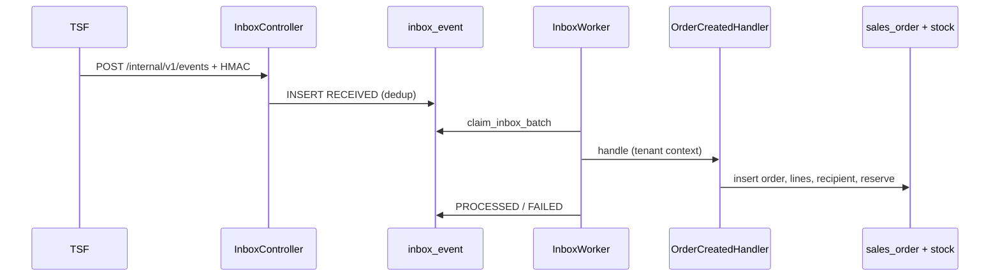
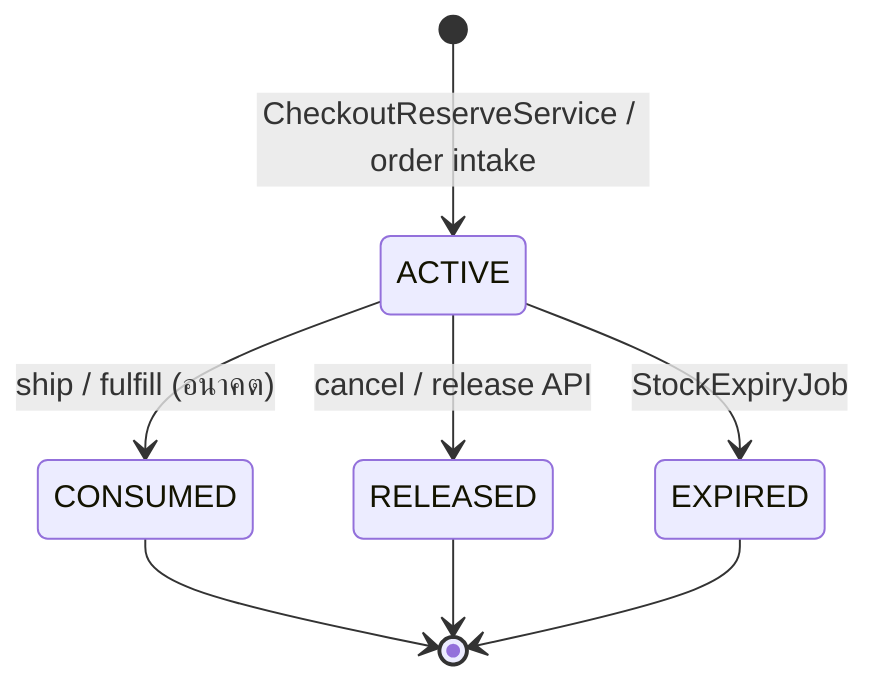
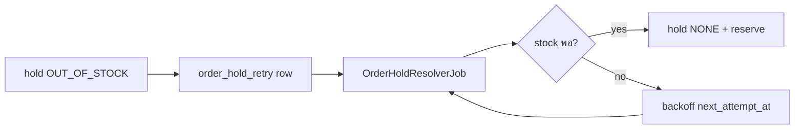
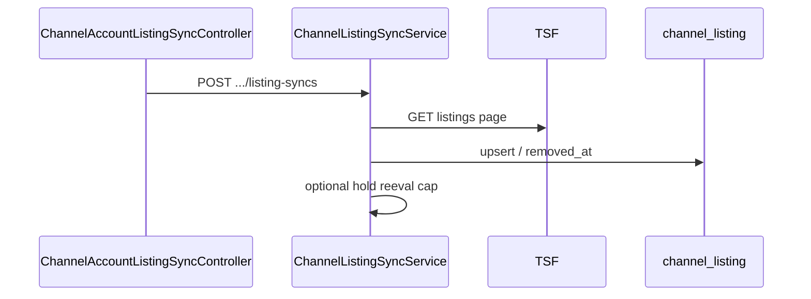

# Backend modules

อ้างอิง main @ ee4e425 (Flyway V13)

แผนที่ package ของ `backend/src/main/java/com/thaishopfun/oms/` — ความรับผิดชอบ, ตาราง, API และ job หลัก. สัญญา REST ละเอียดอยู่ใน [04-api-contract.md](../plan/04-api-contract.md) และ [docs/api/](../api/).

## Package map

| Package | หน้าที่ | คลาสหลัก | ตารางที่เกี่ยวข้อง | API / docs |
|---|---|---|---|---|
| `auth` | JWT/OIDC, JIT login, `TenantContext`, `/api/v1/me` | `TenantContextFilter`, `IdentityProvisioner`, `MeController` | `tenant`, `app_user`, `tenant_membership` | [catalog.md](../api/catalog.md) (auth ร่วม) |
| `inbox` | รับ webhook TSF, HMAC, worker | `InboxController`, `InboxIngestService`, `InboxWorker`, `InboxScheduler`, handlers | `inbox_event`, `reconciliation_issue` | [04-api-contract.md](../plan/04-api-contract.md) § inbound |
| `outbox` | publish ไป TSF หลัง commit | `OutboxAppender`, `OutboxPublisher`, `OutboxScheduler`, `OutboxAdminController` | `outbox_event` | `GET/POST /api/v1/outbox` |
| `channel` | adapter ช่องทาง (TSF 4.7), resilience | `TsfChannelAdapter`, `ChannelProperties` | `channel_account` (อ่าน) | contracts § 4.7 |
| `checkout` | reservation สำหรับ TSF checkout | `CheckoutReservationController`, `CheckoutReserveService`, `CheckoutRepository` | `stock_reservation`, `inventory*`, `shadow_diff`, `idempotency_key` | internal checkout paths |
| `catalog` | products/SKUs/import | `ProductController`, `SkuController`, `CatalogImportController` | `product`, `sku`, `sku_bundle_component` | [catalog.md](../api/catalog.md) |
| `warehouse` | คลัง | `WarehouseController` | `warehouse` | [catalog.md](../api/catalog.md) |
| `stock` | reservation engine, expiry job | `StockRepository`, `StockExpiryJob`, `StockExpiryScheduler` | `inventory`, `inventory_ledger`, `stock_reservation` | — |
| `stockdoc` | เอกสารสต็อก + history | `StockDocumentController`, `StockHistoryController`, `StockDocumentStore` | `stock_document`, `stock_document_line` | [stock-documents.md](../api/stock-documents.md) |
| `order` | domain order + state machine | `OrderStateMachine`, `SalesOrderRepository`, `OrderLineRepository`, … | `sales_order`, `order_line`, `order_status_history`, `order_recipient` | [orders.md](../api/orders.md) |
| `order.intake` | inbox handlers ออเดอร์ | `OrderCreatedHandler`, `OrderUpdatedHandler`, `OrderPaidHandler`, `OrderCancelledHandler`, `OrderIntakeSupport` | ตาราง order + reservation | event types `order.*` |
| `order.hold` | hold sweeper / retry | `OrderHoldResolverJob`, `OrderHoldResolverScheduler`, `OrderHoldRetryRepository` | `order_hold_retry`, `sales_order` | — |
| `order.web` | REST ออเดอร์ | `OrderController`, `OrderQueryService`, `OrderCancelService`, `OrderHoldRecheckService` | อ่าน/เขียน order | [orders.md](../api/orders.md) |
| `listing` | channel listings + sync | `ChannelListingController`, `ChannelListingSyncService`, `ListingChangedHandler` | `channel_listing` | [channel-listings.md](../api/channel-listings.md) |
| `pii` | เข้ารหัสผู้รับ | `PiiCipher`, `PiiKeyRing` | `order_recipient` | — |

## Inbox handlers (`InboxHandler`)

| `event_type` | Handler |
|---|---|
| `membership.changed` | `MembershipChangedHandler` |
| `listing.changed` | `ListingChangedHandler` |
| `order.created` | `OrderCreatedHandler` |
| `order.updated` | `OrderUpdatedHandler` |
| `order.paid` | `OrderPaidHandler` |
| `order.cancelled` | `OrderCancelledHandler` |

## Scheduled jobs

| Job | Scheduler | Config | Default |
|---|---|---|---|
| Inbox worker | `InboxScheduler` | `oms.inbox.worker-enabled`, `oms.inbox.worker-delay-ms` | เปิด, 1000ms |
| Outbox publisher | `OutboxScheduler` | `oms.outbox.publisher-enabled`, `oms.outbox.poll-delay-ms` | เปิด, 2000ms |
| Stock expiry | `StockExpiryScheduler` | `oms.stock.expiry.enabled`, `oms.stock.expiry.interval-ms` | เปิด, 60000ms |
| Hold resolver | `OrderHoldResolverScheduler` | `oms.order.hold-resolver.enabled`, `oms.order.hold-resolver.interval` | เปิด, PT1M |

## Flow: order intake (TSF webhook)

## Flow: stock reservation lifecycle

## Flow: hold → sweeper release

## Flow: listing sync

## Config keys (`application.yml`)

| Key | ความหมาย | Default (ถ้ามี) |
|---|---|---|
| `spring.datasource.url` | JDBC URL | `jdbc:postgresql://localhost:5432/oms` |
| `spring.datasource.username` / `password` | runtime `oms_app` | `oms_app` |
| `spring.flyway.user` / `password` | migrator login | `oms` |
| `oms.security.issuer` | JWT issuer | profile-local |
| `oms.security.audience` | API audience | `oms` |
| `oms.security.jwks-uri` | JWKS URL | env |
| `oms.inbox.hmac-secrets` | verify webhook | ว่างจน profile local |
| `oms.inbox.worker-enabled` | เปิด poller | `true` |
| `oms.inbox.worker-delay-ms` | delay | `1000` |
| `oms.inbox.batch-size` / `lease` / `handler-timeout` | claim batch | `5` / `5m` / `30s` |
| `oms.order.unpaid-hold-grace` | grace unpaid | `10m` |
| `oms.order-intake.enabled` | เปิด handlers | `true` |
| `oms.pii.keys` / `active-key-id` / `hash-key` | PII crypto | ต้องตั้ง (local yml) |
| `oms.outbox.destination-url` / `webhook-secret` | TSF outbox | env |
| `oms.outbox.poll-delay-ms` | publisher | `2000` |
| `oms.tsf.base-url` / `client-secret` | TSF 4.7 client | env |
| `oms.channel.tsf.*` | retry, circuit, bulkhead | ดูไฟล์ |
| `oms.stock.checkout-ttl` | CHECKOUT reservation TTL | `15m` |
| `oms.stock.expiry.*` | expiry job | `enabled=true`, `interval-ms=60000` |
| `oms.order.hold-resolver.*` | sweeper | `enabled=true`, `interval=PT1M`, `batch-size=50` |
| `oms.listing.sync.max-removal-ratio` | guard ลบ listing | `0.5` |
| `oms.listing.sync.min-active-for-guard` | guard | `10` |

ดู `application-local.yml` สำหรับค่า dev (HMAC, PII, mock TSF URLs).
