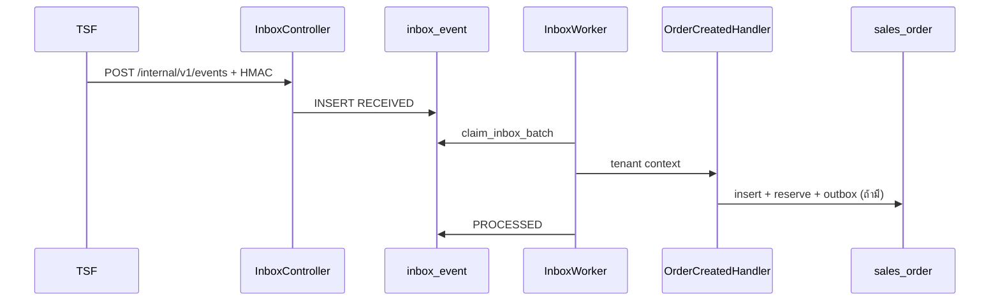
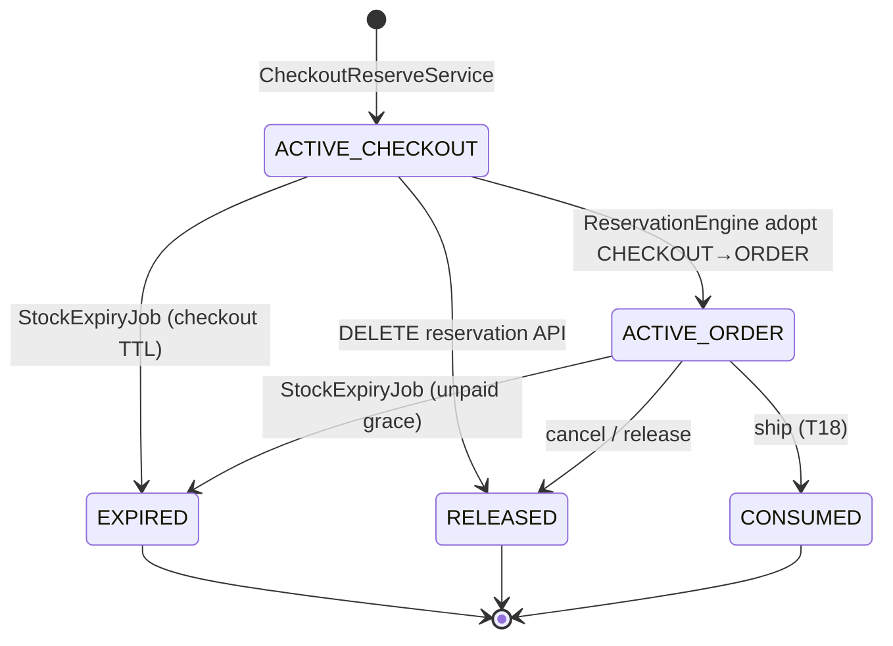
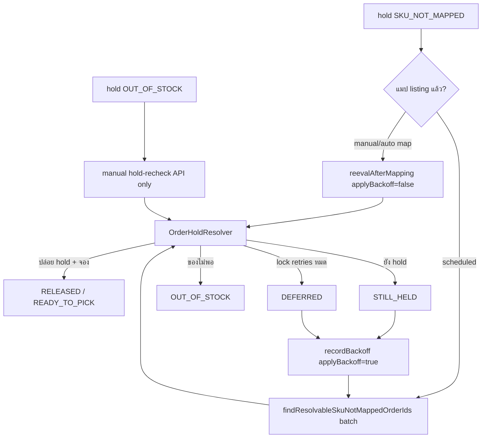
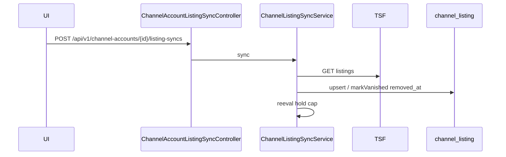

# Backend modules

อ้างอิง main @ ee4e425 (Flyway V13)

แผนที่ `backend/src/main/java/com/thaishopfun/oms/`. สัญญา REST: [04-api-contract.md](../plan/04-api-contract.md), [docs/api/](../api/).

## Package map

| Package | หน้าที่ | คลาสหลัก | ตาราง | Endpoints (สรุป) |
|---|---|---|---|---|
| `tenant` | RLS transaction binding | `TenantAwareDataSourceTransactionManager`, `TenantTransactionConfig` | (context) | — |
| `config` | JDBC URL + clock | `ClockConfig`, `PostgresJdbcUrl`, `PostgresJdbcUrlEnvironmentPostProcessor` | — | — |
| `auth` | JWT/OIDC, JIT, `/api/v1/me` | `TenantContextFilter`, `IdentityProvisioner`, `TenantSessionService`, `MeController`, `EntitlementGate` | `tenant`, `app_user`, `tenant_membership`, `audit_log` (login) | `GET /api/v1/me`, `GET /internal/v1/health` |
| `inbox` | webhook TSF | `InboxController`, `InboxIngestService`, `InboxWorker`, `InboxScheduler`, handlers | `inbox_event`, `reconciliation_issue` | `POST /internal/v1/events` |
| `outbox` | publish TSF | `OutboxAppender`, `OutboxPublisher`, `OutboxScheduler`, `OutboxAdminService` | `outbox_event`, `audit_log` (retry) | `GET /api/v1/outbox`, `POST /api/v1/outbox/{id}/retry` (`OutboxAdminController`) |
| `channel` | adapter + resilience | `TsfChannelAdapter`, `ChannelProperties`, `BaseChannelAdapter` | `channel_account` (อ่าน) | TSF `/internal/v1/...` (client) |
| `channel.api` | DTO 4.7 | `OrderDetail`, `ListingPage`, `Shipment` | — | — |
| `channel.tsf` | TSF HTTP | `TsfChannelAdapter`, `TsfTokenProvider` | — | — |
| `channel.exception` | channel errors | — | — | — |
| `checkout` | TSF checkout reserve | `CheckoutReservationController`, `CheckoutReserveService`, `CheckoutRepository` | reservations, `shadow_diff`, `idempotency_key` | `POST /internal/v1/inventory/reservations`, `DELETE .../{id}` |
| `catalog` | products/SKUs/import | `ProductController`, `SkuController`, `CatalogImportService`, `CatalogAudit` | `product`, `sku`, `sku_bundle_component` | `/api/v1/products`, `/api/v1/skus`, `POST /api/v1/catalog/import` |
| `warehouse` | คลัง | `WarehouseController`, `WarehouseService` | `warehouse` | `/api/v1/warehouses` |
| `stock` | reservation engine | **`ReservationEngine`**, **`StockRepository`**, `StockTransactions` (single-write), `StockExpiryJob` | `inventory`, `inventory_ledger`, `stock_reservation` | — |
| `stockdoc` | เอกสารสต็อก | `StockDocumentController`, `StockHistoryController`, `StockDocumentService` | `stock_document`, `stock_document_line` | `/api/v1/stock-documents`, `GET /api/v1/skus/{id}/stock-history` |
| `order` | domain + state machine | `OrderStateMachine`, `SalesOrderRepository`, … | order tables | — |
| `order.intake` | inbox order events | `OrderCreatedHandler`, `OrderPaidHandler`, `OrderUpdatedHandler`, `OrderCancelledHandler`, `OrderIntakeSupport` | order + reservations | (inbox) |
| `order.hold` | hold resolution | **`OrderHoldResolver`**, **`OrderHoldEffects`**, `OrderHoldResolverJob`, `OrderHoldRetryRepository` | `order_hold_retry`, `sales_order` | — |
| `order.web` | REST orders | `OrderController`, `OrderQueryService`, `OrderCancelService`, `OrderHoldRecheckService` | อ่าน/เขียน order | `/api/v1/orders`, holds, cancel, hold-recheck |
| `order.demo` | demo seed (local) | `OrderDemoCatalogController`, `OrderDemoCatalogService` | catalog/stock/listing | `POST .../order-catalog` (profile) |
| `listing` | listings UI/API | `ChannelListingController`, `ChannelAccountListingSyncController`, `ChannelListingSyncService`, `ChannelListingRepository` | `channel_listing` | `GET /api/v1/channel-accounts`, `/api/v1/channel-listings`, mapping, `POST .../listing-syncs` |
| `listing.intake` | `listing.changed` | `ListingChangedHandler` | `channel_listing` | (inbox) |
| `pii` | encryption | `PiiCipher`, `PiiKeyRing` | `order_recipient` | — |

**Single-write rule:** `ReservationEngine` / `StockRepository` — หนึ่งการเปลี่ยนสต็อกต่อ transaction ของ caller; ห้ามแก้ `inventory` นอก engine (`StockTransactions` รวม ledger + reservation).

## JIT provisioning (mock TSF / production IdP)

1. Bearer JWT (`aud=oms`) → `TenantContextFilter`
2. `IdentityProvisioner` → `lookup_login` / `upsert_app_user` / `provision_tenant` / `provision_membership` (V2 SECURITY DEFINER)
3. `TenantSessionService.recordLogin` → `audit_log` `auth.login` + `ip` เมื่อ `ent_ver` ใหม่กว่า
4. `GET /api/v1/me` อ่าน tenant ภายใต้ RLS

Shop ใหม่จาก webhook: `membership.changed` หรือ `InboxIngestService.provisionUnknown`.

## Mock TSF (local)

`mock-tsf/` — IdP `:8090/tsf-idp`, REST 4.7, checkout client, control API ส่ง event ไป OMS. OMS profile `local` ชี้ JWKS/HMAC/outbox URL มาที่ mock.

## Inbox handlers

| `event_type` | Class |
|---|---|
| `membership.changed` | `MembershipChangedHandler` |
| `listing.changed` | `listing.intake.ListingChangedHandler` |
| `order.created` | `OrderCreatedHandler` |
| `order.updated` | `OrderUpdatedHandler` |
| `order.paid` | `OrderPaidHandler` |
| `order.cancelled` | `OrderCancelledHandler` |

## Outbox event types (main @ ee4e425)

| `event_type` | เมื่อไหร่ | Writer |
|---|---|---|
| `order.status_changed` | hold release / fulfillment เปลี่ยนจาก hold path | `OrderHoldEffects.emitStatusChanged` → `OutboxAppender` |

(งาน intake อื่นอาจเพิ่ม outbox ใน PR ถัดไป — ตอนนี้มีแค่ path นี้ใน `backend/src/main`)

## Scheduled jobs

| Job | Class | Config keys | Default |
|---|---|---|---|
| Inbox | `InboxScheduler` | `oms.inbox.worker-enabled`, `oms.inbox.worker-delay-ms` | on, 1000ms |
| Outbox | `OutboxScheduler` | `oms.outbox.publisher-enabled`, `oms.outbox.poll-delay-ms` | on, 2000ms |
| Stock expiry | `StockExpiryScheduler` | `oms.stock.expiry.enabled`, `oms.stock.expiry.interval-ms`, `batch-size`, `tenant-limit`, `max-batches-per-tenant` | on, 60s, 200, 100, 50 |
| Hold resolver | `OrderHoldResolverScheduler` | `oms.order.hold-resolver.enabled`, `interval`, `batch-size`, `reeval-cap`, `lock-retries`, `backoff-base`, `backoff-max`, `backoff-jitter` | on, PT1M, 50, 200, 3, 1m, 1h, 0.2 |

## Flow: order intake

## Flow: reservation lifecycle

## Flow: hold / sweeper (SKU_NOT_MAPPED)

- **Backoff (`order_hold_retry`):** เฉพาะ scheduled path (`applyBackoff=true`) เมื่อ outcome `STILL_HELD` หรือ `DEFERRED` — **ไม่**เขียน backoff จาก `reevalAfterMapping` / hold-recheck
- **`OUT_OF_STOCK`:** ไม่เข้า backoff; scheduled sweeper **ไม่**ปล่อย — ต้อง manual hold-recheck (remap/restock ไม่แตะ hold นี้โดยตรง)

## Flow: listing sync

## Config keys (`application.yml`)

| Key | ความหมาย | Default |
|---|---|---|
| `oms.security.issuer` / `audience` / `jwks-uri` | JWT | env / profile |
| `oms.security.internal-audience` | service JWT | `oms-internal` |
| `oms.security.internal-client-ids` | client ที่เรียก `/internal/**` | `[]` |
| `oms.security.accepted-token-types` | access token `typ` | `at+jwt`, `JWT`, `""` |
| `oms.inbox.hmac-secrets` | webhook HMAC | local yml |
| `oms.inbox.worker-enabled` / `worker-delay-ms` | inbox poller | true / 1000 |
| `oms.inbox.batch-size` / `lease` / `handler-timeout` | claim | 5 / 5m / 30s |
| `oms.inbox.suspend-defer` / `defer-delay` / `max-defer` / `jitter-ratio` | entitlement defer | 5m / 30s / 24h / 0.2 |
| `oms.order.unpaid-hold-grace` | grace unpaid | 10m |
| `oms.order-intake.enabled` | handlers | true |
| `oms.order.hold-resolver.*` | sweeper | ดูตาราง jobs |
| `oms.pii.*` | encryption | required |
| `oms.outbox.publisher-enabled` / `poll-delay-ms` / `batch-size` / `lease` / `http-timeout` / `jitter-ratio` | outbox | true / 2s / 20 / 5m / 10s / 0.2 |
| `oms.outbox.destination-url` / `webhook-secret` | TSF target | env |
| `oms.tsf.*` / `oms.channel.tsf.*` | TSF client resilience | ดูไฟล์ |
| `oms.stock.checkout-ttl` / `lock-timeout` / `retry.*` | reserve | 15m / 2s / … |
| `oms.stock.expiry.*` | expiry job | ดูตาราง jobs |
| `oms.listing.sync.max-removal-ratio` / `min-active-for-guard` | sync guard | 0.5 / 10 |
