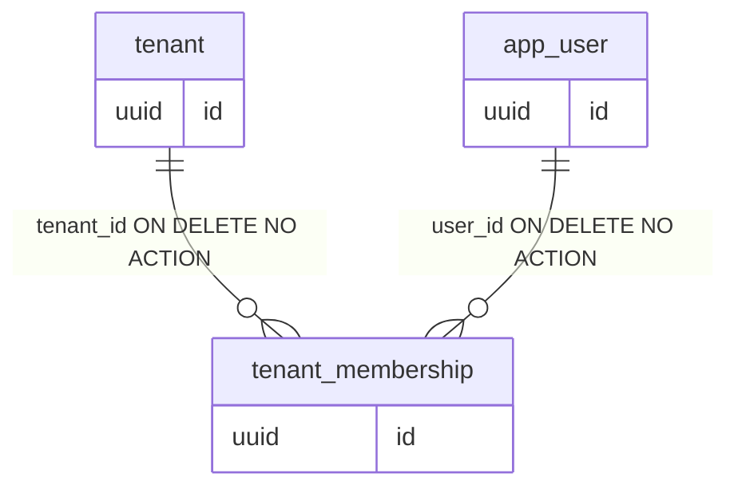
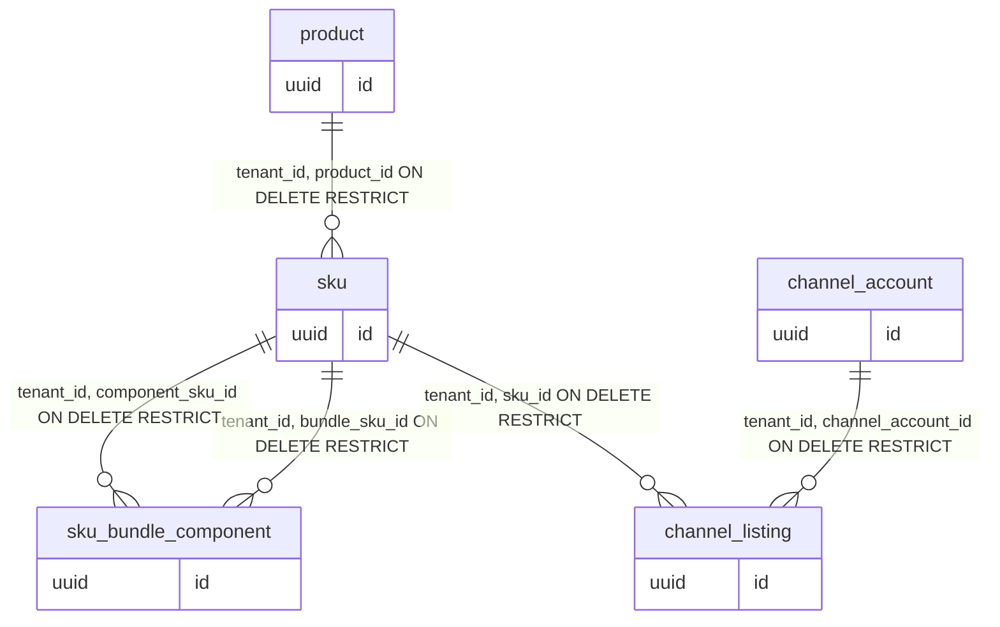
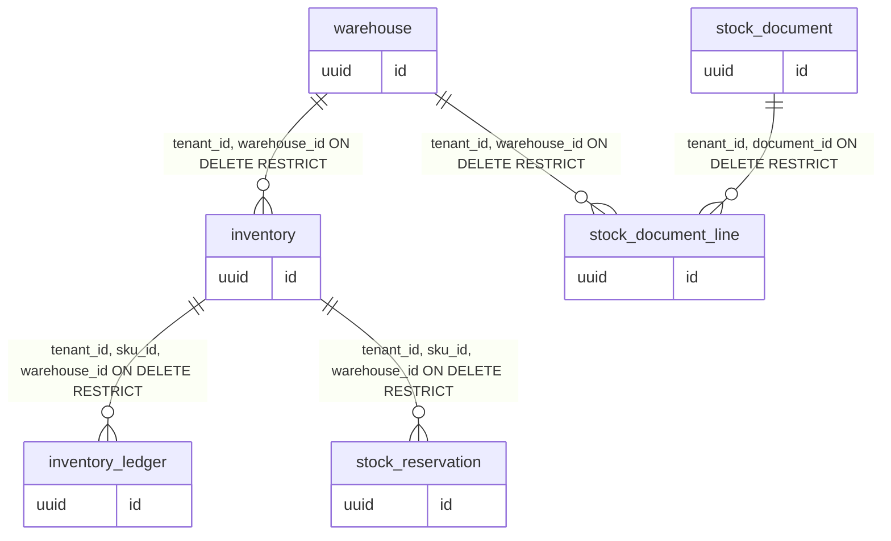
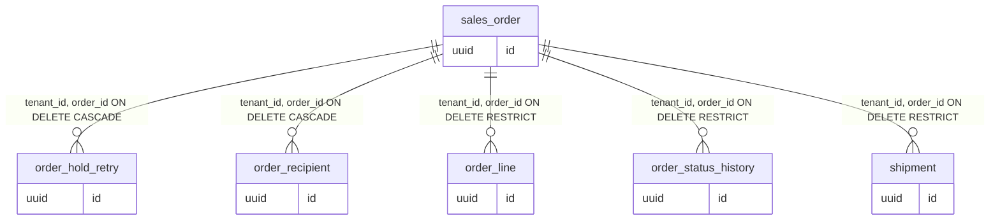
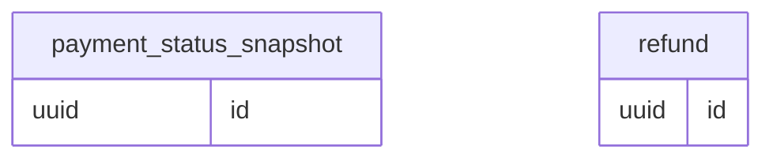
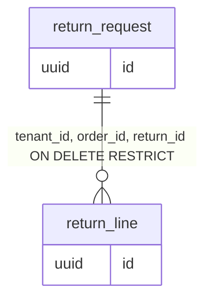
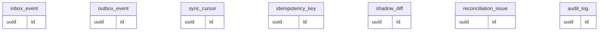

# OMS Data Dictionary

อ้างอิง main @ ee4e425 (Flyway V13)

เอกสารนี้สรุปทุกตารางธุรกิจ (31 ตาราง) จาก `schema-ee4e425.sql` และ `columns-ee4e425.tsv` พร้อม cross-check กับ Flyway V1–V13 และ Java repositories/services. รายละเอียดหลักการ RLS/PII ที่ไม่ซ้ำอยู่ใน [03-data-model.md](../plan/03-data-model.md).

## ภาพรวมตาม domain

- **Tenant / Identity:** `tenant`, `app_user`, `tenant_membership`
- **Channel / Catalog:** `channel_account`, `product`, `sku`, `sku_bundle_component`, `channel_listing`
- **Inventory / Stock:** `warehouse`, `inventory`, `inventory_ledger`, `stock_reservation`, `stock_document`, `stock_document_line`
- **Orders / Fulfillment:** `sales_order`, `order_hold_retry`, `order_recipient`, `order_line`, `order_status_history`, `shipment`
- **Payment:** `payment_status_snapshot`, `refund`
- **Returns:** `return_request`, `return_line`
- **Sync / Platform / Audit:** `inbox_event`, `outbox_event`, `sync_cursor`, `idempotency_key`, `shadow_diff`, `reconciliation_issue`, `audit_log`

`flyway_schema_history` — ตารางภายในของ Flyway เก็บประวัติ migration (ไม่ใช่ domain ธุรกิจ).

## ER diagrams (ทุก FK ใน domain)

### Tenant / Identity

### Channel / Catalog

### Inventory / Stock

### Orders / Fulfillment

### Payment

### Returns

### Sync / Platform / Audit

## ค่า enum / status

### `tenant.entitlement_status`
`ACTIVE` ใช้งานปกติ; `GRACE` อ่านได้แต่ POST ถูกบล็อก; `SUSPENDED` / หมดอายุ → paywall. อัปเดตจาก `membership.changed` และ JIT.

### `tenant_membership.role` / `status`
Role: `OWNER`, `ADMIN`, `STAFF`. Status: `ACTIVE`, `REVOKED`.

### `channel_account`
- `channel`: `TSF`, `SHOPEE`, `LAZADA`, `TIKTOK`
- `mode`: `OBSERVE` (ไม่บังคับสต็อก) → `SHADOW` → `CONTROL` → `ACTIVE`
- `status`: `CONNECTED`, `DISCONNECTED`

### `product.status`
`ACTIVE`, `INACTIVE`

### `sales_order` dimensions (transition จาก `OrderStateMachine`)
- **ORDER:** `ACTIVE` → `CANCELLED` | `COMPLETED` (terminal `CANCELLED` ห้ามแก้)
- **PAYMENT:** `PENDING`→`PAID`; `COD_PENDING`→`PAID`; `PAID`→`PARTIALLY_REFUNDED`→`REFUNDED`
- **FULFILLMENT:** `UNFULFILLED`→`READY_TO_PICK`→`PICKING`→`PACKED`→`SHIPPED`→`DELIVERED` (`PACKED`→`READY_TO_PICK` ได้)
- **HOLD (`hold_reason`):** `NONE`, `SKU_NOT_MAPPED`, `OUT_OF_STOCK`, `ADDRESS_PROBLEM`, `PAYMENT_MISMATCH`, `CHANNEL_CANCEL_PENDING`, `MANUAL` — ทุกค่าเปลี่ยนไปค่าอื่นในเซตได้ยกเว้น guard ใน state machine (เช่น hold บล็อก fulfillment)

### `stock_reservation`
- `owner_type`: `CHECKOUT`, `ORDER`
- `status`: `ACTIVE`, `CONSUMED`, `RELEASED`, `EXPIRED`

### `inventory_ledger.reason`
`OPENING_BALANCE`, `RECEIVE`, `ADJUST_IN`, `ADJUST_OUT`, `COUNT_CORRECTION`, `DAMAGE_WRITE_OFF`, `RETURN_RESTOCK`, `SHIP`, `RESERVE`, `RELEASE`, `UNPACK`

### `stock_document`
- `type`: `OPENING`, `RECEIVE`, `ADJUSTMENT`, `COUNT`, `WRITE_OFF`
- `status`: `DRAFT`, `POSTED`, `VOID`

### `inbox_event.status`
`RECEIVED`, `PROCESSED`, `FAILED`, `DEAD`

### `outbox_event.status`
`PENDING`, `IN_FLIGHT`, `SENT`, `DEAD`

### `channel_listing.mapping_source`
`AUTO`, `MANUAL` (หรือ NULL ก่อนแมป)

### `shadow_diff.kind`
`STOCK`, `ORDER`, `RESERVATION`

### `reconciliation_issue.status`
`OPEN`, `ACK`, `RESOLVED`

### `order_recipient.pii_status`
`ACTIVE`, `REDACTED` — lifecycle ดู [PII lifecycle](../plan/03-data-model.md#pii-lifecycle)

## DB roles, RLS, Flyway

| Role | ใช้เมื่อ | หมายเหตุ |
|---|---|---|
| `oms_migrator` | Flyway | owner ตาราง, DDL |
| `oms_app` | runtime + jobs | DML, **NOBYPASSRLS** |
| `oms_maint` | break-glass | BYPASSRLS, SECURITY DEFINER functions |

Mechanics: ทุก transaction ตั้ง `set_config('app.tenant_id', …, true)` ผ่าน `JpaTransactionManager` (ดู [03-data-model.md](../plan/03-data-model.md)). งานข้าม tenant ใช้ `SECURITY DEFINER` เช่น `claim_inbox_batch`, `claim_outbox_batch`, `list_active_tenant_ids`, `list_tenants_with_expired_reservations`, `resolve_tenant`, `upsert_app_user`, `provision_tenant`, `provision_membership`, `lookup_login` (ดู `V1__foundation_rls.sql`, `V2__jit_provision.sql`).

Trigger / append-only สำคัญ: `audit_log_reject_mutation`, `inventory_ledger_reject_mutation`, bundle/inventory guards ใน `V4__catalog_inventory.sql`.

### Flyway V1–V13 (ไม่มี V5)

| Version | ไฟล์ | สรุป |
|---|---|---|
| V1 | `V1__foundation_rls.sql` | roles, tenant core, inbox/outbox, RLS |
| V2 | `V2__jit_provision.sql` | JIT functions |
| V3 | `V3__inbox_tenant_dedup.sql` | inbox dedup ต่อ tenant |
| V4 | `V4__catalog_inventory.sql` | catalog + stock core |
| _V5_ | _ไม่มี_ | จองไว้สำหรับ T07 แต่ T07 ship โดยไม่มี migration — **ห้ามเพิ่ม V5** (`outOfOrder` off) |
| V6 | `V6__stock_expiry_tenant_claim.sql` | `list_tenants_with_expired_reservations` |
| V7 | `V7__orders.sql` | orders + payment/return schema + sync platform tables |
| V8 | `V8__ledger_seq.sql` | `inventory.ledger_seq` |
| V9 | `V9__reservation_tenant_lookup.sql` | reservation lookup index |
| V10 | `V10__tsf_channel_account_provision.sql` | channel account provision |
| V11 | `V11__sales_order_list_cursor_index.sql` | index list orders |
| V12 | `V12__listing_mapping_and_orphan_marker.sql` | listing mapping + `orphan_recorded_at` |
| V13 | `V13__order_hold_retry.sql` | `order_hold_retry` |

## ตาราง

### `tenant`

**วัตถุประสงค์:** ร้าน (tenant) หนึ่งแถวต่อ TSF shop; เก็บ tier และ entitlement ที่ gate API/inbox
**Phase / feature:** T02 JIT + T11 membership.changed — **สถานะ:** ใช้งานจริง

- **PK:** `id`
- **FK:** —
- **UNIQUE:**
  - `tsf_shop_id` (`tenant_tsf_shop_id_key`)
- **RLS:** policy บน `id = app.tenant_id`

**Fields:**

| field | type | null | default | ความหมาย | ใช้ทำอะไร / ใครเขียน-ใครอ่าน | หมายเหตุ |
|---|---|---|---|---|---|---|
| `id` | `uuid` | NO | — | PK (UUIDv7 จากแอป) | เขียน: `IdentityProvisioner` / `provision_tenant` (V2), `MembershipChangedHandler`; อ่าน: `MeService`, `TenantSessionService`, `InboxEntitlementPolicy`, entitlement filters | — |
| `name` | `text` | NO | — | — | เขียน: `IdentityProvisioner` / `provision_tenant` (V2), `MembershipChangedHandler`; อ่าน: `MeService`, `TenantSessionService`, `InboxEntitlementPolicy`, entitlement filters | — |
| `tsf_shop_id` | `text` | NO | — | รหัสร้าน TSF (unique) | เขียน: `IdentityProvisioner` / `provision_tenant` (V2), `MembershipChangedHandler`; อ่าน: `MeService`, `TenantSessionService`, `InboxEntitlementPolicy`, entitlement filters | — |
| `membership_tier` | `text` | NO | — | แพ็กเกจ membership จาก TSF | เขียน: `IdentityProvisioner` / `provision_tenant` (V2), `MembershipChangedHandler`; อ่าน: `MeService`, `TenantSessionService`, `InboxEntitlementPolicy`, entitlement filters | — |
| `entitlement_status` | `text` | NO | — | ACTIVE / GRACE / SUSPENDED (และสถานะอื่นที่ JWT ส่งมา) | เขียน: `IdentityProvisioner` / `provision_tenant` (V2), `MembershipChangedHandler`; อ่าน: `MeService`, `TenantSessionService`, `InboxEntitlementPolicy`, entitlement filters | — |
| `entitlement_expires_at` | `timestamp with time zone` | YES | — | หมดอายุ GRACE หรือ subscription | เขียน: `IdentityProvisioner` / `provision_tenant` (V2), `MembershipChangedHandler`; อ่าน: `MeService`, `TenantSessionService`, `InboxEntitlementPolicy`, entitlement filters | — |
| `ent_ver` | `bigint` | NO | — | version entitlement; `membership.changed` และ JWT ใช้กัน stale | เขียน: `IdentityProvisioner` / `provision_tenant` (V2), `MembershipChangedHandler`; อ่าน: `MeService`, `TenantSessionService`, `InboxEntitlementPolicy`, entitlement filters | — |

### `app_user`

**วัตถุประสงค์:** ผู้ใช้ OMS ต่อ TSF user id (ไม่มี password ใน OMS)
**Phase / feature:** T02 — **สถานะ:** ใช้งานจริง

- **PK:** `id`
- **FK:** —
- **UNIQUE:**
  - `tsf_user_id` (`app_user_tsf_user_id_key`)
- **RLS:** ไม่มี (ไม่มี `tenant_id`)

**Fields:**

| field | type | null | default | ความหมาย | ใช้ทำอะไร / ใครเขียน-ใครอ่าน | หมายเหตุ |
|---|---|---|---|---|---|---|
| `id` | `uuid` | NO | — | PK (UUIDv7 จากแอป) | เขียน: `upsert_app_user` (V2 SECURITY DEFINER) จาก `IdentityProvisioner`; อ่าน: join ผ่าน `tenant_membership`; ไม่มี RLS (ไม่มี tenant_id) | — |
| `tsf_user_id` | `text` | NO | — | — | เขียน: `upsert_app_user` (V2 SECURITY DEFINER) จาก `IdentityProvisioner`; อ่าน: join ผ่าน `tenant_membership`; ไม่มี RLS (ไม่มี tenant_id) | — |
| `email` | `text` | YES | — | — | เขียน: `upsert_app_user` (V2 SECURITY DEFINER) จาก `IdentityProvisioner`; อ่าน: join ผ่าน `tenant_membership`; ไม่มี RLS (ไม่มี tenant_id) | 🔒 PII — ดู [PII lifecycle](../plan/03-data-model.md#pii-lifecycle) |
| `display_name` | `text` | YES | — | — | เขียน: `upsert_app_user` (V2 SECURITY DEFINER) จาก `IdentityProvisioner`; อ่าน: join ผ่าน `tenant_membership`; ไม่มี RLS (ไม่มี tenant_id) | 🔒 PII — ดู [PII lifecycle](../plan/03-data-model.md#pii-lifecycle) |
| `last_login_at` | `timestamp with time zone` | YES | — | เวลา (timestamptz UTC) | เขียน: `upsert_app_user` (V2 SECURITY DEFINER) จาก `IdentityProvisioner`; อ่าน: join ผ่าน `tenant_membership`; ไม่มี RLS (ไม่มี tenant_id) | — |

### `tenant_membership`

**วัตถุประสงค์:** ผูก user กับ tenant + role (`OWNER`/`ADMIN`/`STAFF`)
**Phase / feature:** T02 — **สถานะ:** ใช้งานจริง

- **PK:** `id`
- **FK:**
  - `tenant_id` → `tenant`(`id`) ON DELETE NO ACTION (`tenant_membership_tenant_id_fkey`)
  - `user_id` → `app_user`(`id`) ON DELETE NO ACTION (`tenant_membership_user_id_fkey`)
- **UNIQUE:**
  - `tenant_id, user_id` (`tenant_membership_tenant_user_key`)
- **RLS:** policies tenant_isolation

**Fields:**

| field | type | null | default | ความหมาย | ใช้ทำอะไร / ใครเขียน-ใครอ่าน | หมายเหตุ |
|---|---|---|---|---|---|---|
| `id` | `uuid` | NO | — | PK (UUIDv7 จากแอป) | เขียน: `provision_membership` (V2), JIT login; อ่าน: `MeService`, `ChannelListingAccess`, RBAC ทั่ว API | — |
| `tenant_id` | `uuid` | NO | — | รหัส tenant สำหรับ RLS | RLS context; เขียน/อ่าน `provision_membership` (V2), JIT login | — |
| `user_id` | `uuid` | NO | — | — | เขียน: `provision_membership` (V2), JIT login; อ่าน: `MeService`, `ChannelListingAccess`, RBAC ทั่ว API | — |
| `role` | `text` | NO | — | — | เขียน: `provision_membership` (V2), JIT login; อ่าน: `MeService`, `ChannelListingAccess`, RBAC ทั่ว API | — |
| `status` | `text` | NO | — | — | เขียน: `provision_membership` (V2), JIT login; อ่าน: `MeService`, `ChannelListingAccess`, RBAC ทั่ว API | — |

### `channel_account`

**วัตถุประสงค์:** บัญชีช่องทางขายต่อร้าน (TSF/Shopee/…) พร้อม mode ควบคุมสต็อก
**Phase / feature:** T06/T10 — **สถานะ:** ใช้งานจริง

- **PK:** `id`
- **FK:**
  - `tenant_id` → `tenant`(`id`) ON DELETE NO ACTION (`channel_account_tenant_id_fkey`)
- **UNIQUE:**
  - `channel, external_shop_id` (`channel_account_channel_external_shop_key`)
  - `tenant_id, id` (`channel_account_tenant_id_id_key`)
- **RLS:** policies tenant_isolation

**Fields:**

| field | type | null | default | ความหมาย | ใช้ทำอะไร / ใครเขียน-ใครอ่าน | หมายเหตุ |
|---|---|---|---|---|---|---|
| `id` | `uuid` | NO | — | PK (UUIDv7 จากแอป) | เขียน: JIT provision, `OrderIntakeSupport`, demo seed; อ่าน: order intake, checkout, listing sync, `OrderQueryService` | — |
| `tenant_id` | `uuid` | NO | — | รหัส tenant สำหรับ RLS | RLS context; เขียน/อ่าน JIT provision, `OrderIntakeSupport`, demo seed | — |
| `channel` | `text` | NO | — | — | เขียน: JIT provision, `OrderIntakeSupport`, demo seed; อ่าน: order intake, checkout, listing sync, `OrderQueryService` | — |
| `external_shop_id` | `text` | NO | — | — | เขียน: JIT provision, `OrderIntakeSupport`, demo seed; อ่าน: order intake, checkout, listing sync, `OrderQueryService` | — |
| `mode` | `text` | NO | `'OBSERVE'::text` | — | เขียน: JIT provision, `OrderIntakeSupport`, demo seed; อ่าน: order intake, checkout, listing sync, `OrderQueryService` | — |
| `stock_sync_paused` | `boolean` | NO | `false` | — | เขียน: JIT provision, `OrderIntakeSupport`, demo seed; อ่าน: order intake, checkout, listing sync, `OrderQueryService` | — |
| `status` | `text` | NO | — | — | เขียน: JIT provision, `OrderIntakeSupport`, demo seed; อ่าน: order intake, checkout, listing sync, `OrderQueryService` | — |
| `credentials_ref` | `text` | YES | — | ชื่อ secret ใน secret manager (ไม่เก็บ token) | เขียน: JIT provision, `OrderIntakeSupport`, demo seed; อ่าน: order intake, checkout, listing sync, `OrderQueryService` | — |
| `token_expires_at` | `timestamp with time zone` | YES | — | เวลา (timestamptz UTC) | เขียน: JIT provision, `OrderIntakeSupport`, demo seed; อ่าน: order intake, checkout, listing sync, `OrderQueryService` | — |
| `last_synced_at` | `timestamp with time zone` | YES | — | เวลา (timestamptz UTC) | เขียน: JIT provision, `OrderIntakeSupport`, demo seed; อ่าน: order intake, checkout, listing sync, `OrderQueryService` | — |
| `created_at` | `timestamp with time zone` | NO | `now()` | เวลา (timestamptz UTC) | ตั้งโดย DB/แอปเมื่อ insert-update; อ่าน order intake | — |
| `updated_at` | `timestamp with time zone` | NO | `now()` | เวลา (timestamptz UTC) | ตั้งโดย DB/แอปเมื่อ insert-update; อ่าน order intake | — |

### `product`

**วัตถุประสงค์:** กลุ่มสินค้า (product) ในแคตตาล็อก OMS
**Phase / feature:** T07 — **สถานะ:** ใช้งานจริง

- **PK:** `id`
- **FK:**
  - `tenant_id` → `tenant`(`id`) ON DELETE NO ACTION (`product_tenant_id_fkey`)
- **UNIQUE:**
  - `tenant_id, id` (`product_tenant_id_id_key`)
- **RLS:** policies tenant_isolation

**Fields:**

| field | type | null | default | ความหมาย | ใช้ทำอะไร / ใครเขียน-ใครอ่าน | หมายเหตุ |
|---|---|---|---|---|---|---|
| `id` | `uuid` | NO | — | PK (UUIDv7 จากแอป) | เขียน: `ProductController` / catalog services, `OrderDemoCatalogService`; อ่าน: catalog UI, SKU create | — |
| `tenant_id` | `uuid` | NO | — | รหัส tenant สำหรับ RLS | RLS context; เขียน/อ่าน `ProductController` / catalog services, `OrderDemoCatalogService` | — |
| `name` | `text` | NO | — | — | เขียน: `ProductController` / catalog services, `OrderDemoCatalogService`; อ่าน: catalog UI, SKU create | — |
| `status` | `text` | NO | — | — | เขียน: `ProductController` / catalog services, `OrderDemoCatalogService`; อ่าน: catalog UI, SKU create | — |
| `created_at` | `timestamp with time zone` | NO | `now()` | เวลา (timestamptz UTC) | ตั้งโดย DB/แอปเมื่อ insert-update; อ่าน catalog UI | — |
| `updated_at` | `timestamp with time zone` | NO | `now()` | เวลา (timestamptz UTC) | ตั้งโดย DB/แอปเมื่อ insert-update; อ่าน catalog UI | — |

### `sku`

**วัตถุประสงค์:** SKU ขายจริง (รวม flag bundle)
**Phase / feature:** T07 — **สถานะ:** ใช้งานจริง

- **PK:** `id`
- **FK:**
  - `tenant_id, product_id` → `product`(`tenant_id, id`) ON DELETE RESTRICT (`sku_product_fkey`)
  - `tenant_id` → `tenant`(`id`) ON DELETE NO ACTION (`sku_tenant_id_fkey`)
- **UNIQUE:**
  - `tenant_id, id` (`sku_tenant_id_id_key`)
  - `tenant_id, sku_code` (`sku_tenant_sku_code_key`)
- **Indexes:**
  - `sku_tenant_product_idx` (INDEX) on `tenant_id, product_id`
- **RLS:** policies tenant_isolation

**Fields:**

| field | type | null | default | ความหมาย | ใช้ทำอะไร / ใครเขียน-ใครอ่าน | หมายเหตุ |
|---|---|---|---|---|---|---|
| `id` | `uuid` | NO | — | PK (UUIDv7 จากแอป) | เขียน: `SkuController`, import, demo catalog; อ่าน: stock, orders, listings mapping | — |
| `tenant_id` | `uuid` | NO | — | รหัส tenant สำหรับ RLS | RLS context; เขียน/อ่าน `SkuController`, import, demo catalog | — |
| `product_id` | `uuid` | NO | — | — | เขียน: `SkuController`, import, demo catalog; อ่าน: stock, orders, listings mapping | — |
| `sku_code` | `text` | NO | — | — | เขียน: `SkuController`, import, demo catalog; อ่าน: stock, orders, listings mapping | — |
| `name` | `text` | NO | — | — | เขียน: `SkuController`, import, demo catalog; อ่าน: stock, orders, listings mapping | — |
| `barcode` | `text` | YES | — | — | เขียน: `SkuController`, import, demo catalog; อ่าน: stock, orders, listings mapping | — |
| `weight_g` | `integer` | YES | — | — | เขียน: `SkuController`, import, demo catalog; อ่าน: stock, orders, listings mapping | — |
| `is_bundle` | `boolean` | NO | `false` | — | เขียน: `SkuController`, import, demo catalog; อ่าน: stock, orders, listings mapping | — |
| `created_at` | `timestamp with time zone` | NO | `now()` | เวลา (timestamptz UTC) | ตั้งโดย DB/แอปเมื่อ insert-update; อ่าน stock | — |
| `updated_at` | `timestamp with time zone` | NO | `now()` | เวลา (timestamptz UTC) | ตั้งโดย DB/แอปเมื่อ insert-update; อ่าน stock | — |

### `sku_bundle_component`

**วัตถุประสงค์:** ส่วนประกอบของ bundle SKU (qty ต่อ component)
**Phase / feature:** T07 — **สถานะ:** ใช้งานจริง

- **PK:** `bundle_sku_id, component_sku_id`
- **FK:**
  - `tenant_id, bundle_sku_id` → `sku`(`tenant_id, id`) ON DELETE RESTRICT (`sku_bundle_component_bundle_fkey`)
  - `tenant_id, component_sku_id` → `sku`(`tenant_id, id`) ON DELETE RESTRICT (`sku_bundle_component_component_fkey`)
  - `tenant_id` → `tenant`(`id`) ON DELETE NO ACTION (`sku_bundle_component_tenant_id_fkey`)
- **Indexes:**
  - `sku_bundle_component_component_sku_idx` (INDEX) on `component_sku_id`
- **RLS:** policies tenant_isolation

**Fields:**

| field | type | null | default | ความหมาย | ใช้ทำอะไร / ใครเขียน-ใครอ่าน | หมายเหตุ |
|---|---|---|---|---|---|---|
| `tenant_id` | `uuid` | NO | — | รหัส tenant สำหรับ RLS | RLS context; เขียน/อ่าน `SkuController` components API | — |
| `bundle_sku_id` | `uuid` | NO | — | — | เขียน: `SkuController` components API; อ่าน: `StockRepository` (expand bundle), order lines UI | — |
| `component_sku_id` | `uuid` | NO | — | — | เขียน: `SkuController` components API; อ่าน: `StockRepository` (expand bundle), order lines UI | — |
| `qty` | `integer` | NO | — | — | เขียน: `SkuController` components API; อ่าน: `StockRepository` (expand bundle), order lines UI | — |
| `created_at` | `timestamp with time zone` | NO | `now()` | เวลา (timestamptz UTC) | ตั้งโดย DB/แอปเมื่อ insert-update; อ่าน `StockRepository` (expand bundle) | — |
| `updated_at` | `timestamp with time zone` | NO | `now()` | เวลา (timestamptz UTC) | ตั้งโดย DB/แอปเมื่อ insert-update; อ่าน `StockRepository` (expand bundle) | — |

### `channel_listing`

**วัตถุประสงค์:** แมป listing ช่องทาง → `sku_id` + metadata สต็อก
**Phase / feature:** T12 listing intake/mapping — **สถานะ:** ใช้งานจริง (บางคอลัมน์ sync push ยังไม่เขียน)

- **PK:** `id`
- **FK:**
  - `tenant_id, channel_account_id` → `channel_account`(`tenant_id, id`) ON DELETE RESTRICT (`channel_listing_channel_account_fkey`)
  - `tenant_id, sku_id` → `sku`(`tenant_id, id`) ON DELETE RESTRICT (`channel_listing_sku_fkey`)
  - `tenant_id` → `tenant`(`id`) ON DELETE NO ACTION (`channel_listing_tenant_id_fkey`)
- **UNIQUE:**
  - `channel_account_id, external_sku_id` (`channel_listing_account_external_sku_key`)
  - `tenant_id, id` (`channel_listing_tenant_id_id_key`)
- **Indexes:**
  - `channel_listing_tenant_sku_idx` (INDEX) on `tenant_id, sku_id` WHERE (sku_id IS NOT NULL)
  - `channel_listing_unmapped_account_idx` (INDEX) on `tenant_id, channel_account_id` WHERE (sku_id IS NULL)
- **RLS:** policies tenant_isolation

**Fields:**

| field | type | null | default | ความหมาย | ใช้ทำอะไร / ใครเขียน-ใครอ่าน | หมายเหตุ |
|---|---|---|---|---|---|---|
| `id` | `uuid` | NO | — | PK (UUIDv7 จากแอป) | เขียน: `ChannelListingRepository`, `ListingChangedHandler`, mapping API; อ่าน: listings UI, order intake SKU resolve, hold resolver | — |
| `tenant_id` | `uuid` | NO | — | รหัส tenant สำหรับ RLS | RLS context; เขียน/อ่าน `ChannelListingRepository`, `ListingChangedHandler`, mapping API | — |
| `channel_account_id` | `uuid` | NO | — | — | เขียน: `ChannelListingRepository`, `ListingChangedHandler`, mapping API; อ่าน: listings UI, order intake SKU resolve, hold resolver | — |
| `sku_id` | `uuid` | YES | — | — | เขียน: `ChannelListingRepository`, `ListingChangedHandler`, mapping API; อ่าน: listings UI, order intake SKU resolve, hold resolver | — |
| `external_item_id` | `text` | YES | — | — | เขียน: `ChannelListingRepository`, `ListingChangedHandler`, mapping API; อ่าน: listings UI, order intake SKU resolve, hold resolver | — |
| `external_sku_id` | `text` | NO | — | — | เขียน: `ChannelListingRepository`, `ListingChangedHandler`, mapping API; อ่าน: listings UI, order intake SKU resolve, hold resolver | — |
| `stock_control` | `boolean` | NO | `false` | allowlist ให้ CONTROL push สต็อก | เขียน: `ChannelListingRepository`, `ListingChangedHandler`, mapping API; อ่าน: listings UI, order intake SKU resolve, hold resolver | — |
| `safety_buffer` | `integer` | NO | `0` | — | เขียน: `ChannelListingRepository`, `ListingChangedHandler`, mapping API; อ่าน: listings UI, order intake SKU resolve, hold resolver | — |
| `last_exposed_qty` | `integer` | YES | — | — | ❓ ไม่พบการใช้งานในโค้ด main @ ee4e425 | — |
| `last_pushed_version` | `bigint` | YES | — | — | ❓ ไม่พบการใช้งานในโค้ด main @ ee4e425 | — |
| `last_seen_channel_qty` | `integer` | YES | — | — | ❓ ไม่พบการใช้งานในโค้ด main @ ee4e425 | — |
| `created_at` | `timestamp with time zone` | NO | `now()` | เวลา (timestamptz UTC) | ตั้งโดย DB/แอปเมื่อ insert-update; อ่าน listings UI | — |
| `updated_at` | `timestamp with time zone` | NO | `now()` | เวลา (timestamptz UTC) | ตั้งโดย DB/แอปเมื่อ insert-update; อ่าน listings UI | — |
| `seller_sku` | `text` | YES | — | — | เขียน: `ChannelListingRepository`, `ListingChangedHandler`, mapping API; อ่าน: listings UI, order intake SKU resolve, hold resolver | — |
| `name` | `text` | YES | — | — | เขียน: `ChannelListingRepository`, `ListingChangedHandler`, mapping API; อ่าน: listings UI, order intake SKU resolve, hold resolver | — |
| `mapping_source` | `text` | YES | — | — | เขียน: `ChannelListingRepository`, `ListingChangedHandler`, mapping API; อ่าน: listings UI, order intake SKU resolve, hold resolver | — |
| `mapped_at` | `timestamp with time zone` | YES | — | เวลา (timestamptz UTC) | เขียน: `ChannelListingRepository`, `ListingChangedHandler`, mapping API; อ่าน: listings UI, order intake SKU resolve, hold resolver | — |
| `removed_at` | `timestamp with time zone` | YES | — | listing ถูกลบที่ช่องทาง (orphan marker V12) | เขียน: `ChannelListingRepository`, `ListingChangedHandler`, mapping API; อ่าน: listings UI, order intake SKU resolve, hold resolver | — |

### `warehouse`

**วัตถุประสงค์:** คลังต่อ tenant (MVP ใช้ default หลัก)
**Phase / feature:** T07 — **สถานะ:** ใช้งานจริง

- **PK:** `id`
- **FK:**
  - `tenant_id` → `tenant`(`id`) ON DELETE NO ACTION (`warehouse_tenant_id_fkey`)
- **UNIQUE:**
  - `tenant_id, code` (`warehouse_tenant_code_key`)
  - `tenant_id, id` (`warehouse_tenant_id_id_key`)
- **Indexes:**
  - `warehouse_one_default_per_tenant_idx` (UNIQUE) on `tenant_id` WHERE is_default
- **RLS:** policies tenant_isolation

**Fields:**

| field | type | null | default | ความหมาย | ใช้ทำอะไร / ใครเขียน-ใครอ่าน | หมายเหตุ |
|---|---|---|---|---|---|---|
| `id` | `uuid` | NO | — | PK (UUIDv7 จากแอป) | เขียน: `WarehouseController`, demo seed; อ่าน: stock documents, reservations, orders | — |
| `tenant_id` | `uuid` | NO | — | รหัส tenant สำหรับ RLS | RLS context; เขียน/อ่าน `WarehouseController`, demo seed | — |
| `code` | `text` | NO | — | — | เขียน: `WarehouseController`, demo seed; อ่าน: stock documents, reservations, orders | — |
| `name` | `text` | NO | — | — | เขียน: `WarehouseController`, demo seed; อ่าน: stock documents, reservations, orders | — |
| `address` | `jsonb` | YES | — | — | เขียน: `WarehouseController`, demo seed; อ่าน: stock documents, reservations, orders | — |
| `is_default` | `boolean` | NO | `false` | — | เขียน: `WarehouseController`, demo seed; อ่าน: stock documents, reservations, orders | — |
| `created_at` | `timestamp with time zone` | NO | `now()` | เวลา (timestamptz UTC) | ตั้งโดย DB/แอปเมื่อ insert-update; อ่าน stock documents | — |
| `updated_at` | `timestamp with time zone` | NO | `now()` | เวลา (timestamptz UTC) | ตั้งโดย DB/แอปเมื่อ insert-update; อ่าน stock documents | — |

### `inventory`

**วัตถุประสงค์:** ยอด on_hand/reserved ต่อ (sku, warehouse) — แก้ผ่าน ledger เท่านั้น
**Phase / feature:** T08 — **สถานะ:** ใช้งานจริง

- **PK:** `id`
- **FK:**
  - `tenant_id, sku_id` → `sku`(`tenant_id, id`) ON DELETE RESTRICT (`inventory_sku_fkey`)
  - `tenant_id` → `tenant`(`id`) ON DELETE NO ACTION (`inventory_tenant_id_fkey`)
  - `tenant_id, warehouse_id` → `warehouse`(`tenant_id, id`) ON DELETE RESTRICT (`inventory_warehouse_fkey`)
- **UNIQUE:**
  - `tenant_id, id` (`inventory_tenant_id_id_key`)
  - `tenant_id, sku_id, warehouse_id` (`inventory_tenant_sku_warehouse_key`)
- **Indexes:**
  - `inventory_tenant_warehouse_idx` (INDEX) on `tenant_id, warehouse_id`
- **RLS:** policies tenant_isolation

**Fields:**

| field | type | null | default | ความหมาย | ใช้ทำอะไร / ใครเขียน-ใครอ่าน | หมายเหตุ |
|---|---|---|---|---|---|---|
| `id` | `uuid` | NO | — | PK (UUIDv7 จากแอป) | เขียน: `StockRepository` (single-write rule); อ่าน: stock UI, checkout, order hold, listing exposure calc (อนาคต) | — |
| `tenant_id` | `uuid` | NO | — | รหัส tenant สำหรับ RLS | RLS context; เขียน/อ่าน `StockRepository` (single-write rule) | — |
| `sku_id` | `uuid` | NO | — | — | เขียน: `StockRepository` (single-write rule); อ่าน: stock UI, checkout, order hold, listing exposure calc (อนาคต) | — |
| `warehouse_id` | `uuid` | NO | — | — | เขียน: `StockRepository` (single-write rule); อ่าน: stock UI, checkout, order hold, listing exposure calc (อนาคต) | — |
| `on_hand` | `integer` | NO | `0` | — | เขียน: `StockRepository` (single-write rule); อ่าน: stock UI, checkout, order hold, listing exposure calc (อนาคต) | — |
| `reserved` | `integer` | NO | `0` | — | เขียน: `StockRepository` (single-write rule); อ่าน: stock UI, checkout, order hold, listing exposure calc (อนาคต) | — |
| `stock_version` | `bigint` | NO | `0` | — | เขียน: `StockRepository` (single-write rule); อ่าน: stock UI, checkout, order hold, listing exposure calc (อนาคต) | — |
| `created_at` | `timestamp with time zone` | NO | `now()` | เวลา (timestamptz UTC) | ตั้งโดย DB/แอปเมื่อ insert-update; อ่าน stock UI | — |
| `updated_at` | `timestamp with time zone` | NO | `now()` | เวลา (timestamptz UTC) | ตั้งโดย DB/แอปเมื่อ insert-update; อ่าน stock UI | — |
| `ledger_seq` | `bigint` | NO | `0` | ลำดับ ledger ต่อแถวสต็อก (V8) | เขียน: `StockRepository` (single-write rule); อ่าน: stock UI, checkout, order hold, listing exposure calc (อนาคต) | — |

### `inventory_ledger`

**วัตถุประสงค์:** บันทึก delta สต็อกแบบ append-only
**Phase / feature:** T08 — **สถานะ:** ใช้งานจริง

- **PK:** `id`
- **FK:**
  - `tenant_id, sku_id, warehouse_id` → `inventory`(`tenant_id, sku_id, warehouse_id`) ON DELETE RESTRICT (`inventory_ledger_inventory_fkey`)
  - `tenant_id` → `tenant`(`id`) ON DELETE NO ACTION (`inventory_ledger_tenant_id_fkey`)
- **UNIQUE:**
  - `tenant_id, id` (`inventory_ledger_tenant_id_id_key`)
- **Indexes:**
  - `inventory_ledger_tenant_ref_idx` (INDEX) on `tenant_id, ref_type, ref_id` WHERE (ref_id IS NOT NULL)
  - `inventory_ledger_tenant_sku_created_idx` (INDEX) on `tenant_id, sku_id, warehouse_id, created_at DESC`
  - `inventory_ledger_tenant_sku_seq_idx` (INDEX) on `tenant_id, sku_id, warehouse_id, ledger_seq DESC`
  - `inventory_ledger_tenant_sku_wh_seq_key` (UNIQUE) on `tenant_id, sku_id, warehouse_id, ledger_seq`
- **RLS:** policies tenant_isolation

**Fields:**

| field | type | null | default | ความหมาย | ใช้ทำอะไร / ใครเขียน-ใครอ่าน | หมายเหตุ |
|---|---|---|---|---|---|---|
| `id` | `uuid` | NO | — | PK (UUIDv7 จากแอป) | เขียน: `StockRepository` ตอน post document / reserve / release; อ่าน: `StockHistoryController`, stock history UI | — |
| `tenant_id` | `uuid` | NO | — | รหัส tenant สำหรับ RLS | RLS context; เขียน/อ่าน `StockRepository` ตอน post document / reserve / release | — |
| `sku_id` | `uuid` | NO | — | — | เขียน: `StockRepository` ตอน post document / reserve / release; อ่าน: `StockHistoryController`, stock history UI | — |
| `warehouse_id` | `uuid` | NO | — | — | เขียน: `StockRepository` ตอน post document / reserve / release; อ่าน: `StockHistoryController`, stock history UI | — |
| `delta_on_hand` | `integer` | NO | — | — | เขียน: `StockRepository` ตอน post document / reserve / release; อ่าน: `StockHistoryController`, stock history UI | — |
| `delta_reserved` | `integer` | NO | — | — | เขียน: `StockRepository` ตอน post document / reserve / release; อ่าน: `StockHistoryController`, stock history UI | — |
| `reason` | `text` | NO | — | — | เขียน: `StockRepository` ตอน post document / reserve / release; อ่าน: `StockHistoryController`, stock history UI | — |
| `ref_type` | `text` | YES | — | — | เขียน: `StockRepository` ตอน post document / reserve / release; อ่าน: `StockHistoryController`, stock history UI | — |
| `ref_id` | `uuid` | YES | — | — | เขียน: `StockRepository` ตอน post document / reserve / release; อ่าน: `StockHistoryController`, stock history UI | — |
| `actor` | `text` | YES | — | — | เขียน: `StockRepository` ตอน post document / reserve / release; อ่าน: `StockHistoryController`, stock history UI | — |
| `created_at` | `timestamp with time zone` | NO | `now()` | เวลา (timestamptz UTC) | ตั้งโดย DB/แอปเมื่อ insert-update; อ่าน `StockHistoryController` | — |
| `ledger_seq` | `bigint` | NO | — | Monotonic per (tenant, sku, warehouse); history and running totals order by this, not created_at. | เขียน: `StockRepository` ตอน post document / reserve / release; อ่าน: `StockHistoryController`, stock history UI | — |

### `stock_reservation`

**วัตถุประสงค์:** จองสต็อกสำหรับ CHECKOUT หรือ ORDER
**Phase / feature:** T08/T12 — **สถานะ:** ใช้งานจริง

- **PK:** `id`
- **FK:**
  - `tenant_id, sku_id, warehouse_id` → `inventory`(`tenant_id, sku_id, warehouse_id`) ON DELETE RESTRICT (`stock_reservation_inventory_fkey`)
  - `tenant_id` → `tenant`(`id`) ON DELETE NO ACTION (`stock_reservation_tenant_id_fkey`)
- **UNIQUE:**
  - `tenant_id, id` (`stock_reservation_tenant_id_id_key`)
- **Indexes:**
  - `stock_reservation_active_expiry_idx` (INDEX) on `status, expires_at` WHERE (status = 'ACTIVE'::text)
  - `stock_reservation_active_owner_sku_key` (UNIQUE) on `tenant_id, owner_type, owner_ref, sku_id` WHERE (status = 'ACTIVE'::text)
  - `stock_reservation_group_id_idx` (INDEX) on `reservation_group_id`
  - `stock_reservation_group_idx` (INDEX) on `tenant_id, reservation_group_id`
  - `stock_reservation_owner_idx` (INDEX) on `tenant_id, owner_type, owner_ref`
  - `stock_reservation_tenant_sku_idx` (INDEX) on `tenant_id, sku_id, warehouse_id`
- **RLS:** policies tenant_isolation

**Fields:**

| field | type | null | default | ความหมาย | ใช้ทำอะไร / ใครเขียน-ใครอ่าน | หมายเหตุ |
|---|---|---|---|---|---|---|
| `id` | `uuid` | NO | — | PK (UUIDv7 จากแอป) | เขียน: `StockRepository`, `CheckoutReserveService`, order intake; อ่าน: `StockExpiryJob`, `OrderQueryService`, hold resolver | — |
| `tenant_id` | `uuid` | NO | — | รหัส tenant สำหรับ RLS | RLS context; เขียน/อ่าน `StockRepository`, `CheckoutReserveService`, order intake | — |
| `owner_type` | `text` | NO | — | — | เขียน: `StockRepository`, `CheckoutReserveService`, order intake; อ่าน: `StockExpiryJob`, `OrderQueryService`, hold resolver | — |
| `owner_ref` | `text` | NO | — | — | เขียน: `StockRepository`, `CheckoutReserveService`, order intake; อ่าน: `StockExpiryJob`, `OrderQueryService`, hold resolver | — |
| `sku_id` | `uuid` | NO | — | — | เขียน: `StockRepository`, `CheckoutReserveService`, order intake; อ่าน: `StockExpiryJob`, `OrderQueryService`, hold resolver | — |
| `warehouse_id` | `uuid` | NO | — | — | เขียน: `StockRepository`, `CheckoutReserveService`, order intake; อ่าน: `StockExpiryJob`, `OrderQueryService`, hold resolver | — |
| `qty` | `integer` | NO | — | — | เขียน: `StockRepository`, `CheckoutReserveService`, order intake; อ่าน: `StockExpiryJob`, `OrderQueryService`, hold resolver | — |
| `status` | `text` | NO | — | — | เขียน: `StockRepository`, `CheckoutReserveService`, order intake; อ่าน: `StockExpiryJob`, `OrderQueryService`, hold resolver | — |
| `expires_at` | `timestamp with time zone` | YES | — | เวลา (timestamptz UTC) | เขียน: `StockRepository`, `CheckoutReserveService`, order intake; อ่าน: `StockExpiryJob`, `OrderQueryService`, hold resolver | — |
| `reservation_group_id` | `uuid` | NO | — | id ส่งให้ TSF checkout (มักเท่ากับ reservation แรกในกลุ่ม) | เขียน: `StockRepository`, `CheckoutReserveService`, order intake; อ่าน: `StockExpiryJob`, `OrderQueryService`, hold resolver | — |
| `created_at` | `timestamp with time zone` | NO | `now()` | เวลา (timestamptz UTC) | ตั้งโดย DB/แอปเมื่อ insert-update; อ่าน `StockExpiryJob` | — |
| `updated_at` | `timestamp with time zone` | NO | `now()` | เวลา (timestamptz UTC) | ตั้งโดย DB/แอปเมื่อ insert-update; อ่าน `StockExpiryJob` | — |

### `stock_document`

**วัตถุประสงค์:** เอกสารปรับสต็อก (OPENING/RECEIVE/ADJUSTMENT/COUNT/WRITE_OFF)
**Phase / feature:** T08A — **สถานะ:** ใช้งานจริง

- **PK:** `id`
- **FK:**
  - `tenant_id` → `tenant`(`id`) ON DELETE NO ACTION (`stock_document_tenant_id_fkey`)
- **UNIQUE:**
  - `tenant_id, id` (`stock_document_tenant_id_id_key`)
- **Indexes:**
  - `stock_document_tenant_status_created_idx` (INDEX) on `tenant_id, status, created_at DESC`
- **RLS:** policies tenant_isolation

**Fields:**

| field | type | null | default | ความหมาย | ใช้ทำอะไร / ใครเขียน-ใครอ่าน | หมายเหตุ |
|---|---|---|---|---|---|---|
| `id` | `uuid` | NO | — | PK (UUIDv7 จากแอป) | เขียน: `StockDocumentStore` / `StockDocumentController`; อ่าน: stock documents UI | — |
| `tenant_id` | `uuid` | NO | — | รหัส tenant สำหรับ RLS | RLS context; เขียน/อ่าน `StockDocumentStore` / `StockDocumentController` | — |
| `type` | `text` | NO | — | — | เขียน: `StockDocumentStore` / `StockDocumentController`; อ่าน: stock documents UI | — |
| `status` | `text` | NO | — | — | เขียน: `StockDocumentStore` / `StockDocumentController`; อ่าน: stock documents UI | — |
| `reference_no` | `text` | YES | — | — | เขียน: `StockDocumentStore` / `StockDocumentController`; อ่าน: stock documents UI | — |
| `note` | `text` | YES | — | — | เขียน: `StockDocumentStore` / `StockDocumentController`; อ่าน: stock documents UI | — |
| `count_started_at` | `timestamp with time zone` | YES | — | เวลา (timestamptz UTC) | เขียน: `StockDocumentStore` / `StockDocumentController`; อ่าน: stock documents UI | — |
| `posted_at` | `timestamp with time zone` | YES | — | เวลา (timestamptz UTC) | เขียน: `StockDocumentStore` / `StockDocumentController`; อ่าน: stock documents UI | — |
| `posted_by` | `uuid` | YES | — | — | เขียน: `StockDocumentStore` / `StockDocumentController`; อ่าน: stock documents UI | — |
| `created_at` | `timestamp with time zone` | NO | `now()` | เวลา (timestamptz UTC) | ตั้งโดย DB/แอปเมื่อ insert-update; อ่าน stock documents UI | — |
| `updated_at` | `timestamp with time zone` | NO | `now()` | เวลา (timestamptz UTC) | ตั้งโดย DB/แอปเมื่อ insert-update; อ่าน stock documents UI | — |

### `stock_document_line`

**วัตถุประสงค์:** บรรทัดในเอกสารสต็อก
**Phase / feature:** T08A — **สถานะ:** ใช้งานจริง

- **PK:** `id`
- **FK:**
  - `tenant_id, document_id` → `stock_document`(`tenant_id, id`) ON DELETE RESTRICT (`stock_document_line_document_fkey`)
  - `tenant_id, sku_id` → `sku`(`tenant_id, id`) ON DELETE RESTRICT (`stock_document_line_sku_fkey`)
  - `tenant_id` → `tenant`(`id`) ON DELETE NO ACTION (`stock_document_line_tenant_id_fkey`)
  - `tenant_id, warehouse_id` → `warehouse`(`tenant_id, id`) ON DELETE RESTRICT (`stock_document_line_warehouse_fkey`)
- **UNIQUE:**
  - `tenant_id, id` (`stock_document_line_tenant_id_id_key`)
- **Indexes:**
  - `stock_document_line_document_idx` (INDEX) on `tenant_id, document_id`
  - `stock_document_line_sku_idx` (INDEX) on `tenant_id, sku_id`
- **RLS:** policies tenant_isolation
- **Triggers:** `audit_log_append_only` BEFORE DELETE OR UPDATE ON public.audit_log FOR EACH ROW EXECUTE FUNCTION public.audit_log_reject_mutation();

--
-- Name: audit_log audit_log_append_only_truncate; Type: TRIGGER; Schema: public; Owner: -
--

CREATE TRIGGER audit_log_append_only_truncate BEFORE TRUNCATE ON public.audit_log FOR EACH STATEMENT EXECUTE FUNCTION public.audit_log_reject_mutation();

--
-- Name: inventory_ledger inventory_ledger_append_only; Type: TRIGGER; Schema: public; Owner: -
--

CREATE TRIGGER inventory_ledger_append_only BEFORE DELETE OR UPDATE ON public.inventory_ledger FOR EACH ROW EXECUTE FUNCTION public.inventory_ledger_reject_mutation();

--
-- Name: inventory_ledger inventory_ledger_append_only_truncate; Type: TRIGGER; Schema: public; Owner: -
--

CREATE TRIGGER inventory_ledger_append_only_truncate BEFORE TRUNCATE ON public.inventory_ledger FOR EACH STATEMENT EXECUTE FUNCTION public.inventory_ledger_reject_mutation();

--
-- Name: inventory inventory_sku_stockable; Type: TRIGGER; Schema: public; Owner: -
--

CREATE TRIGGER inventory_sku_stockable BEFORE INSERT OR UPDATE OF sku_id ON public.inventory FOR EACH ROW EXECUTE FUNCTION public.sku_require_stockable();

--
-- Name: order_line order_line_return_qty_check; Type: TRIGGER; Schema: public; Owner: -
--

CREATE TRIGGER order_line_return_qty_check BEFORE UPDATE OF qty ON public.order_line FOR EACH ROW WHEN ((new.qty < old.qty)) EXECUTE FUNCTION public.order_line_return_qty_check();

--
-- Name: order_status_history order_status_history_append_only; Type: TRIGGER; Schema: public; Owner: -
--

CREATE TRIGGER order_status_history_append_only BEFORE DELETE OR UPDATE ON public.order_status_history FOR EACH ROW EXECUTE FUNCTION public.order_append_only_reject_mutation();

--
-- Name: order_status_history order_status_history_append_only_truncate; Type: TRIGGER; Schema: public; Owner: -
--

CREATE TRIGGER order_status_history_append_only_truncate BEFORE TRUNCATE ON public.order_status_history FOR EACH STATEMENT EXECUTE FUNCTION public.order_append_only_reject_mutation();

--
-- Name: payment_status_snapshot payment_status_snapshot_append_only; Type: TRIGGER; Schema: public; Owner: -
--

CREATE TRIGGER payment_status_snapshot_append_only BEFORE DELETE OR UPDATE ON public.payment_status_snapshot FOR EACH ROW EXECUTE FUNCTION public.order_append_only_reject_mutation();

--
-- Name: payment_status_snapshot payment_status_snapshot_append_only_truncate; Type: TRIGGER; Schema: public; Owner: -
--

CREATE TRIGGER payment_status_snapshot_append_only_truncate BEFORE TRUNCATE ON public.payment_status_snapshot FOR EACH STATEMENT EXECUTE FUNCTION public.order_append_only_reject_mutation();

--
-- Name: return_line return_line_qty_check; Type: TRIGGER; Schema: public; Owner: -
--

CREATE TRIGGER return_line_qty_check BEFORE INSERT OR UPDATE OF qty, order_line_id, return_id, order_id ON public.return_line FOR EACH ROW EXECUTE FUNCTION public.return_line_qty_check();

--
-- Name: return_request return_request_rejected_guard; Type: TRIGGER; Schema: public; Owner: -
--

CREATE TRIGGER return_request_rejected_guard BEFORE INSERT OR UPDATE OF status, rejected ON public.return_request FOR EACH ROW EXECUTE FUNCTION public.return_request_rejected_guard();

--
-- Name: sku_bundle_component sku_bundle_component_check; Type: TRIGGER; Schema: public; Owner: -
--

CREATE TRIGGER sku_bundle_component_check BEFORE INSERT OR UPDATE ON public.sku_bundle_component FOR EACH ROW EXECUTE FUNCTION public.sku_bundle_component_check();

--
-- Name: sku sku_is_bundle_change_check; Type: TRIGGER; Schema: public; Owner: -
--

CREATE TRIGGER sku_is_bundle_change_check BEFORE UPDATE OF is_bundle ON public.sku FOR EACH ROW WHEN ((old.is_bundle IS DISTINCT FROM new.is_bundle)) EXECUTE FUNCTION public.sku_is_bundle_change_check();

--
-- Name: stock_document stock_document_guard; Type: TRIGGER; Schema: public; Owner: -
--

CREATE TRIGGER stock_document_guard BEFORE INSERT OR DELETE OR UPDATE ON public.stock_document FOR EACH ROW EXECUTE FUNCTION public.stock_document_guard();

--
-- Name: stock_document_line stock_document_line_guard; Type: TRIGGER; Schema: public; Owner: -
--

CREATE TRIGGER stock_document_line_guard BEFORE INSERT OR DELETE OR UPDATE ON public.stock_document_line FOR EACH ROW EXECUTE FUNCTION public.stock_document_line_guard();

--
-- Name: stock_document_line stock_document_line_sku_stockable; Type: TRIGGER; Schema: public; Owner: -
--

CREATE TRIGGER stock_document_line_sku_stockable BEFORE INSERT OR UPDATE OF sku_id

**Fields:**

| field | type | null | default | ความหมาย | ใช้ทำอะไร / ใครเขียน-ใครอ่าน | หมายเหตุ |
|---|---|---|---|---|---|---|
| `id` | `uuid` | NO | — | PK (UUIDv7 จากแอป) | เขียน: `StockDocumentStore`; อ่าน: stock document detail UI | — |
| `tenant_id` | `uuid` | NO | — | รหัส tenant สำหรับ RLS | RLS context; เขียน/อ่าน `StockDocumentStore` | — |
| `document_id` | `uuid` | NO | — | — | เขียน: `StockDocumentStore`; อ่าน: stock document detail UI | — |
| `sku_id` | `uuid` | NO | — | — | เขียน: `StockDocumentStore`; อ่าน: stock document detail UI | — |
| `warehouse_id` | `uuid` | NO | — | — | เขียน: `StockDocumentStore`; อ่าน: stock document detail UI | — |
| `qty` | `integer` | NO | — | — | เขียน: `StockDocumentStore`; อ่าน: stock document detail UI | — |
| `system_qty_at_start` | `integer` | YES | — | — | เขียน: `StockDocumentStore`; อ่าน: stock document detail UI | — |
| `counted_qty` | `integer` | YES | — | — | เขียน: `StockDocumentStore`; อ่าน: stock document detail UI | — |
| `reason_code` | `text` | YES | — | — | เขียน: `StockDocumentStore`; อ่าน: stock document detail UI | — |
| `created_at` | `timestamp with time zone` | NO | `now()` | เวลา (timestamptz UTC) | ตั้งโดย DB/แอปเมื่อ insert-update; อ่าน stock document detail UI | — |
| `updated_at` | `timestamp with time zone` | NO | `now()` | เวลา (timestamptz UTC) | ตั้งโดย DB/แอปเมื่อ insert-update; อ่าน stock document detail UI | — |

### `sales_order`

**วัตถุประสงค์:** หัวออเดอร์ขาย (ไม่มี PII)
**Phase / feature:** T10/T12/T13 — **สถานะ:** ใช้งานจริง

- **PK:** `id`
- **FK:**
  - `tenant_id, channel_account_id` → `channel_account`(`tenant_id, id`) ON DELETE RESTRICT (`sales_order_channel_account_fkey`)
  - `tenant_id` → `tenant`(`id`) ON DELETE NO ACTION (`sales_order_tenant_id_fkey`)
- **UNIQUE:**
  - `channel_account_id, external_order_id` (`sales_order_channel_account_external_order_key`)
  - `tenant_id, id` (`sales_order_tenant_id_id_key`)
- **Indexes:**
  - `sales_order_tenant_fulfillment_ordered_idx` (INDEX) on `tenant_id, fulfillment_status, ordered_at DESC`
  - `sales_order_tenant_hold_idx` (INDEX) on `tenant_id, hold_reason` WHERE (hold_reason <> 'NONE'::text)
  - `sales_order_tenant_ordered_id_desc_idx` (INDEX) on `tenant_id, ordered_at DESC, id DESC`
  - `sales_order_tenant_ship_by_idx` (INDEX) on `tenant_id, ship_by` WHERE (fulfillment_status = ANY (ARRAY['READY_TO_PICK'::text, 'PICKING'::text, 'PACKED'::text]))
- **RLS:** policies tenant_isolation

**Fields:**

| field | type | null | default | ความหมาย | ใช้ทำอะไร / ใครเขียน-ใครอ่าน | หมายเหตุ |
|---|---|---|---|---|---|---|
| `id` | `uuid` | NO | — | PK (UUIDv7 จากแอป) | เขียน: order intake handlers, `OrderStateMachine`, cancel/hold services; อ่าน: orders UI, hold queue, listings held count | — |
| `tenant_id` | `uuid` | NO | — | รหัส tenant สำหรับ RLS | RLS context; เขียน/อ่าน order intake handlers, `OrderStateMachine`, cancel/hold services | — |
| `channel_account_id` | `uuid` | NO | — | — | เขียน: order intake handlers, `OrderStateMachine`, cancel/hold services; อ่าน: orders UI, hold queue, listings held count | — |
| `external_order_id` | `text` | NO | — | — | เขียน: order intake handlers, `OrderStateMachine`, cancel/hold services; อ่าน: orders UI, hold queue, listings held count | — |
| `order_status` | `text` | NO | `'ACTIVE'::text` | — | เขียน: order intake handlers, `OrderStateMachine`, cancel/hold services; อ่าน: orders UI, hold queue, listings held count | — |
| `payment_status` | `text` | NO | — | — | เขียน: order intake handlers, `OrderStateMachine`, cancel/hold services; อ่าน: orders UI, hold queue, listings held count | — |
| `fulfillment_status` | `text` | NO | `'UNFULFILLED'::text` | — | เขียน: order intake handlers, `OrderStateMachine`, cancel/hold services; อ่าน: orders UI, hold queue, listings held count | — |
| `hold_reason` | `text` | NO | `'NONE'::text` | — | เขียน: order intake handlers, `OrderStateMachine`, cancel/hold services; อ่าน: orders UI, hold queue, listings held count | — |
| `hold_note` | `text` | YES | — | — | เขียน: order intake handlers, `OrderStateMachine`, cancel/hold services; อ่าน: orders UI, hold queue, listings held count | — |
| `channel_status` | `text` | YES | — | — | เขียน: order intake handlers, `OrderStateMachine`, cancel/hold services; อ่าน: orders UI, hold queue, listings held count | — |
| `payment_method` | `text` | NO | — | — | เขียน: order intake handlers, `OrderStateMachine`, cancel/hold services; อ่าน: orders UI, hold queue, listings held count | — |
| `currency` | `text` | NO | `'THB'::text` | — | เขียน: order intake handlers, `OrderStateMachine`, cancel/hold services; อ่าน: orders UI, hold queue, listings held count | THB เท่านั้น |
| `subtotal` | `numeric` | NO | `0` | — | เขียน: order intake handlers, `OrderStateMachine`, cancel/hold services; อ่าน: orders UI, hold queue, listings held count | หน่วย: บาท (numeric 14,2) |
| `shipping_fee` | `numeric` | NO | `0` | — | เขียน: order intake handlers, `OrderStateMachine`, cancel/hold services; อ่าน: orders UI, hold queue, listings held count | หน่วย: บาท (numeric 14,2) |
| `discount` | `numeric` | NO | `0` | — | เขียน: order intake handlers, `OrderStateMachine`, cancel/hold services; อ่าน: orders UI, hold queue, listings held count | หน่วย: บาท (numeric 14,2) |
| `grand_total` | `numeric` | NO | `0` | ยอดรวม THB (numeric 14,2) ไม่ใช่ satang | เขียน: order intake handlers, `OrderStateMachine`, cancel/hold services; อ่าน: orders UI, hold queue, listings held count | หน่วย: บาท (numeric 14,2) |
| `ordered_at` | `timestamp with time zone` | NO | — | เวลา (timestamptz UTC) | เขียน: order intake handlers, `OrderStateMachine`, cancel/hold services; อ่าน: orders UI, hold queue, listings held count | — |
| `paid_at` | `timestamp with time zone` | YES | — | เวลา (timestamptz UTC) | เขียน: order intake handlers, `OrderStateMachine`, cancel/hold services; อ่าน: orders UI, hold queue, listings held count | — |
| `ship_by` | `timestamp with time zone` | YES | — | — | เขียน: order intake handlers, `OrderStateMachine`, cancel/hold services; อ่าน: orders UI, hold queue, listings held count | — |
| `completed_at` | `timestamp with time zone` | YES | — | เวลา (timestamptz UTC) | เขียน: order intake handlers, `OrderStateMachine`, cancel/hold services; อ่าน: orders UI, hold queue, listings held count | — |
| `external_version` | `bigint` | YES | — | version จากช่องทาง (aggregate) สำหรับ dedup inbox | เขียน: order intake handlers, `OrderStateMachine`, cancel/hold services; อ่าน: orders UI, hold queue, listings held count | — |
| `version` | `bigint` | NO | `0` | — | เขียน: order intake handlers, `OrderStateMachine`, cancel/hold services; อ่าน: orders UI, hold queue, listings held count | — |
| `created_at` | `timestamp with time zone` | NO | `now()` | เวลา (timestamptz UTC) | ตั้งโดย DB/แอปเมื่อ insert-update; อ่าน orders UI | — |
| `updated_at` | `timestamp with time zone` | NO | `now()` | เวลา (timestamptz UTC) | ตั้งโดย DB/แอปเมื่อ insert-update; อ่าน orders UI | — |

### `order_hold_retry`

**วัตถุประสงค์:** backoff สำหรับ sweeper ปล่อย hold OUT_OF_STOCK (T12B-FU)
**Phase / feature:** T12B-FU (V13) — **สถานะ:** ใช้งานจริง

- **PK:** `tenant_id, order_id`
- **FK:**
  - `tenant_id, order_id` → `sales_order`(`tenant_id, id`) ON DELETE CASCADE (`order_hold_retry_sales_order_fkey`)
  - `tenant_id` → `tenant`(`id`) ON DELETE NO ACTION (`order_hold_retry_tenant_id_fkey`)
- **Indexes:**
  - `order_hold_retry_tenant_next_attempt_idx` (INDEX) on `tenant_id, next_attempt_at`
- **RLS:** policies tenant_isolation

**Fields:**

| field | type | null | default | ความหมาย | ใช้ทำอะไร / ใครเขียน-ใครอ่าน | หมายเหตุ |
|---|---|---|---|---|---|---|
| `tenant_id` | `uuid` | NO | — | รหัส tenant สำหรับ RLS | RLS context; เขียน/อ่าน `OrderHoldRetryRepository`, `OrderHoldResolverJob` | — |
| `order_id` | `uuid` | NO | — | — | เขียน: `OrderHoldRetryRepository`, `OrderHoldResolverJob`; อ่าน: `OrderHoldResolverJob`, listing sync cap | — |
| `attempts` | `integer` | NO | `0` | — | เขียน: `OrderHoldRetryRepository`, `OrderHoldResolverJob`; อ่าน: `OrderHoldResolverJob`, listing sync cap | — |
| `next_attempt_at` | `timestamp with time zone` | NO | — | เวลารอ sweeper ครั้งถัดไป | เขียน: `OrderHoldRetryRepository`, `OrderHoldResolverJob`; อ่าน: `OrderHoldResolverJob`, listing sync cap | — |
| `last_error` | `text` | YES | — | — | เขียน: `OrderHoldRetryRepository`, `OrderHoldResolverJob`; อ่าน: `OrderHoldResolverJob`, listing sync cap | — |
| `updated_at` | `timestamp with time zone` | NO | `now()` | เวลา (timestamptz UTC) | ตั้งโดย DB/แอปเมื่อ insert-update; อ่าน `OrderHoldResolverJob` | — |

### `order_recipient`

**วัตถุประสงค์:** PII ผู้รับแยกตาราง (เข้ารหัส)
**Phase / feature:** T10 — **สถานะ:** ใช้งานจริง

- **PK:** `order_id`
- **FK:**
  - `tenant_id, order_id` → `sales_order`(`tenant_id, id`) ON DELETE CASCADE (`order_recipient_order_fkey`)
  - `tenant_id` → `tenant`(`id`) ON DELETE NO ACTION (`order_recipient_tenant_id_fkey`)
- **Indexes:**
  - `order_recipient_pii_status_redact_after_idx` (INDEX) on `pii_status, redact_after`
  - `order_recipient_tenant_phone_hash_idx` (INDEX) on `tenant_id, phone_hash`
- **RLS:** policies tenant_isolation

**Fields:**

| field | type | null | default | ความหมาย | ใช้ทำอะไร / ใครเขียน-ใครอ่าน | หมายเหตุ |
|---|---|---|---|---|---|---|
| `order_id` | `uuid` | NO | — | — | เขียน: `OrderRecipientRepository` ตอน intake; อ่าน: `OrderRecipientMaskedReader`, `OrderQueryService` (masked) | — |
| `tenant_id` | `uuid` | NO | — | รหัส tenant สำหรับ RLS | RLS context; เขียน/อ่าน `OrderRecipientRepository` ตอน intake | — |
| `name_enc` | `bytea` | YES | — | — | เขียน: `OrderRecipientRepository` ตอน intake; อ่าน: `OrderRecipientMaskedReader`, `OrderQueryService` (masked) | 🔒 PII — ดู [PII lifecycle](../plan/03-data-model.md#pii-lifecycle) |
| `phone_enc` | `bytea` | YES | — | — | เขียน: `OrderRecipientRepository` ตอน intake; อ่าน: `OrderRecipientMaskedReader`, `OrderQueryService` (masked) | 🔒 PII — ดู [PII lifecycle](../plan/03-data-model.md#pii-lifecycle) |
| `phone_hash` | `bytea` | YES | — | — | เขียน: `OrderRecipientRepository` ตอน intake; อ่าน: `OrderRecipientMaskedReader`, `OrderQueryService` (masked) | 🔒 PII — ดู [PII lifecycle](../plan/03-data-model.md#pii-lifecycle) |
| `phone_last4` | `text` | YES | — | — | เขียน: `OrderRecipientRepository` ตอน intake; อ่าน: `OrderRecipientMaskedReader`, `OrderQueryService` (masked) | 🔒 PII — ดู [PII lifecycle](../plan/03-data-model.md#pii-lifecycle) |
| `address_enc` | `bytea` | YES | — | — | เขียน: `OrderRecipientRepository` ตอน intake; อ่าน: `OrderRecipientMaskedReader`, `OrderQueryService` (masked) | 🔒 PII — ดู [PII lifecycle](../plan/03-data-model.md#pii-lifecycle) |
| `province` | `text` | YES | — | — | เขียน: `OrderRecipientRepository` ตอน intake; อ่าน: `OrderRecipientMaskedReader`, `OrderQueryService` (masked) | — |
| `postcode` | `text` | YES | — | — | เขียน: `OrderRecipientRepository` ตอน intake; อ่าน: `OrderRecipientMaskedReader`, `OrderQueryService` (masked) | — |
| `pii_status` | `text` | NO | `'ACTIVE'::text` | — | เขียน: `OrderRecipientRepository` ตอน intake; อ่าน: `OrderRecipientMaskedReader`, `OrderQueryService` (masked) | — |
| `redact_after` | `timestamp with time zone` | YES | — | — | เขียน: `OrderRecipientRepository` ตอน intake; อ่าน: `OrderRecipientMaskedReader`, `OrderQueryService` (masked) | — |
| `created_at` | `timestamp with time zone` | NO | `now()` | เวลา (timestamptz UTC) | ตั้งโดย DB/แอปเมื่อ insert-update; อ่าน `OrderRecipientMaskedReader` | — |
| `updated_at` | `timestamp with time zone` | NO | `now()` | เวลา (timestamptz UTC) | ตั้งโดย DB/แอปเมื่อ insert-update; อ่าน `OrderRecipientMaskedReader` | — |

### `order_line`

**วัตถุประสงค์:** บรรทัดสินค้าในออเดอร์
**Phase / feature:** T10 — **สถานะ:** ใช้งานจริง

- **PK:** `id`
- **FK:**
  - `tenant_id, order_id` → `sales_order`(`tenant_id, id`) ON DELETE RESTRICT (`order_line_order_fkey`)
  - `tenant_id, sku_id` → `sku`(`tenant_id, id`) ON DELETE RESTRICT (`order_line_sku_fkey`)
  - `tenant_id` → `tenant`(`id`) ON DELETE NO ACTION (`order_line_tenant_id_fkey`)
- **UNIQUE:**
  - `order_id, external_line_id` (`order_line_order_external_line_key`)
  - `tenant_id, id` (`order_line_tenant_id_id_key`)
  - `tenant_id, order_id, id` (`order_line_tenant_order_id_key`)
- **Indexes:**
  - `order_line_tenant_sku_idx` (INDEX) on `tenant_id, sku_id` WHERE (sku_id IS NOT NULL)
- **RLS:** policies tenant_isolation

**Fields:**

| field | type | null | default | ความหมาย | ใช้ทำอะไร / ใครเขียน-ใครอ่าน | หมายเหตุ |
|---|---|---|---|---|---|---|
| `id` | `uuid` | NO | — | PK (UUIDv7 จากแอป) | เขียน: `OrderLineRepository` / intake; อ่าน: order detail UI, hold resolver, listings | — |
| `tenant_id` | `uuid` | NO | — | รหัส tenant สำหรับ RLS | RLS context; เขียน/อ่าน `OrderLineRepository` / intake | — |
| `order_id` | `uuid` | NO | — | — | เขียน: `OrderLineRepository` / intake; อ่าน: order detail UI, hold resolver, listings | — |
| `sku_id` | `uuid` | YES | — | — | เขียน: `OrderLineRepository` / intake; อ่าน: order detail UI, hold resolver, listings | — |
| `external_line_id` | `text` | YES | — | — | เขียน: `OrderLineRepository` / intake; อ่าน: order detail UI, hold resolver, listings | — |
| `external_sku_id` | `text` | YES | — | — | เขียน: `OrderLineRepository` / intake; อ่าน: order detail UI, hold resolver, listings | — |
| `name` | `text` | NO | — | — | เขียน: `OrderLineRepository` / intake; อ่าน: order detail UI, hold resolver, listings | — |
| `qty` | `integer` | NO | — | — | เขียน: `OrderLineRepository` / intake; อ่าน: order detail UI, hold resolver, listings | — |
| `unit_price` | `numeric` | NO | `0` | ราคาต่อหน่วย THB | เขียน: `OrderLineRepository` / intake; อ่าน: order detail UI, hold resolver, listings | — |
| `discount` | `numeric` | NO | `0` | — | เขียน: `OrderLineRepository` / intake; อ่าน: order detail UI, hold resolver, listings | — |
| `line_total` | `numeric` | NO | `0` | — | เขียน: `OrderLineRepository` / intake; อ่าน: order detail UI, hold resolver, listings | — |
| `created_at` | `timestamp with time zone` | NO | `now()` | เวลา (timestamptz UTC) | ตั้งโดย DB/แอปเมื่อ insert-update; อ่าน order detail UI | — |
| `updated_at` | `timestamp with time zone` | NO | `now()` | เวลา (timestamptz UTC) | ตั้งโดย DB/แอปเมื่อ insert-update; อ่าน order detail UI | — |

### `order_status_history`

**วัตถุประสงค์:** ประวัติการเปลี่ยนสถานะ 4 มิติ
**Phase / feature:** T10 — **สถานะ:** ใช้งานจริง

- **PK:** `id`
- **FK:**
  - `tenant_id, order_id` → `sales_order`(`tenant_id, id`) ON DELETE RESTRICT (`order_status_history_order_fkey`)
  - `tenant_id` → `tenant`(`id`) ON DELETE NO ACTION (`order_status_history_tenant_id_fkey`)
- **UNIQUE:**
  - `tenant_id, id` (`order_status_history_tenant_id_id_key`)
- **Indexes:**
  - `order_status_history_tenant_order_created_idx` (INDEX) on `tenant_id, order_id, created_at`
- **RLS:** policies tenant_isolation

**Fields:**

| field | type | null | default | ความหมาย | ใช้ทำอะไร / ใครเขียน-ใครอ่าน | หมายเหตุ |
|---|---|---|---|---|---|---|
| `id` | `uuid` | NO | — | PK (UUIDv7 จากแอป) | เขียน: `OrderStateMachine` ผ่าน `OrderStatusHistoryRepository`; อ่าน: order detail timeline UI | — |
| `tenant_id` | `uuid` | NO | — | รหัส tenant สำหรับ RLS | RLS context; เขียน/อ่าน `OrderStateMachine` ผ่าน `OrderStatusHistoryRepository` | — |
| `order_id` | `uuid` | NO | — | — | เขียน: `OrderStateMachine` ผ่าน `OrderStatusHistoryRepository`; อ่าน: order detail timeline UI | — |
| `dimension` | `text` | NO | — | — | เขียน: `OrderStateMachine` ผ่าน `OrderStatusHistoryRepository`; อ่าน: order detail timeline UI | — |
| `from_value` | `text` | YES | — | — | เขียน: `OrderStateMachine` ผ่าน `OrderStatusHistoryRepository`; อ่าน: order detail timeline UI | — |
| `to_value` | `text` | NO | — | — | เขียน: `OrderStateMachine` ผ่าน `OrderStatusHistoryRepository`; อ่าน: order detail timeline UI | — |
| `reason` | `text` | YES | — | — | เขียน: `OrderStateMachine` ผ่าน `OrderStatusHistoryRepository`; อ่าน: order detail timeline UI | — |
| `actor` | `text` | YES | — | — | เขียน: `OrderStateMachine` ผ่าน `OrderStatusHistoryRepository`; อ่าน: order detail timeline UI | — |
| `created_at` | `timestamp with time zone` | NO | `now()` | เวลา (timestamptz UTC) | ตั้งโดย DB/แอปเมื่อ insert-update; อ่าน order detail timeline UI | — |

### `shipment`

**วัตถุประสงค์:** การจัดส่งต่อออเดอร์ (หนึ่งแถวต่อ order)
**Phase / feature:** T10 schema; fulfillment writer ยังไม่มีใน main — **สถานะ:** placeholder — อ่านได้ถ้ามีข้อมูล

- **PK:** `id`
- **FK:**
  - `tenant_id, order_id` → `sales_order`(`tenant_id, id`) ON DELETE RESTRICT (`shipment_order_fkey`)
  - `tenant_id` → `tenant`(`id`) ON DELETE NO ACTION (`shipment_tenant_id_fkey`)
  - `tenant_id, warehouse_id` → `warehouse`(`tenant_id, id`) ON DELETE RESTRICT (`shipment_warehouse_fkey`)
- **UNIQUE:**
  - `order_id` (`shipment_order_id_key`)
  - `tenant_id, id` (`shipment_tenant_id_id_key`)
- **Indexes:**
  - `shipment_tenant_tracking_no_idx` (INDEX) on `tenant_id, tracking_no` WHERE (tracking_no IS NOT NULL)
  - `shipment_tenant_warehouse_idx` (INDEX) on `tenant_id, warehouse_id`
- **RLS:** policies tenant_isolation

**Fields:**

| field | type | null | default | ความหมาย | ใช้ทำอะไร / ใครเขียน-ใครอ่าน | หมายเหตุ |
|---|---|---|---|---|---|---|
| `id` | `uuid` | NO | — | PK (UUIDv7 จากแอป) | ❓ ไม่พบการใช้งานในโค้ด main @ ee4e425 (มี schema V7) | — |
| `tenant_id` | `uuid` | NO | — | รหัส tenant สำหรับ RLS | ❓ ไม่พบการใช้งานในโค้ด main @ ee4e425 (มี schema V7) | — |
| `order_id` | `uuid` | NO | — | — | ❓ ไม่พบการใช้งานในโค้ด main @ ee4e425 (มี schema V7) | — |
| `warehouse_id` | `uuid` | NO | — | — | ❓ ไม่พบการใช้งานในโค้ด main @ ee4e425 (มี schema V7) | — |
| `carrier` | `text` | YES | — | — | ❓ ไม่พบการใช้งานในโค้ด main @ ee4e425 (มี schema V7) | — |
| `tracking_no` | `text` | YES | — | — | ❓ ไม่พบการใช้งานในโค้ด main @ ee4e425 (มี schema V7) | — |
| `external_shipment_id` | `text` | YES | — | — | ❓ ไม่พบการใช้งานในโค้ด main @ ee4e425 | — |
| `label_cached_until` | `timestamp with time zone` | YES | — | — | ❓ ไม่พบการใช้งานในโค้ด main @ ee4e425 | — |
| `status` | `text` | NO | `'PENDING'::text` | — | ❓ ไม่พบการใช้งานในโค้ด main @ ee4e425 (มี schema V7) | — |
| `shipped_at` | `timestamp with time zone` | YES | — | เวลา (timestamptz UTC) | ❓ ไม่พบการใช้งานในโค้ด main @ ee4e425 (มี schema V7) | — |
| `delivered_at` | `timestamp with time zone` | YES | — | เวลา (timestamptz UTC) | ❓ ไม่พบการใช้งานในโค้ด main @ ee4e425 (มี schema V7) | — |
| `created_at` | `timestamp with time zone` | NO | `now()` | เวลา (timestamptz UTC) | ❓ ไม่พบการใช้งานในโค้ด main @ ee4e425 (มี schema V7) | — |
| `updated_at` | `timestamp with time zone` | NO | `now()` | เวลา (timestamptz UTC) | ❓ ไม่พบการใช้งานในโค้ด main @ ee4e425 (มี schema V7) | — |

### `return_request`

**วัตถุประสงค์:** คำขอคืนสินค้า/RTS
**Phase / feature:** Phase ตาม [03-data-model.md](../plan/03-data-model.md) — **สถานะ:** placeholder

- **PK:** `id`
- **FK:**
  - `tenant_id, order_id` → `sales_order`(`tenant_id, id`) ON DELETE RESTRICT (`return_request_order_fkey`)
  - `tenant_id` → `tenant`(`id`) ON DELETE NO ACTION (`return_request_tenant_id_fkey`)
- **UNIQUE:**
  - `order_id, external_return_id` (`return_request_order_external_return_key`)
  - `tenant_id, id` (`return_request_tenant_id_id_key`)
  - `tenant_id, order_id, id` (`return_request_tenant_order_id_key`)
- **RLS:** policies tenant_isolation

**Fields:**

| field | type | null | default | ความหมาย | ใช้ทำอะไร / ใครเขียน-ใครอ่าน | หมายเหตุ |
|---|---|---|---|---|---|---|
| `id` | `uuid` | NO | — | PK (UUIDv7 จากแอป) | ❓ ไม่พบการใช้งานในโค้ด main @ ee4e425 (มี schema V7) | — |
| `tenant_id` | `uuid` | NO | — | รหัส tenant สำหรับ RLS | ❓ ไม่พบการใช้งานในโค้ด main @ ee4e425 (มี schema V7) | — |
| `order_id` | `uuid` | NO | — | — | ❓ ไม่พบการใช้งานในโค้ด main @ ee4e425 (มี schema V7) | — |
| `external_return_id` | `text` | YES | — | — | ❓ ไม่พบการใช้งานในโค้ด main @ ee4e425 (มี schema V7) | — |
| `type` | `text` | NO | — | — | ❓ ไม่พบการใช้งานในโค้ด main @ ee4e425 (มี schema V7) | — |
| `status` | `text` | NO | `'REQUESTED'::text` | — | ❓ ไม่พบการใช้งานในโค้ด main @ ee4e425 (มี schema V7) | — |
| `rejected` | `boolean` | NO | `false` | Sticky: set when status becomes REJECTED, never cleared. Rejected requests only move to CLOSED and never count toward the return qty limit. | ❓ ไม่พบการใช้งานในโค้ด main @ ee4e425 (มี schema V7) | — |
| `reason` | `text` | YES | — | — | ❓ ไม่พบการใช้งานในโค้ด main @ ee4e425 (มี schema V7) | — |
| `requested_at` | `timestamp with time zone` | NO | `now()` | เวลา (timestamptz UTC) | ❓ ไม่พบการใช้งานในโค้ด main @ ee4e425 (มี schema V7) | — |
| `received_at` | `timestamp with time zone` | YES | — | เวลา (timestamptz UTC) | ❓ ไม่พบการใช้งานในโค้ด main @ ee4e425 (มี schema V7) | — |
| `created_at` | `timestamp with time zone` | NO | `now()` | เวลา (timestamptz UTC) | ❓ ไม่พบการใช้งานในโค้ด main @ ee4e425 (มี schema V7) | — |
| `updated_at` | `timestamp with time zone` | NO | `now()` | เวลา (timestamptz UTC) | ❓ ไม่พบการใช้งานในโค้ด main @ ee4e425 (มี schema V7) | — |

### `return_line`

**วัตถุประสงค์:** บรรทัดคืนสินค้า
**Phase / feature:** Phase ตามแผน — **สถานะ:** placeholder

- **PK:** `id`
- **FK:**
  - `tenant_id, order_id, order_line_id` → `order_line`(`tenant_id, order_id, id`) ON DELETE RESTRICT (`return_line_order_line_fkey`)
  - `tenant_id, order_id, return_id` → `return_request`(`tenant_id, order_id, id`) ON DELETE RESTRICT (`return_line_return_fkey`)
  - `tenant_id` → `tenant`(`id`) ON DELETE NO ACTION (`return_line_tenant_id_fkey`)
- **UNIQUE:**
  - `return_id, order_line_id` (`return_line_return_order_line_key`)
  - `tenant_id, id` (`return_line_tenant_id_id_key`)
- **Indexes:**
  - `return_line_order_line_idx` (INDEX) on `order_line_id`
  - `return_line_tenant_order_return_idx` (INDEX) on `tenant_id, order_id, return_id`
- **RLS:** policies tenant_isolation

**Fields:**

| field | type | null | default | ความหมาย | ใช้ทำอะไร / ใครเขียน-ใครอ่าน | หมายเหตุ |
|---|---|---|---|---|---|---|
| `id` | `uuid` | NO | — | PK (UUIDv7 จากแอป) | ❓ ไม่พบการใช้งานในโค้ด main @ ee4e425 (มี schema V7) | — |
| `tenant_id` | `uuid` | NO | — | รหัส tenant สำหรับ RLS | ❓ ไม่พบการใช้งานในโค้ด main @ ee4e425 (มี schema V7) | — |
| `order_id` | `uuid` | NO | — | — | ❓ ไม่พบการใช้งานในโค้ด main @ ee4e425 (มี schema V7) | — |
| `return_id` | `uuid` | NO | — | — | ❓ ไม่พบการใช้งานในโค้ด main @ ee4e425 (มี schema V7) | — |
| `order_line_id` | `uuid` | NO | — | — | ❓ ไม่พบการใช้งานในโค้ด main @ ee4e425 (มี schema V7) | — |
| `qty` | `integer` | NO | — | — | ❓ ไม่พบการใช้งานในโค้ด main @ ee4e425 (มี schema V7) | — |
| `condition` | `text` | YES | — | — | ❓ ไม่พบการใช้งานในโค้ด main @ ee4e425 (มี schema V7) | — |
| `restocked_qty` | `integer` | NO | `0` | — | ❓ ไม่พบการใช้งานในโค้ด main @ ee4e425 (มี schema V7) | — |
| `created_at` | `timestamp with time zone` | NO | `now()` | เวลา (timestamptz UTC) | ❓ ไม่พบการใช้งานในโค้ด main @ ee4e425 (มี schema V7) | — |
| `updated_at` | `timestamp with time zone` | NO | `now()` | เวลา (timestamptz UTC) | ❓ ไม่พบการใช้งานในโค้ด main @ ee4e425 (มี schema V7) | — |

### `refund`

**วัตถุประสงค์:** refund จาก TSF Pay (read model)
**Phase / feature:** Phase payment — **สถานะ:** placeholder

- **PK:** `id`
- **FK:**
  - `tenant_id, order_id` → `sales_order`(`tenant_id, id`) ON DELETE RESTRICT (`refund_order_fkey`)
  - `tenant_id, order_id, return_id` → `return_request`(`tenant_id, order_id, id`) ON DELETE RESTRICT (`refund_return_fkey`)
  - `tenant_id` → `tenant`(`id`) ON DELETE NO ACTION (`refund_tenant_id_fkey`)
- **UNIQUE:**
  - `tenant_id, id` (`refund_tenant_id_id_key`)
  - `tenant_id, source_event_id` (`refund_tenant_source_event_key`)
- **Indexes:**
  - `refund_tenant_order_idx` (INDEX) on `tenant_id, order_id`
  - `refund_tenant_order_return_idx` (INDEX) on `tenant_id, order_id, return_id` WHERE (return_id IS NOT NULL)
- **RLS:** policies tenant_isolation

**Fields:**

| field | type | null | default | ความหมาย | ใช้ทำอะไร / ใครเขียน-ใครอ่าน | หมายเหตุ |
|---|---|---|---|---|---|---|
| `id` | `uuid` | NO | — | PK (UUIDv7 จากแอป) | ❓ ไม่พบการใช้งานในโค้ด main @ ee4e425 (มี schema V7) | — |
| `tenant_id` | `uuid` | NO | — | รหัส tenant สำหรับ RLS | ❓ ไม่พบการใช้งานในโค้ด main @ ee4e425 (มี schema V7) | — |
| `order_id` | `uuid` | NO | — | — | ❓ ไม่พบการใช้งานในโค้ด main @ ee4e425 (มี schema V7) | — |
| `return_id` | `uuid` | YES | — | — | ❓ ไม่พบการใช้งานในโค้ด main @ ee4e425 (มี schema V7) | — |
| `provider_ref` | `text` | YES | — | — | ❓ ไม่พบการใช้งานในโค้ด main @ ee4e425 (มี schema V7) | — |
| `amount` | `numeric` | NO | — | — | ❓ ไม่พบการใช้งานในโค้ด main @ ee4e425 (มี schema V7) | — |
| `currency` | `text` | NO | `'THB'::text` | — | ❓ ไม่พบการใช้งานในโค้ด main @ ee4e425 (มี schema V7) | THB เท่านั้น |
| `status` | `text` | NO | — | — | ❓ ไม่พบการใช้งานในโค้ด main @ ee4e425 (มี schema V7) | — |
| `observed_at` | `timestamp with time zone` | NO | — | เวลา (timestamptz UTC) | ❓ ไม่พบการใช้งานในโค้ด main @ ee4e425 (มี schema V7) | — |
| `source_event_id` | `text` | NO | — | — | ❓ ไม่พบการใช้งานในโค้ด main @ ee4e425 (มี schema V7) | — |
| `created_at` | `timestamp with time zone` | NO | `now()` | เวลา (timestamptz UTC) | ❓ ไม่พบการใช้งานในโค้ด main @ ee4e425 (มี schema V7) | — |
| `updated_at` | `timestamp with time zone` | NO | `now()` | เวลา (timestamptz UTC) | ❓ ไม่พบการใช้งานในโค้ด main @ ee4e425 (มี schema V7) | — |

### `payment_status_snapshot`

**วัตถุประสงค์:** snapshot สถานะชำระเงินต่อ event
**Phase / feature:** Phase payment — **สถานะ:** placeholder

- **PK:** `id`
- **FK:**
  - `tenant_id, order_id` → `sales_order`(`tenant_id, id`) ON DELETE RESTRICT (`payment_status_snapshot_order_fkey`)
  - `tenant_id` → `tenant`(`id`) ON DELETE NO ACTION (`payment_status_snapshot_tenant_id_fkey`)
- **UNIQUE:**
  - `tenant_id, id` (`payment_status_snapshot_tenant_id_id_key`)
  - `tenant_id, source_event_id` (`payment_status_snapshot_tenant_source_event_key`)
- **Indexes:**
  - `payment_status_snapshot_tenant_order_observed_idx` (INDEX) on `tenant_id, order_id, observed_at DESC`
- **RLS:** policies tenant_isolation

**Fields:**

| field | type | null | default | ความหมาย | ใช้ทำอะไร / ใครเขียน-ใครอ่าน | หมายเหตุ |
|---|---|---|---|---|---|---|
| `id` | `uuid` | NO | — | PK (UUIDv7 จากแอป) | ❓ ไม่พบการใช้งานในโค้ด main @ ee4e425 (มี schema V7) | — |
| `tenant_id` | `uuid` | NO | — | รหัส tenant สำหรับ RLS | ❓ ไม่พบการใช้งานในโค้ด main @ ee4e425 (มี schema V7) | — |
| `order_id` | `uuid` | NO | — | — | ❓ ไม่พบการใช้งานในโค้ด main @ ee4e425 (มี schema V7) | — |
| `provider` | `text` | NO | — | — | ❓ ไม่พบการใช้งานในโค้ด main @ ee4e425 (มี schema V7) | — |
| `provider_ref` | `text` | YES | — | — | ❓ ไม่พบการใช้งานในโค้ด main @ ee4e425 (มี schema V7) | — |
| `status` | `text` | NO | — | — | ❓ ไม่พบการใช้งานในโค้ด main @ ee4e425 (มี schema V7) | — |
| `amount` | `numeric` | NO | — | — | ❓ ไม่พบการใช้งานในโค้ด main @ ee4e425 (มี schema V7) | — |
| `refunded_amount` | `numeric` | NO | `0` | — | ❓ ไม่พบการใช้งานในโค้ด main @ ee4e425 (มี schema V7) | — |
| `currency` | `text` | NO | `'THB'::text` | — | ❓ ไม่พบการใช้งานในโค้ด main @ ee4e425 (มี schema V7) | THB เท่านั้น |
| `paid_at` | `timestamp with time zone` | YES | — | เวลา (timestamptz UTC) | ❓ ไม่พบการใช้งานในโค้ด main @ ee4e425 (มี schema V7) | — |
| `observed_at` | `timestamp with time zone` | NO | — | เวลา (timestamptz UTC) | ❓ ไม่พบการใช้งานในโค้ด main @ ee4e425 (มี schema V7) | — |
| `source_event_id` | `text` | NO | — | — | ❓ ไม่พบการใช้งานในโค้ด main @ ee4e425 (มี schema V7) | — |
| `created_at` | `timestamp with time zone` | NO | `now()` | เวลา (timestamptz UTC) | ❓ ไม่พบการใช้งานในโค้ด main @ ee4e425 (มี schema V7) | — |

### `inbox_event`

**วัตถุประสงค์:** คิว webhook จาก TSF (dedup + retry)
**Phase / feature:** T11 — **สถานะ:** ใช้งานจริง

- **PK:** `id`
- **FK:**
  - `tenant_id` → `tenant`(`id`) ON DELETE NO ACTION (`inbox_event_tenant_id_fkey`)
- **UNIQUE:**
  - `tenant_id, source, event_id` (`inbox_event_tenant_source_event_key`)
- **Indexes:**
  - `inbox_event_aggregate_processed_idx` (INDEX) on `tenant_id, source, aggregate_id, aggregate_version DESC` WHERE (status = 'PROCESSED'::text)
  - `inbox_event_due_idx` (INDEX) on `COALESCE(next_attempt_at, received_at` WHERE (status = ANY (ARRAY['RECEIVED'::text, 'FAILED'::text]))
  - `inbox_event_status_next_attempt_at_idx` (INDEX) on `status, next_attempt_at`
- **RLS:** policies tenant_isolation

**Fields:**

| field | type | null | default | ความหมาย | ใช้ทำอะไร / ใครเขียน-ใครอ่าน | หมายเหตุ |
|---|---|---|---|---|---|---|
| `id` | `uuid` | NO | — | PK (UUIDv7 จากแอป) | เขียน: `InboxIngestService`, `InboxWorker` (status); อ่าน: `InboxWorker`, admin/debug queries | — |
| `tenant_id` | `uuid` | NO | — | รหัส tenant สำหรับ RLS | RLS context; เขียน/อ่าน `InboxIngestService`, `InboxWorker` (status) | — |
| `source` | `text` | NO | — | — | เขียน: `InboxIngestService`, `InboxWorker` (status); อ่าน: `InboxWorker`, admin/debug queries | — |
| `event_id` | `text` | NO | — | — | เขียน: `InboxIngestService`, `InboxWorker` (status); อ่าน: `InboxWorker`, admin/debug queries | — |
| `event_type` | `text` | NO | — | — | เขียน: `InboxIngestService`, `InboxWorker` (status); อ่าน: `InboxWorker`, admin/debug queries | — |
| `aggregate_id` | `text` | NO | — | — | เขียน: `InboxIngestService`, `InboxWorker` (status); อ่าน: `InboxWorker`, admin/debug queries | — |
| `payload` | `jsonb` | NO | — | — | เขียน: `InboxIngestService`, `InboxWorker` (status); อ่าน: `InboxWorker`, admin/debug queries | — |
| `status` | `text` | NO | — | — | เขียน: `InboxIngestService`, `InboxWorker` (status); อ่าน: `InboxWorker`, admin/debug queries | — |
| `attempts` | `integer` | NO | `0` | — | เขียน: `InboxIngestService`, `InboxWorker` (status); อ่าน: `InboxWorker`, admin/debug queries | — |
| `next_attempt_at` | `timestamp with time zone` | YES | — | เวลา (timestamptz UTC) | เขียน: `InboxIngestService`, `InboxWorker` (status); อ่าน: `InboxWorker`, admin/debug queries | — |
| `last_error` | `text` | YES | — | — | เขียน: `InboxIngestService`, `InboxWorker` (status); อ่าน: `InboxWorker`, admin/debug queries | — |
| `received_at` | `timestamp with time zone` | NO | `now()` | เวลา (timestamptz UTC) | เขียน: `InboxIngestService`, `InboxWorker` (status); อ่าน: `InboxWorker`, admin/debug queries | — |
| `processed_at` | `timestamp with time zone` | YES | — | เวลา (timestamptz UTC) | เขียน: `InboxIngestService`, `InboxWorker` (status); อ่าน: `InboxWorker`, admin/debug queries | — |
| `aggregate_version` | `bigint` | NO | `0` | 0 = sender ไม่ส่ง; ใช้กัน replay เก่า | เขียน: `InboxIngestService`, `InboxWorker` (status); อ่าน: `InboxWorker`, admin/debug queries | — |
| `payload_sha256` | `bytea` | NO | `'\x'::bytea` | hash body แรก; กัน payload เปลี่ยนใต้ event_id เดิม | เขียน: `InboxIngestService`, `InboxWorker` (status); อ่าน: `InboxWorker`, admin/debug queries | — |
| `orphan_recorded_at` | `timestamp with time zone` | YES | — | ครั้งแรกที่ defer เพราะยังไม่มี tenant/order | เขียน: `InboxIngestService`, `InboxWorker` (status); อ่าน: `InboxWorker`, admin/debug queries | — |

### `outbox_event`

**วัตถุประสงค์:** outbox ส่ง event ไป TSF หลัง commit
**Phase / feature:** T14 — **สถานะ:** ใช้งานจริงเมื่อตั้ง URL/secret

- **PK:** `id`
- **FK:**
  - `tenant_id` → `tenant`(`id`) ON DELETE NO ACTION (`outbox_event_tenant_id_fkey`)
- **Indexes:**
  - `outbox_event_status_next_attempt_at_idx` (INDEX) on `status, next_attempt_at`
- **RLS:** policies tenant_isolation

**Fields:**

| field | type | null | default | ความหมาย | ใช้ทำอะไร / ใครเขียน-ใครอ่าน | หมายเหตุ |
|---|---|---|---|---|---|---|
| `id` | `uuid` | NO | — | PK (UUIDv7 จากแอป) | เขียน: `OutboxAppender`, `OutboxStore`; อ่าน: `OutboxPublisher`, `OutboxAdminController` | — |
| `tenant_id` | `uuid` | NO | — | รหัส tenant สำหรับ RLS | RLS context; เขียน/อ่าน `OutboxAppender`, `OutboxStore` | — |
| `aggregate_type` | `text` | NO | — | — | เขียน: `OutboxAppender`, `OutboxStore`; อ่าน: `OutboxPublisher`, `OutboxAdminController` | — |
| `aggregate_id` | `text` | NO | — | — | เขียน: `OutboxAppender`, `OutboxStore`; อ่าน: `OutboxPublisher`, `OutboxAdminController` | — |
| `event_type` | `text` | NO | — | — | เขียน: `OutboxAppender`, `OutboxStore`; อ่าน: `OutboxPublisher`, `OutboxAdminController` | — |
| `payload` | `jsonb` | NO | — | — | เขียน: `OutboxAppender`, `OutboxStore`; อ่าน: `OutboxPublisher`, `OutboxAdminController` | — |
| `status` | `text` | NO | — | — | เขียน: `OutboxAppender`, `OutboxStore`; อ่าน: `OutboxPublisher`, `OutboxAdminController` | — |
| `attempts` | `integer` | NO | `0` | — | เขียน: `OutboxAppender`, `OutboxStore`; อ่าน: `OutboxPublisher`, `OutboxAdminController` | — |
| `next_attempt_at` | `timestamp with time zone` | YES | — | เวลา (timestamptz UTC) | เขียน: `OutboxAppender`, `OutboxStore`; อ่าน: `OutboxPublisher`, `OutboxAdminController` | — |
| `lease_until` | `timestamp with time zone` | YES | — | — | เขียน: `OutboxAppender`, `OutboxStore`; อ่าน: `OutboxPublisher`, `OutboxAdminController` | — |
| `created_at` | `timestamp with time zone` | NO | `now()` | เวลา (timestamptz UTC) | ตั้งโดย DB/แอปเมื่อ insert-update; อ่าน `OutboxPublisher` | — |
| `sent_at` | `timestamp with time zone` | YES | — | เวลา (timestamptz UTC) | เขียน: `OutboxAppender`, `OutboxStore`; อ่าน: `OutboxPublisher`, `OutboxAdminController` | — |

### `sync_cursor`

**วัตถุประสงค์:** cursor sync ORDERS/LISTINGS ต่อ channel account
**Phase / feature:** reserved ตาม [03-data-model.md](../plan/03-data-model.md) — **สถานะ:** placeholder

- **PK:** `channel_account_id, resource`
- **FK:**
  - `tenant_id, channel_account_id` → `channel_account`(`tenant_id, id`) ON DELETE RESTRICT (`sync_cursor_channel_account_fkey`)
  - `tenant_id` → `tenant`(`id`) ON DELETE NO ACTION (`sync_cursor_tenant_id_fkey`)
- **Indexes:**
  - `sync_cursor_tenant_channel_account_idx` (INDEX) on `tenant_id, channel_account_id`
- **RLS:** policies tenant_isolation

**Fields:**

| field | type | null | default | ความหมาย | ใช้ทำอะไร / ใครเขียน-ใครอ่าน | หมายเหตุ |
|---|---|---|---|---|---|---|
| `tenant_id` | `uuid` | NO | — | รหัส tenant สำหรับ RLS | ❓ ไม่พบการใช้งานในโค้ด main @ ee4e425 (มี schema V7) | — |
| `channel_account_id` | `uuid` | NO | — | — | ❓ ไม่พบการใช้งานในโค้ด main @ ee4e425 (มี schema V7) | — |
| `resource` | `text` | NO | — | — | ❓ ไม่พบการใช้งานในโค้ด main @ ee4e425 (มี schema V7) | — |
| `cursor` | `text` | YES | — | — | ❓ ไม่พบการใช้งานในโค้ด main @ ee4e425 | — |
| `last_success_at` | `timestamp with time zone` | YES | — | เวลา (timestamptz UTC) | ❓ ไม่พบการใช้งานในโค้ด main @ ee4e425 | — |
| `created_at` | `timestamp with time zone` | NO | `now()` | เวลา (timestamptz UTC) | ❓ ไม่พบการใช้งานในโค้ด main @ ee4e425 (มี schema V7) | — |
| `updated_at` | `timestamp with time zone` | NO | `now()` | เวลา (timestamptz UTC) | ❓ ไม่พบการใช้งานในโค้ด main @ ee4e425 (มี schema V7) | — |

### `idempotency_key`

**วัตถุประสงค์:** เก็บผล API ซ้ำ (checkout, stock post, hold recheck)
**Phase / feature:** T08/T12 — **สถานะ:** ใช้งานจริง

- **PK:** `tenant_id, scope, key`
- **FK:**
  - `tenant_id` → `tenant`(`id`) ON DELETE NO ACTION (`idempotency_key_tenant_id_fkey`)
- **RLS:** policies tenant_isolation

**Fields:**

| field | type | null | default | ความหมาย | ใช้ทำอะไร / ใครเขียน-ใครอ่าน | หมายเหตุ |
|---|---|---|---|---|---|---|
| `tenant_id` | `uuid` | NO | — | รหัส tenant สำหรับ RLS | RLS context; เขียน/อ่าน `CheckoutIdempotency`, `StockIdempotency`, `OrderHoldRecheckIdempotency` | — |
| `scope` | `text` | NO | — | — | เขียน: `CheckoutIdempotency`, `StockIdempotency`, `OrderHoldRecheckIdempotency`; อ่าน: คลาสเดียวกันก่อนทำงานซ้ำ | — |
| `key` | `text` | NO | — | — | เขียน: `CheckoutIdempotency`, `StockIdempotency`, `OrderHoldRecheckIdempotency`; อ่าน: คลาสเดียวกันก่อนทำงานซ้ำ | — |
| `request_hash` | `text` | NO | — | — | เขียน: `CheckoutIdempotency`, `StockIdempotency`, `OrderHoldRecheckIdempotency`; อ่าน: คลาสเดียวกันก่อนทำงานซ้ำ | — |
| `response_status` | `integer` | YES | — | — | เขียน: `CheckoutIdempotency`, `StockIdempotency`, `OrderHoldRecheckIdempotency`; อ่าน: คลาสเดียวกันก่อนทำงานซ้ำ | — |
| `response_body` | `jsonb` | YES | — | — | เขียน: `CheckoutIdempotency`, `StockIdempotency`, `OrderHoldRecheckIdempotency`; อ่าน: คลาสเดียวกันก่อนทำงานซ้ำ | — |
| `created_at` | `timestamp with time zone` | NO | `now()` | เวลา (timestamptz UTC) | ตั้งโดย DB/แอปเมื่อ insert-update; อ่าน คลาสเดียวกันก่อนทำงานซ้ำ | — |

### `shadow_diff`

**วัตถุประสงค์:** บันทึกความต่าง OMS vs channel (SHADOW mode)
**Phase / feature:** T12/T13 — **สถานะ:** ใช้งานจริง

- **PK:** `id`
- **FK:**
  - `tenant_id, channel_account_id` → `channel_account`(`tenant_id, id`) ON DELETE RESTRICT (`shadow_diff_channel_account_fkey`)
  - `tenant_id` → `tenant`(`id`) ON DELETE NO ACTION (`shadow_diff_tenant_id_fkey`)
- **UNIQUE:**
  - `tenant_id, id` (`shadow_diff_tenant_id_id_key`)
- **Indexes:**
  - `shadow_diff_tenant_account_kind_observed_idx` (INDEX) on `tenant_id, channel_account_id, kind, observed_at DESC`
- **RLS:** policies tenant_isolation

**Fields:**

| field | type | null | default | ความหมาย | ใช้ทำอะไร / ใครเขียน-ใครอ่าน | หมายเหตุ |
|---|---|---|---|---|---|---|
| `id` | `uuid` | NO | — | PK (UUIDv7 จากแอป) | เขียน: `ShadowDiffRepository`, `CheckoutRepository`; อ่าน: acceptance tests; ยังไม่มี UI | — |
| `tenant_id` | `uuid` | NO | — | รหัส tenant สำหรับ RLS | RLS context; เขียน/อ่าน `ShadowDiffRepository`, `CheckoutRepository` | — |
| `channel_account_id` | `uuid` | NO | — | — | เขียน: `ShadowDiffRepository`, `CheckoutRepository`; อ่าน: acceptance tests; ยังไม่มี UI | — |
| `kind` | `text` | NO | — | — | เขียน: `ShadowDiffRepository`, `CheckoutRepository`; อ่าน: acceptance tests; ยังไม่มี UI | — |
| `ref` | `text` | NO | — | — | เขียน: `ShadowDiffRepository`, `CheckoutRepository`; อ่าน: acceptance tests; ยังไม่มี UI | — |
| `oms_value` | `jsonb` | YES | — | — | เขียน: `ShadowDiffRepository`, `CheckoutRepository`; อ่าน: acceptance tests; ยังไม่มี UI | — |
| `channel_value` | `jsonb` | YES | — | — | เขียน: `ShadowDiffRepository`, `CheckoutRepository`; อ่าน: acceptance tests; ยังไม่มี UI | — |
| `observed_at` | `timestamp with time zone` | NO | — | เวลา (timestamptz UTC) | เขียน: `ShadowDiffRepository`, `CheckoutRepository`; อ่าน: acceptance tests; ยังไม่มี UI | — |
| `created_at` | `timestamp with time zone` | NO | `now()` | เวลา (timestamptz UTC) | ตั้งโดย DB/แอปเมื่อ insert-update; อ่าน acceptance tests; ยังไม่มี UI | — |

### `reconciliation_issue`

**วัตถุประสงค์:** ปัญหา reconcile inbox (orphan/defer cap)
**Phase / feature:** T13 — **สถานะ:** ใช้งานจริง

- **PK:** `id`
- **FK:**
  - `tenant_id, order_id` → `sales_order`(`tenant_id, id`) ON DELETE RESTRICT (`reconciliation_issue_order_fkey`)
  - `tenant_id` → `tenant`(`id`) ON DELETE NO ACTION (`reconciliation_issue_tenant_id_fkey`)
- **UNIQUE:**
  - `tenant_id, id` (`reconciliation_issue_tenant_id_id_key`)
- **Indexes:**
  - `reconciliation_issue_open_key` (UNIQUE) on `tenant_id, rule, order_id` WHERE (status <> 'RESOLVED'::text)
  - `reconciliation_issue_tenant_order_idx` (INDEX) on `tenant_id, order_id` WHERE (order_id IS NOT NULL)
  - `reconciliation_issue_tenant_status_idx` (INDEX) on `tenant_id, status, created_at DESC`
- **RLS:** policies tenant_isolation

**Fields:**

| field | type | null | default | ความหมาย | ใช้ทำอะไร / ใครเขียน-ใครอ่าน | หมายเหตุ |
|---|---|---|---|---|---|---|
| `id` | `uuid` | NO | — | PK (UUIDv7 จากแอป) | เขียน: `ReconciliationIssueRepository`; อ่าน: inbox orphan handling (tests) | — |
| `tenant_id` | `uuid` | NO | — | รหัส tenant สำหรับ RLS | RLS context; เขียน/อ่าน `ReconciliationIssueRepository` | — |
| `run_id` | `uuid` | NO | — | — | เขียน: `ReconciliationIssueRepository`; อ่าน: inbox orphan handling (tests) | — |
| `rule` | `text` | NO | — | — | เขียน: `ReconciliationIssueRepository`; อ่าน: inbox orphan handling (tests) | — |
| `order_id` | `uuid` | YES | — | — | เขียน: `ReconciliationIssueRepository`; อ่าน: inbox orphan handling (tests) | — |
| `details` | `jsonb` | YES | — | — | เขียน: `ReconciliationIssueRepository`; อ่าน: inbox orphan handling (tests) | — |
| `status` | `text` | NO | `'OPEN'::text` | — | เขียน: `ReconciliationIssueRepository`; อ่าน: inbox orphan handling (tests) | — |
| `created_at` | `timestamp with time zone` | NO | `now()` | เวลา (timestamptz UTC) | ตั้งโดย DB/แอปเมื่อ insert-update; อ่าน inbox orphan handling (tests) | — |
| `updated_at` | `timestamp with time zone` | NO | `now()` | เวลา (timestamptz UTC) | ตั้งโดย DB/แอปเมื่อ insert-update; อ่าน inbox orphan handling (tests) | — |

### `audit_log`

**วัตถุประสงค์:** audit append-only (PII แทนด้วย `[PII]`)
**Phase / feature:** T02+ — **สถานะ:** ใช้งานจริง

- **PK:** `id`
- **FK:**
  - `tenant_id` → `tenant`(`id`) ON DELETE NO ACTION (`audit_log_tenant_id_fkey`)
- **RLS:** policies tenant_isolation

**Fields:**

| field | type | null | default | ความหมาย | ใช้ทำอะไร / ใครเขียน-ใครอ่าน | หมายเหตุ |
|---|---|---|---|---|---|---|
| `id` | `uuid` | NO | — | PK (UUIDv7 จากแอป) | เขียน: `OrderAudit`, `ListingAudit`, `MembershipChangedHandler`; อ่าน: ยังไม่มี UI (ops ผ่าน DB) | — |
| `tenant_id` | `uuid` | NO | — | รหัส tenant สำหรับ RLS | RLS context; เขียน/อ่าน `OrderAudit`, `ListingAudit`, `MembershipChangedHandler` | — |
| `actor_type` | `text` | NO | — | — | เขียน: `OrderAudit`, `ListingAudit`, `MembershipChangedHandler`; อ่าน: ยังไม่มี UI (ops ผ่าน DB) | — |
| `actor_id` | `text` | YES | — | — | เขียน: `OrderAudit`, `ListingAudit`, `MembershipChangedHandler`; อ่าน: ยังไม่มี UI (ops ผ่าน DB) | — |
| `action` | `text` | NO | — | — | เขียน: `OrderAudit`, `ListingAudit`, `MembershipChangedHandler`; อ่าน: ยังไม่มี UI (ops ผ่าน DB) | — |
| `entity_type` | `text` | NO | — | — | เขียน: `OrderAudit`, `ListingAudit`, `MembershipChangedHandler`; อ่าน: ยังไม่มี UI (ops ผ่าน DB) | — |
| `entity_id` | `text` | YES | — | — | เขียน: `OrderAudit`, `ListingAudit`, `MembershipChangedHandler`; อ่าน: ยังไม่มี UI (ops ผ่าน DB) | — |
| `before` | `jsonb` | YES | — | — | เขียน: `OrderAudit`, `ListingAudit`, `MembershipChangedHandler`; อ่าน: ยังไม่มี UI (ops ผ่าน DB) | — |
| `after` | `jsonb` | YES | — | — | เขียน: `OrderAudit`, `ListingAudit`, `MembershipChangedHandler`; อ่าน: ยังไม่มี UI (ops ผ่าน DB) | — |
| `ip` | `inet` | YES | — | — | เขียน: `OrderAudit`, `ListingAudit`, `MembershipChangedHandler`; อ่าน: ยังไม่มี UI (ops ผ่าน DB) | 🔒 PII — ดู [PII lifecycle](../plan/03-data-model.md#pii-lifecycle) |
| `created_at` | `timestamp with time zone` | NO | `now()` | เวลา (timestamptz UTC) | ตั้งโดย DB/แอปเมื่อ insert-update; อ่าน ยังไม่มี UI (ops ผ่าน DB) | — |

## ฟิลด์ที่ทำเครื่องหมาย ❓

- `channel_listing.last_exposed_qty`
- `channel_listing.last_pushed_version`
- `channel_listing.last_seen_channel_qty`
- `payment_status_snapshot.amount`
- `payment_status_snapshot.created_at`
- `payment_status_snapshot.currency`
- `payment_status_snapshot.id`
- `payment_status_snapshot.observed_at`
- `payment_status_snapshot.order_id`
- `payment_status_snapshot.paid_at`
- `payment_status_snapshot.provider`
- `payment_status_snapshot.provider_ref`
- `payment_status_snapshot.refunded_amount`
- `payment_status_snapshot.source_event_id`
- `payment_status_snapshot.status`
- `payment_status_snapshot.tenant_id`
- `refund.amount`
- `refund.created_at`
- `refund.currency`
- `refund.id`
- `refund.observed_at`
- `refund.order_id`
- `refund.provider_ref`
- `refund.return_id`
- `refund.source_event_id`
- `refund.status`
- `refund.tenant_id`
- `refund.updated_at`
- `return_line.condition`
- `return_line.created_at`
- `return_line.id`
- `return_line.order_id`
- `return_line.order_line_id`
- `return_line.qty`
- `return_line.restocked_qty`
- `return_line.return_id`
- `return_line.tenant_id`
- `return_line.updated_at`
- `return_request.created_at`
- `return_request.external_return_id`
- `return_request.id`
- `return_request.order_id`
- `return_request.reason`
- `return_request.received_at`
- `return_request.rejected`
- `return_request.requested_at`
- `return_request.status`
- `return_request.tenant_id`
- `return_request.type`
- `return_request.updated_at`
- `shipment.carrier`
- `shipment.created_at`
- `shipment.delivered_at`
- `shipment.external_shipment_id`
- `shipment.id`
- `shipment.label_cached_until`
- `shipment.order_id`
- `shipment.shipped_at`
- `shipment.status`
- `shipment.tenant_id`
- `shipment.tracking_no`
- `shipment.updated_at`
- `shipment.warehouse_id`
- `sync_cursor.channel_account_id`
- `sync_cursor.created_at`
- `sync_cursor.cursor`
- `sync_cursor.last_success_at`
- `sync_cursor.resource`
- `sync_cursor.tenant_id`
- `sync_cursor.updated_at`
