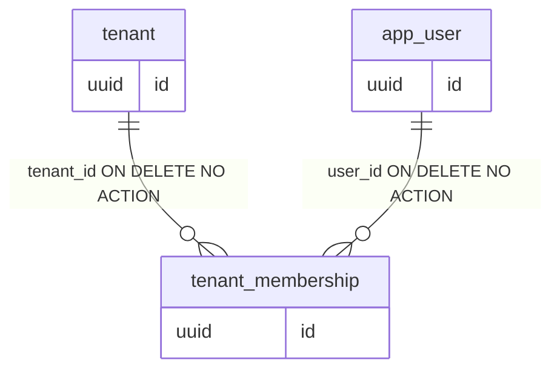
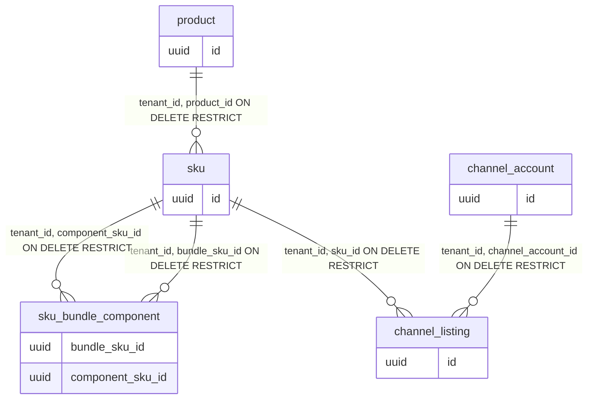
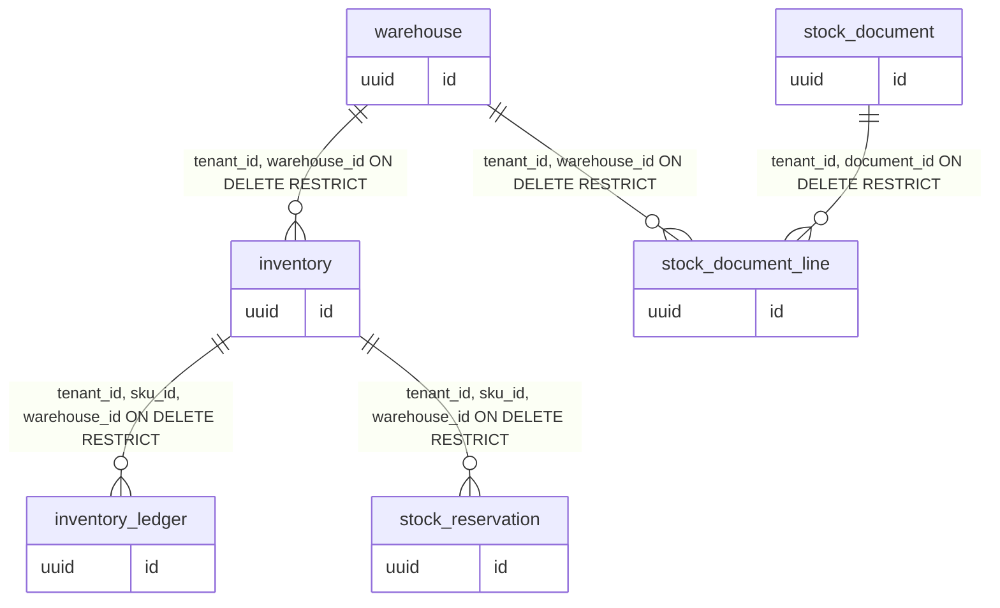
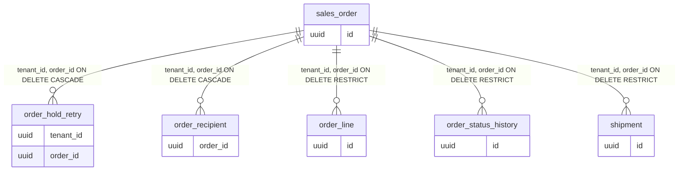
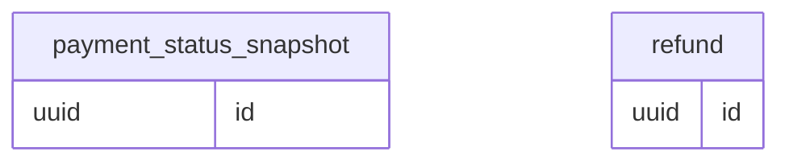
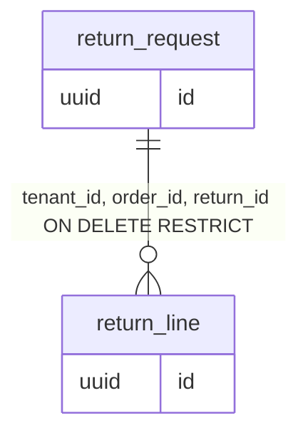
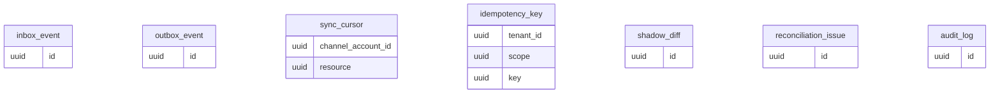
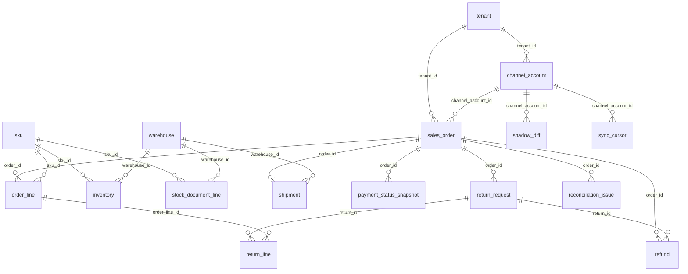

# OMS Data Dictionary

อ้างอิง main @ ee4e425 (Flyway V13)

พจนานุกรมข้อมูลทุกคอลัมน์ธุรกิจ (329) จาก `docs/schema/schema-ee4e425_39c6.sql` / `columns-ee4e425_4276.tsv` cross-check กับ Flyway V1–V13 และ Java. หลักการ RLS/PII: [03-data-model.md](../plan/03-data-model.md).

## ภาพรวมตาม domain

- **Tenant / Identity:** `tenant`, `app_user`, `tenant_membership`
- **Channel / Catalog:** `channel_account`, `product`, `sku`, `sku_bundle_component`, `channel_listing`
- **Inventory / Stock:** `warehouse`, `inventory`, `inventory_ledger`, `stock_reservation`, `stock_document`, `stock_document_line`
- **Orders / Fulfillment:** `sales_order`, `order_hold_retry`, `order_recipient`, `order_line`, `order_status_history`, `shipment`
- **Payment:** `payment_status_snapshot`, `refund`
- **Returns:** `return_request`, `return_line`
- **Sync / Platform / Audit:** `inbox_event`, `outbox_event`, `sync_cursor`, `idempotency_key`, `shadow_diff`, `reconciliation_issue`, `audit_log`

`flyway_schema_history` — ตาราง Flyway (ไม่ใช่ domain ธุรกิจ).

## ER diagrams

### Tenant / Identity

### Channel / Catalog

### Inventory / Stock

### Orders / Fulfillment

### Payment

### Returns

### Sync / Platform / Audit

### Cross-domain FK (อ้างอิงระหว่าง domain)

หมายเหตุ: ทุกตารางธุรกิจยกเว้น `app_user` มี `tenant_id` FK → `tenant` และใช้ RLS `tenant_isolation` บน `app.tenant_id` (ENABLE + FORCE 30 ตาราง)

## ค่า enum / status

### `tenant.entitlement_status`
- `ACTIVE` — ร้านใช้งานปกติ (เขียน API ได้ถ้า role ผ่าน)
- `GRACE` — อ่านได้; POST ธุรกิจถูก `403 ENTITLEMENT_GRACE`; inbox ยังรับ event
- `SUSPENDED` — paywall; inbox defer (ยกเว้น `membership.changed`)

(ค่าที่ JWT รับได้จริง: `ACTIVE`, `GRACE`, `SUSPENDED` เท่านั้น — `UserClaims.STATUSES` + CHECK)

### `tenant_membership.role` / `status`
- `OWNER`, `ADMIN`, `STAFF` — สิทธิ์ UI/API
- `ACTIVE`, `REVOKED` — membership ยังใช้หรือถูก revoke

### `channel_account.channel`
`TSF`, `SHOPEE`, `LAZADA`, `TIKTOK`

### `channel_account.mode`
- `OBSERVE` — ไม่บังคับสต็อก
- `SHADOW` — จำลอง + `shadow_diff`
- `CONTROL` — บังคับเฉพาะ listing ที่ `stock_control=true`
- `ACTIVE` — บังคับทุก listing ที่แมปแล้ว

### `channel_account.status`
`CONNECTED`, `DISCONNECTED`

### `product.status`
`ACTIVE`, `INACTIVE`

### `sales_order` — `OrderStateMachine` transitions
- **ORDER:** `ACTIVE`→`CANCELLED`|`COMPLETED`; `CANCELLED` terminal
- **PAYMENT:** `PENDING`→`PAID`; `COD_PENDING`→`PAID`; `PAID`→`PARTIALLY_REFUNDED`→`REFUNDED`
- **FULFILLMENT:** `UNFULFILLED`→`READY_TO_PICK`→`PICKING`→`PACKED`→`SHIPPED`→`DELIVERED` (`PACKED`→`READY_TO_PICK` ได้)
- **HOLD:** ทุกค่าในเซตเปลี่ยนได้ยกเว้น guard (hold ≠ `NONE` บล็อก fulfillment)

**Guards (สรุป):**
- `READY_TO_PICK`: `order_status=ACTIVE`, `payment_status` เป็น `PAID` หรือ `COD_PENDING`, `hold_reason=NONE`, และเมื่อ stock-enforced ต้องมี ORDER reservation ครบ mapped lines
- `COMPLETED`: `fulfillment=DELIVERED`, `paid_at` ไม่ null, ไม่มี open return, และ ≥7 วันหลัง `DELIVERED` (จาก history)
- ออเดอร์ `CANCELLED`/`COMPLETED`: fulfillment/hold แก้ไม่ได้; payment เปลี่ยนได้เฉพาะ refund states

### `sales_order.payment_method`
- `PREPAID` — ชำระก่อนส่ง
- `COD` — เก็บเงินปลายทาง (`COD_PENDING` ใน payment)

### `stock_reservation`
- `owner_type`: `CHECKOUT`, `ORDER`
- `status`: `ACTIVE`, `CONSUMED`, `RELEASED`, `EXPIRED`
- Lifecycle: CHECKOUT+TTL → adopt เป็น ORDER (`expires_at` NULL) ผ่าน `ReservationEngine`; expiry job ปล่อย CHECKOUT หมดอายุ

### `inventory_ledger.reason`
`OPENING_BALANCE`, `RECEIVE`, `ADJUST_IN`, `ADJUST_OUT`, `COUNT_CORRECTION`, `DAMAGE_WRITE_OFF`, `RETURN_RESTOCK`, `SHIP`, `RESERVE`, `RELEASE`, `UNPACK`

### `stock_document.type` / `status`
- type: `OPENING`, `RECEIVE`, `ADJUSTMENT`, `COUNT`, `WRITE_OFF`
- status: `DRAFT`, `POSTED`, `VOID`

### `inbox_event.status`
`RECEIVED`, `PROCESSED`, `FAILED`, `DEAD`

### `outbox_event.status`
`PENDING`, `IN_FLIGHT`, `SENT`, `DEAD`

### `audit_log.actor_type`
- `USER` — ผู้ใช้ OMS
- `SYSTEM` — job ภายใน
- `TSF` — ระบบ TSF
- `PLATFORM_ADMIN` — admin แพลตฟอร์ม

### `refund.status` (T21)
`PENDING`, `SUCCEEDED`, `FAILED`

### `return_request.type` / `status` (T20)
- type: `RETURN`, `RTS`
- status: `REQUESTED`, `APPROVED`, `REJECTED`, `RECEIVED`, `CLOSED`

### `shipment.status` (T18)
`PENDING`, `LABEL_READY`, `SHIPPED`, `IN_TRANSIT`, `DELIVERED`, `FAILED`, `RETURNED_TO_SENDER`

### `channel_listing.mapping_source`
`AUTO`, `MANUAL`, หรือ NULL ก่อนแมป

### `shadow_diff.kind`
`STOCK`, `ORDER`, `RESERVATION`

### `reconciliation_issue.status`
`OPEN`, `ACK`, `RESOLVED`

### `order_recipient.pii_status`
`ACTIVE`, `REDACTED` — ดู [PII lifecycle](../plan/03-data-model.md#pii-lifecycle)

## DB roles, RLS, Flyway

| Role | ใช้เมื่อ | สิทธิ์ |
|---|---|---|
| `oms_migrator` | **owner ตาราง** (NOLOGIN — ไม่ใช่ login ของ Flyway) | DDL ผ่าน superuser ที่รัน migration; ตารางทั้งหมด OWNER TO `oms_migrator` |
| `oms_app` | runtime + jobs | DML, **NOBYPASSRLS** |
| `oms_maint` | break-glass | BYPASSRLS; owner ฟังก์ชัน SECURITY DEFINER |

**Flyway:** เชื่อมต่อด้วย **bootstrap superuser** (local มักเป็น user `oms` ใน docker-compose) — `V1__foundation_rls.sql` บังคับ superuser เพื่อสร้าง `oms_maint` BYPASSRLS และ reassign ownership

**RLS mechanics:** ทุก transaction ตั้ง `set_config('app.tenant_id', …, true)` ผ่าน `TenantAwareDataSourceTransactionManager` (`tenant/TenantAwareDataSourceTransactionManager.java`) ทันทีที่ `doBegin` — ไม่ใช่ JPA generic manager. JWT filter ตั้ง `TenantContext` (ThreadLocal) เท่านั้น; query นอก `@Transactional` = ไม่มี context = 0 แถว (fail-closed).

**SECURITY DEFINER (ข้าม tenant, คืนเฉพาะ id หรือ batch):** `claim_inbox_batch`, `claim_outbox_batch`, `list_active_tenant_ids`, `list_tenants_with_expired_reservations`, `resolve_tenant`, `resolve_reservation_tenant` (V9), `upsert_app_user`, `provision_tenant`, `provision_membership`, `lookup_login` — ดู `V1__foundation_rls.sql`, `V2__jit_provision.sql`, `V6__stock_expiry_tenant_claim.sql`, `V9__reservation_tenant_lookup.sql`.

### Flyway V1–V13 (ไม่มี V5)

| Version | ไฟล์ | สรุป |
|---|---|---|
| V1 | `V1__foundation_rls.sql` | roles, tenant core, inbox/outbox, RLS |
| V2 | `V2__jit_provision.sql` | JIT SECURITY DEFINER |
| V3 | `V3__inbox_tenant_dedup.sql` | inbox dedup ต่อ tenant + `inbox_event_due_idx` |
| V4 | `V4__catalog_inventory.sql` | catalog + stock + triggers |
| _V5_ | _ไม่มี_ | จอง T07 แต่ ship โดยไม่มี migration — **ห้ามเพิ่ม V5** |
| V6 | `V6__stock_expiry_tenant_claim.sql` | `list_tenants_with_expired_reservations` |
| V7 | `V7__orders.sql` | orders + payment/return schema |
| V8 | `V8__ledger_seq.sql` | `ledger_seq` |
| V9 | `V9__reservation_tenant_lookup.sql` | **`resolve_reservation_tenant`** |
| V10 | `V10__tsf_channel_account_provision.sql` | channel provision |
| V11 | `V11__sales_order_list_cursor_index.sql` | list orders index |
| V12 | `V12__listing_mapping_and_orphan_marker.sql` | listing mapping + inbox orphan marker |
| V13 | `V13__order_hold_retry.sql` | `order_hold_retry` |

## ตาราง

### `tenant`

**วัตถุประสงค์:** ร้าน (tenant) หนึ่งแถวต่อ TSF shop
**Phase / feature:** T02 JIT, T11 — **สถานะ:** ใช้งานจริง

- **PK:** `id`
- **FK:** —
- **UNIQUE:**
  - `tsf_shop_id` (`tenant_tsf_shop_id_key`)
- **CHECK:**
  - `tenant_entitlement_status_check`: `(entitlement_status = ANY (ARRAY['ACTIVE'::text, 'GRACE'::text, 'SUSPENDED'::text]))`
- **RLS:** ENABLE + **FORCE** — policy `tenant_isolation` บน `id = app.tenant_id`
- **Triggers:** —

**Fields:**

| field | type | null | default | ความหมาย | ใช้ทำอะไร / ใครเขียน-ใครอ่าน | หมายเหตุ |
|---|---|---|---|---|---|---|
| `id` | `uuid` | NO | — | รหัสประจำร้าน (tenant) หนึ่งแถวต่อ TSF shop | PK; INSERT `IdentityProvisioner`, `MembershipChangedHandler`; อ่าน `MeService`, `TenantSessionService` | — |
| `name` | `text` | NO | — | ชื่อร้านที่แสดงใน OMS | เขียน `IdentityProvisioner`, `MembershipChangedHandler`; อ่าน `MeService`, `TenantSessionService` | — |
| `tsf_shop_id` | `text` | NO | — | รหัสร้านบน TSF (ไม่ซ้ำทั้งระบบ) | เขียน `IdentityProvisioner`, `MembershipChangedHandler`; อ่าน `MeService`, `TenantSessionService` | — |
| `membership_tier` | `text` | NO | — | แพ็กเกจ membership จาก TSF | เขียน `IdentityProvisioner`, `MembershipChangedHandler`; อ่าน `MeService`, `TenantSessionService` | — |
| `entitlement_status` | `text` | NO | — | สิทธิ์ใช้งาน OMS ของร้าน | TenantSessionService, InboxEntitlementPolicy | enum: ACTIVE, GRACE, SUSPENDED เท่านั้น |
| `entitlement_expires_at` | `timestamp with time zone` | YES | — | เวลาหมดอายุ subscription หรือช่วง GRACE | เขียน `IdentityProvisioner`, `MembershipChangedHandler`; อ่าน `MeService`, `TenantSessionService` | — |
| `ent_ver` | `bigint` | NO | — | เวอร์ชัน entitlement กันข้อมูล stale จาก JWT และ membership.changed | เขียน `IdentityProvisioner`, `MembershipChangedHandler`; อ่าน concurrency/dedup paths | — |

### `app_user`

**วัตถุประสงค์:** ผู้ใช้ OMS
**Phase / feature:** T02 — **สถานะ:** ใช้งานจริง

- **PK:** `id`
- **FK:** —
- **UNIQUE:**
  - `tsf_user_id` (`app_user_tsf_user_id_key`)
- **RLS:** ไม่มี (`tenant_id` ไม่มี — ดู V1)
- **Triggers:** —

**Fields:**

| field | type | null | default | ความหมาย | ใช้ทำอะไร / ใครเขียน-ใครอ่าน | หมายเหตุ |
|---|---|---|---|---|---|---|
| `id` | `uuid` | NO | — | รหัสประจำผู้ใช้ OMS (UUIDv7) | PK; INSERT `IdentityProvisioner`/`upsert_app_user`; อ่าน join `tenant_membership` | — |
| `tsf_user_id` | `text` | NO | — | รหัสผู้ใช้บน TSF (ไม่ซ้ำทั้งระบบ) | เขียน `IdentityProvisioner`/`upsert_app_user`; อ่าน join `tenant_membership` | — |
| `email` | `text` | YES | — | อีเมลผู้ใช้จาก TSF | เขียน `IdentityProvisioner`/`upsert_app_user`; อ่าน join `tenant_membership` | PII 🔒 |
| `display_name` | `text` | YES | — | ชื่อที่แสดงของผู้ใช้ | เขียน `IdentityProvisioner`/`upsert_app_user`; อ่าน join `tenant_membership` | PII 🔒 |
| `last_login_at` | `timestamp with time zone` | YES | — | เวลา login ล่าสุด (UTC) | เขียน `IdentityProvisioner`/`upsert_app_user`; อ่าน join `tenant_membership` | — |

### `tenant_membership`

**วัตถุประสงค์:** user↔tenant + role
**Phase / feature:** T02 — **สถานะ:** ใช้งานจริง

- **PK:** `id`
- **FK:**
  - `tenant_id` → `tenant`(`id`) ON DELETE NO ACTION (`tenant_membership_tenant_id_fkey`)
  - `user_id` → `app_user`(`id`) ON DELETE NO ACTION (`tenant_membership_user_id_fkey`)
- **UNIQUE:**
  - `tenant_id, user_id` (`tenant_membership_tenant_user_key`)
- **CHECK:**
  - `tenant_membership_role_check`: `(role = ANY (ARRAY['OWNER'::text, 'ADMIN'::text, 'STAFF'::text]))`
  - `tenant_membership_status_check`: `(status = ANY (ARRAY['ACTIVE'::text, 'REVOKED'::text]))`
- **Triggers:** —

**Fields:**

| field | type | null | default | ความหมาย | ใช้ทำอะไร / ใครเขียน-ใครอ่าน | หมายเหตุ |
|---|---|---|---|---|---|---|
| `id` | `uuid` | NO | — | รหัสประจำความสัมพันธ์ user–tenant | PK; INSERT `provision_membership`; อ่าน API/repository ที่ query ตาราง | — |
| `tenant_id` | `uuid` | NO | — | รหัสร้านที่แถวนี้สังกัด ใช้กรองด้วย RLS | INSERT ใส่ tenant ปัจจุบัน; RLS กรองทุก SELECT | — |
| `user_id` | `uuid` | NO | — | รหัสผู้ใช้ OMS (app_user) | เขียน `provision_membership`; อ่าน API/repository ที่ query ตาราง | — |
| `role` | `text` | NO | — | บทบาทในร้าน | เขียน `provision_membership`; อ่าน API/repository ที่ query ตาราง | enum: OWNER, ADMIN, STAFF |
| `status` | `text` | NO | — | สถานะการเป็นสมาชิก | เขียน `provision_membership`; อ่าน API/repository ที่ query ตาราง | enum: ACTIVE, REVOKED |

### `channel_account`

**วัตถุประสงค์:** บัญชีช่องทาง + mode
**Phase / feature:** T06/T10 — **สถานะ:** ใช้งานจริง

- **PK:** `id`
- **FK:**
  - `tenant_id` → `tenant`(`id`) ON DELETE NO ACTION (`channel_account_tenant_id_fkey`)
- **UNIQUE:**
  - `channel, external_shop_id` (`channel_account_channel_external_shop_key`)
  - `tenant_id, id` (`channel_account_tenant_id_id_key`)
- **CHECK:**
  - `channel_account_channel_check`: `(channel = ANY (ARRAY['TSF'::text, 'SHOPEE'::text, 'LAZADA'::text, 'TIKTOK'::text]))`
  - `channel_account_credentials_ref_check`: `((credentials_ref IS NULL) OR (btrim(credentials_ref) <> ''::text))`
  - `channel_account_external_shop_id_check`: `(btrim(external_shop_id) <> ''::text)`
  - `channel_account_mode_check`: `(mode = ANY (ARRAY['OBSERVE'::text, 'SHADOW'::text, 'CONTROL'::text, 'ACTIVE'::text]))`
  - `channel_account_status_check`: `(status = ANY (ARRAY['CONNECTED'::text, 'DISCONNECTED'::text]))`
- **Triggers:** —

**Fields:**

| field | type | null | default | ความหมาย | ใช้ทำอะไร / ใครเขียน-ใครอ่าน | หมายเหตุ |
|---|---|---|---|---|---|---|
| `id` | `uuid` | NO | — | รหัสประจำแถว (UUIDv7 ที่แอปสร้าง) | PK; INSERT JIT provision, intake; อ่าน API/repository ที่ query ตาราง | — |
| `tenant_id` | `uuid` | NO | — | รหัสร้านที่แถวนี้สังกัด ใช้กรองด้วย RLS | INSERT ใส่ tenant ปัจจุบัน; RLS กรองทุก SELECT | — |
| `channel` | `text` | NO | — | ช่องทางขาย | เขียน JIT provision, intake; อ่าน API/repository ที่ query ตาราง | enum: TSF, SHOPEE, LAZADA, TIKTOK |
| `external_shop_id` | `text` | NO | — | รหัสร้านฝั่งช่องทาง (unique กับ channel) | เขียน JIT provision, intake; อ่าน API/repository ที่ query ตาราง | — |
| `mode` | `text` | NO | `'OBSERVE'::text` | โหมดควบคุมสต็อก/สังเกตการณ์ | เขียน JIT provision, intake; อ่าน API/repository ที่ query ตาราง | enum: OBSERVE, SHADOW, CONTROL, ACTIVE |
| `stock_sync_paused` | `boolean` | NO | `false` | หยุด push สต็อกไปช่องทางชั่วคราว (true = หยุด) | เขียน JIT provision, intake; อ่าน API/repository ที่ query ตาราง | — |
| `status` | `text` | NO | — | สถานะการเชื่อมต่อบัญชี | เขียน JIT provision, intake; อ่าน API/repository ที่ query ตาราง | enum: CONNECTED, DISCONNECTED |
| `credentials_ref` | `text` | YES | — | ชื่อ secret ใน secret manager (ไม่เก็บ token ในฐานข้อมูล) | เขียน JIT provision, intake; อ่าน API/repository ที่ query ตาราง | — |
| `token_expires_at` | `timestamp with time zone` | YES | — | เวลาหมดอายุ token OAuth (UTC) | เขียน JIT provision, intake; อ่าน API/repository ที่ query ตาราง | — |
| `last_synced_at` | `timestamp with time zone` | YES | — | เวลา sync ช่องทางสำเร็จล่าสุด (UTC) | เขียน JIT provision, intake; อ่าน API/repository ที่ query ตาราง | — |
| `created_at` | `timestamp with time zone` | NO | `now()` | เวลาที่แถวถูกสร้าง (timestamptz UTC) | INSERT default now(); อ่าน API/repository ที่ query ตาราง | — |
| `updated_at` | `timestamp with time zone` | NO | `now()` | เวลาที่แถวถูกแก้ไขล่าสุด (timestamptz UTC) | อัปเดต JIT provision, intake; อ่าน API/repository ที่ query ตาราง | — |

### `product`

**วัตถุประสงค์:** กลุ่มสินค้า
**Phase / feature:** T07 — **สถานะ:** ใช้งานจริง

- **PK:** `id`
- **FK:**
  - `tenant_id` → `tenant`(`id`) ON DELETE NO ACTION (`product_tenant_id_fkey`)
- **UNIQUE:**
  - `tenant_id, id` (`product_tenant_id_id_key`)
- **CHECK:**
  - `product_status_check`: `(status = ANY (ARRAY['ACTIVE'::text, 'INACTIVE'::text]))`
- **Triggers:** —

**Fields:**

| field | type | null | default | ความหมาย | ใช้ทำอะไร / ใครเขียน-ใครอ่าน | หมายเหตุ |
|---|---|---|---|---|---|---|
| `id` | `uuid` | NO | — | รหัสประจำแถว (UUIDv7 ที่แอปสร้าง) | PK; INSERT `ProductService`; อ่าน API/repository ที่ query ตาราง | — |
| `tenant_id` | `uuid` | NO | — | รหัสร้านที่แถวนี้สังกัด ใช้กรองด้วย RLS | INSERT ใส่ tenant ปัจจุบัน; RLS กรองทุก SELECT | — |
| `name` | `text` | NO | — | ชื่อที่แสดง | เขียน `ProductService`; อ่าน API/repository ที่ query ตาราง | — |
| `status` | `text` | NO | — | สถานะสินค้าในแคตตาล็อก | เขียน `ProductService`; อ่าน API/repository ที่ query ตาราง | enum: ACTIVE, INACTIVE |
| `created_at` | `timestamp with time zone` | NO | `now()` | เวลาที่แถวถูกสร้าง (timestamptz UTC) | INSERT default now(); อ่าน API/repository ที่ query ตาราง | — |
| `updated_at` | `timestamp with time zone` | NO | `now()` | เวลาที่แถวถูกแก้ไขล่าสุด (timestamptz UTC) | อัปเดต `ProductService`; อ่าน API/repository ที่ query ตาราง | — |

### `sku`

**วัตถุประสงค์:** SKU / bundle flag
**Phase / feature:** T07 — **สถานะ:** ใช้งานจริง

- **PK:** `id`
- **FK:**
  - `tenant_id, product_id` → `product`(`tenant_id, id`) ON DELETE RESTRICT (`sku_product_fkey`)
  - `tenant_id` → `tenant`(`id`) ON DELETE NO ACTION (`sku_tenant_id_fkey`)
- **UNIQUE:**
  - `tenant_id, id` (`sku_tenant_id_id_key`)
  - `tenant_id, sku_code` (`sku_tenant_sku_code_key`)
- **CHECK:**
  - `sku_sku_code_check`: `(btrim(sku_code) <> ''::text)`
  - `sku_weight_g_check`: `((weight_g IS NULL) OR (weight_g >= 0))`
- **Indexes:**
  - `sku_tenant_product_idx` (INDEX) on `tenant_id, product_id`
- **Triggers:** `sku_is_bundle_change_check` — BEFORE UPDATE OF is_bundle

**Fields:**

| field | type | null | default | ความหมาย | ใช้ทำอะไร / ใครเขียน-ใครอ่าน | หมายเหตุ |
|---|---|---|---|---|---|---|
| `id` | `uuid` | NO | — | รหัสประจำแถว (UUIDv7 ที่แอปสร้าง) | PK; INSERT `SkuService`; อ่าน API/repository ที่ query ตาราง | — |
| `tenant_id` | `uuid` | NO | — | รหัสร้านที่แถวนี้สังกัด ใช้กรองด้วย RLS | INSERT ใส่ tenant ปัจจุบัน; RLS กรองทุก SELECT | — |
| `product_id` | `uuid` | NO | — | product แม่ของ SKU | เขียน `SkuService`; อ่าน API/repository ที่ query ตาราง | — |
| `sku_code` | `text` | NO | — | รหัส SKU ภายในร้าน (ไม่ซ้ำต่อ tenant) | เขียน `SkuService`; อ่าน API/repository ที่ query ตาราง | — |
| `name` | `text` | NO | — | ชื่อที่แสดง | เขียน `SkuService`; อ่าน API/repository ที่ query ตาราง | — |
| `barcode` | `text` | YES | — | บาร์โค้ดสินค้า (ถ้ามี) | เขียน `SkuService`; อ่าน API/repository ที่ query ตาราง | — |
| `weight_g` | `integer` | YES | — | น้ำหนักสินค้าเป็นกรัม | เขียน `SkuService`; อ่าน API/repository ที่ query ตาราง | — |
| `is_bundle` | `boolean` | NO | `false` | เป็น SKU แบบชุด (bundle) ที่ไม่ถือสต็อกเอง แต่ใช้ component | เขียน `SkuService`; อ่าน API/repository ที่ query ตาราง | — |
| `created_at` | `timestamp with time zone` | NO | `now()` | เวลาที่แถวถูกสร้าง (timestamptz UTC) | INSERT default now(); อ่าน API/repository ที่ query ตาราง | — |
| `updated_at` | `timestamp with time zone` | NO | `now()` | เวลาที่แถวถูกแก้ไขล่าสุด (timestamptz UTC) | อัปเดต `SkuService`; อ่าน API/repository ที่ query ตาราง | — |

### `sku_bundle_component`

**วัตถุประสงค์:** ส่วนประกอบ bundle
**Phase / feature:** T07 — **สถานะ:** ใช้งานจริง

- **PK:** `bundle_sku_id, component_sku_id`
- **FK:**
  - `tenant_id, bundle_sku_id` → `sku`(`tenant_id, id`) ON DELETE RESTRICT (`sku_bundle_component_bundle_fkey`)
  - `tenant_id, component_sku_id` → `sku`(`tenant_id, id`) ON DELETE RESTRICT (`sku_bundle_component_component_fkey`)
  - `tenant_id` → `tenant`(`id`) ON DELETE NO ACTION (`sku_bundle_component_tenant_id_fkey`)
- **CHECK:**
  - `sku_bundle_component_not_self_check`: `(bundle_sku_id <> component_sku_id)`
  - `sku_bundle_component_qty_check`: `(qty > 0)`
- **Indexes:**
  - `sku_bundle_component_component_sku_idx` (INDEX) on `component_sku_id`
- **Triggers:** `sku_bundle_component_check` — BEFORE INSERT OR UPDATE

**Fields:**

| field | type | null | default | ความหมาย | ใช้ทำอะไร / ใครเขียน-ใครอ่าน | หมายเหตุ |
|---|---|---|---|---|---|---|
| `tenant_id` | `uuid` | NO | — | รหัสร้านที่แถวนี้สังกัด ใช้กรองด้วย RLS | INSERT ใส่ tenant ปัจจุบัน; RLS กรองทุก SELECT | — |
| `bundle_sku_id` | `uuid` | NO | — | SKU ชุด (bundle) ที่มี component | เขียน `SkuService` components API; อ่าน API/repository ที่ query ตาราง | — |
| `component_sku_id` | `uuid` | NO | — | SKU ส่วนประกอบในชุด | เขียน `SkuService` components API; อ่าน API/repository ที่ query ตาราง | — |
| `qty` | `integer` | NO | — | จำนวน component ต่อ 1 ชุด bundle | เขียน `SkuService` components API; อ่าน API/repository ที่ query ตาราง | — |
| `created_at` | `timestamp with time zone` | NO | `now()` | เวลาที่แถวถูกสร้าง (timestamptz UTC) | INSERT default now(); อ่าน API/repository ที่ query ตาราง | — |
| `updated_at` | `timestamp with time zone` | NO | `now()` | เวลาที่แถวถูกแก้ไขล่าสุด (timestamptz UTC) | อัปเดต `SkuService` components API; อ่าน API/repository ที่ query ตาราง | — |

### `channel_listing`

**วัตถุประสงค์:** listing↔SKU
**Phase / feature:** T12 — **สถานะ:** ใช้งานจริง

- **PK:** `id`
- **FK:**
  - `tenant_id, channel_account_id` → `channel_account`(`tenant_id, id`) ON DELETE RESTRICT (`channel_listing_channel_account_fkey`)
  - `tenant_id, sku_id` → `sku`(`tenant_id, id`) ON DELETE RESTRICT (`channel_listing_sku_fkey`)
  - `tenant_id` → `tenant`(`id`) ON DELETE NO ACTION (`channel_listing_tenant_id_fkey`)
- **UNIQUE:**
  - `channel_account_id, external_sku_id` (`channel_listing_account_external_sku_key`)
  - `tenant_id, id` (`channel_listing_tenant_id_id_key`)
- **CHECK:**
  - `channel_listing_last_exposed_qty_check`: `((last_exposed_qty IS NULL) OR (last_exposed_qty >= 0))`
  - `channel_listing_last_pushed_version_check`: `((last_pushed_version IS NULL) OR (last_pushed_version >= 0))`
  - `channel_listing_mapping_source_check`: `((mapping_source IS NULL) OR (mapping_source = ANY (ARRAY['AUTO'::text, 'MANUAL'::text])))`
  - `channel_listing_mapping_source_sku_check`: `(((sku_id IS NULL) AND (mapping_source IS NULL) AND (mapped_at IS NULL)) OR ((sku_id IS NOT NULL) AND (mapping_source IS NOT NULL) AND (mapped_at IS NOT NULL)))`
  - `channel_listing_safety_buffer_check`: `(safety_buffer >= 0)`
- **Indexes:**
  - `channel_listing_tenant_sku_idx` (INDEX) on `tenant_id, sku_id) WHERE (sku_id IS NOT NULL`
  - `channel_listing_unmapped_account_idx` (INDEX) on `tenant_id, channel_account_id) WHERE (sku_id IS NULL`
- **Triggers:** —

**Fields:**

| field | type | null | default | ความหมาย | ใช้ทำอะไร / ใครเขียน-ใครอ่าน | หมายเหตุ |
|---|---|---|---|---|---|---|
| `id` | `uuid` | NO | — | รหัสประจำแถว (UUIDv7 ที่แอปสร้าง) | PK; INSERT `ChannelListingRepository`, `ListingChangedHandler`, `ChannelListingSyncService`; อ่าน listings UI, intake, hold resolver | — |
| `tenant_id` | `uuid` | NO | — | รหัสร้านที่แถวนี้สังกัด ใช้กรองด้วย RLS | INSERT ใส่ tenant ปัจจุบัน; RLS กรองทุก SELECT | — |
| `channel_account_id` | `uuid` | NO | — | บัญชีช่องทางขายที่แถวอ้างอิง | เขียน `ChannelListingRepository`, `ListingChangedHandler`, `ChannelListingSyncService`; อ่าน listings UI, intake, hold resolver | — |
| `sku_id` | `uuid` | YES | — | SKU OMS ที่แถวอ้างอิง | เขียน `ChannelListingRepository`, `ListingChangedHandler`, `ChannelListingSyncService`; อ่าน listings UI, intake, hold resolver | — |
| `external_item_id` | `text` | YES | — | รหัส item ฝั่งช่องทาง (ถ้ามี) | เขียน `ChannelListingRepository`, `ListingChangedHandler`, `ChannelListingSyncService`; อ่าน listings UI, intake, hold resolver | — |
| `external_sku_id` | `text` | NO | — | รหัส SKU/listing ฝั่งช่องทาง | เขียน `ChannelListingRepository`, `ListingChangedHandler`, `ChannelListingSyncService`; อ่าน listings UI, intake, hold resolver | — |
| `stock_control` | `boolean` | NO | `false` | เมื่อ true และ channel เป็น CONTROL — บังคับตรวจสต็อก/จอง hold ที่ intake และ checkout | เขียน `ChannelListingRepository` (map/sync), demo seed; อ่าน `OrderIntakeSupport`, `OrderHoldEffects`, `CheckoutRepository` กรอง CONTROL | — |
| `safety_buffer` | `integer` | NO | `0` | จำนวนหักจาก sellable ก่อนคำนวณ channel_exposed (checkout availability วันนี้) | เขียน `ChannelListingRepository`; อ่าน `CheckoutRepository`, `StockAvailability`, `StockRepository` หัก sellable | — |
| `last_exposed_qty` | `integer` | YES | — | จำนวนสต็อกที่ push ไปช่องทางครั้งล่าสุด | ยังไม่มี writer บน main ([T15](../plan/05-task-list.md#L216)); อ่านอนาคต stock push | reserved [T15](../plan/05-task-list.md#L216) — ยังไม่มี writer บน main |
| `last_pushed_version` | `bigint` | YES | — | เวอร์ชัน push สต็อกล่าสุดไปช่องทาง | ยังไม่มี writer บน main ([T15](../plan/05-task-list.md#L216)); อ่านอนาคต stock push | reserved [T15](../plan/05-task-list.md#L216) — ยังไม่มี writer บน main |
| `last_seen_channel_qty` | `integer` | YES | — | จำนวนสต็อกที่เห็นจากช่องทางล่าสุด | ยังไม่มี writer บน main ([T23](../plan/05-task-list.md#L245)); อ่านอนาคต drift job | reserved [T23](../plan/05-task-list.md#L245) — ยังไม่มี writer บน main |
| `created_at` | `timestamp with time zone` | NO | `now()` | เวลาที่แถวถูกสร้าง (timestamptz UTC) | INSERT default now(); อ่าน listings UI, intake, hold resolver | — |
| `updated_at` | `timestamp with time zone` | NO | `now()` | เวลาที่แถวถูกแก้ไขล่าสุด (timestamptz UTC) | อัปเดต `ChannelListingRepository`, `ListingChangedHandler`, `ChannelListingSyncService`; อ่าน listings UI, intake, hold resolver | — |
| `seller_sku` | `text` | YES | — | รหัส SKU ที่ผู้ขายตั้งบนช่องทาง | เขียน `ChannelListingRepository`, `ListingChangedHandler`, `ChannelListingSyncService`; อ่าน listings UI, intake, hold resolver | — |
| `name` | `text` | YES | — | ชื่อ listing จากช่องทาง | เขียน `ChannelListingRepository`, `ListingChangedHandler`, `ChannelListingSyncService`; อ่าน listings UI, intake, hold resolver | — |
| `mapping_source` | `text` | YES | — | วิธีที่แมป listing กับ SKU OMS | เขียน `ChannelListingRepository`, `ListingChangedHandler`, `ChannelListingSyncService`; อ่าน listings UI, intake, hold resolver | enum: AUTO, MANUAL หรือ NULL ก่อนแมป |
| `mapped_at` | `timestamp with time zone` | YES | — | เวลาที่แมป SKU สำเร็จ (UTC) | เขียน `ChannelListingRepository`, `ListingChangedHandler`, `ChannelListingSyncService`; อ่าน listings UI, intake, hold resolver | — |
| `removed_at` | `timestamp with time zone` | YES | — | เวลาที่ listing หายจากช่องทาง (soft delete) | เขียน ChannelListingSyncService.markVanished; listing.changed UPSERT ล้างเป็น NULL (ListingChangedHandler, ChannelListingRepository) | — |

### `warehouse`

**วัตถุประสงค์:** คลัง
**Phase / feature:** T07 — **สถานะ:** ใช้งานจริง

- **PK:** `id`
- **FK:**
  - `tenant_id` → `tenant`(`id`) ON DELETE NO ACTION (`warehouse_tenant_id_fkey`)
- **UNIQUE:**
  - `tenant_id, code` (`warehouse_tenant_code_key`)
  - `tenant_id, id` (`warehouse_tenant_id_id_key`)
- **CHECK:**
  - `warehouse_code_check`: `(btrim(code) <> ''::text)`
- **Indexes:**
  - `warehouse_one_default_per_tenant_idx` (UNIQUE) on `tenant_id` WHERE is_default
- **Triggers:** —

**Fields:**

| field | type | null | default | ความหมาย | ใช้ทำอะไร / ใครเขียน-ใครอ่าน | หมายเหตุ |
|---|---|---|---|---|---|---|
| `id` | `uuid` | NO | — | รหัสประจำแถว (UUIDv7 ที่แอปสร้าง) | PK; INSERT `WarehouseService`; อ่าน API/repository ที่ query ตาราง | — |
| `tenant_id` | `uuid` | NO | — | รหัสร้านที่แถวนี้สังกัด ใช้กรองด้วย RLS | INSERT ใส่ tenant ปัจจุบัน; RLS กรองทุก SELECT | — |
| `code` | `text` | NO | — | รหัสคลังภายในร้าน | เขียน `WarehouseService`; อ่าน API/repository ที่ query ตาราง | — |
| `name` | `text` | NO | — | ชื่อที่แสดง | เขียน `WarehouseService`; อ่าน API/repository ที่ query ตาราง | — |
| `address` | `jsonb` | YES | — | ที่อยู่คลังเป็น JSON (ไม่ใช่ PII ผู้รับ) | เขียน `WarehouseService`; อ่าน API/repository ที่ query ตาราง | — |
| `is_default` | `boolean` | NO | `false` | เป็นคลังหลักของร้าน (ได้มากสุดหนึ่งคลังต่อ tenant) | เขียน `WarehouseService`; อ่าน API/repository ที่ query ตาราง | — |
| `created_at` | `timestamp with time zone` | NO | `now()` | เวลาที่แถวถูกสร้าง (timestamptz UTC) | INSERT default now(); อ่าน API/repository ที่ query ตาราง | — |
| `updated_at` | `timestamp with time zone` | NO | `now()` | เวลาที่แถวถูกแก้ไขล่าสุด (timestamptz UTC) | อัปเดต `WarehouseService`; อ่าน API/repository ที่ query ตาราง | — |

### `inventory`

**วัตถุประสงค์:** on_hand/reserved
**Phase / feature:** T08 — **สถานะ:** ใช้งานจริง

- **PK:** `id`
- **FK:**
  - `tenant_id, sku_id` → `sku`(`tenant_id, id`) ON DELETE RESTRICT (`inventory_sku_fkey`)
  - `tenant_id` → `tenant`(`id`) ON DELETE NO ACTION (`inventory_tenant_id_fkey`)
  - `tenant_id, warehouse_id` → `warehouse`(`tenant_id, id`) ON DELETE RESTRICT (`inventory_warehouse_fkey`)
- **UNIQUE:**
  - `tenant_id, id` (`inventory_tenant_id_id_key`)
  - `tenant_id, sku_id, warehouse_id` (`inventory_tenant_sku_warehouse_key`)
- **CHECK:**
  - `inventory_ledger_seq_check`: `(ledger_seq >= 0)`
  - `inventory_quantity_check`: `((on_hand >= 0) AND (reserved >= 0) AND (reserved <= on_hand))`
  - `inventory_stock_version_check`: `(stock_version >= 0)`
- **Indexes:**
  - `inventory_tenant_warehouse_idx` (INDEX) on `tenant_id, warehouse_id`
- **Triggers:** `inventory_sku_stockable` — BEFORE INSERT OR UPDATE OF sku_id

**Fields:**

| field | type | null | default | ความหมาย | ใช้ทำอะไร / ใครเขียน-ใครอ่าน | หมายเหตุ |
|---|---|---|---|---|---|---|
| `id` | `uuid` | NO | — | รหัสประจำแถว (UUIDv7 ที่แอปสร้าง) | PK; INSERT `StockRepository`/`ReservationEngine`; อ่าน stock UI, checkout availability | — |
| `tenant_id` | `uuid` | NO | — | รหัสร้านที่แถวนี้สังกัด ใช้กรองด้วย RLS | INSERT ใส่ tenant ปัจจุบัน; RLS กรองทุก SELECT | — |
| `sku_id` | `uuid` | NO | — | SKU OMS ที่แถวอ้างอิง | เขียน `StockRepository`/`ReservationEngine`; อ่าน stock UI, checkout availability | — |
| `warehouse_id` | `uuid` | NO | — | คลังที่แถวอ้างอิง | เขียน `StockRepository`/`ReservationEngine`; อ่าน stock UI, checkout availability | — |
| `on_hand` | `integer` | NO | `0` | จำนวนสต็อกคงเหลือจริงในคลัง | เขียน `StockRepository`/`ReservationEngine`; อ่าน stock UI, checkout availability | — |
| `reserved` | `integer` | NO | `0` | จำนวนที่จองไว้แล้ว (reserved ≤ on_hand) | เขียน `StockRepository`/`ReservationEngine`; อ่าน stock UI, checkout availability | — |
| `stock_version` | `bigint` | NO | `0` | เวอร์ชัน monotonic บวกทุกการเปลี่ยนสต็อก — ใช้เรียง/ส่ง `stock.updated` ([T15](../plan/05-task-list.md#L216), 04-api-contract); ไม่ใช่ optimistic lock (ล็อกแถว FOR UPDATE) | อัปเดต `StockRepository` ทุกการเปลี่ยนสต็อก (+1 monotonic); อ่าน payload `stock.updated` ([T15](../plan/05-task-list.md#L216)) — ไม่ใช่ optimistic lock (lock แถว FOR UPDATE) | — |
| `created_at` | `timestamp with time zone` | NO | `now()` | เวลาที่แถวถูกสร้าง (timestamptz UTC) | INSERT default now(); อ่าน stock UI, checkout availability | — |
| `updated_at` | `timestamp with time zone` | NO | `now()` | เวลาที่แถวถูกแก้ไขล่าสุด (timestamptz UTC) | อัปเดต `StockRepository`/`ReservationEngine`; อ่าน stock UI, checkout availability | — |
| `ledger_seq` | `bigint` | NO | `0` | จำนวนแถว ledger ที่ commit แล้วสำหรับ (sku, warehouse) นี้ | อัปเดต `StockRepository` ตอน lock แถว inventory | — |

### `inventory_ledger`

**วัตถุประสงค์:** delta append-only
**Phase / feature:** T08 — **สถานะ:** ใช้งานจริง

- **PK:** `id`
- **FK:**
  - `tenant_id, sku_id, warehouse_id` → `inventory`(`tenant_id, sku_id, warehouse_id`) ON DELETE RESTRICT (`inventory_ledger_inventory_fkey`)
  - `tenant_id` → `tenant`(`id`) ON DELETE NO ACTION (`inventory_ledger_tenant_id_fkey`)
- **UNIQUE:**
  - `tenant_id, id` (`inventory_ledger_tenant_id_id_key`)
- **CHECK:**
  - `inventory_ledger_reason_check`: `(reason = ANY (ARRAY['OPENING_BALANCE'::text, 'RECEIVE'::text, 'ADJUST_IN'::text, 'ADJUST_OUT'::text, 'COUNT_CORRECTION'::text, 'DAMAGE_WRITE_OFF'::text, 'RETURN_RESTOCK'::text, 'SHIP'::text, 'RESERVE…`
  - `inventory_ledger_ref_check`: `((ref_type IS NULL) = (ref_id IS NULL))`
- **Indexes:**
  - `inventory_ledger_tenant_ref_idx` (INDEX) on `tenant_id, ref_type, ref_id) WHERE (ref_id IS NOT NULL`
  - `inventory_ledger_tenant_sku_created_idx` (INDEX) on `tenant_id, sku_id, warehouse_id, created_at DESC`
  - `inventory_ledger_tenant_sku_seq_idx` (INDEX) on `tenant_id, sku_id, warehouse_id, ledger_seq DESC`
  - `inventory_ledger_tenant_sku_wh_seq_key` (UNIQUE) on `tenant_id, sku_id, warehouse_id, ledger_seq`
- **Triggers:** `inventory_ledger_append_only` — BEFORE DELETE OR UPDATE; `inventory_ledger_append_only_truncate` — BEFORE TRUNCATE

**Fields:**

| field | type | null | default | ความหมาย | ใช้ทำอะไร / ใครเขียน-ใครอ่าน | หมายเหตุ |
|---|---|---|---|---|---|---|
| `id` | `uuid` | NO | — | รหัสประจำแถว (UUIDv7 ที่แอปสร้าง) | PK; INSERT `StockRepository`; อ่าน API/repository ที่ query ตาราง | — |
| `tenant_id` | `uuid` | NO | — | รหัสร้านที่แถวนี้สังกัด ใช้กรองด้วย RLS | INSERT ใส่ tenant ปัจจุบัน; RLS กรองทุก SELECT | — |
| `sku_id` | `uuid` | NO | — | SKU OMS ที่แถวอ้างอิง | เขียน `StockRepository`; อ่าน API/repository ที่ query ตาราง | append-only — ห้าม UPDATE/DELETE |
| `warehouse_id` | `uuid` | NO | — | คลังที่แถวอ้างอิง | เขียน `StockRepository`; อ่าน API/repository ที่ query ตาราง | append-only — ห้าม UPDATE/DELETE |
| `delta_on_hand` | `integer` | NO | — | การเปลี่ยน on_hand ในรายการนี้ (+/-) | เขียน `StockRepository`; อ่าน API/repository ที่ query ตาราง | append-only — ห้าม UPDATE/DELETE |
| `delta_reserved` | `integer` | NO | — | การเปลี่ยน reserved ในรายการนี้ (+/-) | เขียน `StockRepository`; อ่าน API/repository ที่ query ตาราง | append-only — ห้าม UPDATE/DELETE |
| `reason` | `text` | NO | — | เหตุผลทางบัญชีสต็อก | เขียน `StockRepository`; อ่าน API/repository ที่ query ตาราง | enum: OPENING_BALANCE, RECEIVE, ADJUST_IN, ADJUST_OUT, COUNT_CORRECTION, DAMAGE_WRITE_OFF, RETURN_RESTOCK, SHIP, RESERVE, RELEASE, UNPACK; append-only |
| `ref_type` | `text` | YES | — | ประเภทอ้างอิงต้นทาง (เช่น reservation, document) | เขียน `StockRepository`; อ่าน API/repository ที่ query ตาราง | append-only — ห้าม UPDATE/DELETE |
| `ref_id` | `uuid` | YES | — | รหัสอ้างอิงต้นทาง (คู่กับ ref_type) | เขียน `StockRepository`; อ่าน API/repository ที่ query ตาราง | append-only — ห้าม UPDATE/DELETE |
| `actor` | `text` | YES | — | ผู้กระทำหรือระบบที่ทำให้เกิดรายการ | เขียน `StockRepository`; อ่าน API/repository ที่ query ตาราง | append-only — ห้าม UPDATE/DELETE |
| `created_at` | `timestamp with time zone` | NO | `now()` | เวลาที่แถวถูกสร้าง (timestamptz UTC) | INSERT default now(); อ่าน API/repository ที่ query ตาราง | append-only — ห้าม UPDATE/DELETE |
| `ledger_seq` | `bigint` | NO | — | ลำดับ monotonic ต่อ (tenant, sku, warehouse) ใช้เรียงประวัติแทน created_at | เขียน `StockRepository`; อ่าน API/repository ที่ query ตาราง | append-only |

### `stock_reservation`

**วัตถุประสงค์:** จอง CHECKOUT/ORDER
**Phase / feature:** T08/T12 — **สถานะ:** ใช้งานจริง

- **PK:** `id`
- **FK:**
  - `tenant_id, sku_id, warehouse_id` → `inventory`(`tenant_id, sku_id, warehouse_id`) ON DELETE RESTRICT (`stock_reservation_inventory_fkey`)
  - `tenant_id` → `tenant`(`id`) ON DELETE NO ACTION (`stock_reservation_tenant_id_fkey`)
- **UNIQUE:**
  - `tenant_id, id` (`stock_reservation_tenant_id_id_key`)
- **CHECK:**
  - `stock_reservation_owner_ref_check`: `(btrim(owner_ref) <> ''::text)`
  - `stock_reservation_owner_type_check`: `(owner_type = ANY (ARRAY['CHECKOUT'::text, 'ORDER'::text]))`
  - `stock_reservation_qty_check`: `(qty > 0)`
  - `stock_reservation_status_check`: `(status = ANY (ARRAY['ACTIVE'::text, 'CONSUMED'::text, 'RELEASED'::text, 'EXPIRED'::text]))`
- **Indexes:**
  - `stock_reservation_active_expiry_idx` (INDEX) on `status, expires_at) WHERE (status = 'ACTIVE'::text`
  - `stock_reservation_active_owner_sku_key` (UNIQUE) on `tenant_id, owner_type, owner_ref, sku_id) WHERE (status = 'ACTIVE'::text`
  - `stock_reservation_group_id_idx` (INDEX) on `reservation_group_id`
  - `stock_reservation_group_idx` (INDEX) on `tenant_id, reservation_group_id`
  - `stock_reservation_owner_idx` (INDEX) on `tenant_id, owner_type, owner_ref`
  - `stock_reservation_tenant_sku_idx` (INDEX) on `tenant_id, sku_id, warehouse_id`
- **Triggers:** —

**Fields:**

| field | type | null | default | ความหมาย | ใช้ทำอะไร / ใครเขียน-ใครอ่าน | หมายเหตุ |
|---|---|---|---|---|---|---|
| `id` | `uuid` | NO | — | รหัสประจำแถว (UUIDv7 ที่แอปสร้าง) | PK; INSERT `CheckoutReserveService`, `ReservationEngine`, intake; อ่าน API/repository ที่ query ตาราง | — |
| `tenant_id` | `uuid` | NO | — | รหัสร้านที่แถวนี้สังกัด ใช้กรองด้วย RLS | INSERT ใส่ tenant ปัจจุบัน; RLS กรองทุก SELECT | — |
| `owner_type` | `text` | NO | — | เจ้าของการจอง | เขียน `CheckoutReserveService`, `ReservationEngine`, intake; อ่าน API/repository ที่ query ตาราง | enum: CHECKOUT, ORDER |
| `owner_ref` | `text` | NO | — | อ้างอิงเจ้าของ (เช่น checkout id หรือ order id เป็น text) | เขียน `CheckoutReserveService`, `ReservationEngine`, intake; อ่าน API/repository ที่ query ตาราง | — |
| `sku_id` | `uuid` | NO | — | SKU OMS ที่แถวอ้างอิง | เขียน `CheckoutReserveService`, `ReservationEngine`, intake; อ่าน API/repository ที่ query ตาราง | — |
| `warehouse_id` | `uuid` | NO | — | คลังที่แถวอ้างอิง | เขียน `CheckoutReserveService`, `ReservationEngine`, intake; อ่าน API/repository ที่ query ตาราง | — |
| `qty` | `integer` | NO | — | จำนวนที่จอง (ต่อ component SKU) | เขียน `CheckoutReserveService`, `ReservationEngine`, intake; อ่าน API/repository ที่ query ตาราง | — |
| `status` | `text` | NO | — | ACTIVE กำลังจอง, CONSUMED ตัดสต็อกเมื่อ ship, RELEASED คืนสต็อก, EXPIRED หมดเวลา/unpaid grace | อัปเดต `ReservationEngine`, `StockExpiryJob` (EXPIRED), cancel/release paths | — |
| `expires_at` | `timestamp with time zone` | YES | — | เวลาหมดอายุการจอง (UTC); NULL เมื่อชำระแล้วหรือไม่มี TTL | ตั้ง `CheckoutReserveService`/`ReservationEngine` (CHECKOUT TTL); ORDER unpaid PREPAID = payment_expires_at + grace (`OrderIntakeSupport.adoptForOrder`); ล้าง NULL เมื่อ paid (`StockRepository`) | — |
| `reservation_group_id` | `uuid` | NO | — | รหัสกลุ่มจองร่วมกัน (UUIDv7) ที่ส่งกลับ TSF เป็น reservation_id | CheckoutReserveService.createdResponse; ReservationEngine | — |
| `created_at` | `timestamp with time zone` | NO | `now()` | เวลาที่แถวถูกสร้าง (timestamptz UTC) | INSERT default now(); อ่าน API/repository ที่ query ตาราง | — |
| `updated_at` | `timestamp with time zone` | NO | `now()` | เวลาที่แถวถูกแก้ไขล่าสุด (timestamptz UTC) | อัปเดต `CheckoutReserveService`, `ReservationEngine`, intake; อ่าน API/repository ที่ query ตาราง | — |

### `stock_document`

**วัตถุประสงค์:** เอกสารสต็อก
**Phase / feature:** T08A — **สถานะ:** ใช้งานจริง

- **PK:** `id`
- **FK:**
  - `tenant_id` → `tenant`(`id`) ON DELETE NO ACTION (`stock_document_tenant_id_fkey`)
- **UNIQUE:**
  - `tenant_id, id` (`stock_document_tenant_id_id_key`)
- **CHECK:**
  - `stock_document_count_started_at_check`: `((count_started_at IS NULL) OR (type = 'COUNT'::text))`
  - `stock_document_posted_at_check`: `((status = 'DRAFT'::text) = (posted_at IS NULL))`
  - `stock_document_status_check`: `(status = ANY (ARRAY['DRAFT'::text, 'POSTED'::text, 'VOID'::text]))`
  - `stock_document_type_check`: `(type = ANY (ARRAY['OPENING'::text, 'RECEIVE'::text, 'ADJUSTMENT'::text, 'COUNT'::text, 'WRITE_OFF'::text]))`
- **Indexes:**
  - `stock_document_tenant_status_created_idx` (INDEX) on `tenant_id, status, created_at DESC`
- **Triggers:** `stock_document_guard` — BEFORE INSERT OR DELETE OR UPDATE

**Fields:**

| field | type | null | default | ความหมาย | ใช้ทำอะไร / ใครเขียน-ใครอ่าน | หมายเหตุ |
|---|---|---|---|---|---|---|
| `id` | `uuid` | NO | — | รหัสประจำแถว (UUIDv7 ที่แอปสร้าง) | PK; INSERT `StockDocumentService`; อ่าน API/repository ที่ query ตาราง | — |
| `tenant_id` | `uuid` | NO | — | รหัสร้านที่แถวนี้สังกัด ใช้กรองด้วย RLS | INSERT ใส่ tenant ปัจจุบัน; RLS กรองทุก SELECT | — |
| `type` | `text` | NO | — | ประเภทเอกสารสต็อก | เขียน `StockDocumentService`; อ่าน API/repository ที่ query ตาราง | enum: OPENING, RECEIVE, ADJUSTMENT, COUNT, WRITE_OFF |
| `status` | `text` | NO | — | สถานะเอกสาร | เขียน `StockDocumentService`; อ่าน API/repository ที่ query ตาราง | enum: DRAFT, POSTED, VOID; หลัง DRAFT แก้ได้แค่ status |
| `reference_no` | `text` | YES | — | เลขอ้างอิงภายนอกของเอกสาร | เขียน `StockDocumentService`; อ่าน API/repository ที่ query ตาราง | — |
| `note` | `text` | YES | — | หมายเหตุเอกสาร | เขียน `StockDocumentService`; อ่าน API/repository ที่ query ตาราง | — |
| `count_started_at` | `timestamp with time zone` | YES | — | เวลาเริ่มนับสต็อก (เฉพาะ type COUNT) | เขียน `StockDocumentService`; อ่าน API/repository ที่ query ตาราง | — |
| `posted_at` | `timestamp with time zone` | YES | — | เวลา post เอกสม (NULL ตอน DRAFT) | เขียน `StockDocumentService`; อ่าน API/repository ที่ query ตาราง | — |
| `posted_by` | `uuid` | YES | — | รหัส app_user ที่ post (ไม่มี FK) | เขียน `StockDocumentService`; อ่าน API/repository ที่ query ตาราง | — |
| `created_at` | `timestamp with time zone` | NO | `now()` | เวลาที่แถวถูกสร้าง (timestamptz UTC) | INSERT default now(); อ่าน API/repository ที่ query ตาราง | — |
| `updated_at` | `timestamp with time zone` | NO | `now()` | เวลาที่แถวถูกแก้ไขล่าสุด (timestamptz UTC) | อัปเดต `StockDocumentService`; อ่าน API/repository ที่ query ตาราง | — |

### `stock_document_line`

**วัตถุประสงค์:** บรรทัดเอกสาร
**Phase / feature:** T08A — **สถานะ:** ใช้งานจริง

- **PK:** `id`
- **FK:**
  - `tenant_id, document_id` → `stock_document`(`tenant_id, id`) ON DELETE RESTRICT (`stock_document_line_document_fkey`)
  - `tenant_id, sku_id` → `sku`(`tenant_id, id`) ON DELETE RESTRICT (`stock_document_line_sku_fkey`)
  - `tenant_id` → `tenant`(`id`) ON DELETE NO ACTION (`stock_document_line_tenant_id_fkey`)
  - `tenant_id, warehouse_id` → `warehouse`(`tenant_id, id`) ON DELETE RESTRICT (`stock_document_line_warehouse_fkey`)
- **UNIQUE:**
  - `tenant_id, id` (`stock_document_line_tenant_id_id_key`)
- **CHECK:**
  - `stock_document_line_counted_qty_check`: `((counted_qty IS NULL) OR (counted_qty >= 0))`
  - `stock_document_line_system_qty_check`: `((system_qty_at_start IS NULL) OR (system_qty_at_start >= 0))`
- **Indexes:**
  - `stock_document_line_document_idx` (INDEX) on `tenant_id, document_id`
  - `stock_document_line_sku_idx` (INDEX) on `tenant_id, sku_id`
- **Triggers:** `stock_document_line_guard` — BEFORE INSERT OR DELETE OR UPDATE; `stock_document_line_sku_stockable` — BEFORE INSERT OR UPDATE OF sku_id

**Fields:**

| field | type | null | default | ความหมาย | ใช้ทำอะไร / ใครเขียน-ใครอ่าน | หมายเหตุ |
|---|---|---|---|---|---|---|
| `id` | `uuid` | NO | — | รหัสประจำแถว (UUIDv7 ที่แอปสร้าง) | PK; INSERT `StockDocumentStore`; อ่าน API/repository ที่ query ตาราง | — |
| `tenant_id` | `uuid` | NO | — | รหัสร้านที่แถวนี้สังกัด ใช้กรองด้วย RLS | INSERT ใส่ tenant ปัจจุบัน; RLS กรองทุก SELECT | — |
| `document_id` | `uuid` | NO | — | รหัสเอกสารแม่ | เขียน `StockDocumentStore`; อ่าน API/repository ที่ query ตาราง | — |
| `sku_id` | `uuid` | NO | — | SKU OMS ที่แถวอ้างอิง | เขียน `StockDocumentStore`; อ่าน API/repository ที่ query ตาราง | — |
| `warehouse_id` | `uuid` | NO | — | คลังที่แถวอ้างอิง | เขียน `StockDocumentStore`; อ่าน API/repository ที่ query ตาราง | — |
| `qty` | `integer` | NO | — | จำนวนในบรรทัด (ความหมายตามประเภทเอกสาร) | เขียน `StockDocumentStore`; อ่าน API/repository ที่ query ตาราง | — |
| `system_qty_at_start` | `integer` | YES | — | ยอดระบบตอนเริ่มนับ (COUNT) | เขียน `StockDocumentStore`; อ่าน API/repository ที่ query ตาราง | — |
| `counted_qty` | `integer` | YES | — | ยอดที่นับได้จริง (COUNT) | เขียน `StockDocumentStore`; อ่าน API/repository ที่ query ตาราง | — |
| `reason_code` | `text` | YES | — | รหัสเหตุผลปรับสต็อก (บังคับตอน post ADJUSTMENT) | เขียน `StockDocumentStore`; อ่าน API/repository ที่ query ตาราง | — |
| `created_at` | `timestamp with time zone` | NO | `now()` | เวลาที่แถวถูกสร้าง (timestamptz UTC) | INSERT default now(); อ่าน API/repository ที่ query ตาราง | — |
| `updated_at` | `timestamp with time zone` | NO | `now()` | เวลาที่แถวถูกแก้ไขล่าสุด (timestamptz UTC) | อัปเดต `StockDocumentStore`; อ่าน API/repository ที่ query ตาราง | — |

### `sales_order`

**วัตถุประสงค์:** หัวออเดอร์
**Phase / feature:** T10/T12/T13 — **สถานะ:** ใช้งานจริง

- **PK:** `id`
- **FK:**
  - `tenant_id, channel_account_id` → `channel_account`(`tenant_id, id`) ON DELETE RESTRICT (`sales_order_channel_account_fkey`)
  - `tenant_id` → `tenant`(`id`) ON DELETE NO ACTION (`sales_order_tenant_id_fkey`)
- **UNIQUE:**
  - `channel_account_id, external_order_id` (`sales_order_channel_account_external_order_key`)
  - `tenant_id, id` (`sales_order_tenant_id_id_key`)
- **CHECK:**
  - `sales_order_amounts_check`: `((subtotal >= (0)::numeric) AND (shipping_fee >= (0)::numeric) AND (discount >= (0)::numeric) AND (grand_total >= (0)::numeric))`
  - `sales_order_currency_check`: `(currency = 'THB'::text)`
  - `sales_order_external_order_id_check`: `(btrim(external_order_id) <> ''::text)`
  - `sales_order_external_version_check`: `((external_version IS NULL) OR (external_version >= 0))`
  - `sales_order_fulfillment_status_check`: `(fulfillment_status = ANY (ARRAY['UNFULFILLED'::text, 'READY_TO_PICK'::text, 'PICKING'::text, 'PACKED'::text, 'SHIPPED'::text, 'DELIVERED'::text]))`
  - `sales_order_hold_reason_check`: `(hold_reason = ANY (ARRAY['NONE'::text, 'SKU_NOT_MAPPED'::text, 'OUT_OF_STOCK'::text, 'ADDRESS_PROBLEM'::text, 'PAYMENT_MISMATCH'::text, 'CHANNEL_CANCEL_PENDING'::text, 'MANUAL'::text]))`
  - `sales_order_order_status_check`: `(order_status = ANY (ARRAY['ACTIVE'::text, 'CANCELLED'::text, 'COMPLETED'::text]))`
  - `sales_order_payment_method_check`: `(payment_method = ANY (ARRAY['PREPAID'::text, 'COD'::text]))`
  - `sales_order_payment_status_check`: `(payment_status = ANY (ARRAY['PENDING'::text, 'PAID'::text, 'COD_PENDING'::text, 'PARTIALLY_REFUNDED'::text, 'REFUNDED'::text]))`
  - `sales_order_version_check`: `(version >= 0)`
- **Indexes:**
  - `sales_order_tenant_fulfillment_ordered_idx` (INDEX) on `tenant_id, fulfillment_status, ordered_at DESC`
  - `sales_order_tenant_hold_idx` (INDEX) on `tenant_id, hold_reason) WHERE (hold_reason <> 'NONE'::text`
  - `sales_order_tenant_ordered_id_desc_idx` (INDEX) on `tenant_id, ordered_at DESC, id DESC`
  - `sales_order_tenant_ship_by_idx` (INDEX) on `tenant_id, ship_by) WHERE (fulfillment_status = ANY (ARRAY['READY_TO_PICK'::text, 'PICKING'::text, 'PACKED'::text])`
- **Triggers:** —

**Fields:**

| field | type | null | default | ความหมาย | ใช้ทำอะไร / ใครเขียน-ใครอ่าน | หมายเหตุ |
|---|---|---|---|---|---|---|
| `id` | `uuid` | NO | — | รหัสประจำแถว (UUIDv7 ที่แอปสร้าง) | PK; INSERT order intake, `OrderStateMachine`; อ่าน `OrderQueryService`, orders UI | — |
| `tenant_id` | `uuid` | NO | — | รหัสร้านที่แถวนี้สังกัด ใช้กรองด้วย RLS | INSERT ใส่ tenant ปัจจุบัน; RLS กรองทุก SELECT | — |
| `channel_account_id` | `uuid` | NO | — | บัญชีช่องทางขายที่แถวอ้างอิง | เขียน order intake, `OrderStateMachine`; อ่าน `OrderQueryService`, orders UI | — |
| `external_order_id` | `text` | NO | — | รหัสออเดอร์ฝั่งช่องทาง | เขียน order intake, `OrderStateMachine`; อ่าน `OrderQueryService`, orders UI | — |
| `order_status` | `text` | NO | `'ACTIVE'::text` | สถานะชีวิตออเดอร์ | OrderStateMachine | enum: ACTIVE, CANCELLED, COMPLETED |
| `payment_status` | `text` | NO | — | สถานะการชำระเงินที่ OMS derive | OrderStateMachine | enum: PENDING, PAID, COD_PENDING, PARTIALLY_REFUNDED, REFUNDED |
| `fulfillment_status` | `text` | NO | `'UNFULFILLED'::text` | สถานะการจัดส่ง/fulfillment | OrderStateMachine | enum: UNFULFILLED, READY_TO_PICK, PICKING, PACKED, SHIPPED, DELIVERED |
| `hold_reason` | `text` | NO | `'NONE'::text` | เหตุผลที่ออเดอร์ถูก hold | OrderStateMachine, OrderHoldResolver | enum: NONE, SKU_NOT_MAPPED, OUT_OF_STOCK, ADDRESS_PROBLEM, PAYMENT_MISMATCH, CHANNEL_CANCEL_PENDING, MANUAL |
| `hold_note` | `text` | YES | — | หมายเหตุเพิ่มเมื่อ hold (เช่น MANUAL) | เขียน order intake, `OrderStateMachine`; อ่าน `OrderQueryService`, orders UI | — |
| `channel_status` | `text` | YES | — | ข้อความสถานะดิบจากช่องทาง | เขียน order intake, `OrderStateMachine`; อ่าน `OrderQueryService`, orders UI | — |
| `payment_method` | `text` | NO | — | วิธีชำระ | เขียน order intake, `OrderStateMachine`; อ่าน `OrderQueryService`, orders UI | enum: PREPAID, COD |
| `currency` | `text` | NO | `'THB'::text` | สกุลเงินออเดอร์ — CHECK บังคับ `THB` เท่านั้นบน main | INSERT order intake; ค่า THB ตามช่องทาง — อ่าน API/UI | — |
| `subtotal` | `numeric` | NO | `0` | ยอดรวมสินค้า (บาท) | เขียน order intake, `OrderStateMachine`; อ่าน `OrderQueryService`, orders UI | เงิน THB numeric(14,2) |
| `shipping_fee` | `numeric` | NO | `0` | ค่าจัดส่ง (บาท) | เขียน order intake, `OrderStateMachine`; อ่าน `OrderQueryService`, orders UI | เงิน THB numeric(14,2) |
| `discount` | `numeric` | NO | `0` | ส่วนลด (บาท) | เขียน order intake, `OrderStateMachine`; อ่าน `OrderQueryService`, orders UI | เงิน THB numeric(14,2) |
| `grand_total` | `numeric` | NO | `0` | ยอดสุทธิออเดอร์ (บาท) | เขียน order intake, `OrderStateMachine`; อ่าน `OrderQueryService`, orders UI | เงิน THB numeric(14,2) |
| `ordered_at` | `timestamp with time zone` | NO | — | เวลาที่ลูกค้าสั่ง (UTC) | เขียน order intake, `OrderStateMachine`; อ่าน `OrderQueryService`, orders UI | — |
| `paid_at` | `timestamp with time zone` | YES | — | เวลาชำระเงินสำเร็จ (UTC) | เขียน order intake, `OrderStateMachine`; อ่าน `OrderQueryService`, orders UI | — |
| `ship_by` | `timestamp with time zone` | YES | — | กำหนดส่งล่าสุดจากช่องทาง (UTC) | เขียน order intake, `OrderStateMachine`; อ่าน `OrderQueryService`, orders UI | — |
| `completed_at` | `timestamp with time zone` | YES | — | เวลาออเดอร์ปิดงาน (UTC) | ยังไม่มี writer บน main — คอลัมน์สำรองเมื่อปิดออเดอร์; อ่าน `OrderQueryService` | reserved — ยังไม่มี writer บน main |
| `external_version` | `bigint` | YES | — | เวอร์ชัน aggregate จากช่องทาง ใช้ dedup inbox | เขียน order intake, `OrderStateMachine`; อ่าน concurrency/dedup paths | — |
| `version` | `bigint` | NO | `0` | เวอร์ชัน optimistic lock ของออเดอร์ | OrderStateMachine | — |
| `created_at` | `timestamp with time zone` | NO | `now()` | เวลาที่แถวถูกสร้าง (timestamptz UTC) | INSERT default now(); อ่าน `OrderQueryService`, orders UI | — |
| `updated_at` | `timestamp with time zone` | NO | `now()` | เวลาที่แถวถูกแก้ไขล่าสุด (timestamptz UTC) | อัปเดต order intake, `OrderStateMachine`; อ่าน `OrderQueryService`, orders UI | — |

### `order_hold_retry`

**วัตถุประสงค์:** backoff สำหรับ scheduled sweeper ของ hold SKU_NOT_MAPPED (STILL_HELD/DEFERRED → recordBackoff); RELEASED/OUT_OF_STOCK ลบแถว (`OrderHoldResolverJob.persistRetryState`)
**Phase / feature:** T12B-FU V13 — **สถานะ:** ใช้งานจริง

- **PK:** `tenant_id, order_id`
- **FK:**
  - `tenant_id, order_id` → `sales_order`(`tenant_id, id`) ON DELETE CASCADE (`order_hold_retry_sales_order_fkey`)
  - `tenant_id` → `tenant`(`id`) ON DELETE NO ACTION (`order_hold_retry_tenant_id_fkey`)
- **Indexes:**
  - `order_hold_retry_tenant_next_attempt_idx` (INDEX) on `tenant_id, next_attempt_at`
- **Triggers:** —

**Fields:**

| field | type | null | default | ความหมาย | ใช้ทำอะไร / ใครเขียน-ใครอ่าน | หมายเหตุ |
|---|---|---|---|---|---|---|
| `tenant_id` | `uuid` | NO | — | รหัสร้านที่แถวนี้สังกัด ใช้กรองด้วย RLS | PK; RLS | — |
| `order_id` | `uuid` | NO | — | ออเดอร์ SKU_NOT_MAPPED ที่ scheduled sweeper จะลองอีก (PK) | PK; เขียน/ลบ `OrderHoldResolverJob.persistRetryState` | — |
| `attempts` | `integer` | NO | `0` | จำนวนรอบ backoff ที่ scheduled sweeper บันทึกแล้ว | เขียน `OrderHoldRetryRepository.recordBackoff` (scheduled sweeper); ลบแถวเมื่อ RELEASED/OUT_OF_STOCK | — |
| `next_attempt_at` | `timestamp with time zone` | NO | — | เวลาที่ scheduled sweeper จะลอง resolve อีก | เขียน `recordBackoff` จาก `OrderHoldResolverJob.persistRetryState` | — |
| `last_error` | `text` | YES | — | โค้ดผลล่าสุด: `STILL_HELD`, `DEFERRED`, หรือ simple name ของ exception (ไม่ใช่ข้อความ error) | เขียน `recordBackoff` — โค้ด STILL_HELD \| DEFERRED \| simple name ของ exception (ไม่ใช่ message) | — |
| `updated_at` | `timestamp with time zone` | NO | `now()` | เวลาที่แถวถูกแก้ไขล่าสุด (timestamptz UTC) | อัปเดต `OrderHoldRetryRepository` | — |

### `order_recipient`

**วัตถุประสงค์:** PII ผู้รับ
**Phase / feature:** T10 — **สถานะ:** ใช้งานจริง

- **PK:** `order_id`
- **FK:**
  - `tenant_id, order_id` → `sales_order`(`tenant_id, id`) ON DELETE CASCADE (`order_recipient_order_fkey`)
  - `tenant_id` → `tenant`(`id`) ON DELETE NO ACTION (`order_recipient_tenant_id_fkey`)
- **CHECK:**
  - `order_recipient_active_check`: `((pii_status <> 'ACTIVE'::text) OR ((name_enc IS NOT NULL) AND (address_enc IS NOT NULL)))`
  - `order_recipient_phone_check`: `CASE pii_status WHEN 'REDACTED'::text THEN ((phone_hash IS NULL) AND (phone_last4 IS NULL)) ELSE ((phone_enc IS NULL) = (phone_hash IS NULL)) END`
  - `order_recipient_phone_hash_check`: `((phone_hash IS NULL) OR (octet_length(phone_hash) = 32))`
  - `order_recipient_phone_last4_check`: `((phone_last4 IS NULL) OR (phone_last4 ~ '^[0-9]{4}$'::text))`
  - `order_recipient_pii_status_check`: `(pii_status = ANY (ARRAY['ACTIVE'::text, 'REDACTED'::text]))`
  - `order_recipient_redacted_check`: `((pii_status <> 'REDACTED'::text) OR ((name_enc IS NULL) AND (phone_enc IS NULL) AND (address_enc IS NULL)))`
- **Indexes:**
  - `order_recipient_pii_status_redact_after_idx` (INDEX) on `pii_status, redact_after`
  - `order_recipient_tenant_phone_hash_idx` (INDEX) on `tenant_id, phone_hash`
- **Triggers:** —

**Fields:**

| field | type | null | default | ความหมาย | ใช้ทำอะไร / ใครเขียน-ใครอ่าน | หมายเหตุ |
|---|---|---|---|---|---|---|
| `order_id` | `uuid` | NO | — | รหัสออเดอร์ (PK คู่กับแถว PII หนึ่งต่อ order) | เขียน `OrderRecipientRepository`; อ่าน API/repository ที่ query ตาราง | — |
| `tenant_id` | `uuid` | NO | — | รหัสร้านที่แถวนี้สังกัด ใช้กรองด้วย RLS | INSERT ใส่ tenant ปัจจุบัน; RLS กรองทุก SELECT | — |
| `name_enc` | `bytea` | YES | — | ชื่อผู้รับเข้ารหัส AES-256-GCM | เขียน `OrderRecipientRepository`; อ่าน API/repository ที่ query ตาราง | PII 🔒 ciphertext |
| `phone_enc` | `bytea` | YES | — | เบอร์โทรเข้ารหัส AES-256-GCM | เขียน `OrderRecipientRepository`; อ่าน API/repository ที่ query ตาราง | PII 🔒 ciphertext |
| `phone_hash` | `bytea` | YES | — | HMAC-SHA256 ของเบอร์ normalize ใช้ค้นหา | เขียน `OrderRecipientRepository`; อ่าน API/repository ที่ query ตาราง | PII 🔒 |
| `phone_last4` | `text` | YES | — | เลข 4 ตัวท้ายเบอร์โทร (plaintext) | เขียน `OrderRecipientRepository`; อ่าน API/repository ที่ query ตาราง | PII 🔒 |
| `address_enc` | `bytea` | YES | — | ที่อยู่เข้ารหัส AES-256-GCM | เขียน `OrderRecipientRepository`; อ่าน API/repository ที่ query ตาราง | PII 🔒 ciphertext |
| `province` | `text` | YES | — | จังหวัด (plaintext; คงไว้หลัง redact) | เขียน `OrderRecipientRepository`; อ่าน API/repository ที่ query ตาราง | — |
| `postcode` | `text` | YES | — | รหัสไปรษณีย์ (plaintext; คงไว้หลัง redact) | เขียน `OrderRecipientRepository`; อ่าน API/repository ที่ query ตาราง | — |
| `pii_status` | `text` | NO | `'ACTIVE'::text` | สถานะวงจร PII | เขียน `OrderRecipientRepository`; อ่าน API/repository ที่ query ตาราง | enum: ACTIVE, REDACTED |
| `redact_after` | `timestamp with time zone` | YES | — | เวลานัดลบ/ทำให้ไม่ระบุตัวตน (PDPA) | เขียน `OrderRecipientRepository`; อ่าน API/repository ที่ query ตาราง | — |
| `created_at` | `timestamp with time zone` | NO | `now()` | เวลาที่แถวถูกสร้าง (timestamptz UTC) | INSERT default now(); อ่าน API/repository ที่ query ตาราง | — |
| `updated_at` | `timestamp with time zone` | NO | `now()` | เวลาที่แถวถูกแก้ไขล่าสุด (timestamptz UTC) | อัปเดต `OrderRecipientRepository`; อ่าน API/repository ที่ query ตาราง | — |

### `order_line`

**วัตถุประสงค์:** บรรทัดออเดอร์
**Phase / feature:** T10 — **สถานะ:** ใช้งานจริง

- **PK:** `id`
- **FK:**
  - `tenant_id, order_id` → `sales_order`(`tenant_id, id`) ON DELETE RESTRICT (`order_line_order_fkey`)
  - `tenant_id, sku_id` → `sku`(`tenant_id, id`) ON DELETE RESTRICT (`order_line_sku_fkey`)
  - `tenant_id` → `tenant`(`id`) ON DELETE NO ACTION (`order_line_tenant_id_fkey`)
- **UNIQUE:**
  - `order_id, external_line_id` (`order_line_order_external_line_key`)
  - `tenant_id, id` (`order_line_tenant_id_id_key`)
  - `tenant_id, order_id, id` (`order_line_tenant_order_id_key`)
- **CHECK:**
  - `order_line_amounts_check`: `((unit_price >= (0)::numeric) AND (discount >= (0)::numeric) AND (line_total >= (0)::numeric))`
  - `order_line_qty_check`: `(qty > 0)`
- **Indexes:**
  - `order_line_tenant_sku_idx` (INDEX) on `tenant_id, sku_id) WHERE (sku_id IS NOT NULL`
- **Triggers:** `order_line_return_qty_check` — BEFORE UPDATE OF qty

**Fields:**

| field | type | null | default | ความหมาย | ใช้ทำอะไร / ใครเขียน-ใครอ่าน | หมายเหตุ |
|---|---|---|---|---|---|---|
| `id` | `uuid` | NO | — | รหัสประจำแถว (UUIDv7 ที่แอปสร้าง) | PK; INSERT `OrderLineRepository`, intake; อ่าน API/repository ที่ query ตาราง | — |
| `tenant_id` | `uuid` | NO | — | รหัสร้านที่แถวนี้สังกัด ใช้กรองด้วย RLS | INSERT ใส่ tenant ปัจจุบัน; RLS กรองทุก SELECT | — |
| `order_id` | `uuid` | NO | — | ออเดอร์ที่แถวนี้สังกัด | เขียน `OrderLineRepository`, intake; อ่าน API/repository ที่ query ตาราง | — |
| `sku_id` | `uuid` | YES | — | SKU OMS ที่แมปแล้ว (NULL ถ้ายังไม่แมป → hold SKU_NOT_MAPPED) | เขียน `OrderLineRepository`, intake; อ่าน API/repository ที่ query ตาราง | — |
| `external_line_id` | `text` | YES | — | รหัสบรรทัดฝั่งช่องทาง | เขียน `OrderLineRepository`, intake; อ่าน API/repository ที่ query ตาราง | — |
| `external_sku_id` | `text` | YES | — | รหัส SKU ฝั่งช่องทางบนบรรทัด | เขียน `OrderLineRepository`, intake; อ่าน API/repository ที่ query ตาราง | — |
| `name` | `text` | NO | — | ชื่อสินค้าบนบรรทัด | เขียน `OrderLineRepository`, intake; อ่าน API/repository ที่ query ตาราง | — |
| `qty` | `integer` | NO | — | จำนวนที่สั่ง | เขียน `OrderLineRepository`, intake; อ่าน API/repository ที่ query ตาราง | — |
| `unit_price` | `numeric` | NO | `0` | ราคาต่อหน่วย (บาท) | เขียน `OrderLineRepository`, intake; อ่าน API/repository ที่ query ตาราง | เงิน THB numeric(14,2) |
| `discount` | `numeric` | NO | `0` | ส่วนลดบรรทัด (บาท) | เขียน `OrderLineRepository`, intake; อ่าน API/repository ที่ query ตาราง | เงิน THB numeric(14,2) |
| `line_total` | `numeric` | NO | `0` | ยอดรวมบรรทัด (บาท) | เขียน `OrderLineRepository`, intake; อ่าน API/repository ที่ query ตาราง | เงิน THB numeric(14,2) |
| `created_at` | `timestamp with time zone` | NO | `now()` | เวลาที่แถวถูกสร้าง (timestamptz UTC) | INSERT default now(); อ่าน API/repository ที่ query ตาราง | — |
| `updated_at` | `timestamp with time zone` | NO | `now()` | เวลาที่แถวถูกแก้ไขล่าสุด (timestamptz UTC) | อัปเดต `OrderLineRepository`, intake; อ่าน API/repository ที่ query ตาราง | — |

### `order_status_history`

**วัตถุประสงค์:** ประวัติสถานะ
**Phase / feature:** T10 — **สถานะ:** ใช้งานจริง

- **PK:** `id`
- **FK:**
  - `tenant_id, order_id` → `sales_order`(`tenant_id, id`) ON DELETE RESTRICT (`order_status_history_order_fkey`)
  - `tenant_id` → `tenant`(`id`) ON DELETE NO ACTION (`order_status_history_tenant_id_fkey`)
- **UNIQUE:**
  - `tenant_id, id` (`order_status_history_tenant_id_id_key`)
- **CHECK:**
  - `order_status_history_dimension_check`: `(dimension = ANY (ARRAY['ORDER'::text, 'PAYMENT'::text, 'FULFILLMENT'::text, 'HOLD'::text]))`
  - `order_status_history_value_check`: `CASE dimension WHEN 'ORDER'::text THEN ((to_value = ANY (ARRAY['ACTIVE'::text, 'CANCELLED'::text, 'COMPLETED'::text])) AND ((from_value IS NULL) OR (from_value = ANY (ARRAY['ACTIVE'::text, 'CANCELLED'…`
- **Indexes:**
  - `order_status_history_tenant_order_created_idx` (INDEX) on `tenant_id, order_id, created_at`
- **Triggers:** `order_status_history_append_only` — BEFORE DELETE OR UPDATE; `order_status_history_append_only_truncate` — BEFORE TRUNCATE

**Fields:**

| field | type | null | default | ความหมาย | ใช้ทำอะไร / ใครเขียน-ใครอ่าน | หมายเหตุ |
|---|---|---|---|---|---|---|
| `id` | `uuid` | NO | — | รหัสประจำแถว (UUIDv7 ที่แอปสร้าง) | PK; INSERT `OrderStateMachine`; อ่าน API/repository ที่ query ตาราง | — |
| `tenant_id` | `uuid` | NO | — | รหัสร้านที่แถวนี้สังกัด ใช้กรองด้วย RLS | INSERT ใส่ tenant ปัจจุบัน; RLS กรองทุก SELECT | — |
| `order_id` | `uuid` | NO | — | ออเดอร์ที่แถวนี้สังกัด | เขียน `OrderStateMachine`; อ่าน API/repository ที่ query ตาราง | append-only — ห้าม UPDATE/DELETE |
| `dimension` | `text` | NO | — | มิติสถานะที่เปลี่ยน | OrderStateMachine | enum: ORDER, PAYMENT, FULFILLMENT, HOLD; append-only — ห้าม UPDATE/DELETE |
| `from_value` | `text` | YES | — | ค่าก่อนเปลี่ยน (NULL สำหรับครั้งแรกของมิติ) | เขียน `OrderStateMachine`; อ่าน API/repository ที่ query ตาราง | append-only — ห้าม UPDATE/DELETE |
| `to_value` | `text` | NO | — | ค่าหลังเปลี่ยน | เขียน `OrderStateMachine`; อ่าน API/repository ที่ query ตาราง | append-only — ห้าม UPDATE/DELETE |
| `reason` | `text` | YES | — | เหตุผลประกอบการเปลี่ยนสถานะ | เขียน `OrderStateMachine`; อ่าน API/repository ที่ query ตาราง | append-only — ห้าม UPDATE/DELETE |
| `actor` | `text` | YES | — | ผู้กระทำหรือระบบที่เปลี่ยนสถานะ | เขียน `OrderStateMachine`; อ่าน API/repository ที่ query ตาราง | append-only — ห้าม UPDATE/DELETE |
| `created_at` | `timestamp with time zone` | NO | `now()` | เวลาที่บันทึกการเปลี่ยนสถานะ (UTC) | INSERT default now(); อ่าน API/repository ที่ query ตาราง | append-only |

### `shipment`

**วัตถุประสงค์:** การจัดส่ง
**Phase / feature:** T18 Phase 3 — **สถานะ:** placeholder read-only

- **PK:** `id`
- **FK:**
  - `tenant_id, order_id` → `sales_order`(`tenant_id, id`) ON DELETE RESTRICT (`shipment_order_fkey`)
  - `tenant_id` → `tenant`(`id`) ON DELETE NO ACTION (`shipment_tenant_id_fkey`)
  - `tenant_id, warehouse_id` → `warehouse`(`tenant_id, id`) ON DELETE RESTRICT (`shipment_warehouse_fkey`)
- **UNIQUE:**
  - `order_id` (`shipment_order_id_key`)
  - `tenant_id, id` (`shipment_tenant_id_id_key`)
- **CHECK:**
  - `shipment_status_check`: `(status = ANY (ARRAY['PENDING'::text, 'LABEL_READY'::text, 'SHIPPED'::text, 'IN_TRANSIT'::text, 'DELIVERED'::text, 'FAILED'::text, 'RETURNED_TO_SENDER'::text]))`
- **Indexes:**
  - `shipment_tenant_tracking_no_idx` (INDEX) on `tenant_id, tracking_no) WHERE (tracking_no IS NOT NULL`
  - `shipment_tenant_warehouse_idx` (INDEX) on `tenant_id, warehouse_id`
- **Triggers:** —

**Fields:**

| field | type | null | default | ความหมาย | ใช้ทำอะไร / ใครเขียน-ใครอ่าน | หมายเหตุ |
|---|---|---|---|---|---|---|
| `id` | `uuid` | NO | — | รหัสประจำการจัดส่ง (หนึ่งแถวต่อออเดอร์) | PK; INSERT reserved T18 — อ่าน `OrderQueryService`; อ่าน `OrderQueryService` | reserved [T18](../plan/05-task-list.md#L229) — ยังไม่มี writer บน main |
| `tenant_id` | `uuid` | NO | — | รหัสร้านที่แถวนี้สังกัด ใช้กรองด้วย RLS | อ่าน OrderQueryService | reserved [T18](../plan/05-task-list.md#L229) — ยังไม่มี writer บน main |
| `order_id` | `uuid` | NO | — | ออเดอร์ที่จัดส่งนี้สังกัด | อ่าน OrderQueryService | reserved [T18](../plan/05-task-list.md#L229) — ยังไม่มี writer บน main |
| `warehouse_id` | `uuid` | NO | — | คลังที่จัดส่งออก | อ่าน OrderQueryService | reserved [T18](../plan/05-task-list.md#L229) — ยังไม่มี writer บน main |
| `carrier` | `text` | YES | — | บริษัทขนส่ง | อ่าน OrderQueryService | reserved [T18](../plan/05-task-list.md#L229) — ยังไม่มี writer บน main |
| `tracking_no` | `text` | YES | — | เลขพัสดุ | อ่าน OrderQueryService | reserved [T18](../plan/05-task-list.md#L229) — ยังไม่มี writer บน main |
| `external_shipment_id` | `text` | YES | — | รหัส shipment ฝั่งช่องทาง/ขนส่ง | อ่าน OrderQueryService | reserved [T18](../plan/05-task-list.md#L229) — ยังไม่มี writer บน main |
| `label_cached_until` | `timestamp with time zone` | YES | — | หมดอายุ cache ใบปะหน้า (ไม่เก็บ PDF ในฐานข้อมูล) | อ่าน OrderQueryService | reserved [T18](../plan/05-task-list.md#L229) — ยังไม่มี writer บน main |
| `status` | `text` | NO | `'PENDING'::text` | สถานะการจัดส่ง | อ่าน OrderQueryService | enum: PENDING, LABEL_READY, SHIPPED, IN_TRANSIT, DELIVERED, FAILED, RETURNED_TO_SENDER; reserved T18 Phase 3 |
| `shipped_at` | `timestamp with time zone` | YES | — | เวลาออกจากคลัง (UTC) | อ่าน OrderQueryService | reserved [T18](../plan/05-task-list.md#L229) — ยังไม่มี writer บน main |
| `delivered_at` | `timestamp with time zone` | YES | — | เวลาส่งถึงผู้รับ (UTC) | อ่าน OrderQueryService | reserved [T18](../plan/05-task-list.md#L229) — ยังไม่มี writer บน main |
| `created_at` | `timestamp with time zone` | NO | `now()` | เวลาที่แถวถูกสร้าง (timestamptz UTC) | อ่าน OrderQueryService | reserved [T18](../plan/05-task-list.md#L229) — ยังไม่มี writer บน main |
| `updated_at` | `timestamp with time zone` | NO | `now()` | เวลาที่แถวถูกแก้ไขล่าสุด (timestamptz UTC) | อ่าน OrderQueryService | reserved [T18](../plan/05-task-list.md#L229) — ยังไม่มี writer บน main |

### `return_request`

**วัตถุประสงค์:** คำขอคืน
**Phase / feature:** T20 — **สถานะ:** reserved

- **PK:** `id`
- **FK:**
  - `tenant_id, order_id` → `sales_order`(`tenant_id, id`) ON DELETE RESTRICT (`return_request_order_fkey`)
  - `tenant_id` → `tenant`(`id`) ON DELETE NO ACTION (`return_request_tenant_id_fkey`)
- **UNIQUE:**
  - `order_id, external_return_id` (`return_request_order_external_return_key`)
  - `tenant_id, id` (`return_request_tenant_id_id_key`)
  - `tenant_id, order_id, id` (`return_request_tenant_order_id_key`)
- **CHECK:**
  - `return_request_rejected_check`: `(((status <> 'REJECTED'::text) OR rejected) AND ((NOT rejected) OR (status = ANY (ARRAY['REJECTED'::text, 'CLOSED'::text]))))`
  - `return_request_status_check`: `(status = ANY (ARRAY['REQUESTED'::text, 'APPROVED'::text, 'REJECTED'::text, 'RECEIVED'::text, 'CLOSED'::text]))`
  - `return_request_type_check`: `(type = ANY (ARRAY['RETURN'::text, 'RTS'::text]))`
- **Triggers:** `return_request_rejected_guard` — BEFORE INSERT OR UPDATE OF status, rejected

**Fields:**

| field | type | null | default | ความหมาย | ใช้ทำอะไร / ใครเขียน-ใครอ่าน | หมายเหตุ |
|---|---|---|---|---|---|---|
| `id` | `uuid` | NO | — | รหัสประจำแถว (UUIDv7 ที่แอปสร้าง) | PK; INSERT reserved T20; อ่าน API/repository ที่ query ตาราง | reserved T20 |
| `tenant_id` | `uuid` | NO | — | รหัสร้านที่แถวนี้สังกัด ใช้กรองด้วย RLS | INSERT ใส่ tenant ปัจจุบัน; RLS กรองทุก SELECT | reserved T20 |
| `order_id` | `uuid` | NO | — | ออเดอร์ที่แถวนี้สังกัด | เขียน reserved T20; อ่าน API/repository ที่ query ตาราง | reserved T20 |
| `external_return_id` | `text` | YES | — | รหัสคืนสินค้าจากช่องทาง | เขียน reserved T20; อ่าน API/repository ที่ query ตาราง | reserved T20 |
| `type` | `text` | NO | — | ประเภทคำขอ | เขียน reserved T20; อ่าน API/repository ที่ query ตาราง | enum: RETURN, RTS; reserved T20 |
| `status` | `text` | NO | `'REQUESTED'::text` | สถานะคำขอ | เขียน reserved T20; อ่าน API/repository ที่ query ตาราง | enum: REQUESTED, APPROVED, REJECTED, RECEIVED, CLOSED; reserved T20 |
| `rejected` | `boolean` | NO | `false` | เคยถูกปฏิเสธแล้ว (sticky ไม่ล้าง) | เขียน reserved T20; อ่าน API/repository ที่ query ตาราง | reserved T20 — trigger return_request_rejected_guard |
| `reason` | `text` | YES | — | เหตุผลที่ขอคืน | เขียน reserved T20; อ่าน API/repository ที่ query ตาราง | reserved T20 |
| `requested_at` | `timestamp with time zone` | NO | `now()` | เวลายื่นคำขอ (UTC) | เขียน reserved T20; อ่าน API/repository ที่ query ตาราง | reserved T20 |
| `received_at` | `timestamp with time zone` | YES | — | เวลารับสินค้าคืน (UTC) | เขียน reserved T20; อ่าน API/repository ที่ query ตาราง | reserved T20 |
| `created_at` | `timestamp with time zone` | NO | `now()` | เวลาที่แถวถูกสร้าง (timestamptz UTC) | INSERT default now(); อ่าน API/repository ที่ query ตาราง | reserved T20 |
| `updated_at` | `timestamp with time zone` | NO | `now()` | เวลาที่แถวถูกแก้ไขล่าสุด (timestamptz UTC) | อัปเดต reserved T20; อ่าน API/repository ที่ query ตาราง | reserved T20 |

### `return_line`

**วัตถุประสงค์:** บรรทัดคืน
**Phase / feature:** T20 — **สถานะ:** reserved

- **PK:** `id`
- **FK:**
  - `tenant_id, order_id, order_line_id` → `order_line`(`tenant_id, order_id, id`) ON DELETE RESTRICT (`return_line_order_line_fkey`)
  - `tenant_id, order_id, return_id` → `return_request`(`tenant_id, order_id, id`) ON DELETE RESTRICT (`return_line_return_fkey`)
  - `tenant_id` → `tenant`(`id`) ON DELETE NO ACTION (`return_line_tenant_id_fkey`)
- **UNIQUE:**
  - `return_id, order_line_id` (`return_line_return_order_line_key`)
  - `tenant_id, id` (`return_line_tenant_id_id_key`)
- **CHECK:**
  - `return_line_condition_check`: `((condition IS NULL) OR (condition = ANY (ARRAY['RESELLABLE'::text, 'DAMAGED'::text])))`
  - `return_line_qty_check`: `(qty > 0)`
  - `return_line_restocked_qty_check`: `((restocked_qty >= 0) AND (restocked_qty <= qty))`
- **Indexes:**
  - `return_line_order_line_idx` (INDEX) on `order_line_id`
  - `return_line_tenant_order_return_idx` (INDEX) on `tenant_id, order_id, return_id`
- **Triggers:** `return_line_qty_check` — BEFORE INSERT OR UPDATE OF qty, order_line_id, return_id, order_id

**Fields:**

| field | type | null | default | ความหมาย | ใช้ทำอะไร / ใครเขียน-ใครอ่าน | หมายเหตุ |
|---|---|---|---|---|---|---|
| `id` | `uuid` | NO | — | รหัสประจำแถว (UUIDv7 ที่แอปสร้าง) | PK; INSERT reserved T20; อ่าน API/repository ที่ query ตาราง | reserved T20 |
| `tenant_id` | `uuid` | NO | — | รหัสร้านที่แถวนี้สังกัด ใช้กรองด้วย RLS | INSERT ใส่ tenant ปัจจุบัน; RLS กรองทุก SELECT | reserved T20 |
| `order_id` | `uuid` | NO | — | ออเดอร์ที่แถวนี้สังกัด | เขียน reserved T20; อ่าน API/repository ที่ query ตาราง | reserved T20 |
| `return_id` | `uuid` | NO | — | คำขอคืนที่บรรทัดนี้สังกัด | เขียน reserved T20; อ่าน API/repository ที่ query ตาราง | reserved T20 |
| `order_line_id` | `uuid` | NO | — | บรรทัดออเดอร์ที่คืน | เขียน reserved T20; อ่าน API/repository ที่ query ตาราง | reserved T20 |
| `qty` | `integer` | NO | — | จำนวนที่ขอคืน | เขียน reserved T20; อ่าน API/repository ที่ query ตาราง | reserved T20 |
| `condition` | `text` | YES | — | สภาพสินค้าเมื่อรับคืน | เขียน reserved T20; อ่าน API/repository ที่ query ตาราง | enum: RESELLABLE, DAMAGED หรือ NULL ก่อนรับ; reserved T20 |
| `restocked_qty` | `integer` | NO | `0` | จำนวนที่นำกลับเข้าสต็อกแล้ว | เขียน reserved T20; อ่าน API/repository ที่ query ตาราง | reserved T20 |
| `created_at` | `timestamp with time zone` | NO | `now()` | เวลาที่แถวถูกสร้าง (timestamptz UTC) | INSERT default now(); อ่าน API/repository ที่ query ตาราง | reserved T20 |
| `updated_at` | `timestamp with time zone` | NO | `now()` | เวลาที่แถวถูกแก้ไขล่าสุด (timestamptz UTC) | อัปเดต reserved T20; อ่าน API/repository ที่ query ตาราง | reserved T20 |

### `refund`

**วัตถุประสงค์:** refund snapshot
**Phase / feature:** T21 / TSF-10 — **สถานะ:** reserved

- **PK:** `id`
- **FK:**
  - `tenant_id, order_id` → `sales_order`(`tenant_id, id`) ON DELETE RESTRICT (`refund_order_fkey`)
  - `tenant_id, order_id, return_id` → `return_request`(`tenant_id, order_id, id`) ON DELETE RESTRICT (`refund_return_fkey`)
  - `tenant_id` → `tenant`(`id`) ON DELETE NO ACTION (`refund_tenant_id_fkey`)
- **UNIQUE:**
  - `tenant_id, id` (`refund_tenant_id_id_key`)
  - `tenant_id, source_event_id` (`refund_tenant_source_event_key`)
- **CHECK:**
  - `refund_amount_check`: `(amount >= (0)::numeric)`
  - `refund_currency_check`: `(currency = 'THB'::text)`
  - `refund_source_event_id_check`: `(btrim(source_event_id) <> ''::text)`
  - `refund_status_check`: `(status = ANY (ARRAY['PENDING'::text, 'SUCCEEDED'::text, 'FAILED'::text]))`
- **Indexes:**
  - `refund_tenant_order_idx` (INDEX) on `tenant_id, order_id`
  - `refund_tenant_order_return_idx` (INDEX) on `tenant_id, order_id, return_id) WHERE (return_id IS NOT NULL`
- **Triggers:** —

**Fields:**

| field | type | null | default | ความหมาย | ใช้ทำอะไร / ใครเขียน-ใครอ่าน | หมายเหตุ |
|---|---|---|---|---|---|---|
| `id` | `uuid` | NO | — | รหัสประจำแถว (UUIDv7 ที่แอปสร้าง) | PK; INSERT reserved T21; อ่าน API/repository ที่ query ตาราง | reserved T21 |
| `tenant_id` | `uuid` | NO | — | รหัสร้านที่แถวนี้สังกัด ใช้กรองด้วย RLS | INSERT ใส่ tenant ปัจจุบัน; RLS กรองทุก SELECT | reserved T21 |
| `order_id` | `uuid` | NO | — | ออเดอร์ที่แถวนี้สังกัด | เขียน reserved T21; อ่าน API/repository ที่ query ตาราง | reserved T21 |
| `return_id` | `uuid` | YES | — | คำขอคืนที่เกี่ยว (ถ้ามี) | เขียน reserved T21; อ่าน API/repository ที่ query ตาราง | reserved T21 |
| `provider_ref` | `text` | YES | — | อ้างอิงจาก payment provider | เขียน reserved T21; อ่าน API/repository ที่ query ตาราง | reserved T21 |
| `amount` | `numeric` | NO | — | จำนวนเงินคืน (บาท) | เขียน reserved T21; อ่าน API/repository ที่ query ตาราง | เงิน THB numeric(14,2); reserved T21 |
| `currency` | `text` | NO | `'THB'::text` | สกุลเงินของ refund (schema คาด THB) | เขียน reserved T21; อ่าน API/repository ที่ query ตาราง | reserved [T21](../plan/05-task-list.md#L237) |
| `status` | `text` | NO | — | สถานะ refund จาก TSF Pay | เขียน reserved T21; อ่าน API/repository ที่ query ตาราง | enum: PENDING, SUCCEEDED, FAILED; reserved T21 |
| `observed_at` | `timestamp with time zone` | NO | — | เวลาที่สะท้อนจาก provider (UTC) | เขียน reserved T21; อ่าน API/repository ที่ query ตาราง | reserved T21 |
| `source_event_id` | `text` | NO | — | event id จาก inbox ใช้ dedup | เขียน reserved T21; อ่าน API/repository ที่ query ตาราง | reserved T21; unique ต่อ tenant |
| `created_at` | `timestamp with time zone` | NO | `now()` | เวลาที่แถวถูกสร้าง (timestamptz UTC) | INSERT default now(); อ่าน API/repository ที่ query ตาราง | reserved T21 |
| `updated_at` | `timestamp with time zone` | NO | `now()` | เวลาที่แถวถูกแก้ไขล่าสุด (timestamptz UTC) | อัปเดต reserved T21; อ่าน API/repository ที่ query ตาราง | reserved T21 |

### `payment_status_snapshot`

**วัตถุประสงค์:** payment snapshot
**Phase / feature:** T21 — **สถานะ:** reserved

- **PK:** `id`
- **FK:**
  - `tenant_id, order_id` → `sales_order`(`tenant_id, id`) ON DELETE RESTRICT (`payment_status_snapshot_order_fkey`)
  - `tenant_id` → `tenant`(`id`) ON DELETE NO ACTION (`payment_status_snapshot_tenant_id_fkey`)
- **UNIQUE:**
  - `tenant_id, id` (`payment_status_snapshot_tenant_id_id_key`)
  - `tenant_id, source_event_id` (`payment_status_snapshot_tenant_source_event_key`)
- **CHECK:**
  - `payment_status_snapshot_amounts_check`: `((amount >= (0)::numeric) AND (refunded_amount >= (0)::numeric))`
  - `payment_status_snapshot_currency_check`: `(currency = 'THB'::text)`
  - `payment_status_snapshot_provider_check`: `(provider = ANY (ARRAY['XENDIT'::text, 'OPN'::text]))`
  - `payment_status_snapshot_source_event_id_check`: `(btrim(source_event_id) <> ''::text)`
  - `payment_status_snapshot_status_check`: `(btrim(status) <> ''::text)`
- **Indexes:**
  - `payment_status_snapshot_tenant_order_observed_idx` (INDEX) on `tenant_id, order_id, observed_at DESC`
- **Triggers:** `payment_status_snapshot_append_only` — BEFORE DELETE OR UPDATE; `payment_status_snapshot_append_only_truncate` — BEFORE TRUNCATE

**Fields:**

| field | type | null | default | ความหมาย | ใช้ทำอะไร / ใครเขียน-ใครอ่าน | หมายเหตุ |
|---|---|---|---|---|---|---|
| `id` | `uuid` | NO | — | รหัสประจำแถว (UUIDv7 ที่แอปสร้าง) | PK; INSERT reserved T21 — ยังไม่มี writer; อ่าน API/repository ที่ query ตาราง | reserved T21 |
| `tenant_id` | `uuid` | NO | — | รหัสร้านที่แถวนี้สังกัด ใช้กรองด้วย RLS | INSERT ใส่ tenant ปัจจุบัน; RLS กรองทุก SELECT | reserved T21 |
| `order_id` | `uuid` | NO | — | ออเดอร์ที่แถวนี้สังกัด | เขียน reserved T21 — ยังไม่มี writer; อ่าน API/repository ที่ query ตาราง | reserved T21 |
| `provider` | `text` | NO | — | ผู้ให้บริการชำระเงิน | เขียน reserved T21 — ยังไม่มี writer; อ่าน API/repository ที่ query ตาราง | enum: XENDIT, OPN; reserved T21 |
| `provider_ref` | `text` | YES | — | อ้างอิงจาก payment provider | เขียน reserved T21 — ยังไม่มี writer; อ่าน API/repository ที่ query ตาราง | reserved T21 |
| `status` | `text` | NO | — | สถานะดิบจาก provider (ไม่ enumerate ใน schema) | เขียน reserved T21 — ยังไม่มี writer; อ่าน API/repository ที่ query ตาราง | reserved T21 |
| `amount` | `numeric` | NO | — | ยอดชำระ (บาท) | เขียน reserved T21 — ยังไม่มี writer; อ่าน API/repository ที่ query ตาราง | เงิน THB numeric(14,2); reserved T21 |
| `refunded_amount` | `numeric` | NO | `0` | ยอดที่ refund แล้ว (บาท) | เขียน reserved T21 — ยังไม่มี writer; อ่าน API/repository ที่ query ตาราง | เงิน THB numeric(14,2); reserved T21 |
| `currency` | `text` | NO | `'THB'::text` | สกุลเงินของ snapshot (schema คาด THB) | เขียน reserved T21 — ยังไม่มี writer; อ่าน API/repository ที่ query ตาราง | reserved [T21](../plan/05-task-list.md#L237) |
| `paid_at` | `timestamp with time zone` | YES | — | เวลาชำระสำเร็จ (UTC) | เขียน reserved T21 — ยังไม่มี writer; อ่าน API/repository ที่ query ตาราง | reserved T21 |
| `observed_at` | `timestamp with time zone` | NO | — | เวลาที่สะท้อนจาก provider (UTC) | เขียน reserved T21 — ยังไม่มี writer; อ่าน API/repository ที่ query ตาราง | reserved T21 |
| `source_event_id` | `text` | NO | — | event id จาก inbox ใช้ dedup | เขียน reserved T21 — ยังไม่มี writer; อ่าน API/repository ที่ query ตาราง | reserved T21; append-only |
| `created_at` | `timestamp with time zone` | NO | `now()` | เวลาที่บันทึก snapshot (UTC) | INSERT default now(); อ่าน API/repository ที่ query ตาราง | append-only; reserved [T21](../plan/05-task-list.md#L237) |

### `inbox_event`

**วัตถุประสงค์:** คิว webhook
**Phase / feature:** T11 — **สถานะ:** ใช้งานจริง

- **PK:** `id`
- **FK:**
  - `tenant_id` → `tenant`(`id`) ON DELETE NO ACTION (`inbox_event_tenant_id_fkey`)
- **UNIQUE:**
  - `tenant_id, source, event_id` (`inbox_event_tenant_source_event_key`)
- **CHECK:**
  - `inbox_event_aggregate_version_check`: `(aggregate_version >= 0)`
  - `inbox_event_attempts_check`: `(attempts >= 0)`
  - `inbox_event_status_check`: `(status = ANY (ARRAY['RECEIVED'::text, 'PROCESSED'::text, 'FAILED'::text, 'DEAD'::text]))`
- **Indexes:**
  - `inbox_event_aggregate_processed_idx` (INDEX) on `tenant_id, source, aggregate_id, aggregate_version DESC) WHERE (status = 'PROCESSED'::text`
  - `inbox_event_due_idx` (INDEX) on `COALESCE(next_attempt_at, received_at), id) WHERE (status = ANY (ARRAY['RECEIVED'::text, 'FAILED'::text])`
  - `inbox_event_status_next_attempt_at_idx` (INDEX) on `status, next_attempt_at`
- **Triggers:** —

**Fields:**

| field | type | null | default | ความหมาย | ใช้ทำอะไร / ใครเขียน-ใครอ่าน | หมายเหตุ |
|---|---|---|---|---|---|---|
| `id` | `uuid` | NO | — | รหัสประจำแถว (UUIDv7 ที่แอปสร้าง) | PK; INSERT `InboxIngestService`, `InboxWorker`; อ่าน `InboxWorker` | — |
| `tenant_id` | `uuid` | NO | — | รหัสร้านที่แถวนี้สังกัด ใช้กรองด้วย RLS | INSERT ใส่ tenant ปัจจุบัน; RLS กรองทุก SELECT | — |
| `source` | `text` | NO | — | แหล่ง event (เช่น TSF) | เขียน `InboxIngestService`, `InboxWorker`; อ่าน `InboxWorker` | — |
| `event_id` | `text` | NO | — | รหัส event จากแหล่ง (dedup ต่อ tenant) | เขียน `InboxIngestService`, `InboxWorker`; อ่าน `InboxWorker` | — |
| `event_type` | `text` | NO | — | ชนิด event สำหรับ router handler | เขียน `InboxIngestService`, `InboxWorker`; อ่าน `InboxWorker` | — |
| `aggregate_id` | `text` | NO | — | รหัส aggregate ที่ event เกี่ยว | เขียน `InboxIngestService`, `InboxWorker`; อ่าน `InboxWorker` | — |
| `payload` | `jsonb` | NO | — | เนื้อหา event เป็น JSON (อาจมี PII ชั่วคราว) | เขียน `InboxIngestService`, `InboxWorker`; อ่าน `InboxWorker` | PII 🔒 — scrub หลัง 7 วัน วางแผน [T27](../plan/05-task-list.md#L224) (05-task-list); ยังไม่ implement บน main |
| `status` | `text` | NO | — | สถานะคิว: RECEIVED รอ worker, PROCESSED สำเร็จ, FAILED รอ retry, DEAD หยุด retry | INSERT `InboxIngestService` (RECEIVED); อัปเดต `InboxWorker` (PROCESSED/FAILED/DEAD) | enum: RECEIVED, PROCESSED, FAILED, DEAD |
| `attempts` | `integer` | NO | `0` | จำนวนครั้งที่ worker หยิบ/ลองแล้ว | เขียน `InboxIngestService`, `InboxWorker`; อ่าน `InboxWorker` | — |
| `next_attempt_at` | `timestamp with time zone` | YES | — | เวลา lease/retry ถัดไป (claim_inbox_batch ขยับ) | อัปเดต `InboxWorker`/`claim_inbox_batch` สำหรับ lease/retry | — |
| `last_error` | `text` | YES | — | ข้อความ error ล่าสุด | เขียน `InboxIngestService`, `InboxWorker`; อ่าน `InboxWorker` | — |
| `received_at` | `timestamp with time zone` | NO | `now()` | เวลารับ event เข้าระบบ (UTC) | เขียน `InboxIngestService`, `InboxWorker`; อ่าน `InboxWorker` | — |
| `processed_at` | `timestamp with time zone` | YES | — | เวลาประมวลผลสำเร็จ (UTC) | เขียน `InboxIngestService`, `InboxWorker`; อ่าน `InboxWorker` | — |
| `aggregate_version` | `bigint` | NO | `0` | เวอร์ชัน envelope; 0 = ผู้ส่งไม่ส่ง; กัน replay เก่า | เขียน `InboxIngestService`, `InboxWorker`; อ่าน `InboxWorker` | — |
| `payload_sha256` | `bytea` | NO | `'\x'::bytea` | SHA-256 ของ body ครั้งแรก; event_id ซ้ำแต่ hash ต่างยังถือ duplicate | เขียน `InboxIngestService`, `InboxWorker`; อ่าน `InboxWorker` | — |
| `orphan_recorded_at` | `timestamp with time zone` | YES | — | เวลาที่บันทึกว่าเป็น orphan หลัง defer เกิน max | InboxWorker เมื่อเกิน max-defer | — |

### `outbox_event`

**วัตถุประสงค์:** outbox TSF
**Phase / feature:** T14 — **สถานะ:** ใช้งานจริงเมื่อตั้ง URL

- **PK:** `id`
- **FK:**
  - `tenant_id` → `tenant`(`id`) ON DELETE NO ACTION (`outbox_event_tenant_id_fkey`)
- **CHECK:**
  - `outbox_event_attempts_check`: `(attempts >= 0)`
  - `outbox_event_status_check`: `(status = ANY (ARRAY['PENDING'::text, 'IN_FLIGHT'::text, 'SENT'::text, 'DEAD'::text]))`
- **Indexes:**
  - `outbox_event_status_next_attempt_at_idx` (INDEX) on `status, next_attempt_at`
- **Triggers:** —

**Fields:**

| field | type | null | default | ความหมาย | ใช้ทำอะไร / ใครเขียน-ใครอ่าน | หมายเหตุ |
|---|---|---|---|---|---|---|
| `id` | `uuid` | NO | — | รหัสประจำแถว (UUIDv7 ที่แอปสร้าง) | PK; INSERT `OutboxAppender`, `OutboxPublisher`; อ่าน `OutboxPublisher`, `OutboxAdminService` list | — |
| `tenant_id` | `uuid` | NO | — | รหัสร้านที่แถวนี้สังกัด ใช้กรองด้วย RLS | INSERT ใส่ tenant ปัจจุบัน; RLS กรองทุก SELECT | — |
| `aggregate_type` | `text` | NO | — | ประเภท aggregate ใน outbox | เขียน `OutboxAppender`, `OutboxPublisher`; อ่าน `OutboxPublisher`, `OutboxAdminService` list | — |
| `aggregate_id` | `text` | NO | — | รหัส aggregate | เขียน `OutboxAppender`, `OutboxPublisher`; อ่าน `OutboxPublisher`, `OutboxAdminService` list | — |
| `event_type` | `text` | NO | — | ชนิด event ที่จะส่งออก | INSERT `OutboxAppender` (เช่น order.status_changed) | — |
| `payload` | `jsonb` | NO | — | payload JSON ที่จะส่งไป TSF (อาจมี PII ชั่วคราว) | INSERT `OutboxAppender`; อ่าน `OutboxPublisher` HTTP POST | PII 🔒 — scrub หลัง 7 วัน วางแผน [T27](../plan/05-task-list.md#L224); ยังไม่ implement บน main |
| `status` | `text` | NO | — | PENDING รอส่ง, IN_FLIGHT worker ถือ lease, SENT สำเร็จ, DEAD หยุด retry (admin retry ได้) | INSERT `OutboxAppender` (PENDING); อัปเดต `OutboxPublisher`/`OutboxStore` (IN_FLIGHT→SENT/DEAD); admin retry → PENDING (`OutboxAdminService`) | — |
| `attempts` | `integer` | NO | `0` | จำนวนครั้งที่พยายามส่ง | อัปเดต `OutboxPublisher` ตอน claim/fail; reset `OutboxAdminService` retry | — |
| `next_attempt_at` | `timestamp with time zone` | YES | — | เวลา retry ส่งถัดไป | อัปเดต `OutboxPublisher` backoff; NULL เมื่อ SENT/DEAD/retry | — |
| `lease_until` | `timestamp with time zone` | YES | — | หมด lease ตอน worker ถือ IN_FLIGHT | ตั้ง `OutboxPublisher` ตอน claim IN_FLIGHT; ล้างเมื่อส่งหรือคืน PENDING | — |
| `created_at` | `timestamp with time zone` | NO | `now()` | เวลาที่แถวถูกสร้าง (timestamptz UTC) | INSERT default now(); อ่าน `OutboxPublisher`, `OutboxAdminService` list | — |
| `sent_at` | `timestamp with time zone` | YES | — | เวลาส่งสำเร็จ (UTC) | ตั้ง `OutboxPublisher` เมื่อส่งสำเร็จ | — |

### `sync_cursor`

**วัตถุประสงค์:** cursor sync
**Phase / feature:** T12C (#26) — **สถานะ:** reserved

- **PK:** `channel_account_id, resource`
- **FK:**
  - `tenant_id, channel_account_id` → `channel_account`(`tenant_id, id`) ON DELETE RESTRICT (`sync_cursor_channel_account_fkey`)
  - `tenant_id` → `tenant`(`id`) ON DELETE NO ACTION (`sync_cursor_tenant_id_fkey`)
- **CHECK:**
  - `sync_cursor_resource_check`: `(resource = ANY (ARRAY['ORDERS'::text, 'LISTINGS'::text]))`
- **Indexes:**
  - `sync_cursor_tenant_channel_account_idx` (INDEX) on `tenant_id, channel_account_id`
- **Triggers:** —

**Fields:**

| field | type | null | default | ความหมาย | ใช้ทำอะไร / ใครเขียน-ใครอ่าน | หมายเหตุ |
|---|---|---|---|---|---|---|
| `tenant_id` | `uuid` | NO | — | รหัสร้านที่แถวนี้สังกัด ใช้กรองด้วย RLS | INSERT ใส่ tenant ปัจจุบัน; RLS กรองทุก SELECT | reserved [T12C](../plan/05-task-list.md#L212) |
| `channel_account_id` | `uuid` | NO | — | บัญชีช่องทางที่ cursor นี้ผูก | เขียน reserved [T12C](../plan/05-task-list.md#L212); อ่าน reserved T12C job | reserved [T12C](../plan/05-task-list.md#L212) |
| `resource` | `text` | NO | — | ทรัพยากรที่ sync | เขียน reserved [T12C](../plan/05-task-list.md#L212); อ่าน reserved T12C job | enum: ORDERS, LISTINGS; reserved [T12C](../plan/05-task-list.md#L212) |
| `cursor` | `text` | YES | — | ตำแหน่ง cursor ล่าสุด | เขียน reserved [T12C](../plan/05-task-list.md#L212); อ่าน reserved T12C job | reserved [T12C](../plan/05-task-list.md#L212) |
| `last_success_at` | `timestamp with time zone` | YES | — | เวลา sync สำเร็จล่าสุด (UTC) | เขียน reserved [T12C](../plan/05-task-list.md#L212); อ่าน reserved T12C job | reserved [T12C](../plan/05-task-list.md#L212) |
| `created_at` | `timestamp with time zone` | NO | `now()` | เวลาที่แถวถูกสร้าง (timestamptz UTC) | INSERT default now(); อ่าน reserved T12C job | reserved [T12C](../plan/05-task-list.md#L212) |
| `updated_at` | `timestamp with time zone` | NO | `now()` | เวลาที่แถวถูกแก้ไขล่าสุด (timestamptz UTC) | อัปเดต reserved [T12C](../plan/05-task-list.md#L212); อ่าน reserved T12C job | reserved [T12C](../plan/05-task-list.md#L212) |

### `idempotency_key`

**วัตถุประสงค์:** idempotent API
**Phase / feature:** T08/T12 — **สถานะ:** ใช้งานจริง

- **PK:** `tenant_id, scope, key`
- **FK:**
  - `tenant_id` → `tenant`(`id`) ON DELETE NO ACTION (`idempotency_key_tenant_id_fkey`)
- **Triggers:** —

**Fields:**

| field | type | null | default | ความหมาย | ใช้ทำอะไร / ใครเขียน-ใครอ่าน | หมายเหตุ |
|---|---|---|---|---|---|---|
| `tenant_id` | `uuid` | NO | — | รหัสร้านที่แถวนี้สังกัด ใช้กรองด้วย RLS | INSERT ใส่ tenant ปัจจุบัน; RLS กรองทุก SELECT | — |
| `scope` | `text` | NO | — | ขอบเขตคีย์ (เช่น checkout, stock) | เขียน Checkout/Stock idempotency stores; อ่าน API/repository ที่ query ตาราง | — |
| `key` | `text` | NO | — | คีย์ idempotency จาก client | เขียน Checkout/Stock idempotency stores; อ่าน API/repository ที่ query ตาราง | — |
| `request_hash` | `text` | NO | — | hash ของ request กันคีย์เดียวคนละ body | เขียน Checkout/Stock idempotency stores; อ่าน API/repository ที่ query ตาราง | — |
| `response_status` | `integer` | YES | — | HTTP status ที่ replay | เขียน Checkout/Stock idempotency stores; อ่าน API/repository ที่ query ตาราง | — |
| `response_body` | `jsonb` | YES | — | body JSON ที่ replay | เขียน Checkout/Stock idempotency stores; อ่าน API/repository ที่ query ตาราง | — |
| `created_at` | `timestamp with time zone` | NO | `now()` | เวลาที่แถวถูกสร้าง (timestamptz UTC) | INSERT default now(); อ่าน API/repository ที่ query ตาราง | — |

### `shadow_diff`

**วัตถุประสงค์:** SHADOW diff
**Phase / feature:** T12/T13 — **สถานะ:** ใช้งานจริง

- **PK:** `id`
- **FK:**
  - `tenant_id, channel_account_id` → `channel_account`(`tenant_id, id`) ON DELETE RESTRICT (`shadow_diff_channel_account_fkey`)
  - `tenant_id` → `tenant`(`id`) ON DELETE NO ACTION (`shadow_diff_tenant_id_fkey`)
- **UNIQUE:**
  - `tenant_id, id` (`shadow_diff_tenant_id_id_key`)
- **CHECK:**
  - `shadow_diff_kind_check`: `(kind = ANY (ARRAY['STOCK'::text, 'ORDER'::text, 'RESERVATION'::text]))`
  - `shadow_diff_ref_check`: `(btrim(ref) <> ''::text)`
- **Indexes:**
  - `shadow_diff_tenant_account_kind_observed_idx` (INDEX) on `tenant_id, channel_account_id, kind, observed_at DESC`
- **Triggers:** —

**Fields:**

| field | type | null | default | ความหมาย | ใช้ทำอะไร / ใครเขียน-ใครอ่าน | หมายเหตุ |
|---|---|---|---|---|---|---|
| `id` | `uuid` | NO | — | รหัสประจำแถว (UUIDv7 ที่แอปสร้าง) | PK; INSERT `ShadowDiffRepository`, checkout; อ่าน API/repository ที่ query ตาราง | — |
| `tenant_id` | `uuid` | NO | — | รหัสร้านที่แถวนี้สังกัด ใช้กรองด้วย RLS | INSERT ใส่ tenant ปัจจุบัน; RLS กรองทุก SELECT | — |
| `channel_account_id` | `uuid` | NO | — | บัญชีช่องทางขายที่แถวอ้างอิง | เขียน `ShadowDiffRepository`, checkout; อ่าน API/repository ที่ query ตาราง | — |
| `kind` | `text` | NO | — | ชนิดความต่าง | เขียน `ShadowDiffRepository`, checkout; อ่าน API/repository ที่ query ตาราง | enum: STOCK, ORDER, RESERVATION |
| `ref` | `text` | NO | — | อ้างอิงสิ่งที่เทียบ (listing, order, reservation group) | เขียน `ShadowDiffRepository`, checkout; อ่าน API/repository ที่ query ตาราง | — |
| `oms_value` | `jsonb` | YES | — | ค่าฝั่ง OMS เป็น JSON | เขียน `ShadowDiffRepository`, checkout; อ่าน API/repository ที่ query ตาราง | — |
| `channel_value` | `jsonb` | YES | — | ค่าฝั่งช่องทางเป็น JSON | เขียน `ShadowDiffRepository`, checkout; อ่าน API/repository ที่ query ตาราง | — |
| `observed_at` | `timestamp with time zone` | NO | — | เวลาที่พบความต่าง (UTC) | เขียน `ShadowDiffRepository`, checkout; อ่าน API/repository ที่ query ตาราง | — |
| `created_at` | `timestamp with time zone` | NO | `now()` | เวลาที่แถวถูกสร้าง (timestamptz UTC) | INSERT default now(); อ่าน API/repository ที่ query ตาราง | — |

### `reconciliation_issue`

**วัตถุประสงค์:** inbox reconcile
**Phase / feature:** T13 — **สถานะ:** ใช้งานจริง

- **PK:** `id`
- **FK:**
  - `tenant_id, order_id` → `sales_order`(`tenant_id, id`) ON DELETE RESTRICT (`reconciliation_issue_order_fkey`)
  - `tenant_id` → `tenant`(`id`) ON DELETE NO ACTION (`reconciliation_issue_tenant_id_fkey`)
- **UNIQUE:**
  - `tenant_id, id` (`reconciliation_issue_tenant_id_id_key`)
- **CHECK:**
  - `reconciliation_issue_rule_check`: `(btrim(rule) <> ''::text)`
  - `reconciliation_issue_status_check`: `(status = ANY (ARRAY['OPEN'::text, 'ACK'::text, 'RESOLVED'::text]))`
- **Indexes:**
  - `reconciliation_issue_open_key` (UNIQUE) on `tenant_id, rule, order_id) NULLS NOT DISTINCT WHERE (status <> 'RESOLVED'::text`
  - `reconciliation_issue_tenant_order_idx` (INDEX) on `tenant_id, order_id) WHERE (order_id IS NOT NULL`
  - `reconciliation_issue_tenant_status_idx` (INDEX) on `tenant_id, status, created_at DESC`
- **Triggers:** —

**Fields:**

| field | type | null | default | ความหมาย | ใช้ทำอะไร / ใครเขียน-ใครอ่าน | หมายเหตุ |
|---|---|---|---|---|---|---|
| `id` | `uuid` | NO | — | รหัสประจำแถว (UUIDv7 ที่แอปสร้าง) | PK; INSERT `ReconciliationIssueRepository`; อ่าน API/repository ที่ query ตาราง | — |
| `tenant_id` | `uuid` | NO | — | รหัสร้านที่แถวนี้สังกัด ใช้กรองด้วย RLS | INSERT ใส่ tenant ปัจจุบัน; RLS กรองทุก SELECT | — |
| `run_id` | `uuid` | NO | — | รหัสรอบ reconcile (ยังไม่มีตาราง run) | เขียน `ReconciliationIssueRepository`; อ่าน API/repository ที่ query ตาราง | — |
| `rule` | `text` | NO | — | กฎที่ตรวจแล้วพบปัญหา | เขียน `ReconciliationIssueRepository`; อ่าน API/repository ที่ query ตาราง | — |
| `order_id` | `uuid` | YES | — | ออเดอร์ที่เกี่ยว (NULL = ระดับร้าน) | เขียน `ReconciliationIssueRepository`; อ่าน API/repository ที่ query ตาราง | — |
| `details` | `jsonb` | YES | — | รายละเอียด JSON (ห้าม PII) | เขียน `ReconciliationIssueRepository`; อ่าน API/repository ที่ query ตาราง | — |
| `status` | `text` | NO | `'OPEN'::text` | สถานะการจัดการ | เขียน `ReconciliationIssueRepository`; อ่าน API/repository ที่ query ตาราง | enum: OPEN, ACK, RESOLVED |
| `created_at` | `timestamp with time zone` | NO | `now()` | เวลาที่แถวถูกสร้าง (timestamptz UTC) | INSERT default now(); อ่าน API/repository ที่ query ตาราง | — |
| `updated_at` | `timestamp with time zone` | NO | `now()` | เวลาที่แถวถูกแก้ไขล่าสุด (timestamptz UTC) | อัปเดต `ReconciliationIssueRepository`; อ่าน API/repository ที่ query ตาราง | — |

### `audit_log`

**วัตถุประสงค์:** audit append-only
**Phase / feature:** T02+ — **สถานะ:** ใช้งานจริง

- **PK:** `id`
- **FK:**
  - `tenant_id` → `tenant`(`id`) ON DELETE NO ACTION (`audit_log_tenant_id_fkey`)
- **CHECK:**
  - `audit_log_actor_type_check`: `(actor_type = ANY (ARRAY['USER'::text, 'SYSTEM'::text, 'TSF'::text, 'PLATFORM_ADMIN'::text]))`
- **Triggers:** `audit_log_append_only` — BEFORE DELETE OR UPDATE; `audit_log_append_only_truncate` — BEFORE TRUNCATE

**Fields:**

| field | type | null | default | ความหมาย | ใช้ทำอะไร / ใครเขียน-ใครอ่าน | หมายเหตุ |
|---|---|---|---|---|---|---|
| `id` | `uuid` | NO | — | รหัสประจำแถว (UUIDv7 ที่แอปสร้าง) | INSERT audit writers; อ่าน ops | — |
| `tenant_id` | `uuid` | NO | — | รหัสร้านที่แถวนี้สังกัด ใช้กรองด้วย RLS | INSERT จาก `TenantContext`; RLS กรอง | — |
| `actor_type` | `text` | NO | — | ประเภทผู้กระทำ | INSERT audit writers (USER/SYSTEM/TSF) | enum: USER, SYSTEM, TSF, PLATFORM_ADMIN; append-only — ห้าม UPDATE/DELETE |
| `actor_id` | `text` | YES | — | รหัสผู้กระทำ (text) | INSERT audit writers (user id หรือ null) | append-only — ห้าม UPDATE/DELETE |
| `action` | `text` | NO | — | รหัสการกระทำ — เช่น `auth.login`, `membership.changed`, `PRODUCT_CREATED`/`PRODUCT_UPDATED`/`PRODUCT_ARCHIVED`/`PRODUCT_DELETED`, `SKU_CREATED`/`SKU_UPDATED`/`SKU_DELETED`, `CATALOG_IMPORTED`, `CHANNEL_LISTING_MAPPED`/`CHANNEL_LISTING_UNMAPPED`, `ORDER_CANCEL_REQUESTED`, `ORDER_HOLD_RECHECKED`, `outbox.retry` | เขียน `TenantSessionService` (auth.login), `MembershipChangedHandler` (membership.changed), `CatalogAudit`/`ProductService`/`SkuService`/`CatalogImportService` (PRODUCT_*/SKU_*/CATALOG_IMPORTED), `ListingAudit` (CHANNEL_LISTING_MAPPED/UNMAPPED), `OrderAudit` (ORDER_CANCEL_REQUESTED, ORDER_HOLD_RECHECKED), `OutboxAdminService` (outbox.retry); อ่าน ops/SQL | append-only — ห้าม UPDATE/DELETE |
| `entity_type` | `text` | NO | — | ประเภท entity ที่ถูก audit | INSERT audit writers | append-only — ห้าม UPDATE/DELETE |
| `entity_id` | `text` | YES | — | รหัส entity | INSERT audit writers | append-only — ห้าม UPDATE/DELETE |
| `before` | `jsonb` | YES | — | snapshot ก่อนเปลี่ยน (JSON) | INSERT audit writers (JSON snapshot) | append-only — ห้าม UPDATE/DELETE |
| `after` | `jsonb` | YES | — | snapshot หลังเปลี่ยน (JSON) | INSERT audit writers (JSON snapshot) | append-only — ห้าม UPDATE/DELETE |
| `ip` | `inet` | YES | — | ที่อยู่ IP ผู้เรียก | INSERT `TenantSessionService`, `CatalogAudit`, `OrderAudit` จาก request IP | PII 🔒; append-only — ห้าม UPDATE/DELETE |
| `created_at` | `timestamp with time zone` | NO | `now()` | เวลาที่บันทึก audit (UTC) | INSERT ตอนเขียน audit; อ่านเรียงเวลา | append-only |
