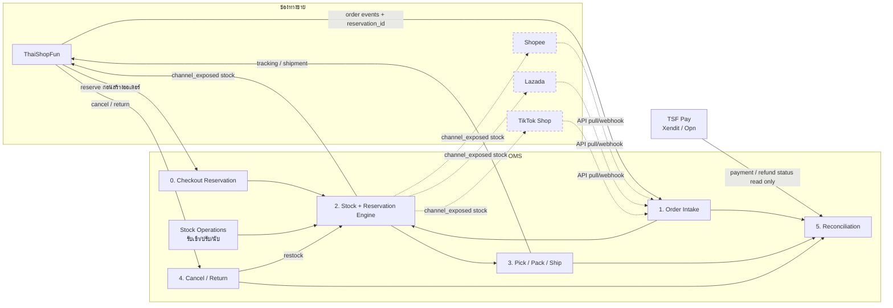
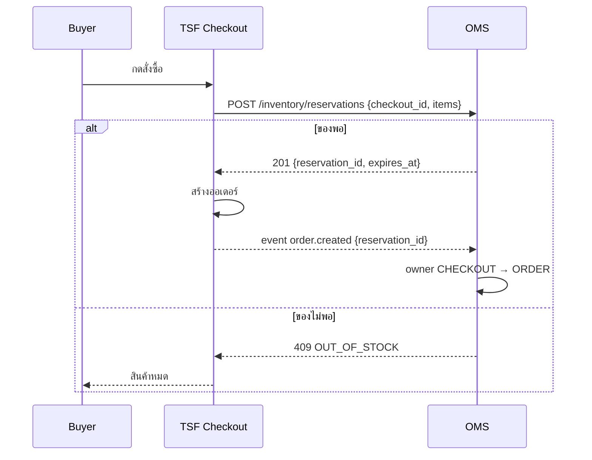
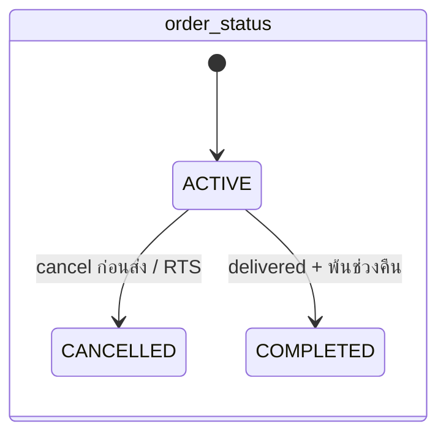
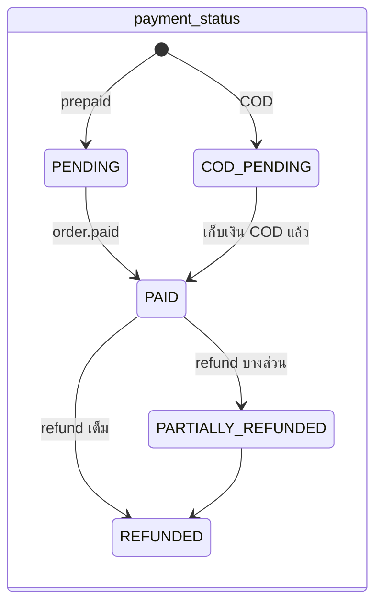
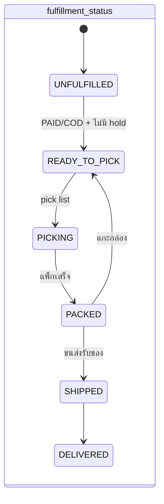
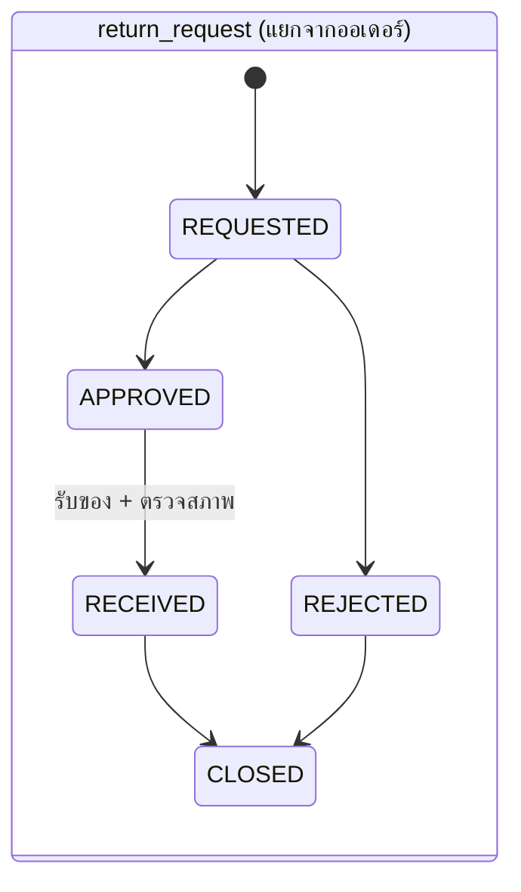

# 1. Process Map: OMS ทำงานยังไง

> อ่านส่วนนี้ก่อน ถ้ายังไม่คุ้นกับงาน OMS
> คำย่อ: **TSF** = ThaiShopFun, **TSF Pay** = ThaiShopFun Pay (Xendit xenPlatform / Opn)

## ภาพรวมใน 30 วินาที
- OMS คือ "ห้องควบคุมกลาง" ของร้าน ออเดอร์จากทุกช่องทางเข้ามารวมที่เดียว
- OMS ถือ **สต๊อกจริง** ไว้ที่เดียว แล้วบอกทุกช่องทางว่าขายได้อีกกี่ชิ้น
- **TSF จองสต๊อกกับ OMS ก่อนสร้างออเดอร์** (checkout reservation) ถ้าจองไม่ได้ ผู้ซื้อจะเห็น "สินค้าหมด" ไม่มีออเดอร์ที่ขายเกิน
- ช่องทางยังเป็นเจ้าของ **หน้าร้าน, การจ่ายเงิน, การตัดสินยกเลิก/คืน, ใบปะหน้าขนส่ง**
- OMS ไม่แตะเงิน แค่ **อ่าน** สถานะการจ่ายเงินจาก TSF Pay

(เส้นประ = หลัง MVP)

---

## 1.1 Order Intake: รับออเดอร์
**คืออะไร:** ผู้ซื้อกดสั่งที่ช่องทาง ช่องทางส่งออเดอร์มาให้ OMS OMS เก็บเป็นรูปแบบกลางเดียวกันทุกช่องทาง

**ขั้นตอน**
1. TSF จองสต๊อกแล้ว (1.2) จึงสร้างออเดอร์ แล้วส่ง `order.created` พร้อม `reservation_id`
2. OMS เช็ก `event_id` ซ้ำไหม (webhook ส่งซ้ำได้เสมอ) ซ้ำ = ข้าม
3. OMS map SKU ช่องทาง → SKU กลาง (`channel_listing`)
4. OMS **ย้ายเจ้าของ reservation** จาก `CHECKOUT` → `ORDER` (ไม่จองใหม่ ไม่ตัดซ้ำ)
   - ไม่มี `reservation_id` หรือหมดอายุไปแล้ว → จองใหม่ตอนนี้ ไม่พอ = `hold_reason=OUT_OF_STOCK`
   - map SKU ไม่ได้ → `hold_reason=SKU_NOT_MAPPED`
5. ตั้งสถานะ 3 มิติ (ดูท้ายไฟล์): `order_status=ACTIVE`, `payment_status=PENDING` (หรือ `COD_PENDING`), `fulfillment_status=UNFULFILLED`
6. `order.paid` → `payment_status=PAID` → ถ้าไม่มี hold → `fulfillment_status=READY_TO_PICK`
7. COD → `COD_PENDING` + `READY_TO_PICK` ได้ทันที
8. กันพลาด: ทุก 15 นาที backfill ออเดอร์ที่อัปเดตล่าสุดจาก TSF เผื่อ event หาย

**ทุกอย่างในข้อ 3–6 commit ใน transaction เดียว:** อัปเดตออเดอร์ + reservation + `order_status_history` + `outbox_event` + `inbox_event=PROCESSED` พังกลางทาง = rollback ทั้งก้อน แล้ว event ถูกประมวลผลใหม่

| OMS ทำ | ช่องทางทำ |
|---|---|
| เก็บออเดอร์รูปแบบกลาง, กันซ้ำ, map SKU, รับโอน reservation | จองสต๊อกก่อนสร้างออเดอร์, หน้าร้าน, รับเงิน, ส่ง event |

## 1.2 Stock + Reservation: จองสต๊อก กันขายเกิน
**คืออะไร:** ของมีจริง 10 ชิ้น ขาย 4 ช่องทาง ถ้าทุกช่องทางคิดว่ามี 10 จะขายได้ 40 = **oversell** OMS ต้องเป็นคนเดียวที่ตัดสินว่าเหลือเท่าไร

**คำศัพท์ (ใช้ทั้งเอกสาร)**
| คำ | สูตร / ความหมาย |
|---|---|
| `on_hand` | ของอยู่ในคลังจริง |
| `reserved` | จองอยู่ (ทั้ง CHECKOUT และ ORDER) |
| `physical_available` | `on_hand − reserved` |
| `safety_buffer` | กันไว้ไม่โชว์ (ต่อ SKU / ต่อช่องทาง) |
| `channel_allocated` | โควตาที่แบ่งให้ช่องทาง (ใช้เฉพาะ Hard Allocation) |
| `channel_exposed` | ตัวเลขที่ push ไปโชว์ที่ช่องทางจริง |

### TSF Checkout Reservation (strong reservation)

1. TSF เรียก reserve **ก่อน** สร้างออเดอร์ จองแบบ all-or-nothing (ขาด 1 รายการ = ไม่จองเลย)
2. ได้ `reservation_id` + `expires_at` (CHECKOUT TTL เริ่ม 15 นาที)
3. ผู้ซื้อทิ้ง checkout → TSF เรียก `DELETE` คืนทันที ถ้าไม่เรียก job คืนเองตอนหมดอายุ
4. `order.created` → โอนเป็น `ORDER` ตั้ง `expires_at = payment_expires_at + 10 นาที` จ่ายแล้วหรือ COD = ไม่หมดอายุ
5. ส่งของ → `CONSUMED` (ตัด `on_hand` + `reserved` พร้อมกัน), ยกเลิก/หมดอายุ → `RELEASED`
6. Job expiry ทุก 1 นาที คืน reservation ที่หมดอายุ + เขียน ledger `RELEASE`
7. ถ้า OMS ล่ม/ช้าเกิน timeout: TSF ทำตาม fallback policy (ดู "ต้องให้ Narote ตัดสินใจ" #6)

### กลไกจอง (ทุกช่องทางใช้ตัวเดียวกัน)
- แตก bundle เป็น SKU ลูก รวมจำนวนต่อ SKU ก่อน แล้ว **เรียง SKU id** ก่อน lock (กัน deadlock)
- จองด้วย conditional UPDATE ทีละ SKU ตามลำดับ
  `UPDATE inventory SET reserved = reserved + :qty WHERE sku_id=:id AND on_hand - reserved >= :qty`
  update ได้ 0 แถว = ของไม่พอ → rollback ทั้งชุด
- DB มี `CHECK (reserved <= on_hand)` เป็นด่านสุดท้าย
- ทุกการเปลี่ยนเขียน `inventory_ledger` (reason `RESERVE / RELEASE / SHIP / ...`)
- สต๊อกเปลี่ยน → คำนวณ `channel_exposed` ใหม่ (รวม bundle ที่ใช้ SKU นี้) → รวบ 2–5 วิ → push ค่า absolute + `stock_version`
- full push ทุก 15 นาที กัน push หาย

### Bundle rules
- bundle ไม่มีสต๊อกตัวเอง: `bundle_available = min( floor(component_available / component_qty) )`
- component เปลี่ยน → หา bundle ที่ขึ้นกับมัน → คำนวณใหม่ → `stock.updated` ของ bundle ด้วย
- **ห้าม nested bundle** (component ต้องไม่ใช่ bundle) → circular เกิดไม่ได้ บังคับทั้ง API และ DB trigger
- ยกเลิก/หมดอายุ bundle = คืน component ครบทุกตัวใน transaction เดียว

### กัน oversell ข้ามช่องทาง (เฟส 5 แต่ออกแบบไว้แล้ว)
TSF ปลอดภัยเพราะจองก่อนขาย แต่ Shopee/Lazada/TikTok **ขายก่อนแล้วค่อยบอก OMS** ช่วงที่ push ยังไม่ถึงคือช่องโหว่

| Strategy | `channel_exposed` | ข้อดี | ข้อเสีย |
|---|---|---|---|
| **Shared Exposure** | `max(0, physical_available − safety_buffer_ch)` ทุกช่องทางเห็น pool เดียวกัน | ขายได้เต็มที่ ของไม่ค้าง | ชิ้นท้ายๆ อาจขายซ้อน |
| **Hard Allocation** | `min(channel_allocated − channel_reserved, physical_available − safety_buffer)` | ไม่ขายซ้อนข้ามช่องทาง | ของค้างในช่องทางที่ขายช้า ต้อง rebalance |

- **ค่าเริ่ม (ตัดสินใจแล้ว): Shared Exposure + last-units protection** เมื่อ `physical_available ≤ low_stock_threshold` (เริ่ม 3) โชว์เฉพาะ TSF (มี strong reservation) ช่องทางอื่นเป็น 0
- ตั้ง Hard Allocation ต่อ SKU ได้ สำหรับสินค้าจำกัด/ไลฟ์
- **นิยาม business oversell:** ออเดอร์ที่ช่องทางรับไปแล้วแต่ OMS จองไม่ได้ (`hold_reason=OUT_OF_STOCK`) นับเป็น oversell แม้สต๊อกใน DB ไม่ติดลบ ใช้ตัวนี้วัด strategy (เป้า < 0.1% ของออเดอร์ marketplace)

| OMS ทำ | ช่องทางทำ |
|---|---|
| คำนวณ exposed, จอง/โอน/คืน, ledger, push สต๊อก | TSF: จองก่อนขาย; marketplace: โชว์ตามตัวเลข OMS |

## 1.3 Pick / Pack / Ship: หยิบ แพ็ก ส่ง
**คืออะไร:** เปลี่ยนออเดอร์ที่พร้อมส่ง เป็นกล่องที่ขนส่งมารับ ใช้ `fulfillment_status` อย่างเดียว

**ขั้นตอน**
1. ออเดอร์ `READY_TO_PICK` (จ่ายแล้วหรือ COD, `hold_reason=NONE`) → เลือกหลายใบ → สร้าง **pick list** → `PICKING`
2. แพ็กทีละออเดอร์ ยิงบาร์โค้ดเช็ก SKU/จำนวน → `PACKED`
3. ขอใบปะหน้าจาก **ช่องทาง** ได้ `tracking_no` + label PDF พิมพ์เป็นชุด
4. ขนส่งรับของ → ยืนยันส่ง → `SHIPPED` ตัดสต๊อกจริง (reservation `CONSUMED`) → `shipment.updated` ไป TSF
5. สถานะพัสดุหลังจากนี้มาจากช่องทาง → `DELIVERED`
6. พ้นช่วงคืน (7 วัน) และไม่มี return เปิดอยู่ → `order_status=COMPLETED`
7. ติด hold ระหว่างทาง (เช่น `ADDRESS_PROBLEM`) → หยุดที่สถานะเดิม เดินต่อไม่ได้จนแก้

**ยกเลิกก่อนส่ง:** ได้เมื่อ `fulfillment_status ∈ {UNFULFILLED, READY_TO_PICK, PICKING, PACKED}` (PACKED ต้องแกะกล่องก่อน) → `order_status=CANCELLED` + คืน reservation

| OMS ทำ | ช่องทางทำ |
|---|---|
| pick list, เช็กแพ็ก, ขอ + พิมพ์ label, ยืนยันส่ง, ตัดสต๊อก | คุยกับขนส่ง, ออก tracking/label, อัปเดตสถานะพัสดุ |

## 1.4 Cancel / Return / Refund: ยกเลิก คืน คืนเงิน
**หลักใหม่:** return และ refund เป็น **entity แยก** ไม่เปลี่ยนสถานะหลักของออเดอร์ คืนบางชิ้นได้ (partial return)

| แบบ | เกิดตอน | ผลต่อสต๊อก | ผลต่อออเดอร์ |
|---|---|---|---|
| **Cancel ก่อนส่ง** | ยังไม่ SHIPPED | คืน reservation ทันที | `order_status=CANCELLED` |
| **ส่งไม่สำเร็จ** (RTS) | SHIPPED แล้วตีกลับ | รับของคืน ตรวจ แล้ว restock | สร้าง `return_request(type=RTS)`; TSF ส่ง `order.cancelled` → `CANCELLED` |
| **คืนสินค้า** | DELIVERED แล้ว | restock เฉพาะของดี | ออเดอร์ยัง `ACTIVE/DELIVERED`, มี return + refund แยก |

**ขั้นตอน (คืนสินค้า)**
1. ผู้ซื้อขอคืนบางชิ้นที่ TSF → `return.requested` (มี lines + qty) → `return_request=REQUESTED`
2. TSF ตัดสิน → `APPROVED / REJECTED` (OMS แค่รับผล)
3. ของถึงคลัง → ร้านกด "รับของคืน" เลือกสภาพต่อชิ้น `RESELLABLE / DAMAGED` → restock เฉพาะ RESELLABLE (ledger `RETURN_RESTOCK`), DAMAGED ลง `DAMAGE_WRITE_OFF` → `RECEIVED` → `return.received` ไป TSF
4. TSF Pay คืนเงิน → `refund` แถวใหม่ → `payment_status` = `PARTIALLY_REFUNDED` หรือ `REFUNDED`
5. ทุก return ปิดแล้ว → `CLOSED`; ออเดอร์ `COMPLETED` ได้หลังไม่มี return เปิดอยู่

**ร้านขอยกเลิกจาก OMS:** OMS เรียก `POST /cancel-requests` ไป TSF → ติด `hold_reason=CHANNEL_CANCEL_PENDING` → TSF ตัดสิน ส่ง `order.cancelled` กลับ OMS ไม่ยกเลิกเองฝ่ายเดียว

| OMS ทำ | ช่องทางทำ |
|---|---|
| คืน reservation, รับของคืน, ตรวจสภาพ, restock, ledger | รับคำขอ, ตัดสินอนุมัติ, คืนเงิน |

## 1.5 Reconciliation: กระทบยอด
**คืออะไร:** เช็ก 3 อย่างตรงกัน **ออเดอร์ vs เงิน vs การส่ง** ไม่ตรง = เงินรั่วหรือของหาย
- Job ทุกคืน 02:00 (เวลาไทย) ต่อ tenant + กดรันเองได้ → `reconciliation_issue`

| กฎ | ความหมาย |
|---|---|
| `READY_TO_PICK/PICKING/PACKED` เลย `ship_by` | ส่งช้า เสี่ยงโดนปรับ |
| `SHIPPED` แต่ `payment_status` ไม่ใช่ `PAID/COD_PENDING` | ส่งของโดยยังไม่ได้เงิน |
| `CANCELLED` แต่ `payment_status=PAID` | ต้องคืนเงินลูกค้า |
| `COD_PENDING` + `DELIVERED` เกิน 14 วัน | เงิน COD ค้าง |
| return `RECEIVED` แต่ไม่มี refund เกิน 7 วัน | ลูกค้ารอเงินคืน |
| ยอด payment ≠ `grand_total` | ส่วนลด/ค่าส่งไม่ตรง |
| `channel_exposed` ที่ส่ง ≠ สต๊อกที่ช่องทางโชว์ | sync หลุด (re-push อัตโนมัติ) |
| ledger รวม ≠ `inventory` หรือ reservation ACTIVE ≠ `reserved` | invariant พัง → alert ทันที |

MVP ไม่ทำบัญชี settlement/ค่าธรรมเนียม

## 1.6 Stock Operations: จัดการสต๊อกหลังบ้าน
ทุกการเปลี่ยน `on_hand` ต้องมาจาก "เอกสารสต๊อก" มีเหตุผล มีคนทำ ย้อนดูได้

| งาน | เมื่อไร | ledger reason |
|---|---|---|
| Opening balance | เริ่มใช้ OMS ครั้งแรก | `OPENING_BALANCE` |
| รับของเข้า | ของใหม่มาถึง | `RECEIVE` |
| ปรับมือ (ต้องเลือกเหตุผล) | แก้ผิด/เจอของเพิ่ม/ของหาย | `ADJUST_IN / ADJUST_OUT` |
| นับสต๊อก | นับจริงเทียบระบบ | `COUNT_CORRECTION` |
| ของเสีย/ตัดทิ้ง | เสียหาย หมดอายุ | `DAMAGE_WRITE_OFF` |
| รับคืนเข้าสต๊อก | return สภาพดี | `RETURN_RESTOCK` |
| ระบบทำเอง | จอง/คืน/ส่ง | `RESERVE / RELEASE / SHIP` |

- นับสต๊อก: จำยอดระบบตอนเริ่มนับ → `delta = นับได้ − ยอดตอนเริ่ม` → ใช้ delta กับยอดปัจจุบัน (ของที่ขายระหว่างนับไม่ถูกนับซ้ำ)
- ลด `on_hand` จนต่ำกว่า `reserved` ไม่ได้ → ต้องยกเลิก/ย้ายออเดอร์ก่อน

---

## Order State: แยก 3 มิติ + hold
ออเดอร์เดียวมี 3 สถานะแยกกัน + ป้าย hold เพราะ "เงิน" กับ "ของ" เดินคนละจังหวะ

| มิติ | ค่า |
|---|---|
| `order_status` | `ACTIVE / CANCELLED / COMPLETED` |
| `payment_status` | `PENDING / PAID / COD_PENDING / PARTIALLY_REFUNDED / REFUNDED` |
| `fulfillment_status` | `UNFULFILLED / READY_TO_PICK / PICKING / PACKED / SHIPPED / DELIVERED` |
| `hold_reason` | `NONE / SKU_NOT_MAPPED / OUT_OF_STOCK / ADDRESS_PROBLEM / PAYMENT_MISMATCH / CHANNEL_CANCEL_PENDING / MANUAL` |

**Guard หลัก**
- `READY_TO_PICK` ได้เมื่อ `payment_status ∈ {PAID, COD_PENDING}` และ `hold_reason=NONE` และ reservation เป็น `ORDER`
- โหมด **OBSERVE / DISCONNECTED** และ tenant ที่ OMS ไม่คุมสต๊อก (PO decision 2026-10-01): guard **ไม่**บังคับ ORDER reservation — COD/PAID ไป `READY_TO_PICK` ได้เมื่อ hold `NONE` (ไม่มีแถว `stock_reservation` ก็ได้)
- `hold_reason ≠ NONE` → fulfillment เดินหน้าไม่ได้
- `order_status=CANCELLED` ได้เมื่อ fulfillment ยังไม่ SHIPPED หรือเป็น RTS ที่ TSF ยืนยันยกเลิก
- `COMPLETED` ได้เมื่อ `DELIVERED` + พ้น 7 วัน + ไม่มี return เปิด
- เปลี่ยนผ่าน `OrderStateMachine` เท่านั้น ทุกครั้งลง `order_status_history` (dimension, from, to, reason, actor)
- event มาผิดลำดับ (เช่น paid หลัง cancelled) → ไม่ย้อน ลง `reconciliation_issue`

