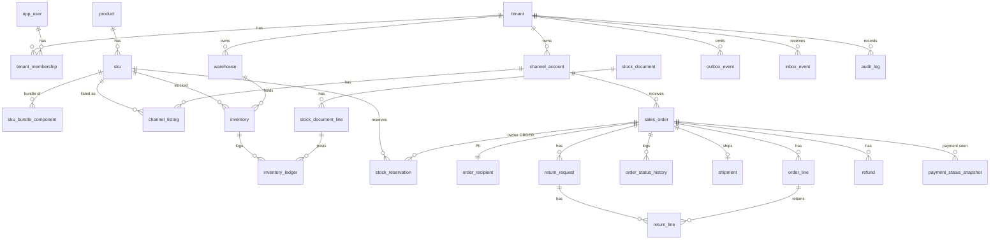

# 3. Data Model

## หลักการ (ตัดสินใจแล้ว)
- **Multi-tenancy = shared DB, shared schema + `tenant_id` ทุกตาราง + PostgreSQL RLS แบบ FORCE**
  เหตุผล: Flyway ชุดเดียว, ops ง่าย, RLS กันพลาดถ้าโค้ดลืม filter
- **PK = UUIDv7** สร้างใน Java, เวลา = `timestamptz` (UTC เก็บ แสดงเวลาไทย), เงิน = `numeric(14,2)` + `currency` (`THB`)
- Optimistic lock `version bigint` ที่ `sales_order`; inventory ใช้ conditional UPDATE
- ชื่อตาราง `sales_order` / `return_request` (เลี่ยง reserved word)
- เปลี่ยน schema ผ่าน Flyway เท่านั้น (`V{n}__desc.sql`) ห้ามแก้ไฟล์ที่ merge แล้ว

## RLS + DB roles
| Role | ใช้ทำอะไร | สิทธิ์ |
|---|---|---|
| `oms_migrator` | Flyway, เป็น owner ของตาราง | DDL; app ไม่ใช้ role นี้ |
| `oms_app` | app + job ทุกตัว | DML เท่านั้น, **NOBYPASSRLS**, ไม่ใช่ owner |
| `oms_maint` | maintenance / break-glass เท่านั้น | BYPASSRLS, ปิด login ปกติ เปิดเฉพาะตอนใช้ + audit |

- ทุกตารางที่มี `tenant_id`: `ENABLE` + **`FORCE ROW LEVEL SECURITY`**
- policy: `USING (tenant_id = current_setting('app.tenant_id', true)::uuid) WITH CHECK (เหมือนกัน)` → ไม่ตั้ง context = ไม่เห็นอะไร (fail-closed)
- **ตั้ง context ใน transaction เดียวกับ query:** override `JpaTransactionManager.doBegin()` ให้รัน `SELECT set_config('app.tenant_id', :tid, true)` บน connection ของ transaction นั้นทันที (`true` = local, หายเองตอน commit/rollback, ใช้กับ PgBouncer transaction pooling ได้)
- JWT filter ทำแค่ resolve `TenantContext` (ThreadLocal) และ clear ใน `finally`; query นอก `@Transactional` = ไม่มี context = 0 แถว
- งานข้าม tenant: เรียก function `SECURITY DEFINER` ที่คืนแค่ id (`list_active_tenant_ids()`, `claim_inbox_batch(n)`, `claim_outbox_batch(n)`, `resolve_tenant(channel, external_shop_id)`) แล้วเปิด transaction ใหม่ **ต่อ tenant** พร้อม context ของ tenant นั้น

## ER Diagram

## ตารางหลัก (key columns)

### Tenant / Identity
| ตาราง | columns สำคัญ | หมายเหตุ |
|---|---|---|
| `tenant` | id, name, `tsf_shop_id` UNIQUE, membership_tier, entitlement_status (`ACTIVE/GRACE/SUSPENDED`), entitlement_expires_at, ent_ver | RLS: `id = app.tenant_id` |
| `app_user` | id, `tsf_user_id` UNIQUE, email, display_name, last_login_at | ไม่มี password |
| `tenant_membership` | id, tenant_id, user_id, role (`OWNER/ADMIN/STAFF`), status, UNIQUE(tenant_id,user_id) | role มาจาก claim `shop_role` |

### Channel / Catalog
| ตาราง | columns สำคัญ | หมายเหตุ |
|---|---|---|
| `channel_account` | id, tenant_id, channel (`TSF/SHOPEE/LAZADA/TIKTOK`), external_shop_id, **mode** (`OBSERVE/SHADOW/CONTROL/ACTIVE`), **stock_sync_paused** bool, status (`CONNECTED/DISCONNECTED`), credentials_ref, token_expires_at, last_synced_at, UNIQUE(channel, external_shop_id) | TSF สร้างตอน JIT (mode เริ่ม `OBSERVE`) |
| `product` | id, tenant_id, name, status | |
| `sku` | id, tenant_id, product_id, sku_code, name, barcode, weight_g, is_bundle, UNIQUE(tenant_id, sku_code) | |
| `sku_bundle_component` | tenant_id, bundle_sku_id, component_sku_id, qty > 0, PK(bundle,component) | trigger: component ต้อง `is_bundle=false` และ bundle ≠ component (ห้าม nested/circular) |
| `channel_listing` | id, tenant_id, channel_account_id, sku_id, external_item_id, external_sku_id, **stock_control** bool (allowlist ของ CONTROL), safety_buffer, last_exposed_qty, last_pushed_version, last_seen_channel_qty, UNIQUE(channel_account_id, external_sku_id) | ตัด `alloc_pct` ออก |
| `allocation_policy` *(Phase 5)* | tenant_id, sku_id NULL (= ค่า default ร้าน), strategy (`SHARED/HARD`), low_stock_threshold, priority_channel_account_id | |
| `channel_allocation` *(Phase 5)* | tenant_id, channel_account_id, sku_id, allocated_qty | ใช้กับ `HARD`; ผลรวม ≤ `physical_available − safety_buffer` |

### Inventory
| ตาราง | columns สำคัญ | หมายเหตุ |
|---|---|---|
| `warehouse` | id, tenant_id, code, name, address jsonb, is_default | MVP ใช้ default อันเดียว |
| `inventory` | id, tenant_id, sku_id, warehouse_id, on_hand, reserved, stock_version, UNIQUE(tenant_id, sku_id, warehouse_id), CHECK(on_hand>=0 AND reserved>=0 AND reserved<=on_hand) | เฉพาะ SKU ที่ไม่ใช่ bundle |
| `stock_reservation` | id, tenant_id, **owner_type** (`CHECKOUT/ORDER`), **owner_ref** (checkout_id หรือ order_id), sku_id, warehouse_id, qty, **status** (`ACTIVE/CONSUMED/RELEASED/EXPIRED`), **expires_at** (null = ไม่หมดอายุ), reservation_group_id, created_at, updated_at | 1 แถวต่อ SKU ลูก (รวมจำนวนจาก bundle + SKU เดี่ยวแล้ว); `reservation_group_id` = `reservation_id` ที่ส่งให้ TSF; UNIQUE(tenant_id, owner_type, owner_ref, sku_id) WHERE status='ACTIVE'; index (status, expires_at); FK (tenant_id, sku_id, warehouse_id) → `inventory` (ต้องมีแถว inventory ก่อนจอง, bundle จึงจองไม่ได้; ไม่ lock แถว `sku`) |
| `inventory_ledger` | id, tenant_id, sku_id, warehouse_id, delta_on_hand, delta_reserved, reason, ref_type, ref_id, actor, created_at | append-only; `reason`: `OPENING_BALANCE, RECEIVE, ADJUST_IN, ADJUST_OUT, COUNT_CORRECTION, DAMAGE_WRITE_OFF, RETURN_RESTOCK, SHIP, RESERVE, RELEASE, UNPACK` |
| `stock_document` | id, tenant_id, type (`OPENING/RECEIVE/ADJUSTMENT/COUNT/WRITE_OFF`), status (`DRAFT/POSTED/VOID`), reference_no, note, count_started_at, posted_at, posted_by | post = เขียน ledger ครั้งเดียว ห้ามแก้หลัง POSTED |
| `stock_document_line` | id, tenant_id, document_id, sku_id, warehouse_id, qty, system_qty_at_start, counted_qty, reason_code | ADJUST ต้องมี `reason_code` |

### Orders / Fulfillment
| ตาราง | columns สำคัญ | หมายเหตุ |
|---|---|---|
| `sales_order` | id, tenant_id, channel_account_id, external_order_id, **order_status**, **payment_status**, **fulfillment_status**, **hold_reason** (default `NONE`), hold_note, channel_status, payment_method (`PREPAID/COD`), currency, subtotal, shipping_fee, discount, grand_total, ordered_at, paid_at, ship_by, completed_at, external_version, version, **UNIQUE(channel_account_id, external_order_id)** | ไม่มี PII ในตารางนี้ |
| `order_recipient` | order_id PK, tenant_id, name_enc, phone_enc, phone_hash, phone_last4, address_enc, province, postcode, **pii_status** (`ACTIVE/REDACTED`), redact_after | PII แยกตาราง ลบง่าย (ดู PII lifecycle) |
| `order_line` | id, tenant_id, order_id, sku_id (null ถ้า map ไม่ได้), external_sku_id, name, qty, unit_price, discount, line_total | |
| `order_status_history` | id, tenant_id, order_id, dimension (`ORDER/PAYMENT/FULFILLMENT/HOLD`), from_value, to_value, reason, actor, created_at | |
| `shipment` | id, tenant_id, order_id UNIQUE, warehouse_id, carrier, tracking_no, external_shipment_id, label_cached_until, status (`PENDING/LABEL_READY/SHIPPED/IN_TRANSIT/DELIVERED/FAILED/RETURNED_TO_SENDER`), shipped_at, delivered_at | ไม่เก็บ label PDF ถาวร |
| `return_request` | id, tenant_id, order_id, external_return_id, type (`RETURN/RTS`), status (`REQUESTED/APPROVED/REJECTED/RECEIVED/CLOSED`), reason, requested_at, received_at | ไม่แตะสถานะหลักของออเดอร์ |
| `return_line` | id, tenant_id, return_id, order_line_id, qty, condition (`RESELLABLE/DAMAGED`), restocked_qty | partial return; ผลรวม qty ต่อ line ≤ qty ที่ส่ง |
| `refund` | id, tenant_id, order_id, return_id NULL, provider_ref, amount, status (`PENDING/SUCCEEDED/FAILED`), observed_at, source_event_id UNIQUE | read-only จาก TSF Pay |

### Payment (read-only)
| ตาราง | columns สำคัญ | หมายเหตุ |
|---|---|---|
| `payment_status_snapshot` | id, tenant_id, order_id, provider (`XENDIT/OPN`), provider_ref, status, amount, refunded_amount, currency, paid_at, observed_at, source_event_id UNIQUE | append-only; ไม่มีข้อมูลบัตร/บัญชี; `sales_order.payment_status` คำนวณจากแถวล่าสุด + `refund` |

### Sync / Platform
| ตาราง | columns สำคัญ | หมายเหตุ |
|---|---|---|
| `inbox_event` | id, tenant_id, source, event_id, event_type, aggregate_id, aggregate_version, payload jsonb, payload_sha256 bytea, status (`RECEIVED/PROCESSED/FAILED/DEAD`), attempts, next_attempt_at, last_error, received_at, processed_at, **UNIQUE(tenant_id, source, event_id)** | V3. V1 was `UNIQUE(source, event_id)`, which collided across shops. payload ที่มี PII ล้างหลัง PROCESSED 7 วัน |
| `outbox_event` | id, tenant_id, aggregate_type, aggregate_id, event_type, payload jsonb, status (`PENDING/IN_FLIGHT/SENT/DEAD`), attempts, next_attempt_at, lease_until, created_at, sent_at | เขียนใน transaction เดียวกับ business change |
| `sync_cursor` | tenant_id, channel_account_id, resource (`ORDERS/LISTINGS`), cursor, last_success_at, PK(channel_account_id, resource) | |
| `idempotency_key` | tenant_id, scope, key, request_hash, response_status, response_body jsonb, created_at, PK(tenant_id, scope, key) | ลบหลัง 24 ชม. |
| `shadow_diff` | id, tenant_id, channel_account_id, kind (`STOCK/ORDER/RESERVATION`), ref, oms_value, channel_value, observed_at | ใช้ตัดสินเลื่อน mode |
| `reconciliation_issue` | id, tenant_id, run_id, rule, order_id NULL, details jsonb, status (`OPEN/ACK/RESOLVED`), UNIQUE(tenant_id, rule, order_id) WHERE status<>'RESOLVED' | |
| `audit_log` | id, tenant_id, actor_type (`USER/SYSTEM/TSF/PLATFORM_ADMIN`), actor_id, action, entity_type, entity_id, before jsonb, after jsonb, ip, created_at | append-only, PII แทนด้วย `"[PII]"` |

Inbox entitlement (T11), applied by the worker after `claim_inbox_batch`. The claim function does not filter it.

- `ACTIVE`, and `GRACE` that has not passed `entitlement_expires_at`: process the event. GRACE still blocks user API writes. Inbound events keep flowing so the shop does not lose orders during grace.
- `SUSPENDED`, a passed expiry, or any other status: defer business events. Status stays `RECEIVED` or `FAILED`, the claim does not consume an attempt, and `next_attempt_at` is pushed out. The row is not deleted and does not become `DEAD` only because the shop is suspended.
- `membership.changed` is processed in every state, including `SUSPENDED`, so a renewal can set the tenant back to `ACTIVE`.

## PII lifecycle
| ข้อมูล | เก็บที่ | ป้องกัน | อายุ |
|---|---|---|---|
| ชื่อ, เบอร์, ที่อยู่ผู้รับ | `order_recipient` | AES-GCM ระดับ column (key จาก secret manager, หมุนได้), ค้นเบอร์ด้วย `phone_hash` (HMAC) | ปิดออเดอร์ (`COMPLETED/CANCELLED`) + 90 วัน → **REDACTED** (ลบ name/phone/address เหลือ province, postcode) |
| Label PDF | ไม่เก็บถาวร ดึงจาก TSF ตอนพิมพ์ | cache ≤ 7 วันหลัง SHIPPED | ลบอัตโนมัติ |
| Event payload | `inbox_event.payload` / `outbox_event.payload` | — | ล้าง field PII หลัง PROCESSED/SENT 7 วัน |
| Log | app log | logback masking filter (phone, address, email) + test | ห้ามมี PII เลย |
| Audit | `audit_log` | PII → `"[PII]"` | ตาม NFR.md |
| Backup | PITR (Railway) | เข้ารหัสที่ storage | PITR ~28 วัน + offsite dump 35 วัน → ข้อมูลที่ redact แล้วหายจาก backup ครบภายใน ~35 วัน |
| หน้าจอ | UI | STAFF เห็นเบอร์ `***-***-1234`; เบอร์/ที่อยู่เต็มเฉพาะหน้าแพ็ก/พิมพ์ label; export CSV ที่มี PII = OWNER/ADMIN + audit | — |

## Index ที่ต้องมีตั้งแต่แรก
- `sales_order (tenant_id, fulfillment_status, ordered_at desc)`, `(tenant_id, hold_reason) WHERE hold_reason <> 'NONE'`
- `sales_order (tenant_id, ship_by) WHERE fulfillment_status IN ('READY_TO_PICK','PICKING','PACKED')`
- `stock_reservation (status, expires_at) WHERE status='ACTIVE'`, `(tenant_id, owner_type, owner_ref)`
- `sku_bundle_component (component_sku_id)` สำหรับหา bundle ที่ต้องคำนวณใหม่
- `outbox_event (status, next_attempt_at)`, `inbox_event (status, next_attempt_at)`
- `order_recipient (tenant_id, phone_hash)`, `(pii_status, redact_after)`
