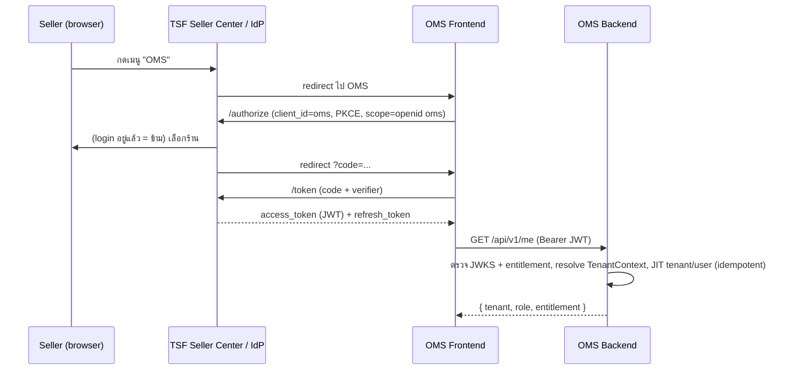

# 4. API Contract กับ ThaiShopFun (Draft v0.2)

> URL/domain เป็น placeholder: `{TSF_AUTH}`, `{TSF_API}`, `{OMS_API}`
> ตัวอย่างในไฟล์นี้เป็นตัวอธิบาย **source of truth คือ spec ใน repo `tsf-oms-contracts`** (ดู 4.9)

## หลักการ (ตัดสินใจแล้ว)
| เรื่อง | ตัดสินใจ | เหตุผล |
|---|---|---|
| ผู้ใช้ login | **OIDC Authorization Code + PKCE**, TSF เป็น IdP | มาตรฐาน, ไม่มี password ใน OMS |
| Token | JWT `RS256` อายุ 10 นาที + refresh token (rotate), ตรวจผ่าน JWKS | ถอนสิทธิ์ได้เร็ว |
| Service ↔ Service | OAuth2 client credentials (`aud=oms-internal` / `aud=tsf-internal`) | แยกจาก token ผู้ใช้ |
| จองตอน checkout | **REST sync** `POST /inventory/reservations` | อยู่ใน checkout path ต้องได้คำตอบทันที |
| "ข้อเท็จจริง" | **Webhook event** จาก outbox ทั้งสองฝั่ง | ไม่หายแม้ระบบล่ม |
| "คำสั่ง / ขอข้อมูล" | **REST** + `Idempotency-Key` | ต้องการคำตอบทันที |
| Delivery | **at-least-once** + consumer idempotent (dedupe `event_id`) ไม่ใช่ exactly-once | exactly-once ข้ามระบบทำจริงไม่ได้ |
| ลำดับ event | ไม่รับประกัน → `aggregate_version` / `stock_version` | ของเก่ามาทีหลังไม่ทับของใหม่ |
| Contract | OpenAPI 3.1 (REST) + AsyncAPI 3 / JSON Schema (event) + contract test ใน CI ทั้ง 2 repo | เปลี่ยนสัญญาแล้วอีกฝั่งรู้ก่อนพัง |

## 4.1 JWT Claims (token ผู้ใช้ที่ TSF ออก)
```json
{
  "iss": "{TSF_AUTH}", "aud": "oms", "sub": "tsf_user_8812",
  "iat": 1790665200, "exp": 1790665800, "jti": "c1f0...",
  "email": "owner@shop.example",
  "tsf_shop_id": "shop_45021",
  "shop_role": "OWNER",
  "shop_name": "ร้านตัวอย่าง",
  "membership": { "tier": "PRO", "status": "ACTIVE", "expires_at": "2026-12-31T16:59:59Z" },
  "entitlements": ["oms"],
  "ent_ver": 7
}
```
- `tsf_shop_id` → `tenant`, `sub` → `app_user`, `shop_role` → role
- `shop_name` (optional) → `tenant.name`; ถ้าไม่มีให้ใช้ `tsf_shop_id`
- 1 token = 1 ร้าน เปลี่ยนร้าน = ขอ token ใหม่
- `ent_ver` ใน token ต่ำกว่าใน DB → `401 ENTITLEMENT_STALE` และไม่เขียนแถว ให้ refresh
- OMS accepts `typ` `at+jwt` (preferred) or `JWT`, and a missing `typ`. `id_token`s are rejected by audience (`aud` is not `oms`). Default `oms.security.accepted-token-types` is that set. The `local` and `test` profiles accept only `at+jwt`.

**Entitlement gate:** ลายเซ็น/`aud`/`iss`/อายุผิด = `401` (message เดียวกัน ไม่บอก claim) · token ที่มีทั้ง `aud=oms` และ `aud=oms-internal` = `401` · `ent_ver` ต่ำกว่า DB = `401 ENTITLEMENT_STALE` · `oms ∈ entitlements` + `ACTIVE` และยังไม่หมดอายุ = เต็ม · `GRACE` ที่ยังไม่หมดอายุ = read-only (`403 ENTITLEMENT_GRACE` เมื่อเขียน) · `SUSPENDED`, `expires_at` ผ่านแล้ว (รวม `GRACE`), หรือไม่มี `oms` = `403 ENTITLEMENT_INACTIVE` · `tenant_membership.status = REVOKED` = `403 MEMBERSHIP_REVOKED` และไม่ถูกเปิดเป็น `ACTIVE` ใหม่

## 4.2 SSO Flow

- access token เก็บใน memory เท่านั้น; logout ที่ TSF = revoke refresh token

## 4.3 Checkout Reservation API (TSF → OMS, sync)
```http
POST {OMS_API}/internal/v1/inventory/reservations
Authorization: Bearer <client-credentials JWT>
Idempotency-Key: chk_20260929_88121
{ "checkout_id": "chk_20260929_88121", "tsf_shop_id": "shop_45021",
  "items": [ { "listing_sku_id": "tsf_sku_7781", "qty": 2 },
             { "listing_sku_id": "tsf_sku_9001", "qty": 1 } ] }
```
**201 จองได้**
```json
{ "reservation_id": "rsv_01J9Z4A1B2C3", "expires_at": "2026-09-29T08:30:00Z",
  "enforced": true,
  "items": [ { "listing_sku_id": "tsf_sku_7781", "qty": 2, "enforced": true },
             { "listing_sku_id": "tsf_sku_9001", "qty": 1, "enforced": true } ] }
```
**409 ของไม่พอ** (all-or-nothing ไม่จองอะไรเลย)
```json
{ "error": "OUT_OF_STOCK",
  "items": [ { "listing_sku_id": "tsf_sku_9001", "requested": 1, "available": 0 } ] }
```
- `checkout_id` = 1 ครั้งที่กดสั่ง; ส่งซ้ำ body เดิม = ได้ผลเดิม, body ต่าง = `409 IDEMPOTENCY_CONFLICT`
- `enforced=false` (ระดับ item หรือทั้งก้อน) เมื่อ: mode `SHADOW`, SKU ไม่อยู่ใน allowlist ของ `CONTROL`, listing ยังไม่ map, channel `DISCONNECTED` → TSF ใช้สต๊อกตัวเองตัดสิน
- `DELETE /internal/v1/inventory/reservations/{reservation_id}` → คืนทันที (ผู้ซื้อทิ้ง checkout) idempotent `204`
- CHECKOUT TTL เริ่ม 15 นาที; `order.created` ต้องมี `reservation_id` → OMS โอน owner เป็น `ORDER`
- `order.created` มาหลังหมดอายุ → OMS พยายามจองใหม่ ไม่พอ = `hold_reason=OUT_OF_STOCK` (นับ business oversell)
- เป้า latency (NFR): p95 < 150 ms, p99 < 300 ms; TSF ตั้ง timeout 800 ms แล้วทำตาม fallback policy

## 4.4 Event Envelope + Delivery (ใช้ทั้งสองทิศ)
```json
{
  "event_id": "01J9Z3K7Q8X2V4M6N0P1R3S5T7",
  "event_type": "order.paid",
  "schema_version": 1,
  "occurred_at": "2026-09-29T08:15:02Z",
  "tsf_shop_id": "shop_45021",
  "aggregate_id": "TSF-240929-000123",
  "aggregate_version": 3,
  "data": { }
}
```
```
POST {OMS_API}/internal/v1/events      (TSF → OMS)
POST {TSF_API}/internal/v1/oms-events  (OMS → TSF)
X-Event-Id: 01J9Z3K7Q8X2V4M6N0P1R3S5T7
X-Signature: t=1790665202,v1=5f2b...e9
```
- `v1 = hex(HMAC_SHA256(secret, t + "." + raw_body))` secret แยกต่อทิศ หมุนได้ (รับ 2 key ช่วงเปลี่ยน)
- ผู้รับตรวจ signature + `|now − t| ≤ 300s` ไม่ผ่าน = `401`
- ผู้รับ insert inbox (UNIQUE `(tenant_id, source, event_id)`, V3) แล้วตอบ `202`; ซ้ำ = `200`; ประมวลผล async. body คนละ payload แต่ key เดิมยังตอบ `200` (เก็บก้อนแรก, log + metric)
- **at-least-once:** ผู้ส่งอาจส่งซ้ำ (เช่น ล่มหลังส่งก่อนบันทึก SENT) ผู้รับต้อง dedupe ด้วย `event_id` เสมอ
- **Retry:** ไม่ได้ 2xx → backoff + jitter 30s, 2m, 10m, 30m, 1h, 3h, 6h (~11 ชม.) → `DEAD` + alert, retry เองได้
- `4xx` (ยกเว้น 408/429) = ไม่ retry → DEAD. `503` มี `Retry-After` ต้องเคารพ (retry ได้)
- ร้านที่ยังไม่มีใน OMS: event ธุรกิจตอบ `503` + `Retry-After: 60` (`TENANT_NOT_READY`) ไม่ใช่ `422`. `membership.changed` ที่ entitlement ยังใช้ได้ (`ACTIVE` หรือ `GRACE` ที่ยังไม่หมดอายุ) สร้างร้านผ่าน `provision_tenant` (ไม่ถอย `ent_ver`) แล้วตอบ `202`. `SUSPENDED` หรือหมดอายุของร้านที่ยังไม่มีแถว ตอบ `503` เช่นกัน. `provision_membership` ยังเกิดตอน login เพราะ event นี้ไม่มี user
- `aggregate_version` บังคับสำหรับ event ธุรกิจ (ไม่มีหรือเกิน bigint = `400`). `membership.changed` จัดลำดับด้วย `ent_ver` และละเว้น version ได้
- `\u0000` ใน JSON = `400`
- event type ที่ยังไม่มี handler: คง `RECEIVED`, เลื่อน 1 ชม. โดยไม่นับ attempt (replay ได้เมื่อมี handler)
- `aggregate_version` ≤ ที่เก็บของ event ธุรกิจ = ข้าม. แถว `membership.changed` ไม่เข้า history นั้น และไม่ใช้มัน (ลำดับอยู่ที่ `ent_ver`). มี gap = handler ใช้ snapshot เต็มจนกว่าจะมี REST refetch (T10)
- event ที่ aggregate เดียวกัน ประมวลผลทีละตัว (`pg_advisory_xact_lock(aggregate)`)
- **GRACE:** event ขาเข้ายังประมวลผลระหว่าง `GRACE` ที่ยังไม่หมดอายุ (ออเดอร์ไม่หาย). การเขียนของ user ยังถูกบล็อก. `SUSPENDED` หรือหมดอายุเลื่อน event ธุรกิจไว้ (`last_error = ENTITLEMENT_DEFERRED`) ไม่ลบ และไม่ทำให้ `DEAD` แค่เพราะร้านถูกระงับ. กลับมา `ACTIVE`/`GRACE` แล้วปลุกเฉพาะแถวที่มี marker นั้น (`next_attempt_at = now()`). backoff ของ `FAILED` ปกติไม่ถูกปลุก
- `claim_inbox_batch` เรียง `COALESCE(next_attempt_at, received_at)` จากเก่าไปใหม่ (index `inbox_event_due_idx`) เพื่อไม่ให้ retry ที่ถึงเวลาถูกแซงโดย event ใหม่ตลอด. lease ที่ส่งคือค่าที่ตั้ง ปัดขึ้นเป็นมิลลิวินาที (`InboxLimits.claimedLease`) ไม่ให้สั้นกว่าที่ guard ตรวจ. สูงสุด 1 ชั่วโมง (`InboxLimits.MAX_LEASE`) เท่ากับที่ฟังก์ชันปฏิเสธ. ค่าที่ยาวกว่านั้นทำให้ process ไม่บูต

## 4.5 Events: TSF → OMS
| event_type | เมื่อไร | ผลใน OMS |
|---|---|---|
| `order.created` | สร้างออเดอร์ (หลังจองสำเร็จ) | สร้าง order + โอน reservation CHECKOUT → ORDER |
| `order.paid` | TSF Pay ยืนยัน | `payment_status=PAID` → `READY_TO_PICK` ถ้าไม่มี hold |
| `order.cancelled` | ยกเลิก / หมดเวลาจ่าย / RTS | `order_status=CANCELLED` + คืน reservation |
| `order.updated` | แก้ที่อยู่/หมายเหตุ | อัปเดต `order_recipient` |
| `shipment.status_changed` | ขนส่งอัปเดต | `shipment.status`, `DELIVERED` |
| `return.requested` / `return.decided` | ขอคืน (มี lines) / TSF ตัดสิน | `return_request` + `return_line` |
| `payment.status_changed` | สถานะเงินเปลี่ยน | `payment_status_snapshot` |
| `refund.status_changed` | คืนเงินสำเร็จ/ล้มเหลว | `refund` → คำนวณ `payment_status` |
| `membership.changed` | ต่อ/หมด/เปลี่ยน tier | `tenant.entitlement_*`, `ent_ver` |
| `listing.changed` | เพิ่ม/ลบ/แก้สินค้าที่ TSF | `channel_listing` + auto-map |

**`order.created.data`**
```json
{
  "order_id": "TSF-240929-000123",
  "reservation_id": "rsv_01J9Z4A1B2C3",
  "payment_method": "PREPAID",
  "payment_expires_at": "2026-09-29T08:45:00Z",
  "currency": "THB",
  "totals": { "subtotal": 590.00, "shipping_fee": 40.00, "discount": 50.00, "grand_total": 580.00 },
  "recipient": { "name": "สมชาย ใจดี", "phone": "0812341234",
    "address": { "line1": "99/1 ถ.สุขุมวิท", "district": "คลองเตย", "province": "กรุงเทพมหานคร", "postcode": "10110" } },
  "ship_by": "2026-10-01T10:59:59Z",
  "lines": [ { "line_id": "L1", "listing_sku_id": "tsf_sku_7781", "seller_sku": "TSHIRT-BLK-M",
               "name": "เสื้อยืดดำ M", "qty": 2, "unit_price": 295.00 } ]
}
```
**`return.requested.data`** (คืนบางชิ้น)
```json
{ "order_id": "TSF-240929-000123", "return_id": "tsf_ret_311", "type": "RETURN",
  "reason": "SIZE_WRONG", "lines": [ { "line_id": "L1", "qty": 1 } ] }
```
**`refund.status_changed.data`** (OMS ไม่เห็นข้อมูลบัตร/บัญชี)
```json
{ "order_id": "TSF-240929-000123", "refund_id": "xnd_rf_77", "return_id": "tsf_ret_311",
  "status": "SUCCEEDED", "amount": 295.00, "currency": "THB" }
```

## 4.6 Events: OMS → TSF
| event_type | เมื่อไร | TSF ทำอะไร |
|---|---|---|
| `stock.updated` | exposed เปลี่ยน (รวบ 2–5 วิ, รวม bundle ที่กระทบ) + full push 15 นาที | ตั้งสต๊อก listing ถ้า `stock_version` ใหม่กว่า; **ส่งเฉพาะ mode CONTROL (allowlist) / ACTIVE และไม่ pause** |
| `order.status_changed` | fulfillment เปลี่ยน | แสดงสถานะ |
| `shipment.updated` | ยืนยันส่ง (มี tracking) | แจ้งผู้ซื้อ |
| `return.received` | รับของคืน + สภาพต่อ line | ปลดให้ TSF Pay คืนเงิน |

**`stock.updated.data`** (batch, absolute)
```json
{ "items": [
  { "listing_sku_id": "tsf_sku_7781", "seller_sku": "TSHIRT-BLK-M", "available": 18, "stock_version": 1042 },
  { "listing_sku_id": "tsf_sku_5000", "seller_sku": "SET-TSHIRT-2", "available": 9, "stock_version": 1043 }
] }
```
**`shipment.updated.data`**
```json
{ "order_id": "TSF-240929-000123", "status": "SHIPPED", "carrier": "FLASH",
  "tracking_no": "TH0123456789A", "shipped_at": "2026-09-30T03:20:00Z" }
```

## 4.7 REST ที่ TSF เปิดให้ OMS (`{TSF_API}/internal/v1`, client credentials)
| Method + Path | ใช้ทำอะไร |
|---|---|
| `GET /shops/{shopId}/orders?updated_since=&cursor=&limit=100` | backfill 15 นาที + reconcile |
| `GET /orders/{orderId}` | ดึงตัวเต็มเมื่อ event มี gap |
| `GET /orders/{orderId}/payment-status` | สถานะเงิน + refund ล่าสุด (TSF อ่านจาก TSF Pay) |
| `GET /shops/{shopId}/listings?cursor=` | listing + สต๊อกที่ TSF โชว์ (ใช้ shadow diff / drift) |
| `POST /orders/{orderId}/shipments` | ขอ label + tracking (`Idempotency-Key` บังคับ) |
| `GET /shipments/{shipmentId}/label` | ดาวน์โหลด label PDF |
| `POST /orders/{orderId}/cancel-requests` | ร้านขอยกเลิก (TSF ตัดสิน → `order.cancelled`) |

ส่ง key เดิมซ้ำ = response เดิม; body ต่างแต่ key เดิม = `409`; `429` มี `Retry-After` ต้องเคารพ

## 4.8 REST ที่ OMS เปิด
| Path | ผู้เรียก | Auth |
|---|---|---|
| `POST /internal/v1/inventory/reservations`, `DELETE .../{id}` | TSF checkout | client credentials |
| `POST /internal/v1/events` | TSF webhook | HMAC + client credentials |
| `GET /internal/v1/health` | TSF monitor | client credentials |
| `/api/v1/**` (me, skus, stock-documents, inventory, orders, pick-lists, shipments, returns, reconciliation, channel-accounts/{id}/mode, emergency) | OMS frontend | user JWT |

Error format ทุก endpoint:
```json
{ "error": "ENTITLEMENT_INACTIVE", "message": "Membership expired", "trace_id": "4bf92f35..." }
```
Error codes ที่ใช้กับ entitlement และ membership: `ENTITLEMENT_INACTIVE`, `ENTITLEMENT_GRACE`, `ENTITLEMENT_STALE`, `MEMBERSHIP_REVOKED`. `401` จาก token ใช้ message เดียว (`Invalid or expired token`) ไม่ว่า claim ไหนพัง.

## 4.9 Contract Governance
- repo แยก **`tsf-oms-contracts`** (ตัดสินใจแล้ว: เป็นกลาง ทั้ง 2 repo pin tag เดียวกัน)
  - `openapi/oms-internal.yaml` (reservation, events receiver), `openapi/tsf-internal.yaml` (4.7)
  - `asyncapi/tsf-oms-events.yaml` + `schemas/*.json` (JSON Schema ต่อ event_type + version)
  - `examples/` ตัวอย่าง JSON ที่ validate ผ่าน schema
- CI ของ contracts: lint (Spectral), validate examples, **breaking-change check** (`oasdiff` สำหรับ OpenAPI, schema diff สำหรับ event) → breaking = ต้องขึ้น `/v2` หรือ `schema_version` ใหม่
- CI ของ OMS: response ของ OMS validate กับ OpenAPI, event ที่ OMS ส่ง/รับ validate กับ JSON Schema, mock TSF ใช้ spec เดียวกัน
- CI ของ TSF: ทำแบบเดียวกัน (TSF-08)
- รองรับ `schema_version` เก่าอย่างน้อย 1 version ระหว่างเปลี่ยน
