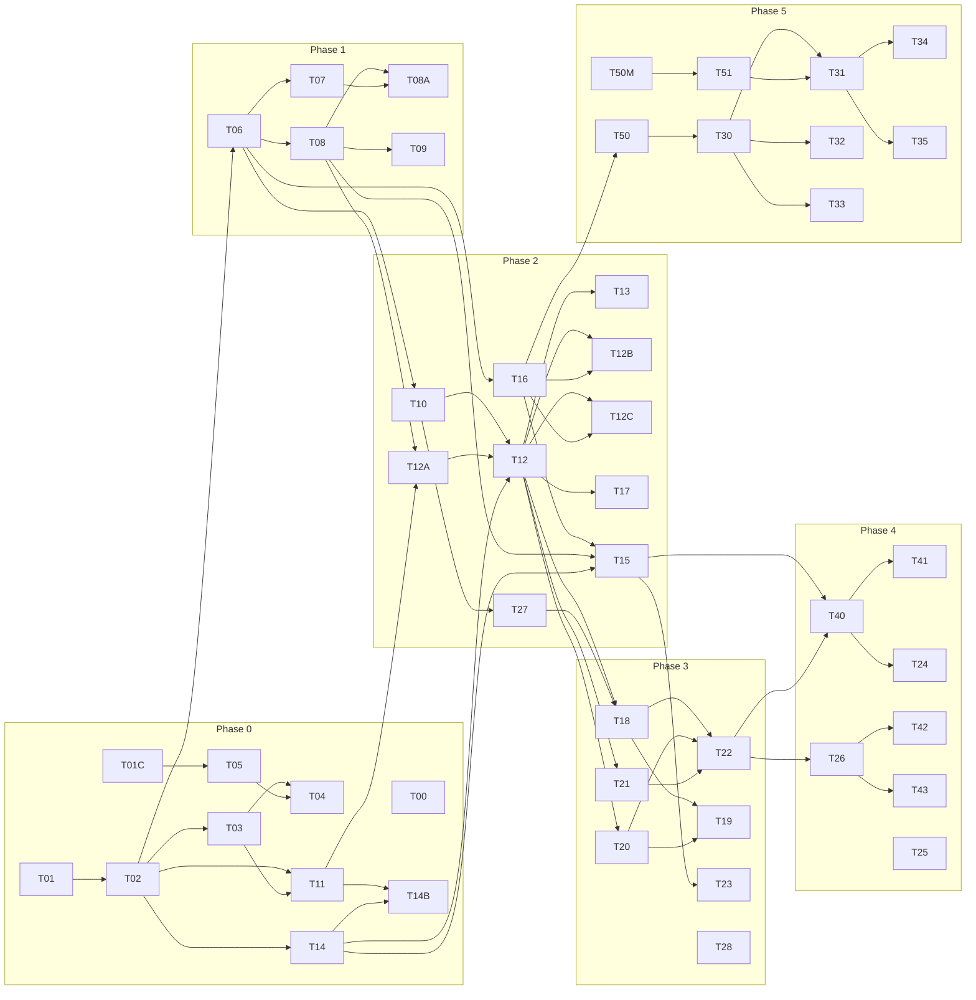

# 5. Task List (v2)

## กติกาการทำงาน
- **Planner/Reviewer** เขียน/แก้ task + AC, ตรวจ PR ตาม AC
- **Cursor cloud agent** = feature PR หลัก (branch `feat/Txx-*`)
- **Codex** = review รอบสองทุก PR ของ Cursor + งานแยก (test, adapter, migration, contracts) ใน branch ตัวเอง (`codex/Txx-*`)
- **Narote approve ทุก merge** เข้า `main` (branch protection: CI เขียว + Codex review + Narote approve)
- 1 task = 1 PR (ใหญ่เกิน ~600 บรรทัดไม่นับ test → แตก PR)
- **Flyway migrations may be written by Cursor or Codex, one migration per PR, never edit a merged version; Codex reviews every migration PR.**
- **Definition of Done:** CI เขียว (รวม contract test), test ครอบ AC, ไม่มี PII ใน log, invariant check ผ่าน, อัปเดต `docs/` ถ้าเปลี่ยน contract (แก้ spec ใน `tsf-oms-contracts` ก่อนเสมอ)

### Flyway versions

Versions are taken in merge order as the next free number. One migration per PR. Never edit a merged migration.

| Version | Owner |
|---|---|
| V1 | T02 foundation + FORCE RLS |
| V2 | T03 JIT provision |
| V3 | T11 inbox dedup `(tenant_id, source, event_id)`, `aggregate_version`, `payload_sha256` |
| V4 | T06 catalog, warehouse, stock (FORCE RLS) |
| V6 | T08 expired-reservation tenant claim function |

## สรุปจำนวน
| Phase | Cursor | Codex | รวม |
|---|---|---|---|
| 0 Foundation | 5 | 5 | 10 |
| 1 Catalog + Inventory | 3 | 2 | 5 |
| 2 TSF Order Integration | 5 | 5 | 10 |
| 3 Fulfillment | 4 | 3 | 7 |
| 4 Pilot | 3 | 4 | 7 |
| 5 Multichannel | 2 | 7 | 9 |
| **รวม** | **22** | **26** | **48** (MVP = Phase 0–4 = 39) |

## Dependency (ย่อ)

---

## Phase 0: Foundation (สัปดาห์ 1–3)
**T00 · Codex · deps: —** Invariants + NFR
- นำ `NFR.md` เข้า repo, เขียน `docs/invariants.md` และทำ invariant check เป็น SQL ที่รันใน test + nightly
- invariants: `0 ≤ reserved ≤ on_hand` · ผลรวม ledger = inventory · ผลรวม reservation ACTIVE ต่อ SKU = `reserved` · 1 reservation มี owner เดียว · ทุกตาราง `tenant_id` มี FORCE RLS · handler ทุกตัว idempotent · ไม่มี PII ใน log
- AC: มี `InvariantChecker` เรียกได้จาก test ทุกตัวหลังจบ · ทำให้ invariant พังโดยตั้งใจแล้ว test fail · NFR ทุกบรรทัดมีค่าหรือ TBD + ค่าเริ่ม

**T01 · Cursor · deps: —** Repo skeleton + staging
- repo `oms`: `backend/` (Spring Boot 4.1, Java 17, Maven wrapper), `frontend/` (Vite + React + TS), `docker-compose.yml` (Postgres 16+), GitHub Actions, deploy staging (Railway) อัตโนมัติจาก `main`
- AC: `./mvnw verify` + `npm ci && npm run build && npm test` ผ่านใน CI · `/actuator/health` = UP บน staging · README รัน local ใน 3 คำสั่ง · Spotless/ESLint บังคับ

**T01C · Codex · deps: —** Contracts repo
- repo `tsf-oms-contracts`: OpenAPI 3.1 (OMS internal + TSF internal), AsyncAPI 3 + JSON Schema ทุก event ใน 04, examples, CI (Spectral lint, validate examples, `oasdiff` breaking check), publish เป็น tag + package
- AC: ตัวอย่างทุกตัวใน 04-api-contract validate ผ่าน · PR ที่ลบ field required → CI fail ว่า breaking · OMS CI ดึง spec ด้วย tag ได้

**T02 · Codex · deps: T01** Flyway V1 + RLS + roles
- `tenant`, `app_user`, `tenant_membership`, `audit_log`, `idempotency_key`, `inbox_event`, `outbox_event`; roles `oms_migrator / oms_app (NOBYPASSRLS) / oms_maint`; ENABLE + **FORCE RLS**; functions `SECURITY DEFINER`: `list_active_tenant_ids`, `resolve_tenant`, `claim_inbox_batch`, `claim_outbox_batch`
- AC: migrate DB ว่างผ่าน (Testcontainers) · ต่อด้วย `oms_app` ไม่ตั้ง context → 0 แถว · context A insert แถว tenant B → error (WITH CHECK) · owner table ก็ถูก RLS บังคับ (FORCE) · `oms_app` ไม่มี BYPASSRLS (query `pg_roles` ใน test) · SECURITY DEFINER คืนแค่ id ไม่คืนข้อมูลอื่น

**T03 · Cursor · deps: T02** Auth + TenantContext + transaction-scoped RLS
- JWT resource server (JWKS), filter resolve `TenantContext` เท่านั้น (clear ใน `finally`), `TenantAwareJpaTransactionManager.doBegin()` รัน `set_config('app.tenant_id', ?, true)`, entitlement gate, JIT provisioning, `GET /api/v1/me`, client credentials สำหรับ `/internal/**`
- AC:
  - token ถูก 200 · `aud` ผิด/หมดอายุ 401 · EXPIRED 403 `ENTITLEMENT_INACTIVE` · GRACE: GET ได้ POST 403
  - **pool leak test:** Hikari pool size 1, request tenant A แล้ว B สลับ 1,000 รอบ (รวมกรณี A throw exception กลางทาง) → B ไม่เคยเห็นข้อมูล A
  - หลัง commit/rollback `current_setting('app.tenant_id', true)` บน connection เดิม = ว่าง
  - ThreadLocal ถูก clear ทุก request (test ด้วย thread pool reuse) · `@Async`/worker ไม่มี context = ทำงานกับ DB ไม่ได้ จนกว่าจะตั้งเอง
  - login ครั้งแรกพร้อมกัน 10 request → tenant 1 แถว · ทุก login ลง audit

**T05 · Codex · deps: T01C** Mock TSF
- IdP (JWKS, authorize, token), REST ตาม 4.7, client เรียก Checkout Reserve API, ยิง webhook เซ็น HMAC; ทุก request/response validate กับ contracts
- AC: `docker compose up` แล้ว T03/T04 test ใช้ได้ · มี endpoint สั่ง "ยิง event X ซ้ำ N ครั้ง / สลับลำดับ / ส่งหลัง reservation หมดอายุ" · payload ไม่ตรง schema = mock ปฏิเสธ

**T04 · Cursor · deps: T03, T05** Frontend shell + SSO
- OIDC PKCE, token ใน memory, route guard, layout, หน้า paywall, API client กลาง
- AC: Playwright login ผ่าน mock IdP → dashboard ชื่อร้าน · membership หมด → paywall · ไม่มี token ใน localStorage/sessionStorage

**T11 · Cursor · deps: T02, T03** Inbox framework
- `POST /internal/v1/events`: ตรวจ HMAC + timestamp, `resolve_tenant`, insert inbox, ตอบ 202; worker `claim_inbox_batch` (`FOR UPDATE SKIP LOCKED`) แล้วประมวลผล **ต่อ tenant ใน transaction เดียว**: handler + `inbox_event=PROCESSED`; `pg_advisory_xact_lock` ต่อ aggregate; handler registry
- AC: signature ผิด/เก่ากว่า 5 นาที 401 · event ซ้ำ 5 ครั้ง handler ทำงานผลลัพธ์เดียว · handler throw → rollback ทั้งหมด (ไม่มี PROCESSED ค้าง) แล้ว retry ตาม backoff → DEAD · event aggregate เดียวกันไม่ประมวลผลพร้อมกัน · ack p95 < 100 ms
- V3 replaces V1 `UNIQUE(source, event_id)` with `UNIQUE(tenant_id, source, event_id)` and adds `aggregate_version` plus `payload_sha256`. Entitlement is applied after `claim_inbox_batch` (the claim does not filter it): unexpired `ACTIVE` and `GRACE` are processed (GRACE still blocks user writes; inbound orders keep flowing); `SUSPENDED` and a passed `entitlement_expires_at` defer business events without consuming an attempt; `membership.changed` always runs so a shop can be reactivated, and that reactivation wakes deferred inbox rows. An unknown shop returns `503` + `Retry-After: 60` for business events. An active `membership.changed` provisions the tenant.

**T14 · Cursor · deps: T02** Outbox publisher (at-least-once)
- API `outbox.append()` ใช้ใน transaction ของ business; publisher `claim_outbox_batch` → `IN_FLIGHT` + `lease_until` → ส่ง HTTP (HMAC) → `SENT`; lease หมด = ส่งใหม่; backoff + jitter; DEAD; หน้า admin retry
- AC (**rewrite v2**):
  - รัน publisher 3 instance พร้อมกัน → **ไม่มี event ไหนถูก 2 instance ถือพร้อมกัน** (ตรวจจาก lease/lock log)
  - **ส่งซ้ำได้** (เช่น ล่มหลังส่งก่อน mark SENT) และ receiver ใน test dedupe ด้วย `event_id` จนผลลัพธ์ถูก
  - kill ระหว่าง business transaction → ไม่มี outbox row (ไม่มี event ผี)
  - kill **ก่อน** ได้ ack → event ยังอยู่และถูกส่งภายหลัง; kill **หลัง** ack ก่อน mark SENT → ส่งซ้ำ ไม่หาย
  - receiver ตอบ 500/429 (`Retry-After`) → retry ตามตาราง 4.4; 400 → DEAD ทันที

**T14B · Codex · deps: T11, T14** Delivery chaos test
- Toxiproxy/kill container ระหว่างรับ-ส่ง event 1,000 ตัว
- AC: 0 event หาย · duplicate delivery > 0 ได้ แต่ผลลัพธ์ปลายทางเหมือนส่งครั้งเดียว · รายงาน duplicate rate

## Phase 1: Catalog + Inventory (สัปดาห์ 4–6)
**T06 · Codex · deps: T02** Flyway (next free version)
- `channel_account` (มี `mode`, `stock_sync_paused`), `product`, `sku`, `sku_bundle_component` (+ trigger ห้าม nested/circular), `channel_listing` (`stock_control`, `safety_buffer`), `warehouse`, `inventory`, `inventory_ledger`, `stock_reservation` (owner_type/owner_ref/status/expires_at), `stock_document`, `stock_document_line` + FORCE RLS + index
- AC: CHECK `reserved <= on_hand` ทำงาน · ใส่ bundle เป็น component → error · UNIQUE reservation ACTIVE ต่อ owner+SKU · RLS test ทุกตารางใหม่

**T07 · Cursor · deps: T06, T04** Catalog + warehouse
- CRUD product/SKU/bundle/warehouse, import CSV, หน้า SKU list + ค้นหา
- AC: import 1,000 แถว < 10 วิ แบบ all-or-nothing แจ้งเลขแถวผิด · `sku_code` ซ้ำ 409 · สร้าง bundle ซ้อน → 422 `NESTED_BUNDLE` · ทุกการแก้ลง audit

**T08 · Cursor · deps: T06** Reservation engine
- `reserve(owner, items)` all-or-nothing, `transferOwner(CHECKOUT→ORDER)`, `release`, `consume`, `unpack`; แตก bundle + รวมจำนวนต่อ SKU + **lock ตาม SKU id เรียงลำดับ**; expiry job 1 นาที; คำนวณ `physical_available`, `channel_exposed`, bundle availability `min(floor(avail/qty))`; component เปลี่ยน → ส่ง internal `StockChanged` ของ bundle ที่เกี่ยวด้วย
- AC: 50 thread จองของ 10 ชิ้น → สำเร็จ 10 พอดี · transfer ไม่เปลี่ยน `reserved` · หมดอายุคืนภายใน 2 นาที + ledger `RELEASE` · bundle ขาดลูก 1 ตัว = ไม่จองทั้งชุด · component เปลี่ยนแล้วมี `StockChanged` ของทุก bundle ที่ใช้มัน

**T08A · Cursor · deps: T08, T07** Stock operations + history UI
- เอกสาร Opening balance, Receive, Adjustment (บังคับ reason), Count (จำ `system_qty_at_start`), Write-off; DRAFT → POSTED (ห้ามแก้หลัง post, ยกเลิกด้วย VOID + เอกสารกลับรายการ); return restock hook; หน้า stock history ต่อ SKU (กรอง reason/วันที่, ลิงก์ไปเอกสาร/ออเดอร์)
- AC: post แล้ว ledger reason ตรง (`OPENING_BALANCE/RECEIVE/ADJUST_IN/ADJUST_OUT/COUNT_CORRECTION/DAMAGE_WRITE_OFF`) · Count ที่มีการขายระหว่างนับ → ยอดสุดท้าย = นับได้ − ที่ขายหลังเริ่มนับ · ADJUST_OUT จนต่ำกว่า `reserved` → 422 · post ซ้ำ (double click) ไม่ลง ledger ซ้ำ · STAFF post ADJUST ไม่ได้ (OWNER/ADMIN เท่านั้น)

**T09 · Codex · deps: T08** Concurrency + bundle stress
- jqwik + multi-thread test
- AC ต้องมีทุกเคส:
  - bundle vs component race (ขาย bundle กับ SKU ลูกพร้อมกันจนของหมด) → ไม่ติดลบ, สำเร็จรวมไม่เกินของ
  - 2 bundle ใช้ component เดียวกัน จองพร้อมกัน
  - ยกเลิก bundle → component กลับครบทุกตัว
  - bundle reservation หมดอายุ → คืนครบ + bundle availability คำนวณใหม่
  - nested / circular bundle ถูกปฏิเสธ (API + DB)
  - **deadlock ordering:** ออเดอร์ SKU {A,B} กับ {B,A} 1,000 คู่พร้อมกัน → 0 deadlock
  - 10,000 operation สุ่ม → InvariantChecker ผ่านทุกครั้ง

## Phase 2: TSF Order Integration (สัปดาห์ 7–10)
**T10 · Codex · deps: T06** Flyway (next free version)
- `sales_order` (order/payment/fulfillment status + hold_reason), `order_recipient` (column เข้ารหัส), `order_line`, `order_status_history` (dimension), `shipment`, `return_request`, `return_line`, `refund`, `payment_status_snapshot`, `sync_cursor`, `shadow_diff`, `reconciliation_issue`
- AC: UNIQUE `(channel_account_id, external_order_id)` · CHECK ค่า enum ทุก status · ผลรวม return qty ต่อ line ≤ qty (trigger) · FORCE RLS ครบ

**T16 · Codex · deps: T01C, T05, T06** Base adapter + capabilities + TSF adapter (**foundation Phase 2**)
- `ChannelAdapter` + `ChannelCapabilities {supportsWebhooks, supportsOrderPull, supportsStockPush, supportsCancelRequest, supportsLabel, supportsReturn, supportsPartialShipment, supportsCod}`
- `BaseChannelAdapter` (Resilience4j core): rate limiter ต่อ channel_account, exponential backoff + jitter, เคารพ `Retry-After`, circuit breaker, bulkhead (concurrency limit ต่อ channel), timeout 10 วิ, metrics ต่อ channel
- TSF adapter: list orders (cursor), get order, payment-status, listings, create shipment, get label, cancel request; capabilities TSF = ทุกตัว true ยกเว้น `supportsPartialShipment=false`
- AC: contract test ทุก endpoint 4.7 กับ mock TSF · `429 + Retry-After: 5` → รอ ≥ 5 วิ · 5xx ต่อเนื่อง → circuit OPEN แล้ว half-open ตามค่า · เกิน concurrency limit → รอคิวไม่ยิงเกิน · เรียก capability ที่ไม่รองรับ → `UnsupportedCapabilityException`

**T12A · Cursor · deps: T08, T11, T01C** Checkout Reserve API
- `POST/DELETE /internal/v1/inventory/reservations` ตาม 4.3, idempotent ด้วย `checkout_id`, `enforced` ตาม mode/allowlist/mapping
- AC: ตอบตาม OpenAPI (contract test) · all-or-nothing · ซ้ำ body เดิม = ผลเดิม, body ต่าง = 409 · SHADOW → คำนวณจริงแต่ `enforced=false` และบันทึก `shadow_diff` · p95 < 150 ms ที่ 200 req/s (Gatling) · DELETE ซ้ำ = 204

**T12 · Cursor · deps: T10, T11, T12A, T14** Order intake + สถานะ 3 มิติ
- handler `order.created/paid/cancelled/updated`, `OrderStateMachine` (guards ตาม 01), โอน reservation, จองใหม่ถ้าหมดอายุ, hold_reason
- AC: **business update + reservation + `order_status_history` + outbox + inbox PROCESSED อยู่ใน transaction เดียว** (test: throw หลังเขียน outbox → ไม่มีอะไร commit) · paid มาก่อน created → ผลสุดท้ายถูก · COD → `COD_PENDING` + `READY_TO_PICK` · reservation หมดอายุก่อน created + ของไม่พอ → `OUT_OF_STOCK` hold · cancel คืน reservation ครบ

**T13 · Codex · deps: T12** State matrix test
- AC: table-driven ครอบทุกคู่ transition ของ 3 มิติ + guard ข้ามมิติ (เช่น READY_TO_PICK ขณะ PENDING ต้องล้ม, hold ≠ NONE ห้ามเดิน) · transition ห้าม = exception ไม่แตะ DB

**T12B · Cursor · deps: T12, T16** SKU mapping + hold resolution
- sync listings, auto-map `seller_sku = sku_code`, หน้า map มือ, ปล่อย hold แล้วจองใหม่
- AC: map แล้วออเดอร์ `SKU_NOT_MAPPED` ที่เกี่ยวถูกจองและปล่อยครบ · ของไม่พอ → เปลี่ยนเป็น `OUT_OF_STOCK`

**T12C · Codex · deps: T12, T16** Backfill + gap fetch
- job 15 นาทีต่อ tenant ผ่าน `sync_cursor`, gap ใน `aggregate_version` → ดึงตัวเต็ม
- AC: ปิด webhook ใน mock แล้วสร้าง 50 ออเดอร์ → ครบภายใน 15 นาที ไม่ซ้ำ · cursor เดินต่อหลัง restart

**T15 · Cursor · deps: T08, T14, T16** Stock push
- `StockChanged` → debounce 2–5 วิ → `stock.updated` (absolute + `stock_version`, รวม bundle), full push 15 นาที; เคารพ mode (SHADOW = บันทึก would-push ลง `shadow_diff`, CONTROL = เฉพาะ `stock_control=true`), `stock_sync_paused`
- AC: จอง 5 ครั้งใน 1 วิ = ส่ง 1 event ค่าสุดท้ายถูก · ขาย component แล้ว bundle listing ถูก push ด้วย · pause แล้วไม่มี event ออก · propagation p95 < 10 วิ

**T17 · Cursor · deps: T12** Orders UI
- list + tab ตาม fulfillment, filter hold/payment, ค้นหา (order id, tracking, เบอร์ผ่าน hash), detail + timeline 3 มิติ, ปุ่มขอยกเลิก
- AC: 10,000 ออเดอร์ โหลด < 1 วิ (server pagination) · STAFF เห็นเบอร์แบบ mask

**T27 · Codex · deps: T10** PII lifecycle
- AES-GCM column encryption + key rotation, `phone_hash`, logback masking filter, redaction job (ปิด + 90 วัน), scrub payload inbox/outbox หลัง 7 วัน, purge label cache 7 วัน
- AC: grep log ของ test suite ไม่เจอเบอร์/ที่อยู่ · redaction แล้วเหลือ province/postcode · หมุน key แล้วอ่านข้อมูลเก่าได้

## Phase 3: Fulfillment (สัปดาห์ 11–13)
**T18 · Cursor · deps: T12, T16, T27** Pick / Pack / Label / Ship
- pick list (PDF), หน้าแพ็กยิงบาร์โค้ด, ขอ label ผ่าน adapter (ตรวจ `supportsLabel`), รวม label PDF, ยืนยันส่ง → `SHIPPED` + consume + `shipment.updated`
- AC: ยิงผิด/เกิน = ไม่ให้ PACKED · ขอ label ซ้ำไม่ออกใหม่ · SHIPPED แล้ว `on_hand` ลดตรง, reservation CONSUMED · 100 label PDF เดียว · ออเดอร์ที่มี hold ไม่อยู่ใน pick list

**T20 · Cursor · deps: T12, T08A** Cancel + Returns (partial)
- cancel ก่อนส่ง (รวม unpack), `return.requested/decided`, RTS, หน้ารับของคืนต่อ line (qty + สภาพ), `return.received`
- AC: คืน 1 จาก 2 ชิ้น → ออเดอร์ยัง `ACTIVE/DELIVERED` · RESELLABLE → `RETURN_RESTOCK`, DAMAGED → `DAMAGE_WRITE_OFF` · return qty เกินที่ส่ง → 422 · ยกเลิกตอน PACKED → unpack แล้วคืน reservation

**T21 · Codex · deps: T12, T16** Payment + refund snapshot
- handler `payment.status_changed`, `refund.status_changed`, คำนวณ `payment_status`, fallback GET ตอน reconcile
- AC: event ซ้ำไม่สร้างแถวซ้ำ · refund 295 จาก 580 → `PARTIALLY_REFUNDED`, ครบ → `REFUNDED` · ไม่มี dependency Xendit/Opn SDK

**T22 · Cursor · deps: T18, T20, T21** Reconciliation
- job 02:00 ต่อ tenant (per-tenant context) + ปุ่มรันเอง, 8 กฎใน 1.5, หน้า report ACK/RESOLVED
- AC: fixture ผิดแต่ละกฎถูกจับ 8/8 · รันซ้ำไม่สร้าง issue ซ้ำ · invariant พัง → alert ทันที

**T23 · Codex · deps: T15, T16** Stock drift (TSF)
- เทียบ `last_exposed_qty` กับ `last_seen_channel_qty` จาก listings
- AC: diff → issue `STOCK_DRIFT` + re-push · ไม่แตะ `on_hand`

**T19 · Codex · deps: T18, T20** E2E
- Playwright + mock TSF: reserve → created → paid → pick → pack → label → ship → delivered → คืนบางชิ้น → refund; และ cancel ตอน PACKED
- AC: รันใน CI < 5 นาที · InvariantChecker ผ่านท้ายทุก scenario

**T28 · Cursor · deps: T04** Public product page + demo tenant
- หน้า HTTPS สาธารณะอธิบาย OMS + demo account สำหรับ reviewer marketplace
- AC: เปิดได้ไม่ต้อง login · demo tenant มีข้อมูลตัวอย่าง ไม่มี PII จริง

## Phase 4: Pilot (สัปดาห์ 14–22)
**T40 · Cursor · deps: T12A, T15, T22** Connection modes + emergency controls
- เปลี่ยน mode ทีละขั้น (เดินหน้า/ถอย), SKU allowlist ของ CONTROL, ปุ่ม PAUSE STOCK SYNC / DISCONNECT CHANNEL / FORCE FULL RESYNC, global kill switch (platform admin)
- AC: ข้ามขั้น (OBSERVE → ACTIVE) ไม่ได้ · PAUSE มีผลภายใน 5 วิ (ไม่มี `stock.updated` ออก) · DISCONNECT → reserve API ตอบ `enforced=false` · RESYNC push ครบทุก listing + ดึงออเดอร์ย้อนหลัง · ทุกปุ่มลง audit + ต้องยืนยัน 2 ขั้น

**T41 · Codex · deps: T40, T23** Shadow diff report
- เก็บ diff stock/order/reservation (OMS vs TSF จริง), คำนวณเกณฑ์เลื่อน mode
- AC: หน้า report แสดง diff % รายวัน · เกณฑ์ใน 02 (diff < 0.5% 7 วัน) คำนวณถูกจาก fixture

**T26 · Cursor · deps: T22** Prod deploy + observability + PITR
- prod env, JSON log + `trace_id`, metrics (reserve latency, inbox lag, DEAD, stock propagation lag, business oversell, hold count), alert, **เปิด Railway PITR**
- AC: prod deploy ต้องกดเอง (Narote) · alert เมื่อ DEAD > 0, inbox lag > 5 นาที, reserve p95 เกิน NFR · `railway postgres pitr status` = healthy

**T24 · Cursor · deps: T17, T40** Dashboard + audit viewer
- การ์ด: รอแพ็ก, ใกล้ ship-by, hold, DEAD events, mode ปัจจุบัน, sync paused, issue เปิด; หน้า audit
- AC: ตัวเลขการ์ดตรง query ใน test · audit ไม่แสดง PII

**T42 · Codex · deps: T26** DR drill
- restore PITR ไป sibling service, สลับ connection, วัด RPO/RTO, เขียน runbook
- AC: RPO ≤ 1 นาที, RTO ≤ 60 นาที ตาม NFR · runbook ทำตามได้โดยคนที่ไม่ได้เขียน

**T43 · Codex · deps: T26, T12A** Load test ตาม NFR
- Gatling: checkout reserve, webhook ingest, peak orders/min, stock updates/sec
- AC: ผ่านทุกตัวเลขใน NFR.md ที่ 2× peak เป้า · รายงานเทียบ NFR

**T25 · Codex · deps: T27, T40** Security review
- test: ทุกตาราง `tenant_id` มี `relforcerowsecurity=true` + policy · `oms_app` ไม่มี BYPASSRLS · PII scan log/audit · dependency scan
- AC: เพิ่มตารางไม่มี FORCE RLS → CI fail · รายงาน finding ใน PR

## Phase 5: Multichannel (framework เริ่ม ~สัปดาห์ 14, adapter หลัง approval)
**T50M · Codex · deps: T10** Flyway V5: `allocation_policy`, `channel_allocation`
- AC: CHECK ผลรวม allocation ≤ physical − buffer (ตรวจใน service + test)

**T50 · Codex · deps: T16** Capability framework (ต่อยอด T16)
- polling fallback เมื่อ `!supportsWebhooks`, gating ปุ่ม/flow ตาม capability, config rate/concurrency ต่อ marketplace
- AC: adapter ปลอมที่ไม่มี webhook → order เข้าด้วย poll · `supportsCancelRequest=false` → UI ซ่อนปุ่ม API ตอบ 422

**T51 · Cursor · deps: T50M, T15** Allocation strategy
- Shared Exposure + last-units protection (ค่าเริ่ม), Hard Allocation ต่อ SKU, rebalance, UI ตั้งค่า
- AC: `physical_available ≤ low_stock_threshold` → ช่องทางที่ไม่ใช่ priority ได้ 0 · HARD: ไม่มีช่องทางไหน exposed เกินโควตา

**T30 · Cursor · deps: T50** Connect channel UI (OAuth marketplace) + token refresh
- AC: token เข้ารหัส, refresh ก่อนหมดอายุ, เริ่ม mode `OBSERVE` เสมอ

**T31 · Codex · deps: T30, T51, Shopee approval** Shopee adapter
**T32 · Codex · deps: T30, T51, TikTok approval** TikTok Shop adapter
**T33 · Codex · deps: T30, T51, Lazada approval** Lazada adapter
- AC ร่วม: capabilities ถูกต้องตาม docs จริง · contract test + sandbox ผ่าน · rate limit ตาม docs · ผ่าน shadow ก่อนเปิด control

**T34 · Codex · deps: T31, T51** Cross-channel race (**นิยามใหม่**)
- จำลอง TSF + Shopee (+ช่องทางที่ 3) ขายชิ้นท้ายพร้อมกันพร้อม propagation lag 5–60 วิ
- **ออเดอร์ที่ถูก ON_HOLD (`OUT_OF_STOCK`) = business oversell** ไม่ใช่ "ผ่าน"
- AC: สต๊อกไม่ติดลบ · รายงาน business oversell rate ต่อ strategy (SHARED, SHARED+protection, HARD) · HARD = 0 · SHARED+protection < 0.1% ที่ load ตาม NFR

**T35 · Codex · deps: T31** Multichannel drift + resync
- AC: สร้าง drift ตั้งใจ → ตรวจเจอภายใน 15 นาที + re-push · FORCE FULL RESYNC ใช้ได้ทุก adapter

---

## งานฝั่ง ThaiShopFun (repo TSF, OMS รอ)
| ID | ต้องพร้อมก่อน | งาน |
|---|---|---|
| TSF-01 | T04 (staging) | OIDC client `oms` + claims ตาม 4.1 + JWKS |
| TSF-02 | T12 | outbox + webhook ตาม 4.5 (รวม `reservation_id`, return lines, `refund.status_changed`), at-least-once |
| TSF-03 | T16 | internal REST ตาม 4.7 + client credentials + `Retry-After` |
| TSF-04 | T15 | รับ `stock.updated` / `shipment.updated` / `return.received` + dedupe `event_id` |
| TSF-05 | T18 | ออก label/tracking ผ่านขนส่งของ TSF |
| TSF-06 | T03 | `membership.changed` + entitlement `oms` ต่อ tier |
| **TSF-07** | T12A | **checkout เรียก `POST /inventory/reservations` ก่อนสร้างออเดอร์**, 409 → แสดง OUT_OF_STOCK, `DELETE` เมื่อทิ้ง checkout, ส่ง `reservation_id` ใน `order.created`, เคารพ `enforced` |
| **TSF-08** | T01C | ดึง `tsf-oms-contracts` tag เดียวกัน + contract test ใน CI ของ TSF |
| **TSF-09** | T12A | timeout 800 ms + circuit breaker ตอนเรียก reserve + fallback policy (ตัดสินใจ #6) + metric |
