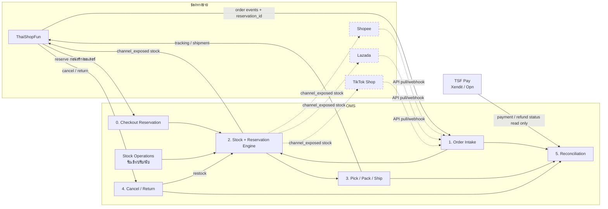
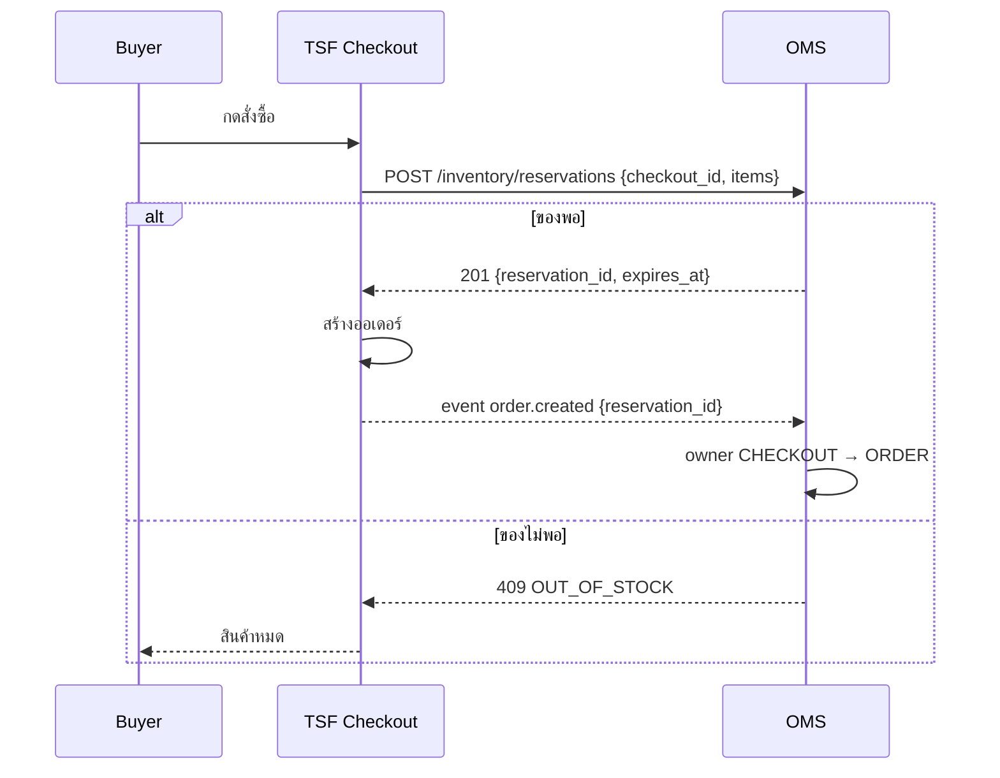
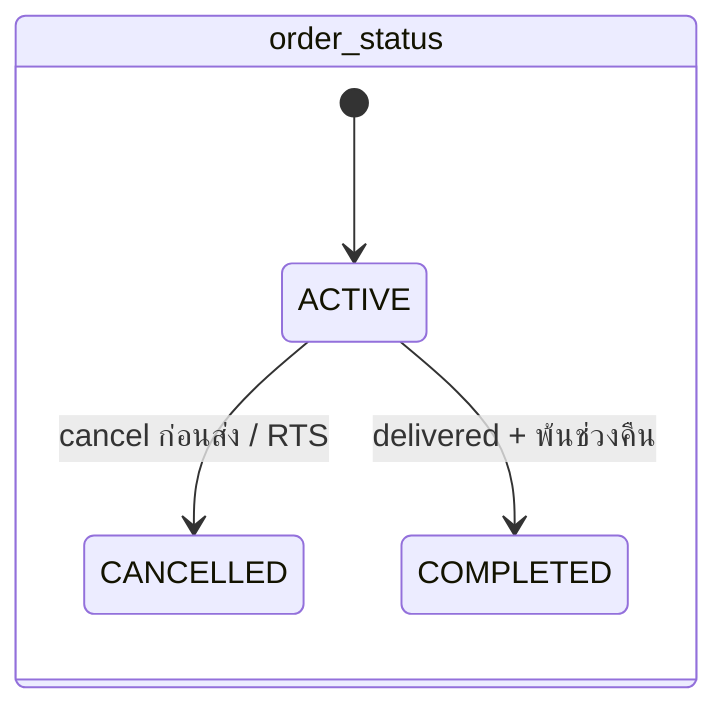
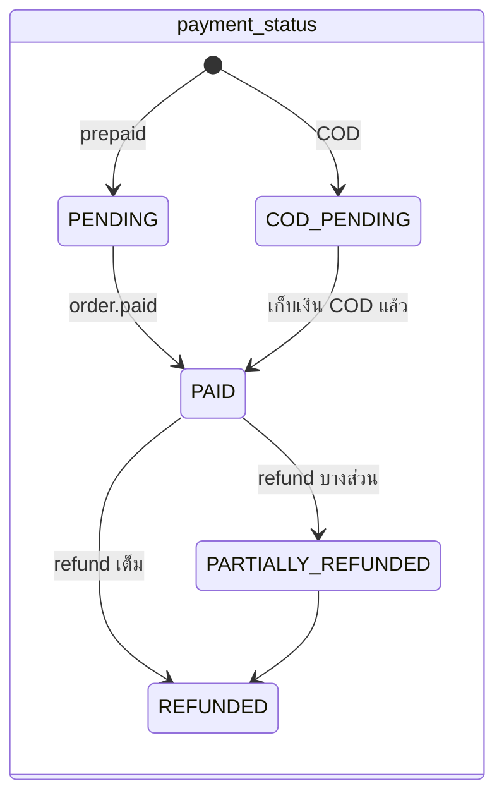
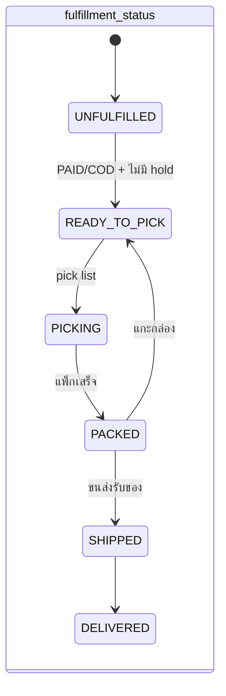
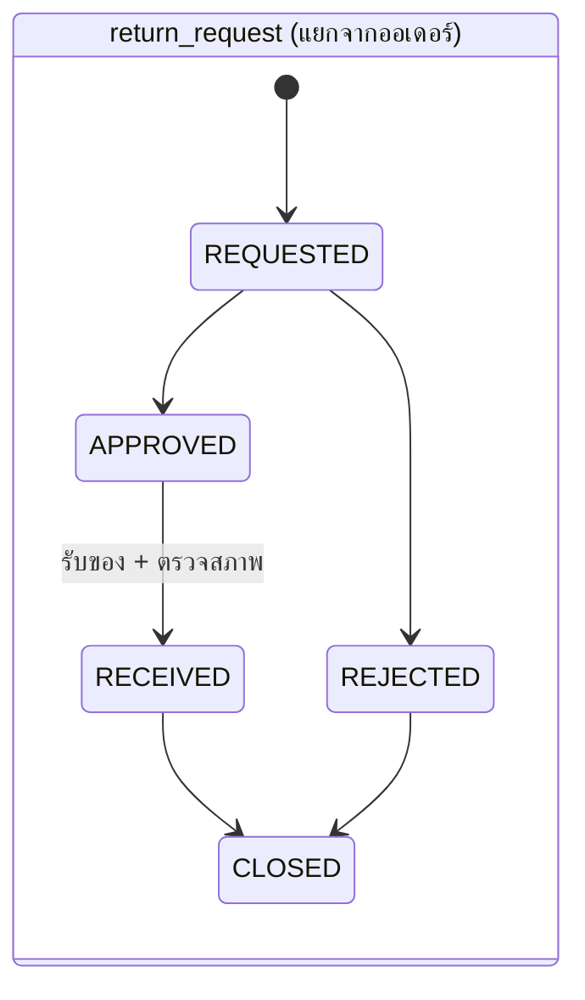
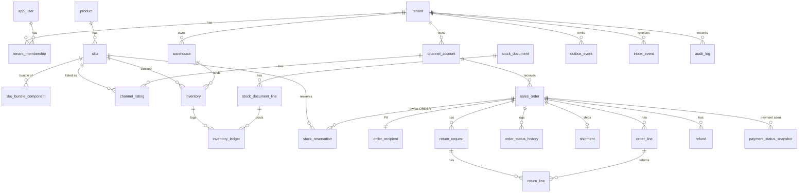
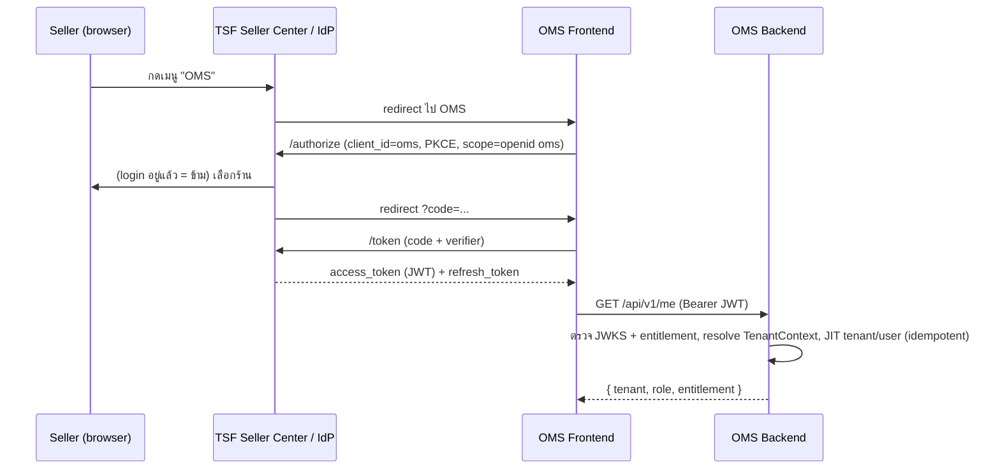
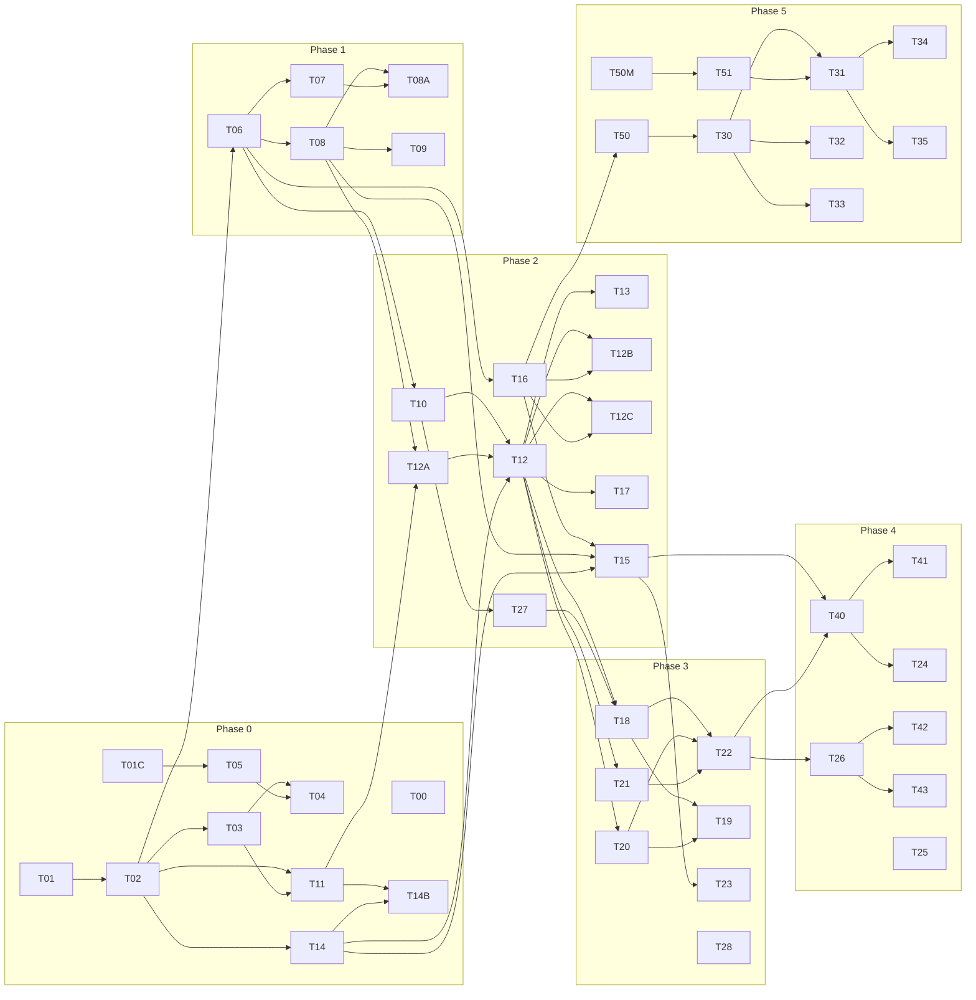

# OMS Plan v2: Multichannel Order Management System
*สำหรับ Narote · 29 ก.ย. 2026 · planning เท่านั้น ยังไม่มีโค้ด/repo · v1 อยู่ที่ `v1/` · สิ่งที่เปลี่ยนดู `CHANGELOG-v2.md` · NFR ดู `NFR.md`*

**ต่อยอดจาก:** `/workspace/oms-research/report.md` (ตลาด, คู่แข่ง, ด่าน partner approval, ความเสี่ยง stock race)

## สรุปการตัดสินใจหลัก
- **ThaiShopFun เป็นช่องทางแรก** → Shopee → TikTok Shop → Lazada (ยื่น partner ทั้งหมดสัปดาห์แรก)
- **OMS = สิทธิ์สมาชิก TSF:** SSO (OIDC + JWT จาก TSF), 1 ร้าน = 1 tenant, gate ตาม membership
- **TSF จองสต๊อกกับ OMS ก่อนสร้างออเดอร์** (Checkout Reservation) → ออเดอร์ TSF ขายเกินไม่ได้
- **สถานะออเดอร์ 3 มิติ** (order / payment / fulfillment) + `hold_reason`; return/refund แยก entity คืนบางชิ้นได้
- **Reservation engine เดียว** (CHECKOUT/ORDER), bundle ไม่ซ้อน, lock ตาม SKU id, ledger ทุกการเปลี่ยน + stock operations ครบ
- **Sync at-least-once:** webhook จาก outbox + inbox dedupe, update ทั้งหมดใน transaction เดียว
- **Multi-tenant:** shared schema + FORCE RLS, context ตั้งใน transaction เดียวกับ query
- **เปิดใช้แบบค่อยเป็นค่อยไป:** OBSERVE → SHADOW → CONTROL → ACTIVE + ปุ่มฉุกเฉิน, pilot 1 → 2 → 5 → 10 ร้าน
- **เงินอยู่ TSF Pay** OMS อ่านอย่างเดียว; **PII** แยกตาราง เข้ารหัส ลบตามอายุ; **Contracts** เป็น OpenAPI/AsyncAPI + CI
- **Stack:** React + Vite + TS / Spring Boot 4.1 (Java 17) / PostgreSQL (Railway PITR) / Flyway / JWT; B2B/D365 = paid add-on อนาคต

## สารบัญ
1. [Process Map](01-process-map.md)
2. [MVP Scope + Rollout](02-mvp-scope.md)
3. [Data Model](03-data-model.md)
4. [API Contract กับ ThaiShopFun](04-api-contract.md)
5. [Task List](05-task-list.md)
6. [NFR](NFR.md)
7. ต้องให้ Narote ตัดสินใจ (ท้ายไฟล์)

---

# 1. Process Map: OMS ทำงานยังไง

> อ่านส่วนนี้ก่อน ถ้ายังไม่คุ้นกับงาน OMS
> คำย่อ: **TSF** = ThaiShopFun, **TSF Pay** = ThaiShopFun Pay (Xendit xenPlatform / Opn)

## ภาพรวมใน 30 วินาที
- OMS คือ "ห้องควบคุมกลาง" ของร้าน ออเดอร์จากทุกช่องทางเข้ามารวมที่เดียว
- OMS ถือ **สต๊อกจริง** ไว้ที่เดียว แล้วบอกทุกช่องทางว่าขายได้อีกกี่ชิ้น
- **TSF จองสต๊อกกับ OMS ก่อนสร้างออเดอร์** (checkout reservation) ถ้าจองไม่ได้ ผู้ซื้อจะเห็น "สินค้าหมด" ไม่มีออเดอร์ที่ขายเกิน
- ช่องทางยังเป็นเจ้าของ **หน้าร้าน, การจ่ายเงิน, การตัดสินยกเลิก/คืน, ใบปะหน้าขนส่ง**
- OMS ไม่แตะเงิน แค่ **อ่าน** สถานะการจ่ายเงินจาก TSF Pay


(เส้นประ = หลัง MVP)

---

## 1.1 Order Intake: รับออเดอร์
**คืออะไร:** ผู้ซื้อกดสั่งที่ช่องทาง ช่องทางส่งออเดอร์มาให้ OMS OMS เก็บเป็นรูปแบบกลางเดียวกันทุกช่องทาง

**ขั้นตอน**
1. TSF จองสต๊อกแล้ว (1.2) จึงสร้างออเดอร์ แล้วส่ง `order.created` พร้อม `reservation_id`
2. OMS เช็ก `event_id` ซ้ำไหม (webhook ส่งซ้ำได้เสมอ) ซ้ำ = ข้าม
3. OMS map SKU ช่องทาง → SKU กลาง (`channel_listing`)
4. OMS **ย้ายเจ้าของ reservation** จาก `CHECKOUT` → `ORDER` (ไม่จองใหม่ ไม่ตัดซ้ำ)
   - ไม่มี `reservation_id` หรือหมดอายุไปแล้ว → จองใหม่ตอนนี้ ไม่พอ = `hold_reason=OUT_OF_STOCK`
   - map SKU ไม่ได้ → `hold_reason=SKU_NOT_MAPPED`
5. ตั้งสถานะ 3 มิติ (ดูท้ายไฟล์): `order_status=ACTIVE`, `payment_status=PENDING` (หรือ `COD_PENDING`), `fulfillment_status=UNFULFILLED`
6. `order.paid` → `payment_status=PAID` → ถ้าไม่มี hold → `fulfillment_status=READY_TO_PICK`
7. COD → `COD_PENDING` + `READY_TO_PICK` ได้ทันที
8. กันพลาด: ทุก 15 นาที backfill ออเดอร์ที่อัปเดตล่าสุดจาก TSF เผื่อ event หาย

**ทุกอย่างในข้อ 3–6 commit ใน transaction เดียว:** อัปเดตออเดอร์ + reservation + `order_status_history` + `outbox_event` + `inbox_event=PROCESSED` พังกลางทาง = rollback ทั้งก้อน แล้ว event ถูกประมวลผลใหม่

| OMS ทำ | ช่องทางทำ |
|---|---|
| เก็บออเดอร์รูปแบบกลาง, กันซ้ำ, map SKU, รับโอน reservation | จองสต๊อกก่อนสร้างออเดอร์, หน้าร้าน, รับเงิน, ส่ง event |

## 1.2 Stock + Reservation: จองสต๊อก กันขายเกิน
**คืออะไร:** ของมีจริง 10 ชิ้น ขาย 4 ช่องทาง ถ้าทุกช่องทางคิดว่ามี 10 จะขายได้ 40 = **oversell** OMS ต้องเป็นคนเดียวที่ตัดสินว่าเหลือเท่าไร

**คำศัพท์ (ใช้ทั้งเอกสาร)**
| คำ | สูตร / ความหมาย |
|---|---|
| `on_hand` | ของอยู่ในคลังจริง |
| `reserved` | จองอยู่ (ทั้ง CHECKOUT และ ORDER) |
| `physical_available` | `on_hand − reserved` |
| `safety_buffer` | กันไว้ไม่โชว์ (ต่อ SKU / ต่อช่องทาง) |
| `channel_allocated` | โควตาที่แบ่งให้ช่องทาง (ใช้เฉพาะ Hard Allocation) |
| `channel_exposed` | ตัวเลขที่ push ไปโชว์ที่ช่องทางจริง |

### TSF Checkout Reservation (strong reservation)

1. TSF เรียก reserve **ก่อน** สร้างออเดอร์ จองแบบ all-or-nothing (ขาด 1 รายการ = ไม่จองเลย)
2. ได้ `reservation_id` + `expires_at` (CHECKOUT TTL เริ่ม 15 นาที)
3. ผู้ซื้อทิ้ง checkout → TSF เรียก `DELETE` คืนทันที ถ้าไม่เรียก job คืนเองตอนหมดอายุ
4. `order.created` → โอนเป็น `ORDER` ตั้ง `expires_at = payment_expires_at + 10 นาที` จ่ายแล้วหรือ COD = ไม่หมดอายุ
5. ส่งของ → `CONSUMED` (ตัด `on_hand` + `reserved` พร้อมกัน), ยกเลิก/หมดอายุ → `RELEASED`
6. Job expiry ทุก 1 นาที คืน reservation ที่หมดอายุ + เขียน ledger `RELEASE`
7. ถ้า OMS ล่ม/ช้าเกิน timeout: TSF ทำตาม fallback policy (ดู "ต้องให้ Narote ตัดสินใจ" #6)

### กลไกจอง (ทุกช่องทางใช้ตัวเดียวกัน)
- แตก bundle เป็น SKU ลูก รวมจำนวนต่อ SKU ก่อน แล้ว **เรียง SKU id** ก่อน lock (กัน deadlock)
- จองด้วย conditional UPDATE ทีละ SKU ตามลำดับ
  `UPDATE inventory SET reserved = reserved + :qty WHERE sku_id=:id AND on_hand - reserved >= :qty`
  update ได้ 0 แถว = ของไม่พอ → rollback ทั้งชุด
- DB มี `CHECK (reserved <= on_hand)` เป็นด่านสุดท้าย
- ทุกการเปลี่ยนเขียน `inventory_ledger` (reason `RESERVE / RELEASE / SHIP / ...`)
- สต๊อกเปลี่ยน → คำนวณ `channel_exposed` ใหม่ (รวม bundle ที่ใช้ SKU นี้) → รวบ 2–5 วิ → push ค่า absolute + `stock_version`
- full push ทุก 15 นาที กัน push หาย

### Bundle rules
- bundle ไม่มีสต๊อกตัวเอง: `bundle_available = min( floor(component_available / component_qty) )`
- component เปลี่ยน → หา bundle ที่ขึ้นกับมัน → คำนวณใหม่ → `stock.updated` ของ bundle ด้วย
- **ห้าม nested bundle** (component ต้องไม่ใช่ bundle) → circular เกิดไม่ได้ บังคับทั้ง API และ DB trigger
- ยกเลิก/หมดอายุ bundle = คืน component ครบทุกตัวใน transaction เดียว

### กัน oversell ข้ามช่องทาง (เฟส 5 แต่ออกแบบไว้แล้ว)
TSF ปลอดภัยเพราะจองก่อนขาย แต่ Shopee/Lazada/TikTok **ขายก่อนแล้วค่อยบอก OMS** ช่วงที่ push ยังไม่ถึงคือช่องโหว่

| Strategy | `channel_exposed` | ข้อดี | ข้อเสีย |
|---|---|---|---|
| **Shared Exposure** | `max(0, physical_available − safety_buffer_ch)` ทุกช่องทางเห็น pool เดียวกัน | ขายได้เต็มที่ ของไม่ค้าง | ชิ้นท้ายๆ อาจขายซ้อน |
| **Hard Allocation** | `min(channel_allocated − channel_reserved, physical_available − safety_buffer)` | ไม่ขายซ้อนข้ามช่องทาง | ของค้างในช่องทางที่ขายช้า ต้อง rebalance |

- **ค่าเริ่ม (ตัดสินใจแล้ว): Shared Exposure + last-units protection** เมื่อ `physical_available ≤ low_stock_threshold` (เริ่ม 3) โชว์เฉพาะ TSF (มี strong reservation) ช่องทางอื่นเป็น 0
- ตั้ง Hard Allocation ต่อ SKU ได้ สำหรับสินค้าจำกัด/ไลฟ์
- **นิยาม business oversell:** ออเดอร์ที่ช่องทางรับไปแล้วแต่ OMS จองไม่ได้ (`hold_reason=OUT_OF_STOCK`) นับเป็น oversell แม้สต๊อกใน DB ไม่ติดลบ ใช้ตัวนี้วัด strategy (เป้า < 0.1% ของออเดอร์ marketplace)

| OMS ทำ | ช่องทางทำ |
|---|---|
| คำนวณ exposed, จอง/โอน/คืน, ledger, push สต๊อก | TSF: จองก่อนขาย; marketplace: โชว์ตามตัวเลข OMS |

## 1.3 Pick / Pack / Ship: หยิบ แพ็ก ส่ง
**คืออะไร:** เปลี่ยนออเดอร์ที่พร้อมส่ง เป็นกล่องที่ขนส่งมารับ ใช้ `fulfillment_status` อย่างเดียว

**ขั้นตอน**
1. ออเดอร์ `READY_TO_PICK` (จ่ายแล้วหรือ COD, `hold_reason=NONE`) → เลือกหลายใบ → สร้าง **pick list** → `PICKING`
2. แพ็กทีละออเดอร์ ยิงบาร์โค้ดเช็ก SKU/จำนวน → `PACKED`
3. ขอใบปะหน้าจาก **ช่องทาง** ได้ `tracking_no` + label PDF พิมพ์เป็นชุด
4. ขนส่งรับของ → ยืนยันส่ง → `SHIPPED` ตัดสต๊อกจริง (reservation `CONSUMED`) → `shipment.updated` ไป TSF
5. สถานะพัสดุหลังจากนี้มาจากช่องทาง → `DELIVERED`
6. พ้นช่วงคืน (7 วัน) และไม่มี return เปิดอยู่ → `order_status=COMPLETED`
7. ติด hold ระหว่างทาง (เช่น `ADDRESS_PROBLEM`) → หยุดที่สถานะเดิม เดินต่อไม่ได้จนแก้

**ยกเลิกก่อนส่ง:** ได้เมื่อ `fulfillment_status ∈ {UNFULFILLED, READY_TO_PICK, PICKING, PACKED}` (PACKED ต้องแกะกล่องก่อน) → `order_status=CANCELLED` + คืน reservation

| OMS ทำ | ช่องทางทำ |
|---|---|
| pick list, เช็กแพ็ก, ขอ + พิมพ์ label, ยืนยันส่ง, ตัดสต๊อก | คุยกับขนส่ง, ออก tracking/label, อัปเดตสถานะพัสดุ |

## 1.4 Cancel / Return / Refund: ยกเลิก คืน คืนเงิน
**หลักใหม่:** return และ refund เป็น **entity แยก** ไม่เปลี่ยนสถานะหลักของออเดอร์ คืนบางชิ้นได้ (partial return)

| แบบ | เกิดตอน | ผลต่อสต๊อก | ผลต่อออเดอร์ |
|---|---|---|---|
| **Cancel ก่อนส่ง** | ยังไม่ SHIPPED | คืน reservation ทันที | `order_status=CANCELLED` |
| **ส่งไม่สำเร็จ** (RTS) | SHIPPED แล้วตีกลับ | รับของคืน ตรวจ แล้ว restock | สร้าง `return_request(type=RTS)`; TSF ส่ง `order.cancelled` → `CANCELLED` |
| **คืนสินค้า** | DELIVERED แล้ว | restock เฉพาะของดี | ออเดอร์ยัง `ACTIVE/DELIVERED`, มี return + refund แยก |

**ขั้นตอน (คืนสินค้า)**
1. ผู้ซื้อขอคืนบางชิ้นที่ TSF → `return.requested` (มี lines + qty) → `return_request=REQUESTED`
2. TSF ตัดสิน → `APPROVED / REJECTED` (OMS แค่รับผล)
3. ของถึงคลัง → ร้านกด "รับของคืน" เลือกสภาพต่อชิ้น `RESELLABLE / DAMAGED` → restock เฉพาะ RESELLABLE (ledger `RETURN_RESTOCK`), DAMAGED ลง `DAMAGE_WRITE_OFF` → `RECEIVED` → `return.received` ไป TSF
4. TSF Pay คืนเงิน → `refund` แถวใหม่ → `payment_status` = `PARTIALLY_REFUNDED` หรือ `REFUNDED`
5. ทุก return ปิดแล้ว → `CLOSED`; ออเดอร์ `COMPLETED` ได้หลังไม่มี return เปิดอยู่

**ร้านขอยกเลิกจาก OMS:** OMS เรียก `POST /cancel-requests` ไป TSF → ติด `hold_reason=CHANNEL_CANCEL_PENDING` → TSF ตัดสิน ส่ง `order.cancelled` กลับ OMS ไม่ยกเลิกเองฝ่ายเดียว

| OMS ทำ | ช่องทางทำ |
|---|---|
| คืน reservation, รับของคืน, ตรวจสภาพ, restock, ledger | รับคำขอ, ตัดสินอนุมัติ, คืนเงิน |

## 1.5 Reconciliation: กระทบยอด
**คืออะไร:** เช็ก 3 อย่างตรงกัน **ออเดอร์ vs เงิน vs การส่ง** ไม่ตรง = เงินรั่วหรือของหาย
- Job ทุกคืน 02:00 (เวลาไทย) ต่อ tenant + กดรันเองได้ → `reconciliation_issue`

| กฎ | ความหมาย |
|---|---|
| `READY_TO_PICK/PICKING/PACKED` เลย `ship_by` | ส่งช้า เสี่ยงโดนปรับ |
| `SHIPPED` แต่ `payment_status` ไม่ใช่ `PAID/COD_PENDING` | ส่งของโดยยังไม่ได้เงิน |
| `CANCELLED` แต่ `payment_status=PAID` | ต้องคืนเงินลูกค้า |
| `COD_PENDING` + `DELIVERED` เกิน 14 วัน | เงิน COD ค้าง |
| return `RECEIVED` แต่ไม่มี refund เกิน 7 วัน | ลูกค้ารอเงินคืน |
| ยอด payment ≠ `grand_total` | ส่วนลด/ค่าส่งไม่ตรง |
| `channel_exposed` ที่ส่ง ≠ สต๊อกที่ช่องทางโชว์ | sync หลุด (re-push อัตโนมัติ) |
| ledger รวม ≠ `inventory` หรือ reservation ACTIVE ≠ `reserved` | invariant พัง → alert ทันที |

MVP ไม่ทำบัญชี settlement/ค่าธรรมเนียม

## 1.6 Stock Operations: จัดการสต๊อกหลังบ้าน
ทุกการเปลี่ยน `on_hand` ต้องมาจาก "เอกสารสต๊อก" มีเหตุผล มีคนทำ ย้อนดูได้

| งาน | เมื่อไร | ledger reason |
|---|---|---|
| Opening balance | เริ่มใช้ OMS ครั้งแรก | `OPENING_BALANCE` |
| รับของเข้า | ของใหม่มาถึง | `RECEIVE` |
| ปรับมือ (ต้องเลือกเหตุผล) | แก้ผิด/เจอของเพิ่ม/ของหาย | `ADJUST_IN / ADJUST_OUT` |
| นับสต๊อก | นับจริงเทียบระบบ | `COUNT_CORRECTION` |
| ของเสีย/ตัดทิ้ง | เสียหาย หมดอายุ | `DAMAGE_WRITE_OFF` |
| รับคืนเข้าสต๊อก | return สภาพดี | `RETURN_RESTOCK` |
| ระบบทำเอง | จอง/คืน/ส่ง | `RESERVE / RELEASE / SHIP` |

- นับสต๊อก: จำยอดระบบตอนเริ่มนับ → `delta = นับได้ − ยอดตอนเริ่ม` → ใช้ delta กับยอดปัจจุบัน (ของที่ขายระหว่างนับไม่ถูกนับซ้ำ)
- ลด `on_hand` จนต่ำกว่า `reserved` ไม่ได้ → ต้องยกเลิก/ย้ายออเดอร์ก่อน

---

## Order State: แยก 3 มิติ + hold
ออเดอร์เดียวมี 3 สถานะแยกกัน + ป้าย hold เพราะ "เงิน" กับ "ของ" เดินคนละจังหวะ

| มิติ | ค่า |
|---|---|
| `order_status` | `ACTIVE / CANCELLED / COMPLETED` |
| `payment_status` | `PENDING / PAID / COD_PENDING / PARTIALLY_REFUNDED / REFUNDED` |
| `fulfillment_status` | `UNFULFILLED / READY_TO_PICK / PICKING / PACKED / SHIPPED / DELIVERED` |
| `hold_reason` | `NONE / SKU_NOT_MAPPED / OUT_OF_STOCK / ADDRESS_PROBLEM / PAYMENT_MISMATCH / CHANNEL_CANCEL_PENDING / MANUAL` |

**Guard หลัก**
- `READY_TO_PICK` ได้เมื่อ `payment_status ∈ {PAID, COD_PENDING}` และ `hold_reason=NONE` และ reservation เป็น `ORDER`
- `hold_reason ≠ NONE` → fulfillment เดินหน้าไม่ได้
- `order_status=CANCELLED` ได้เมื่อ fulfillment ยังไม่ SHIPPED หรือเป็น RTS ที่ TSF ยืนยันยกเลิก
- `COMPLETED` ได้เมื่อ `DELIVERED` + พ้น 7 วัน + ไม่มี return เปิด
- เปลี่ยนผ่าน `OrderStateMachine` เท่านั้น ทุกครั้งลง `order_status_history` (dimension, from, to, reason, actor)
- event มาผิดลำดับ (เช่น paid หลัง cancelled) → ไม่ย้อน ลง `reconciliation_issue`









---

# 2. MVP Scope

## เป้าหมาย MVP (ประโยคเดียว)
ร้านสมาชิก TSF เข้า OMS ด้วยบัญชีเดิม (SSO) แล้วจัดการออเดอร์ TSF ครบวงจร: จองตอน checkout → รับออเดอร์ → แพ็ก → label → ส่ง → คืน → กระทบยอด **โดยไม่มีออเดอร์ TSF ที่ขายเกิน** และเปิดใช้แบบค่อยเป็นค่อยไป (shadow ก่อน control)

## ปรับทิศจาก research (ตัดสินใจแล้ว)
- Research เสนอ B2B/D365 เป็นแกน MVP → **เลื่อนเป็น paid add-on ทีหลัง** เพราะ OMS เป็นสิทธิ์สมาชิก TSF ฐานลูกค้ามีอยู่แล้ว
- Research เสนอ Next.js/Prisma → **React + Vite + TS / Spring Boot 4.1 (Java 17) / PostgreSQL / Flyway / JWT**
- Research เสนอเริ่ม Lazada → **เริ่ม TSF** first-party ไม่ต้องรอ approval และจองสต๊อกแบบ strong ได้

## In scope (MVP = Phase 0–4)
| หมวด | ของที่ทำ |
|---|---|
| Foundation | invariants + NFR, contracts (OpenAPI/AsyncAPI) + contract test ใน CI, RLS (FORCE), inbox/outbox at-least-once |
| Auth/Tenant | SSO ด้วย JWT จาก TSF, 1 TSF shop = 1 tenant, gate ตาม membership, role `OWNER/ADMIN/STAFF` |
| Catalog | product, SKU, bundle (ไม่ซ้อน), import CSV, map SKU ↔ TSF listing |
| Inventory | reservation engine (CHECKOUT/ORDER), stock operations ครบ (opening, รับเข้า, ปรับ, นับ, ตัดเสีย, restock), ledger + หน้าประวัติ |
| TSF integration | Checkout Reservation API, order intake, สถานะ 3 มิติ + hold, backfill, stock push, TSF adapter บน base adapter + capabilities |
| Fulfillment | pick list, แพ็กยิงบาร์โค้ด, label จาก TSF, ยืนยันส่ง, cancel, return บางชิ้น, refund (อ่าน), payment snapshot, reconciliation |
| Rollout | connection mode OBSERVE → SHADOW → CONTROL → ACTIVE, emergency controls, monitoring, DR test |
| Security/PII | แยกตาราง PII, เข้ารหัส phone/address, mask log/audit, ลบตามอายุ (ดู NFR.md) |

## Out of scope (MVP)
- Shopee / Lazada / TikTok adapter (Phase 5 หลังได้ approval)
- B2B / ขายส่ง / D365 F&O connector → **paid add-on อนาคต**
- WMS เต็ม (location, lot/FEFO), หลายคลังพร้อม allocation rule
- ขนส่งตรง (Flash/Kerry/J&T) ใช้ label จากช่องทางเท่านั้น
- ใบกำกับภาษี, บัญชี settlement/ค่าธรรมเนียม, dashboard กำไร
- แชท/ไลฟ์, POS, ระบบตัวแทน, mobile app
- Split shipment (1 ออเดอร์ = 1 shipment), nested bundle

## Channel Connection Mode (shadow ก่อนคุมจริง)
ทุก `channel_account` มี `mode` เปลี่ยนได้ทีละขั้น (ถอยได้ทุกขั้น)

| Mode | OMS อ่าน | OMS คำนวณ | OMS เขียนไปช่องทาง | Checkout reserve (TSF) |
|---|---|---|---|---|
| **OBSERVE** | ✅ orders, listings, สต๊อกช่องทาง | ❌ | ❌ | ไม่เรียก |
| **SHADOW** | ✅ | ✅ จอง/คำนวณ exposed เต็ม | ❌ เก็บเป็น "would push" เทียบกับของจริง | เรียก แต่ `enforced=false` TSF ใช้สต๊อกตัวเอง |
| **CONTROL** | ✅ | ✅ | ✅ เฉพาะ SKU ใน allowlist (`stock_control=true`) | `enforced=true` เฉพาะ SKU allowlist |
| **ACTIVE** | ✅ | ✅ | ✅ ทุก SKU + fulfillment ผ่าน OMS | `enforced=true` ทั้งหมด |

**เกณฑ์เลื่อนขั้น:** SHADOW → CONTROL เมื่อ diff (OMS vs ของจริง) < 0.5% ติดกัน 7 วัน และไม่มี DEAD event; CONTROL → ACTIVE เมื่อ allowlist ≥ 50% ของ SKU 7 วันไม่มี business oversell

**Emergency controls** (OWNER ของร้าน + platform admin, ลง audit ทุกครั้ง)
| ปุ่ม | ผล |
|---|---|
| **PAUSE STOCK SYNC** | หยุด push สต๊อกไปช่องทางนั้น (reservation ยังทำงาน) + ช่องทางแสดงค่าล่าสุด → เตือนบน dashboard ทุกนาทีที่ pause |
| **DISCONNECT CHANNEL** | หยุดทุก sync เข้า-ออก, checkout reserve ตอบ `enforced=false`, ข้อมูลเดิมยังอยู่ |
| **FORCE FULL RESYNC** | ดึงออเดอร์ย้อนหลังตามช่วงที่เลือก + คำนวณและ push `channel_exposed` ทุก listing ใหม่ |
| Global kill switch (platform admin) | PAUSE STOCK SYNC ทุก tenant พร้อมกัน |

## Pilot progression (Phase 4)
| ขั้น | ใคร | Mode | ระยะ | ผ่านเมื่อ |
|---|---|---|---|---|
| 1 | ร้านทดสอบภายใน (TSF staging → prod) | OBSERVE → SHADOW → CONTROL → ACTIVE เร็ว | 1 สัปดาห์ | E2E ผ่านบน prod, DR drill ผ่าน |
| 2 | 1–2 ร้านที่คุ้นเคย | OBSERVE → **SHADOW** | 2 สัปดาห์ | diff < 0.5% 7 วัน |
| 3 | ร้านเดิม | **CONTROL** (allowlist 20% → 50%) | 2 สัปดาห์ | ไม่มี business oversell, lag ตาม NFR |
| 4 | ขยายเป็น 3–5 ร้าน | SHADOW 1 สัปดาห์ → CONTROL/ACTIVE | 2 สัปดาห์ | support ticket < 1/ร้าน/สัปดาห์ |
| 5 | ขยายเป็น 5–10 ร้าน | ACTIVE | 2 สัปดาห์+ | ครบ NFR 14 วัน → เปิดให้สมาชิกทั่วไป |

## ลำดับเพิ่ม marketplace (ตัดสินใจแล้ว)
**ยื่นขอ partner ทั้ง 3 เจ้าสัปดาห์แรก** แล้ว build ตามลำดับ **Shopee → TikTok Shop → Lazada** เจ้าไหนอนุมัติก่อนทำก่อนได้ (ยืนยันกับยอดขายร้านสมาชิก TSF จริงอีกที)

| Channel | ต้องมีอะไรก่อน (จาก research) | ระยะรอ |
|---|---|---|
| **ThaiShopFun** | first-party ใช้ internal API + event | 0 |
| **Shopee** | Third-party Partner, นิติบุคคล/license, product URL HTTPS (TLS1.2), trial account ให้ตรวจ | review ~10 วันทำการ |
| **TikTok Shop** | Partner Center แบบ ISV, public app ต้องผ่าน app review | ไม่ระบุ เผื่อ 2–4 สัปดาห์ |
| **Lazada** | ขอ app category ใน App Console แนบเหตุผล/เอกสาร | ไม่ระบุ เผื่อ 2–4 สัปดาห์ |

ทุกเจ้าต้องมี **หน้า product ของ OMS ที่เปิดสาธารณะ (HTTPS)** + บัญชี demo ให้ reviewer → เตรียมใน Phase 3

## Phases + Timeline
| Phase | สัปดาห์ | ผลลัพธ์ | Exit criteria |
|---|---|---|---|
| **0 Foundation** | 1–3 | invariants, NFR, repo/CI, contracts, PG + FORCE RLS, auth/tenant, inbox/outbox, mock TSF | login ผ่าน mock TSF, RLS leak test ผ่าน, chaos test inbox/outbox ผ่าน |
| **1 Catalog + Inventory** | 4–6 | product/SKU/bundle, warehouse, ledger, stock operations, reservation engine (CHECKOUT/ORDER), stress test | concurrency + bundle stress ผ่านทุกเคส, ledger = inventory |
| **2 TSF Order Integration** | 7–10 | Checkout Reserve API, order intake, สถานะ 3 มิติ, SKU mapping, backfill, stock push, base adapter + TSF adapter, orders UI, PII | ออเดอร์จาก mock TSF ครบ ไม่ซ้ำ, reserve p95 ตาม NFR |
| **3 Fulfillment** | 11–13 | pick/pack/label/ship, cancel, return บางชิ้น, refund, payment snapshot, reconciliation | E2E เต็ม flow ผ่านกับ mock TSF |
| **4 Pilot** | 14–22 | modes + emergency controls, monitoring, load test, DR test, 1 → 2 → 5 → 10 ร้าน | ตาราง pilot ข้างบนครบ |
| **5 Multichannel** | เริ่มได้ ~14 (framework) / adapter หลัง approval | capability framework, allocation strategy, Shopee → TikTok → Lazada, cross-channel race/drift test | adapter ละ ~3–4 สัปดาห์, business oversell < 0.1% |
| **Future (paid)** | — | B2B/D365 F&O connector, WMS เบา, ใบกำกับภาษี | — |

**ขึ้นกับฝั่ง TSF:** Phase 2 ต้องมี TSF-01..04 + TSF-07 บน staging (ดู 05-task-list) ไม่พร้อมก็ใช้ mock TSF ต่อได้ แต่ Phase 4 เริ่มไม่ได้

---

# 3. Data Model

## หลักการ (ตัดสินใจแล้ว)
- **Multi-tenancy = shared DB, shared schema + `tenant_id` ทุกตาราง + PostgreSQL RLS แบบ FORCE**
  เหตุผล: Flyway ชุดเดียว, ops ง่าย, RLS กันพลาดถ้าโค้ดลืม filter
- **PK = UUIDv7** สร้างใน Java, เวลา = `timestamptz` (UTC เก็บ แสดงเวลาไทย), เงิน = `numeric(14,2)` + `currency` (`THB`)
- Optimistic lock `version bigint` ที่ `sales_order`; inventory ใช้ conditional UPDATE
- ชื่อตาราง `sales_order` / `return_request` (เลี่ยง reserved word)
- เปลี่ยน schema ผ่าน Flyway เท่านั้น (`V{n}__desc.sql`) ห้ามแก้ไฟล์ที่ merge แล้ว

## RLS + DB roles
| Role | ใช้ทำอะไร | สิทธิ์ |
|---|---|---|
| `oms_migrator` | Flyway, เป็น owner ของตาราง | DDL; app ไม่ใช้ role นี้ |
| `oms_app` | app + job ทุกตัว | DML เท่านั้น, **NOBYPASSRLS**, ไม่ใช่ owner |
| `oms_maint` | maintenance / break-glass เท่านั้น | BYPASSRLS, ปิด login ปกติ เปิดเฉพาะตอนใช้ + audit |

- ทุกตารางที่มี `tenant_id`: `ENABLE` + **`FORCE ROW LEVEL SECURITY`**
- policy: `USING (tenant_id = current_setting('app.tenant_id', true)::uuid) WITH CHECK (เหมือนกัน)` → ไม่ตั้ง context = ไม่เห็นอะไร (fail-closed)
- **ตั้ง context ใน transaction เดียวกับ query:** override `JpaTransactionManager.doBegin()` ให้รัน `SELECT set_config('app.tenant_id', :tid, true)` บน connection ของ transaction นั้นทันที (`true` = local, หายเองตอน commit/rollback, ใช้กับ PgBouncer transaction pooling ได้)
- JWT filter ทำแค่ resolve `TenantContext` (ThreadLocal) และ clear ใน `finally`; query นอก `@Transactional` = ไม่มี context = 0 แถว
- งานข้าม tenant: เรียก function `SECURITY DEFINER` ที่คืนแค่ id (`list_active_tenant_ids()`, `claim_inbox_batch(n)`, `claim_outbox_batch(n)`, `resolve_tenant(channel, external_shop_id)`) แล้วเปิด transaction ใหม่ **ต่อ tenant** พร้อม context ของ tenant นั้น

## ER Diagram


## ตารางหลัก (key columns)

### Tenant / Identity
| ตาราง | columns สำคัญ | หมายเหตุ |
|---|---|---|
| `tenant` | id, name, `tsf_shop_id` UNIQUE, membership_tier, entitlement_status (`ACTIVE/GRACE/SUSPENDED`), entitlement_expires_at, ent_ver | RLS: `id = app.tenant_id` |
| `app_user` | id, `tsf_user_id` UNIQUE, email, display_name, last_login_at | ไม่มี password |
| `tenant_membership` | id, tenant_id, user_id, role (`OWNER/ADMIN/STAFF`), status, UNIQUE(tenant_id,user_id) | role มาจาก claim `shop_role` |

### Channel / Catalog
| ตาราง | columns สำคัญ | หมายเหตุ |
|---|---|---|
| `channel_account` | id, tenant_id, channel (`TSF/SHOPEE/LAZADA/TIKTOK`), external_shop_id, **mode** (`OBSERVE/SHADOW/CONTROL/ACTIVE`), **stock_sync_paused** bool, status (`CONNECTED/DISCONNECTED`), credentials_ref, token_expires_at, last_synced_at, UNIQUE(channel, external_shop_id) | TSF สร้างตอน JIT (mode เริ่ม `OBSERVE`) |
| `product` | id, tenant_id, name, status | |
| `sku` | id, tenant_id, product_id, sku_code, name, barcode, weight_g, is_bundle, UNIQUE(tenant_id, sku_code) | |
| `sku_bundle_component` | tenant_id, bundle_sku_id, component_sku_id, qty > 0, PK(bundle,component) | trigger: component ต้อง `is_bundle=false` และ bundle ≠ component (ห้าม nested/circular) |
| `channel_listing` | id, tenant_id, channel_account_id, sku_id, external_item_id, external_sku_id, **stock_control** bool (allowlist ของ CONTROL), safety_buffer, last_exposed_qty, last_pushed_version, last_seen_channel_qty, UNIQUE(channel_account_id, external_sku_id) | ตัด `alloc_pct` ออก |
| `allocation_policy` *(Phase 5)* | tenant_id, sku_id NULL (= ค่า default ร้าน), strategy (`SHARED/HARD`), low_stock_threshold, priority_channel_account_id | |
| `channel_allocation` *(Phase 5)* | tenant_id, channel_account_id, sku_id, allocated_qty | ใช้กับ `HARD`; ผลรวม ≤ `physical_available − safety_buffer` |

### Inventory
| ตาราง | columns สำคัญ | หมายเหตุ |
|---|---|---|
| `warehouse` | id, tenant_id, code, name, address jsonb, is_default | MVP ใช้ default อันเดียว |
| `inventory` | id, tenant_id, sku_id, warehouse_id, on_hand, reserved, stock_version, UNIQUE(sku_id, warehouse_id), CHECK(on_hand>=0 AND reserved>=0 AND reserved<=on_hand) | เฉพาะ SKU ที่ไม่ใช่ bundle |
| `stock_reservation` | id, tenant_id, **owner_type** (`CHECKOUT/ORDER`), **owner_ref** (checkout_id หรือ order_id), sku_id, warehouse_id, qty, **status** (`ACTIVE/CONSUMED/RELEASED/EXPIRED`), **expires_at** (null = ไม่หมดอายุ), reservation_group_id, created_at, updated_at | 1 แถวต่อ SKU ลูก (รวมจำนวนจาก bundle + SKU เดี่ยวแล้ว); `reservation_group_id` = `reservation_id` ที่ส่งให้ TSF; UNIQUE(tenant_id, owner_type, owner_ref, sku_id) WHERE status='ACTIVE'; index (status, expires_at) |
| `inventory_ledger` | id, tenant_id, sku_id, warehouse_id, delta_on_hand, delta_reserved, reason, ref_type, ref_id, actor, created_at | append-only; `reason`: `OPENING_BALANCE, RECEIVE, ADJUST_IN, ADJUST_OUT, COUNT_CORRECTION, DAMAGE_WRITE_OFF, RETURN_RESTOCK, SHIP, RESERVE, RELEASE, UNPACK` |
| `stock_document` | id, tenant_id, type (`OPENING/RECEIVE/ADJUSTMENT/COUNT/WRITE_OFF`), status (`DRAFT/POSTED/VOID`), reference_no, note, count_started_at, posted_at, posted_by | post = เขียน ledger ครั้งเดียว ห้ามแก้หลัง POSTED |
| `stock_document_line` | id, tenant_id, document_id, sku_id, warehouse_id, qty, system_qty_at_start, counted_qty, reason_code | ADJUST ต้องมี `reason_code` |

### Orders / Fulfillment
| ตาราง | columns สำคัญ | หมายเหตุ |
|---|---|---|
| `sales_order` | id, tenant_id, channel_account_id, external_order_id, **order_status**, **payment_status**, **fulfillment_status**, **hold_reason** (default `NONE`), hold_note, channel_status, payment_method (`PREPAID/COD`), currency, subtotal, shipping_fee, discount, grand_total, ordered_at, paid_at, ship_by, completed_at, external_version, version, **UNIQUE(channel_account_id, external_order_id)** | ไม่มี PII ในตารางนี้ |
| `order_recipient` | order_id PK, tenant_id, name_enc, phone_enc, phone_hash, phone_last4, address_enc, province, postcode, **pii_status** (`ACTIVE/REDACTED`), redact_after | PII แยกตาราง ลบง่าย (ดู PII lifecycle) |
| `order_line` | id, tenant_id, order_id, sku_id (null ถ้า map ไม่ได้), external_sku_id, name, qty, unit_price, discount, line_total | |
| `order_status_history` | id, tenant_id, order_id, dimension (`ORDER/PAYMENT/FULFILLMENT/HOLD`), from_value, to_value, reason, actor, created_at | |
| `shipment` | id, tenant_id, order_id UNIQUE, warehouse_id, carrier, tracking_no, external_shipment_id, label_cached_until, status (`PENDING/LABEL_READY/SHIPPED/IN_TRANSIT/DELIVERED/FAILED/RETURNED_TO_SENDER`), shipped_at, delivered_at | ไม่เก็บ label PDF ถาวร |
| `return_request` | id, tenant_id, order_id, external_return_id, type (`RETURN/RTS`), status (`REQUESTED/APPROVED/REJECTED/RECEIVED/CLOSED`), reason, requested_at, received_at | ไม่แตะสถานะหลักของออเดอร์ |
| `return_line` | id, tenant_id, return_id, order_line_id, qty, condition (`RESELLABLE/DAMAGED`), restocked_qty | partial return; ผลรวม qty ต่อ line ≤ qty ที่ส่ง |
| `refund` | id, tenant_id, order_id, return_id NULL, provider_ref, amount, status (`PENDING/SUCCEEDED/FAILED`), observed_at, source_event_id UNIQUE | read-only จาก TSF Pay |

### Payment (read-only)
| ตาราง | columns สำคัญ | หมายเหตุ |
|---|---|---|
| `payment_status_snapshot` | id, tenant_id, order_id, provider (`XENDIT/OPN`), provider_ref, status, amount, refunded_amount, currency, paid_at, observed_at, source_event_id UNIQUE | append-only; ไม่มีข้อมูลบัตร/บัญชี; `sales_order.payment_status` คำนวณจากแถวล่าสุด + `refund` |

### Sync / Platform
| ตาราง | columns สำคัญ | หมายเหตุ |
|---|---|---|
| `inbox_event` | id, tenant_id, source, event_id, event_type, aggregate_id, payload jsonb, status (`RECEIVED/PROCESSED/FAILED/DEAD`), attempts, next_attempt_at, last_error, received_at, processed_at, **UNIQUE(source, event_id)** | payload ที่มี PII ล้างหลัง PROCESSED 7 วัน |
| `outbox_event` | id, tenant_id, aggregate_type, aggregate_id, event_type, payload jsonb, status (`PENDING/IN_FLIGHT/SENT/DEAD`), attempts, next_attempt_at, lease_until, created_at, sent_at | เขียนใน transaction เดียวกับ business change |
| `sync_cursor` | tenant_id, channel_account_id, resource (`ORDERS/LISTINGS`), cursor, last_success_at, PK(channel_account_id, resource) | |
| `idempotency_key` | tenant_id, scope, key, request_hash, response_status, response_body jsonb, created_at, PK(tenant_id, scope, key) | ลบหลัง 24 ชม. |
| `shadow_diff` | id, tenant_id, channel_account_id, kind (`STOCK/ORDER/RESERVATION`), ref, oms_value, channel_value, observed_at | ใช้ตัดสินเลื่อน mode |
| `reconciliation_issue` | id, tenant_id, run_id, rule, order_id NULL, details jsonb, status (`OPEN/ACK/RESOLVED`), UNIQUE(tenant_id, rule, order_id) WHERE status<>'RESOLVED' | |
| `audit_log` | id, tenant_id, actor_type (`USER/SYSTEM/TSF/PLATFORM_ADMIN`), actor_id, action, entity_type, entity_id, before jsonb, after jsonb, ip, created_at | append-only, PII แทนด้วย `"[PII]"` |

## PII lifecycle
| ข้อมูล | เก็บที่ | ป้องกัน | อายุ |
|---|---|---|---|
| ชื่อ, เบอร์, ที่อยู่ผู้รับ | `order_recipient` | AES-GCM ระดับ column (key จาก secret manager, หมุนได้), ค้นเบอร์ด้วย `phone_hash` (HMAC) | ปิดออเดอร์ (`COMPLETED/CANCELLED`) + 90 วัน → **REDACTED** (ลบ name/phone/address เหลือ province, postcode) |
| Label PDF | ไม่เก็บถาวร ดึงจาก TSF ตอนพิมพ์ | cache ≤ 7 วันหลัง SHIPPED | ลบอัตโนมัติ |
| Event payload | `inbox_event.payload` / `outbox_event.payload` | — | ล้าง field PII หลัง PROCESSED/SENT 7 วัน |
| Log | app log | logback masking filter (phone, address, email) + test | ห้ามมี PII เลย |
| Audit | `audit_log` | PII → `"[PII]"` | ตาม NFR.md |
| Backup | PITR (Railway) | เข้ารหัสที่ storage | PITR ~28 วัน + offsite dump 35 วัน → ข้อมูลที่ redact แล้วหายจาก backup ครบภายใน ~35 วัน |
| หน้าจอ | UI | STAFF เห็นเบอร์ `***-***-1234`; เบอร์/ที่อยู่เต็มเฉพาะหน้าแพ็ก/พิมพ์ label; export CSV ที่มี PII = OWNER/ADMIN + audit | — |

## Index ที่ต้องมีตั้งแต่แรก
- `sales_order (tenant_id, fulfillment_status, ordered_at desc)`, `(tenant_id, hold_reason) WHERE hold_reason <> 'NONE'`
- `sales_order (tenant_id, ship_by) WHERE fulfillment_status IN ('READY_TO_PICK','PICKING','PACKED')`
- `stock_reservation (status, expires_at) WHERE status='ACTIVE'`, `(tenant_id, owner_type, owner_ref)`
- `sku_bundle_component (component_sku_id)` สำหรับหา bundle ที่ต้องคำนวณใหม่
- `outbox_event (status, next_attempt_at)`, `inbox_event (status, next_attempt_at)`
- `order_recipient (tenant_id, phone_hash)`, `(pii_status, redact_after)`

---

# 4. API Contract กับ ThaiShopFun (Draft v0.2)

> URL/domain เป็น placeholder: `{TSF_AUTH}`, `{TSF_API}`, `{OMS_API}`
> ตัวอย่างในไฟล์นี้เป็นตัวอธิบาย **source of truth คือ spec ใน repo `tsf-oms-contracts`** (ดู 4.9)

## หลักการ (ตัดสินใจแล้ว)
| เรื่อง | ตัดสินใจ | เหตุผล |
|---|---|---|
| ผู้ใช้ login | **OIDC Authorization Code + PKCE**, TSF เป็น IdP | มาตรฐาน, ไม่มี password ใน OMS |
| Token | JWT `RS256` อายุ 10 นาที + refresh token (rotate), ตรวจผ่าน JWKS | ถอนสิทธิ์ได้เร็ว |
| Service ↔ Service | OAuth2 client credentials (`aud=oms-internal` / `aud=tsf-internal`) | แยกจาก token ผู้ใช้ |
| จองตอน checkout | **REST sync** `POST /inventory/reservations` | อยู่ใน checkout path ต้องได้คำตอบทันที |
| "ข้อเท็จจริง" | **Webhook event** จาก outbox ทั้งสองฝั่ง | ไม่หายแม้ระบบล่ม |
| "คำสั่ง / ขอข้อมูล" | **REST** + `Idempotency-Key` | ต้องการคำตอบทันที |
| Delivery | **at-least-once** + consumer idempotent (dedupe `event_id`) ไม่ใช่ exactly-once | exactly-once ข้ามระบบทำจริงไม่ได้ |
| ลำดับ event | ไม่รับประกัน → `aggregate_version` / `stock_version` | ของเก่ามาทีหลังไม่ทับของใหม่ |
| Contract | OpenAPI 3.1 (REST) + AsyncAPI 3 / JSON Schema (event) + contract test ใน CI ทั้ง 2 repo | เปลี่ยนสัญญาแล้วอีกฝั่งรู้ก่อนพัง |

## 4.1 JWT Claims (token ผู้ใช้ที่ TSF ออก)
```json
{
  "iss": "{TSF_AUTH}", "aud": "oms", "sub": "tsf_user_8812",
  "iat": 1790665200, "exp": 1790665800, "jti": "c1f0...",
  "email": "owner@shop.example",
  "tsf_shop_id": "shop_45021",
  "shop_role": "OWNER",
  "membership": { "tier": "PRO", "status": "ACTIVE", "expires_at": "2026-12-31T16:59:59Z" },
  "entitlements": ["oms"],
  "ent_ver": 7
}
```
- `tsf_shop_id` → `tenant`, `sub` → `app_user`, `shop_role` → role
- 1 token = 1 ร้าน เปลี่ยนร้าน = ขอ token ใหม่
- `ent_ver` ใน token ต่ำกว่าใน DB → 401 ให้ refresh

**Entitlement gate:** ลายเซ็น/`aud`/อายุผิด = `401` · `oms ∈ entitlements` + `ACTIVE` = เต็ม · `GRACE` = read-only (`403 ENTITLEMENT_GRACE` เมื่อเขียน) · `SUSPENDED` = `403 ENTITLEMENT_INACTIVE`

## 4.2 SSO Flow

- access token เก็บใน memory เท่านั้น; logout ที่ TSF = revoke refresh token

## 4.3 Checkout Reservation API (TSF → OMS, sync)
```http
POST {OMS_API}/internal/v1/inventory/reservations
Authorization: Bearer <client-credentials JWT>
Idempotency-Key: chk_20260929_88121
{ "checkout_id": "chk_20260929_88121", "tsf_shop_id": "shop_45021",
  "items": [ { "listing_sku_id": "tsf_sku_7781", "qty": 2 },
             { "listing_sku_id": "tsf_sku_9001", "qty": 1 } ] }
```
**201 จองได้**
```json
{ "reservation_id": "rsv_01J9Z4A1B2C3", "expires_at": "2026-09-29T08:30:00Z",
  "enforced": true,
  "items": [ { "listing_sku_id": "tsf_sku_7781", "qty": 2, "enforced": true },
             { "listing_sku_id": "tsf_sku_9001", "qty": 1, "enforced": true } ] }
```
**409 ของไม่พอ** (all-or-nothing ไม่จองอะไรเลย)
```json
{ "error": "OUT_OF_STOCK",
  "items": [ { "listing_sku_id": "tsf_sku_9001", "requested": 1, "available": 0 } ] }
```
- `checkout_id` = 1 ครั้งที่กดสั่ง; ส่งซ้ำ body เดิม = ได้ผลเดิม, body ต่าง = `409 IDEMPOTENCY_CONFLICT`
- `enforced=false` (ระดับ item หรือทั้งก้อน) เมื่อ: mode `SHADOW`, SKU ไม่อยู่ใน allowlist ของ `CONTROL`, listing ยังไม่ map, channel `DISCONNECTED` → TSF ใช้สต๊อกตัวเองตัดสิน
- `DELETE /internal/v1/inventory/reservations/{reservation_id}` → คืนทันที (ผู้ซื้อทิ้ง checkout) idempotent `204`
- CHECKOUT TTL เริ่ม 15 นาที; `order.created` ต้องมี `reservation_id` → OMS โอน owner เป็น `ORDER`
- `order.created` มาหลังหมดอายุ → OMS พยายามจองใหม่ ไม่พอ = `hold_reason=OUT_OF_STOCK` (นับ business oversell)
- เป้า latency (NFR): p95 < 150 ms, p99 < 300 ms; TSF ตั้ง timeout 800 ms แล้วทำตาม fallback policy

## 4.4 Event Envelope + Delivery (ใช้ทั้งสองทิศ)
```json
{
  "event_id": "01J9Z3K7Q8X2V4M6N0P1R3S5T7",
  "event_type": "order.paid",
  "schema_version": 1,
  "occurred_at": "2026-09-29T08:15:02Z",
  "tsf_shop_id": "shop_45021",
  "aggregate_id": "TSF-240929-000123",
  "aggregate_version": 3,
  "data": { }
}
```
```
POST {OMS_API}/internal/v1/events      (TSF → OMS)
POST {TSF_API}/internal/v1/oms-events  (OMS → TSF)
X-Event-Id: 01J9Z3K7Q8X2V4M6N0P1R3S5T7
X-Signature: t=1790665202,v1=5f2b...e9
```
- `v1 = hex(HMAC_SHA256(secret, t + "." + raw_body))` secret แยกต่อทิศ หมุนได้ (รับ 2 key ช่วงเปลี่ยน)
- ผู้รับตรวจ signature + `|now − t| ≤ 300s` ไม่ผ่าน = `401`
- ผู้รับ insert inbox (UNIQUE `event_id`) แล้วตอบ `202`; ซ้ำ = `200`; ประมวลผล async
- **at-least-once:** ผู้ส่งอาจส่งซ้ำ (เช่น ล่มหลังส่งก่อนบันทึก SENT) ผู้รับต้อง dedupe ด้วย `event_id` เสมอ
- **Retry:** ไม่ได้ 2xx → backoff + jitter 30s, 2m, 10m, 30m, 1h, 3h, 6h (~11 ชม.) → `DEAD` + alert, retry เองได้
- `4xx` (ยกเว้น 408/429) = ไม่ retry → DEAD
- `aggregate_version` ≤ ที่เก็บ = ข้าม; มี gap = ดึงตัวเต็มผ่าน REST
- event ที่ aggregate เดียวกัน ประมวลผลทีละตัว (`pg_advisory_xact_lock(aggregate)`)

## 4.5 Events: TSF → OMS
| event_type | เมื่อไร | ผลใน OMS |
|---|---|---|
| `order.created` | สร้างออเดอร์ (หลังจองสำเร็จ) | สร้าง order + โอน reservation CHECKOUT → ORDER |
| `order.paid` | TSF Pay ยืนยัน | `payment_status=PAID` → `READY_TO_PICK` ถ้าไม่มี hold |
| `order.cancelled` | ยกเลิก / หมดเวลาจ่าย / RTS | `order_status=CANCELLED` + คืน reservation |
| `order.updated` | แก้ที่อยู่/หมายเหตุ | อัปเดต `order_recipient` |
| `shipment.status_changed` | ขนส่งอัปเดต | `shipment.status`, `DELIVERED` |
| `return.requested` / `return.decided` | ขอคืน (มี lines) / TSF ตัดสิน | `return_request` + `return_line` |
| `payment.status_changed` | สถานะเงินเปลี่ยน | `payment_status_snapshot` |
| `refund.status_changed` | คืนเงินสำเร็จ/ล้มเหลว | `refund` → คำนวณ `payment_status` |
| `membership.changed` | ต่อ/หมด/เปลี่ยน tier | `tenant.entitlement_*`, `ent_ver` |
| `listing.changed` | เพิ่ม/ลบ/แก้สินค้าที่ TSF | `channel_listing` + auto-map |

**`order.created.data`**
```json
{
  "order_id": "TSF-240929-000123",
  "reservation_id": "rsv_01J9Z4A1B2C3",
  "payment_method": "PREPAID",
  "payment_expires_at": "2026-09-29T08:45:00Z",
  "currency": "THB",
  "totals": { "subtotal": 590.00, "shipping_fee": 40.00, "discount": 50.00, "grand_total": 580.00 },
  "recipient": { "name": "สมชาย ใจดี", "phone": "0812341234",
    "address": { "line1": "99/1 ถ.สุขุมวิท", "district": "คลองเตย", "province": "กรุงเทพมหานคร", "postcode": "10110" } },
  "ship_by": "2026-10-01T10:59:59Z",
  "lines": [ { "line_id": "L1", "listing_sku_id": "tsf_sku_7781", "seller_sku": "TSHIRT-BLK-M",
               "name": "เสื้อยืดดำ M", "qty": 2, "unit_price": 295.00 } ]
}
```
**`return.requested.data`** (คืนบางชิ้น)
```json
{ "order_id": "TSF-240929-000123", "return_id": "tsf_ret_311", "type": "RETURN",
  "reason": "SIZE_WRONG", "lines": [ { "line_id": "L1", "qty": 1 } ] }
```
**`refund.status_changed.data`** (OMS ไม่เห็นข้อมูลบัตร/บัญชี)
```json
{ "order_id": "TSF-240929-000123", "refund_id": "xnd_rf_77", "return_id": "tsf_ret_311",
  "status": "SUCCEEDED", "amount": 295.00, "currency": "THB" }
```

## 4.6 Events: OMS → TSF
| event_type | เมื่อไร | TSF ทำอะไร |
|---|---|---|
| `stock.updated` | exposed เปลี่ยน (รวบ 2–5 วิ, รวม bundle ที่กระทบ) + full push 15 นาที | ตั้งสต๊อก listing ถ้า `stock_version` ใหม่กว่า; **ส่งเฉพาะ mode CONTROL (allowlist) / ACTIVE และไม่ pause** |
| `order.status_changed` | fulfillment เปลี่ยน | แสดงสถานะ |
| `shipment.updated` | ยืนยันส่ง (มี tracking) | แจ้งผู้ซื้อ |
| `return.received` | รับของคืน + สภาพต่อ line | ปลดให้ TSF Pay คืนเงิน |

**`stock.updated.data`** (batch, absolute)
```json
{ "items": [
  { "listing_sku_id": "tsf_sku_7781", "seller_sku": "TSHIRT-BLK-M", "available": 18, "stock_version": 1042 },
  { "listing_sku_id": "tsf_sku_5000", "seller_sku": "SET-TSHIRT-2", "available": 9, "stock_version": 1043 }
] }
```
**`shipment.updated.data`**
```json
{ "order_id": "TSF-240929-000123", "status": "SHIPPED", "carrier": "FLASH",
  "tracking_no": "TH0123456789A", "shipped_at": "2026-09-30T03:20:00Z" }
```

## 4.7 REST ที่ TSF เปิดให้ OMS (`{TSF_API}/internal/v1`, client credentials)
| Method + Path | ใช้ทำอะไร |
|---|---|
| `GET /shops/{shopId}/orders?updated_since=&cursor=&limit=100` | backfill 15 นาที + reconcile |
| `GET /orders/{orderId}` | ดึงตัวเต็มเมื่อ event มี gap |
| `GET /orders/{orderId}/payment-status` | สถานะเงิน + refund ล่าสุด (TSF อ่านจาก TSF Pay) |
| `GET /shops/{shopId}/listings?cursor=` | listing + สต๊อกที่ TSF โชว์ (ใช้ shadow diff / drift) |
| `POST /orders/{orderId}/shipments` | ขอ label + tracking (`Idempotency-Key` บังคับ) |
| `GET /shipments/{shipmentId}/label` | ดาวน์โหลด label PDF |
| `POST /orders/{orderId}/cancel-requests` | ร้านขอยกเลิก (TSF ตัดสิน → `order.cancelled`) |

ส่ง key เดิมซ้ำ = response เดิม; body ต่างแต่ key เดิม = `409`; `429` มี `Retry-After` ต้องเคารพ

## 4.8 REST ที่ OMS เปิด
| Path | ผู้เรียก | Auth |
|---|---|---|
| `POST /internal/v1/inventory/reservations`, `DELETE .../{id}` | TSF checkout | client credentials |
| `POST /internal/v1/events` | TSF webhook | HMAC + client credentials |
| `GET /internal/v1/health` | TSF monitor | client credentials |
| `/api/v1/**` (me, skus, stock-documents, inventory, orders, pick-lists, shipments, returns, reconciliation, channel-accounts/{id}/mode, emergency) | OMS frontend | user JWT |

Error format ทุก endpoint:
```json
{ "error": "ENTITLEMENT_INACTIVE", "message": "Membership expired", "trace_id": "4bf92f35..." }
```

## 4.9 Contract Governance
- repo แยก **`tsf-oms-contracts`** (ตัดสินใจแล้ว: เป็นกลาง ทั้ง 2 repo pin tag เดียวกัน)
  - `openapi/oms-internal.yaml` (reservation, events receiver), `openapi/tsf-internal.yaml` (4.7)
  - `asyncapi/tsf-oms-events.yaml` + `schemas/*.json` (JSON Schema ต่อ event_type + version)
  - `examples/` ตัวอย่าง JSON ที่ validate ผ่าน schema
- CI ของ contracts: lint (Spectral), validate examples, **breaking-change check** (`oasdiff` สำหรับ OpenAPI, schema diff สำหรับ event) → breaking = ต้องขึ้น `/v2` หรือ `schema_version` ใหม่
- CI ของ OMS: response ของ OMS validate กับ OpenAPI, event ที่ OMS ส่ง/รับ validate กับ JSON Schema, mock TSF ใช้ spec เดียวกัน
- CI ของ TSF: ทำแบบเดียวกัน (TSF-08)
- รองรับ `schema_version` เก่าอย่างน้อย 1 version ระหว่างเปลี่ยน

---

# 5. Task List (v2)

## กติกาการทำงาน
- **Planner/Reviewer** เขียน/แก้ task + AC, ตรวจ PR ตาม AC
- **Cursor cloud agent** = feature PR หลัก (branch `feat/Txx-*`)
- **Codex** = review รอบสองทุก PR ของ Cursor + งานแยก (test, adapter, migration, contracts) ใน branch ตัวเอง (`codex/Txx-*`)
- **Narote approve ทุก merge** เข้า `main` (branch protection: CI เขียว + Codex review + Narote approve)
- 1 task = 1 PR (ใหญ่เกิน ~600 บรรทัดไม่นับ test → แตก PR)
- **Flyway migrations may be written by Cursor or Codex, one migration per PR, never edit a merged version; Codex reviews every migration PR.**
- **Definition of Done:** CI เขียว (รวม contract test), test ครอบ AC, ไม่มี PII ใน log, invariant check ผ่าน, อัปเดต `docs/` ถ้าเปลี่ยน contract (แก้ spec ใน `tsf-oms-contracts` ก่อนเสมอ)

## สรุปจำนวน
| Phase | Cursor | Codex | รวม |
|---|---|---|---|
| 0 Foundation | 5 | 5 | 10 |
| 1 Catalog + Inventory | 3 | 2 | 5 |
| 2 TSF Order Integration | 5 | 5 | 10 |
| 3 Fulfillment | 4 | 3 | 7 |
| 4 Pilot | 3 | 4 | 7 |
| 5 Multichannel | 2 | 7 | 9 |
| **รวม** | **22** | **26** | **48** (MVP = Phase 0–4 = 39) |

## Dependency (ย่อ)


---

## Phase 0: Foundation (สัปดาห์ 1–3)
**T00 · Codex · deps: —** Invariants + NFR
- นำ `NFR.md` เข้า repo, เขียน `docs/invariants.md` และทำ invariant check เป็น SQL ที่รันใน test + nightly
- invariants: `0 ≤ reserved ≤ on_hand` · ผลรวม ledger = inventory · ผลรวม reservation ACTIVE ต่อ SKU = `reserved` · 1 reservation มี owner เดียว · ทุกตาราง `tenant_id` มี FORCE RLS · handler ทุกตัว idempotent · ไม่มี PII ใน log
- AC: มี `InvariantChecker` เรียกได้จาก test ทุกตัวหลังจบ · ทำให้ invariant พังโดยตั้งใจแล้ว test fail · NFR ทุกบรรทัดมีค่าหรือ TBD + ค่าเริ่ม

**T01 · Cursor · deps: —** Repo skeleton + staging
- repo `oms`: `backend/` (Spring Boot 4.1, Java 17, Maven wrapper), `frontend/` (Vite + React + TS), `docker-compose.yml` (Postgres 16+), GitHub Actions, deploy staging (Railway) อัตโนมัติจาก `main`
- AC: `./mvnw verify` + `npm ci && npm run build && npm test` ผ่านใน CI · `/actuator/health` = UP บน staging · README รัน local ใน 3 คำสั่ง · Spotless/ESLint บังคับ

**T01C · Codex · deps: —** Contracts repo
- repo `tsf-oms-contracts`: OpenAPI 3.1 (OMS internal + TSF internal), AsyncAPI 3 + JSON Schema ทุก event ใน 04, examples, CI (Spectral lint, validate examples, `oasdiff` breaking check), publish เป็น tag + package
- AC: ตัวอย่างทุกตัวใน 04-api-contract validate ผ่าน · PR ที่ลบ field required → CI fail ว่า breaking · OMS CI ดึง spec ด้วย tag ได้

**T02 · Codex · deps: T01** Flyway V1 + RLS + roles
- `tenant`, `app_user`, `tenant_membership`, `audit_log`, `idempotency_key`, `inbox_event`, `outbox_event`; roles `oms_migrator / oms_app (NOBYPASSRLS) / oms_maint`; ENABLE + **FORCE RLS**; functions `SECURITY DEFINER`: `list_active_tenant_ids`, `resolve_tenant`, `claim_inbox_batch`, `claim_outbox_batch`
- AC: migrate DB ว่างผ่าน (Testcontainers) · ต่อด้วย `oms_app` ไม่ตั้ง context → 0 แถว · context A insert แถว tenant B → error (WITH CHECK) · owner table ก็ถูก RLS บังคับ (FORCE) · `oms_app` ไม่มี BYPASSRLS (query `pg_roles` ใน test) · SECURITY DEFINER คืนแค่ id ไม่คืนข้อมูลอื่น

**T03 · Cursor · deps: T02** Auth + TenantContext + transaction-scoped RLS
- JWT resource server (JWKS), filter resolve `TenantContext` เท่านั้น (clear ใน `finally`), `TenantAwareJpaTransactionManager.doBegin()` รัน `set_config('app.tenant_id', ?, true)`, entitlement gate, JIT provisioning, `GET /api/v1/me`, client credentials สำหรับ `/internal/**`
- AC:
  - token ถูก 200 · `aud` ผิด/หมดอายุ 401 · EXPIRED 403 `ENTITLEMENT_INACTIVE` · GRACE: GET ได้ POST 403
  - **pool leak test:** Hikari pool size 1, request tenant A แล้ว B สลับ 1,000 รอบ (รวมกรณี A throw exception กลางทาง) → B ไม่เคยเห็นข้อมูล A
  - หลัง commit/rollback `current_setting('app.tenant_id', true)` บน connection เดิม = ว่าง
  - ThreadLocal ถูก clear ทุก request (test ด้วย thread pool reuse) · `@Async`/worker ไม่มี context = ทำงานกับ DB ไม่ได้ จนกว่าจะตั้งเอง
  - login ครั้งแรกพร้อมกัน 10 request → tenant 1 แถว · ทุก login ลง audit

**T05 · Codex · deps: T01C** Mock TSF
- IdP (JWKS, authorize, token), REST ตาม 4.7, client เรียก Checkout Reserve API, ยิง webhook เซ็น HMAC; ทุก request/response validate กับ contracts
- AC: `docker compose up` แล้ว T03/T04 test ใช้ได้ · มี endpoint สั่ง "ยิง event X ซ้ำ N ครั้ง / สลับลำดับ / ส่งหลัง reservation หมดอายุ" · payload ไม่ตรง schema = mock ปฏิเสธ

**T04 · Cursor · deps: T03, T05** Frontend shell + SSO
- OIDC PKCE, token ใน memory, route guard, layout, หน้า paywall, API client กลาง
- AC: Playwright login ผ่าน mock IdP → dashboard ชื่อร้าน · membership หมด → paywall · ไม่มี token ใน localStorage/sessionStorage

**T11 · Cursor · deps: T02, T03** Inbox framework
- `POST /internal/v1/events`: ตรวจ HMAC + timestamp, `resolve_tenant`, insert inbox, ตอบ 202; worker `claim_inbox_batch` (`FOR UPDATE SKIP LOCKED`) แล้วประมวลผล **ต่อ tenant ใน transaction เดียว**: handler + `inbox_event=PROCESSED`; `pg_advisory_xact_lock` ต่อ aggregate; handler registry
- AC: signature ผิด/เก่ากว่า 5 นาที 401 · event ซ้ำ 5 ครั้ง handler ทำงานผลลัพธ์เดียว · handler throw → rollback ทั้งหมด (ไม่มี PROCESSED ค้าง) แล้ว retry ตาม backoff → DEAD · event aggregate เดียวกันไม่ประมวลผลพร้อมกัน · ack p95 < 100 ms

**T14 · Cursor · deps: T02** Outbox publisher (at-least-once)
- API `outbox.append()` ใช้ใน transaction ของ business; publisher `claim_outbox_batch` → `IN_FLIGHT` + `lease_until` → ส่ง HTTP (HMAC) → `SENT`; lease หมด = ส่งใหม่; backoff + jitter; DEAD; หน้า admin retry
- AC (**rewrite v2**):
  - รัน publisher 3 instance พร้อมกัน → **ไม่มี event ไหนถูก 2 instance ถือพร้อมกัน** (ตรวจจาก lease/lock log)
  - **ส่งซ้ำได้** (เช่น ล่มหลังส่งก่อน mark SENT) และ receiver ใน test dedupe ด้วย `event_id` จนผลลัพธ์ถูก
  - kill ระหว่าง business transaction → ไม่มี outbox row (ไม่มี event ผี)
  - kill **ก่อน** ได้ ack → event ยังอยู่และถูกส่งภายหลัง; kill **หลัง** ack ก่อน mark SENT → ส่งซ้ำ ไม่หาย
  - receiver ตอบ 500/429 (`Retry-After`) → retry ตามตาราง 4.4; 400 → DEAD ทันที

**T14B · Codex · deps: T11, T14** Delivery chaos test
- Toxiproxy/kill container ระหว่างรับ-ส่ง event 1,000 ตัว
- AC: 0 event หาย · duplicate delivery > 0 ได้ แต่ผลลัพธ์ปลายทางเหมือนส่งครั้งเดียว · รายงาน duplicate rate

## Phase 1: Catalog + Inventory (สัปดาห์ 4–6)
**T06 · Codex · deps: T02** Flyway V3
- `channel_account` (มี `mode`, `stock_sync_paused`), `product`, `sku`, `sku_bundle_component` (+ trigger ห้าม nested/circular), `channel_listing` (`stock_control`, `safety_buffer`), `warehouse`, `inventory`, `inventory_ledger`, `stock_reservation` (owner_type/owner_ref/status/expires_at), `stock_document`, `stock_document_line` + FORCE RLS + index
- AC: CHECK `reserved <= on_hand` ทำงาน · ใส่ bundle เป็น component → error · UNIQUE reservation ACTIVE ต่อ owner+SKU · RLS test ทุกตารางใหม่

**T07 · Cursor · deps: T06, T04** Catalog + warehouse
- CRUD product/SKU/bundle/warehouse, import CSV, หน้า SKU list + ค้นหา
- AC: import 1,000 แถว < 10 วิ แบบ all-or-nothing แจ้งเลขแถวผิด · `sku_code` ซ้ำ 409 · สร้าง bundle ซ้อน → 422 `NESTED_BUNDLE` · ทุกการแก้ลง audit

**T08 · Cursor · deps: T06** Reservation engine
- `reserve(owner, items)` all-or-nothing, `transferOwner(CHECKOUT→ORDER)`, `release`, `consume`, `unpack`; แตก bundle + รวมจำนวนต่อ SKU + **lock ตาม SKU id เรียงลำดับ**; expiry job 1 นาที; คำนวณ `physical_available`, `channel_exposed`, bundle availability `min(floor(avail/qty))`; component เปลี่ยน → ส่ง internal `StockChanged` ของ bundle ที่เกี่ยวด้วย
- AC: 50 thread จองของ 10 ชิ้น → สำเร็จ 10 พอดี · transfer ไม่เปลี่ยน `reserved` · หมดอายุคืนภายใน 2 นาที + ledger `RELEASE` · bundle ขาดลูก 1 ตัว = ไม่จองทั้งชุด · component เปลี่ยนแล้วมี `StockChanged` ของทุก bundle ที่ใช้มัน

**T08A · Cursor · deps: T08, T07** Stock operations + history UI
- เอกสาร Opening balance, Receive, Adjustment (บังคับ reason), Count (จำ `system_qty_at_start`), Write-off; DRAFT → POSTED (ห้ามแก้หลัง post, ยกเลิกด้วย VOID + เอกสารกลับรายการ); return restock hook; หน้า stock history ต่อ SKU (กรอง reason/วันที่, ลิงก์ไปเอกสาร/ออเดอร์)
- AC: post แล้ว ledger reason ตรง (`OPENING_BALANCE/RECEIVE/ADJUST_IN/ADJUST_OUT/COUNT_CORRECTION/DAMAGE_WRITE_OFF`) · Count ที่มีการขายระหว่างนับ → ยอดสุดท้าย = นับได้ − ที่ขายหลังเริ่มนับ · ADJUST_OUT จนต่ำกว่า `reserved` → 422 · post ซ้ำ (double click) ไม่ลง ledger ซ้ำ · STAFF post ADJUST ไม่ได้ (OWNER/ADMIN เท่านั้น)

**T09 · Codex · deps: T08** Concurrency + bundle stress
- jqwik + multi-thread test
- AC ต้องมีทุกเคส:
  - bundle vs component race (ขาย bundle กับ SKU ลูกพร้อมกันจนของหมด) → ไม่ติดลบ, สำเร็จรวมไม่เกินของ
  - 2 bundle ใช้ component เดียวกัน จองพร้อมกัน
  - ยกเลิก bundle → component กลับครบทุกตัว
  - bundle reservation หมดอายุ → คืนครบ + bundle availability คำนวณใหม่
  - nested / circular bundle ถูกปฏิเสธ (API + DB)
  - **deadlock ordering:** ออเดอร์ SKU {A,B} กับ {B,A} 1,000 คู่พร้อมกัน → 0 deadlock
  - 10,000 operation สุ่ม → InvariantChecker ผ่านทุกครั้ง

## Phase 2: TSF Order Integration (สัปดาห์ 7–10)
**T10 · Codex · deps: T06** Flyway V4
- `sales_order` (order/payment/fulfillment status + hold_reason), `order_recipient` (column เข้ารหัส), `order_line`, `order_status_history` (dimension), `shipment`, `return_request`, `return_line`, `refund`, `payment_status_snapshot`, `sync_cursor`, `shadow_diff`, `reconciliation_issue`
- AC: UNIQUE `(channel_account_id, external_order_id)` · CHECK ค่า enum ทุก status · ผลรวม return qty ต่อ line ≤ qty (trigger) · FORCE RLS ครบ

**T16 · Codex · deps: T01C, T05, T06** Base adapter + capabilities + TSF adapter (**foundation Phase 2**)
- `ChannelAdapter` + `ChannelCapabilities {supportsWebhooks, supportsOrderPull, supportsStockPush, supportsCancelRequest, supportsLabel, supportsReturn, supportsPartialShipment, supportsCod}`
- `BaseChannelAdapter` (Resilience4j core): rate limiter ต่อ channel_account, exponential backoff + jitter, เคารพ `Retry-After`, circuit breaker, bulkhead (concurrency limit ต่อ channel), timeout 10 วิ, metrics ต่อ channel
- TSF adapter: list orders (cursor), get order, payment-status, listings, create shipment, get label, cancel request; capabilities TSF = ทุกตัว true ยกเว้น `supportsPartialShipment=false`
- AC: contract test ทุก endpoint 4.7 กับ mock TSF · `429 + Retry-After: 5` → รอ ≥ 5 วิ · 5xx ต่อเนื่อง → circuit OPEN แล้ว half-open ตามค่า · เกิน concurrency limit → รอคิวไม่ยิงเกิน · เรียก capability ที่ไม่รองรับ → `UnsupportedCapabilityException`

**T12A · Cursor · deps: T08, T11, T01C** Checkout Reserve API
- `POST/DELETE /internal/v1/inventory/reservations` ตาม 4.3, idempotent ด้วย `checkout_id`, `enforced` ตาม mode/allowlist/mapping
- AC: ตอบตาม OpenAPI (contract test) · all-or-nothing · ซ้ำ body เดิม = ผลเดิม, body ต่าง = 409 · SHADOW → คำนวณจริงแต่ `enforced=false` และบันทึก `shadow_diff` · p95 < 150 ms ที่ 200 req/s (Gatling) · DELETE ซ้ำ = 204

**T12 · Cursor · deps: T10, T11, T12A, T14** Order intake + สถานะ 3 มิติ
- handler `order.created/paid/cancelled/updated`, `OrderStateMachine` (guards ตาม 01), โอน reservation, จองใหม่ถ้าหมดอายุ, hold_reason
- AC: **business update + reservation + `order_status_history` + outbox + inbox PROCESSED อยู่ใน transaction เดียว** (test: throw หลังเขียน outbox → ไม่มีอะไร commit) · paid มาก่อน created → ผลสุดท้ายถูก · COD → `COD_PENDING` + `READY_TO_PICK` · reservation หมดอายุก่อน created + ของไม่พอ → `OUT_OF_STOCK` hold · cancel คืน reservation ครบ

**T13 · Codex · deps: T12** State matrix test
- AC: table-driven ครอบทุกคู่ transition ของ 3 มิติ + guard ข้ามมิติ (เช่น READY_TO_PICK ขณะ PENDING ต้องล้ม, hold ≠ NONE ห้ามเดิน) · transition ห้าม = exception ไม่แตะ DB

**T12B · Cursor · deps: T12, T16** SKU mapping + hold resolution
- sync listings, auto-map `seller_sku = sku_code`, หน้า map มือ, ปล่อย hold แล้วจองใหม่
- AC: map แล้วออเดอร์ `SKU_NOT_MAPPED` ที่เกี่ยวถูกจองและปล่อยครบ · ของไม่พอ → เปลี่ยนเป็น `OUT_OF_STOCK`

**T12C · Codex · deps: T12, T16** Backfill + gap fetch
- job 15 นาทีต่อ tenant ผ่าน `sync_cursor`, gap ใน `aggregate_version` → ดึงตัวเต็ม
- AC: ปิด webhook ใน mock แล้วสร้าง 50 ออเดอร์ → ครบภายใน 15 นาที ไม่ซ้ำ · cursor เดินต่อหลัง restart

**T15 · Cursor · deps: T08, T14, T16** Stock push
- `StockChanged` → debounce 2–5 วิ → `stock.updated` (absolute + `stock_version`, รวม bundle), full push 15 นาที; เคารพ mode (SHADOW = บันทึก would-push ลง `shadow_diff`, CONTROL = เฉพาะ `stock_control=true`), `stock_sync_paused`
- AC: จอง 5 ครั้งใน 1 วิ = ส่ง 1 event ค่าสุดท้ายถูก · ขาย component แล้ว bundle listing ถูก push ด้วย · pause แล้วไม่มี event ออก · propagation p95 < 10 วิ

**T17 · Cursor · deps: T12** Orders UI
- list + tab ตาม fulfillment, filter hold/payment, ค้นหา (order id, tracking, เบอร์ผ่าน hash), detail + timeline 3 มิติ, ปุ่มขอยกเลิก
- AC: 10,000 ออเดอร์ โหลด < 1 วิ (server pagination) · STAFF เห็นเบอร์แบบ mask

**T27 · Codex · deps: T10** PII lifecycle
- AES-GCM column encryption + key rotation, `phone_hash`, logback masking filter, redaction job (ปิด + 90 วัน), scrub payload inbox/outbox หลัง 7 วัน, purge label cache 7 วัน
- AC: grep log ของ test suite ไม่เจอเบอร์/ที่อยู่ · redaction แล้วเหลือ province/postcode · หมุน key แล้วอ่านข้อมูลเก่าได้

## Phase 3: Fulfillment (สัปดาห์ 11–13)
**T18 · Cursor · deps: T12, T16, T27** Pick / Pack / Label / Ship
- pick list (PDF), หน้าแพ็กยิงบาร์โค้ด, ขอ label ผ่าน adapter (ตรวจ `supportsLabel`), รวม label PDF, ยืนยันส่ง → `SHIPPED` + consume + `shipment.updated`
- AC: ยิงผิด/เกิน = ไม่ให้ PACKED · ขอ label ซ้ำไม่ออกใหม่ · SHIPPED แล้ว `on_hand` ลดตรง, reservation CONSUMED · 100 label PDF เดียว · ออเดอร์ที่มี hold ไม่อยู่ใน pick list

**T20 · Cursor · deps: T12, T08A** Cancel + Returns (partial)
- cancel ก่อนส่ง (รวม unpack), `return.requested/decided`, RTS, หน้ารับของคืนต่อ line (qty + สภาพ), `return.received`
- AC: คืน 1 จาก 2 ชิ้น → ออเดอร์ยัง `ACTIVE/DELIVERED` · RESELLABLE → `RETURN_RESTOCK`, DAMAGED → `DAMAGE_WRITE_OFF` · return qty เกินที่ส่ง → 422 · ยกเลิกตอน PACKED → unpack แล้วคืน reservation

**T21 · Codex · deps: T12, T16** Payment + refund snapshot
- handler `payment.status_changed`, `refund.status_changed`, คำนวณ `payment_status`, fallback GET ตอน reconcile
- AC: event ซ้ำไม่สร้างแถวซ้ำ · refund 295 จาก 580 → `PARTIALLY_REFUNDED`, ครบ → `REFUNDED` · ไม่มี dependency Xendit/Opn SDK

**T22 · Cursor · deps: T18, T20, T21** Reconciliation
- job 02:00 ต่อ tenant (per-tenant context) + ปุ่มรันเอง, 8 กฎใน 1.5, หน้า report ACK/RESOLVED
- AC: fixture ผิดแต่ละกฎถูกจับ 8/8 · รันซ้ำไม่สร้าง issue ซ้ำ · invariant พัง → alert ทันที

**T23 · Codex · deps: T15, T16** Stock drift (TSF)
- เทียบ `last_exposed_qty` กับ `last_seen_channel_qty` จาก listings
- AC: diff → issue `STOCK_DRIFT` + re-push · ไม่แตะ `on_hand`

**T19 · Codex · deps: T18, T20** E2E
- Playwright + mock TSF: reserve → created → paid → pick → pack → label → ship → delivered → คืนบางชิ้น → refund; และ cancel ตอน PACKED
- AC: รันใน CI < 5 นาที · InvariantChecker ผ่านท้ายทุก scenario

**T28 · Cursor · deps: T04** Public product page + demo tenant
- หน้า HTTPS สาธารณะอธิบาย OMS + demo account สำหรับ reviewer marketplace
- AC: เปิดได้ไม่ต้อง login · demo tenant มีข้อมูลตัวอย่าง ไม่มี PII จริง

## Phase 4: Pilot (สัปดาห์ 14–22)
**T40 · Cursor · deps: T12A, T15, T22** Connection modes + emergency controls
- เปลี่ยน mode ทีละขั้น (เดินหน้า/ถอย), SKU allowlist ของ CONTROL, ปุ่ม PAUSE STOCK SYNC / DISCONNECT CHANNEL / FORCE FULL RESYNC, global kill switch (platform admin)
- AC: ข้ามขั้น (OBSERVE → ACTIVE) ไม่ได้ · PAUSE มีผลภายใน 5 วิ (ไม่มี `stock.updated` ออก) · DISCONNECT → reserve API ตอบ `enforced=false` · RESYNC push ครบทุก listing + ดึงออเดอร์ย้อนหลัง · ทุกปุ่มลง audit + ต้องยืนยัน 2 ขั้น

**T41 · Codex · deps: T40, T23** Shadow diff report
- เก็บ diff stock/order/reservation (OMS vs TSF จริง), คำนวณเกณฑ์เลื่อน mode
- AC: หน้า report แสดง diff % รายวัน · เกณฑ์ใน 02 (diff < 0.5% 7 วัน) คำนวณถูกจาก fixture

**T26 · Cursor · deps: T22** Prod deploy + observability + PITR
- prod env, JSON log + `trace_id`, metrics (reserve latency, inbox lag, DEAD, stock propagation lag, business oversell, hold count), alert, **เปิด Railway PITR**
- AC: prod deploy ต้องกดเอง (Narote) · alert เมื่อ DEAD > 0, inbox lag > 5 นาที, reserve p95 เกิน NFR · `railway postgres pitr status` = healthy

**T24 · Cursor · deps: T17, T40** Dashboard + audit viewer
- การ์ด: รอแพ็ก, ใกล้ ship-by, hold, DEAD events, mode ปัจจุบัน, sync paused, issue เปิด; หน้า audit
- AC: ตัวเลขการ์ดตรง query ใน test · audit ไม่แสดง PII

**T42 · Codex · deps: T26** DR drill
- restore PITR ไป sibling service, สลับ connection, วัด RPO/RTO, เขียน runbook
- AC: RPO ≤ 1 นาที, RTO ≤ 60 นาที ตาม NFR · runbook ทำตามได้โดยคนที่ไม่ได้เขียน

**T43 · Codex · deps: T26, T12A** Load test ตาม NFR
- Gatling: checkout reserve, webhook ingest, peak orders/min, stock updates/sec
- AC: ผ่านทุกตัวเลขใน NFR.md ที่ 2× peak เป้า · รายงานเทียบ NFR

**T25 · Codex · deps: T27, T40** Security review
- test: ทุกตาราง `tenant_id` มี `relforcerowsecurity=true` + policy · `oms_app` ไม่มี BYPASSRLS · PII scan log/audit · dependency scan
- AC: เพิ่มตารางไม่มี FORCE RLS → CI fail · รายงาน finding ใน PR

## Phase 5: Multichannel (framework เริ่ม ~สัปดาห์ 14, adapter หลัง approval)
**T50M · Codex · deps: T10** Flyway V5: `allocation_policy`, `channel_allocation`
- AC: CHECK ผลรวม allocation ≤ physical − buffer (ตรวจใน service + test)

**T50 · Codex · deps: T16** Capability framework (ต่อยอด T16)
- polling fallback เมื่อ `!supportsWebhooks`, gating ปุ่ม/flow ตาม capability, config rate/concurrency ต่อ marketplace
- AC: adapter ปลอมที่ไม่มี webhook → order เข้าด้วย poll · `supportsCancelRequest=false` → UI ซ่อนปุ่ม API ตอบ 422

**T51 · Cursor · deps: T50M, T15** Allocation strategy
- Shared Exposure + last-units protection (ค่าเริ่ม), Hard Allocation ต่อ SKU, rebalance, UI ตั้งค่า
- AC: `physical_available ≤ low_stock_threshold` → ช่องทางที่ไม่ใช่ priority ได้ 0 · HARD: ไม่มีช่องทางไหน exposed เกินโควตา

**T30 · Cursor · deps: T50** Connect channel UI (OAuth marketplace) + token refresh
- AC: token เข้ารหัส, refresh ก่อนหมดอายุ, เริ่ม mode `OBSERVE` เสมอ

**T31 · Codex · deps: T30, T51, Shopee approval** Shopee adapter
**T32 · Codex · deps: T30, T51, TikTok approval** TikTok Shop adapter
**T33 · Codex · deps: T30, T51, Lazada approval** Lazada adapter
- AC ร่วม: capabilities ถูกต้องตาม docs จริง · contract test + sandbox ผ่าน · rate limit ตาม docs · ผ่าน shadow ก่อนเปิด control

**T34 · Codex · deps: T31, T51** Cross-channel race (**นิยามใหม่**)
- จำลอง TSF + Shopee (+ช่องทางที่ 3) ขายชิ้นท้ายพร้อมกันพร้อม propagation lag 5–60 วิ
- **ออเดอร์ที่ถูก ON_HOLD (`OUT_OF_STOCK`) = business oversell** ไม่ใช่ "ผ่าน"
- AC: สต๊อกไม่ติดลบ · รายงาน business oversell rate ต่อ strategy (SHARED, SHARED+protection, HARD) · HARD = 0 · SHARED+protection < 0.1% ที่ load ตาม NFR

**T35 · Codex · deps: T31** Multichannel drift + resync
- AC: สร้าง drift ตั้งใจ → ตรวจเจอภายใน 15 นาที + re-push · FORCE FULL RESYNC ใช้ได้ทุก adapter

---

## งานฝั่ง ThaiShopFun (repo TSF, OMS รอ)
| ID | ต้องพร้อมก่อน | งาน |
|---|---|---|
| TSF-01 | T04 (staging) | OIDC client `oms` + claims ตาม 4.1 + JWKS |
| TSF-02 | T12 | outbox + webhook ตาม 4.5 (รวม `reservation_id`, return lines, `refund.status_changed`), at-least-once |
| TSF-03 | T16 | internal REST ตาม 4.7 + client credentials + `Retry-After` |
| TSF-04 | T15 | รับ `stock.updated` / `shipment.updated` / `return.received` + dedupe `event_id` |
| TSF-05 | T18 | ออก label/tracking ผ่านขนส่งของ TSF |
| TSF-06 | T03 | `membership.changed` + entitlement `oms` ต่อ tier |
| **TSF-07** | T12A | **checkout เรียก `POST /inventory/reservations` ก่อนสร้างออเดอร์**, 409 → แสดง OUT_OF_STOCK, `DELETE` เมื่อทิ้ง checkout, ส่ง `reservation_id` ใน `order.created`, เคารพ `enforced` |
| **TSF-08** | T01C | ดึง `tsf-oms-contracts` tag เดียวกัน + contract test ใน CI ของ TSF |
| **TSF-09** | T12A | timeout 800 ms + circuit breaker ตอนเรียก reserve + fallback policy (ตัดสินใจ #6) + metric |

---

# NFR: Non-Functional Requirements (v0.1, ทำใน Phase 0 / T00)

> ตัวเลขที่ยังไม่รู้จริงใส่ **TBD** + ค่าเริ่มที่เสนอ ใช้ออกแบบและ load test ไปก่อน ทบทวนหลัง pilot ขั้น 2
> "platform" = ทุก tenant รวมกัน

## Volume
| รายการ | ค่าเริ่ม (เสนอ) | สถานะ | หมายเหตุ |
|---|---|---|---|
| Tenants (ร้าน) | pilot 10 · 12 เดือน 500 | TBD | ขึ้นกับจำนวนสมาชิก TSF ที่จ่ายเงิน |
| Channel accounts ต่อ tenant | MVP 1 (TSF) · Phase 5 ≤ 5 (ปกติ 2–4) | ตั้งแล้ว | |
| Orders/วัน ต่อ tenant | median 50 · p95 tenant 1,000 | TBD | |
| Orders/วัน platform | 12 เดือน 50,000 | TBD | |
| Peak orders/นาที | platform 500 · tenant 100 | TBD | ช่วง 11.11 / flash sale ≈ 10× ปกติ |
| Checkout reserve req/วินาที | peak 200 req/s | TBD | รวมคนที่ทิ้ง checkout (≈ 3× ออเดอร์) |
| SKUs ต่อร้าน | ปกติ 500 · สูงสุด 20,000 | TBD | |
| Stock updates/วินาที (ขาออกหลัง debounce) | ปกติ 50/s · peak 300/s | TBD | |

## Latency / Lag
| รายการ | เป้า | วัดจาก |
|---|---|---|
| Checkout reserve API | p95 < 150 ms · p99 < 300 ms | server-side, T43 |
| Webhook ingestion (รับ → ตอบ 202) | p95 < 100 ms · p99 < 300 ms | T11 metric |
| Order processing lag (รับ event → ออเดอร์ + reservation commit) | p95 < 5 วิ · p99 < 30 วิ | `processed_at − received_at` |
| Stock propagation lag (inventory เปลี่ยน → TSF รับ `stock.updated`) | TSF p95 < 10 วิ · marketplace p95 < 60 วิ | outbox `sent_at − ledger.created_at` |
| หน้า orders list (10,000 ออเดอร์) | < 1 วิ | T17 |

## Availability / DR
| รายการ | เป้า | หมายเหตุ |
|---|---|---|
| Availability UI/API | 99.5% ต่อเดือน (pilot) | |
| Availability Checkout Reserve API | **99.9%** เมื่อร้านอยู่ mode CONTROL/ACTIVE | อยู่ใน checkout path → ต้อง HA Postgres + ≥ 2 app instance + TSF fallback (TSF-09) |
| RPO | ≤ 1 นาที | Railway PITR ส่ง WAL ทุกครั้งที่ commit, `archive_timeout=60s` |
| RTO | ≤ 60 นาที (pilot) → 30 นาที (หลัง pilot) | PITR restore เป็น sibling service แล้วสลับ connection string (T42) |
| DR drill | ทุกเดือน + ก่อนขยาย pilot แต่ละขั้น | |

## Backup (แทน "daily backup" ของ v1)
- **ตรวจแล้ว: Railway Postgres รองรับ PITR** (docs.railway.com/volumes/point-in-time-recovery)
  - archive WAL ทุก segment ไป Railway bucket ด้วย pgBackRest, base backup full ทุกสัปดาห์ + incremental ทุกวัน
  - เก็บ full 4 ชุดล่าสุด → restore ได้ย้อนหลัง **~4 สัปดาห์** ถึงระดับวินาที
  - restore สร้าง **service ใหม่ข้างๆ** ของเดิมไม่ถูกแตะ; รองรับทั้ง single-node และ HA cluster
  - window เริ่มนับหลังเปิด → **เปิด PITR ตั้งแต่วันแรกที่มี staging/prod** (T26)
- เสริม: `pg_dump` รายสัปดาห์ เข้ารหัส เก็บนอก Railway (คนละ provider/region) 5 สัปดาห์ กันกรณี account/region มีปัญหา
- Backup retention: PITR ~28 วัน · offsite dump 35 วัน

## PII retention
| ข้อมูล | อายุ | หลังจากนั้น |
|---|---|---|
| ชื่อ/เบอร์/ที่อยู่ผู้รับ | ปิดออเดอร์ + 90 วัน | REDACTED (เหลือ province/postcode) |
| Label PDF cache | 7 วันหลัง SHIPPED | ลบ |
| Event payload ที่มี PII | 7 วันหลัง PROCESSED/SENT | ล้าง field PII |
| Audit log | 2 ปี (ไม่มี PII อยู่แล้ว) | ลบ |
| App log | 30 วัน (ห้ามมี PII) | ลบ |
| Backup | ตาม backup retention | ข้อมูลที่ลบแล้วหายจาก backup ครบภายใน ~35 วันหลัง redaction |
| Tenant ที่ SUSPENDED | 90 วัน | ลบข้อมูลทั้ง tenant |

## อื่นๆ
- Security: TLS ทุกเส้น, secret ใน Railway variables/secret manager, FORCE RLS ทุกตาราง tenant, หมุน HMAC/encryption key ได้โดยไม่ downtime
- Data residency: Railway region **Southeast Asia (Singapore)** · TBD ยืนยันเรื่อง PDPA cross-border กับที่ปรึกษา
- Observability: metric ทุกตัวในไฟล์นี้ต้องมี dashboard + alert ก่อนเข้า Phase 4

---

# ต้องให้ Narote ตัดสินใจ
(ถ้าไม่ตอบ ทีมจะใช้ค่า **แนะนำ** เดินงานต่อ)

| # | เรื่อง | แนะนำ | เหตุผลสั้น |
|---|---|---|---|
| 1 | Tier สมาชิก TSF ไหนได้ OMS | **ทุก tier ที่จ่ายเงินและ ACTIVE ได้ OMS (ช่องทาง TSF)**; Shopee/TikTok/Lazada เฉพาะ tier บนตอน Phase 5 | OMS เป็นเหตุผลต่อสมาชิก marketplace เป็นตัว upsell |
| 2 | สมาชิกหมดอายุ | **Grace 7 วัน read-only** (หยุด sync + checkout reserve ตอบ `enforced=false`) → SUSPENDED, เก็บข้อมูล 90 วัน | ไม่เสียข้อมูลทันที แต่ไม่ได้ใช้ฟรีต่อ |
| 3 | TSF ออก label/tracking ผ่าน API ได้ไหม (TSF-05) | **ให้ TSF ออก label** แบบเดียวกับ marketplace; ถ้ายังไม่มี → ใบแพ็กจาก OMS + กรอก tracking เอง | pattern เดียวทุกช่องทาง |
| 4 | นิติบุคคลที่ยื่น partner marketplace | **บริษัท ThaiShopFun ยื่นทั้ง 3 เจ้าสัปดาห์แรก** (Narote ส่งเอกสารเอง) | review นาน ยื่นเร็ว Phase 5 ไม่สะดุด |
| 5 | Hosting | **Railway region Singapore + PITR ตั้งแต่วันแรก + HA Postgres ก่อนร้านแรกเข้า CONTROL** (ค่าใช้จ่ายเพิ่มจาก HA) | ตรวจแล้วว่า Railway มี PITR ~4 สัปดาห์, HA ต้องมีเพราะ reserve API อยู่ใน checkout |
| 6 | **OMS ล่ม/ช้าเกิน 800 ms ตอน checkout** (TSF-09) | **Fail-open แบบมีเงื่อนไข:** TSF ขายต่อได้ถ้าสต๊อกล่าสุดที่ OMS push ไป ≥ qty + 1 และไม่ใช่ SKU ที่ตั้ง "จำกัด" ไว้ → OMS จองย้อนหลังตอน `order.created` (ไม่พอ = ON_HOLD นับ oversell) | fail-closed ปลอดภัยกว่าแต่ OMS ล่ม = TSF ขายไม่ได้ทั้งร้าน |
| 7 | Allocation strategy ค่าเริ่ม (Phase 5) | **Shared Exposure + last-units protection** (threshold 3, TSF เป็น priority), Hard Allocation เปิดเป็นรายสินค้า | ขายได้เต็ม ของไม่ค้าง แต่กันชิ้นท้ายให้ช่องทางที่จองได้จริง |
| 8 | อายุเก็บ PII ผู้รับ | **ปิดออเดอร์ + 90 วัน** แล้ว redact | พอสำหรับเคลม/คืนสินค้า ลดความเสี่ยง PDPA; ยืนยันกับที่ปรึกษากฎหมาย |
| 9 | ร้าน pilot 1–2 ร้านแรก | **เลือกร้านสมาชิกที่ขายแค่ TSF, 20–200 ออเดอร์/วัน, < 500 SKU, ติดต่อ owner ได้ทาง LINE** | ใหญ่พอเห็นปัญหาจริง เล็กพอแก้มือทัน |
| 10 | ตัวเลข TBD ใน NFR.md | **ใช้ค่าเริ่มที่เสนอ** แล้วทบทวนหลัง pilot ขั้น 2 | ต้องมีเป้าไว้ load test ก่อน pilot |

---

